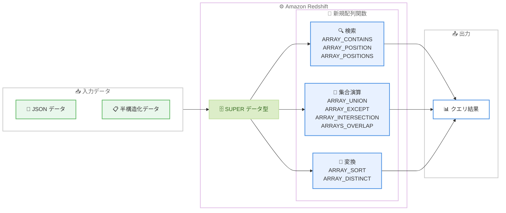

# Amazon Redshift - 半構造化データ処理向け 9 つの新しい配列関数

**リリース日**: 2026 年 3 月 6 日
**サービス**: Amazon Redshift
**機能**: SUPER データ型向け新規配列関数 (ARRAY_CONTAINS, ARRAY_DISTINCT, ARRAY_EXCEPT, ARRAY_INTERSECTION, ARRAY_POSITION, ARRAY_POSITIONS, ARRAY_SORT, ARRAY_UNION, ARRAYS_OVERLAP)

[このアップデートのインフォグラフィックを見る](https://takech9203.github.io/aws-news-summary/20260306-amazon-redshift-nine-new-array-functions.html)

## 概要

Amazon Redshift が SUPER データ型に格納された半構造化データを操作するための 9 つの新しい配列関数をサポートした。追加された関数は ARRAY_CONTAINS、ARRAY_DISTINCT、ARRAY_EXCEPT、ARRAY_INTERSECTION、ARRAY_POSITION、ARRAY_POSITIONS、ARRAY_SORT、ARRAY_UNION、ARRAYS_OVERLAP の 9 つで、配列の検索、比較、ソート、変換を SQL クエリ内で直接実行できる。

これらの関数は、JSON や半構造化データを Redshift の SUPER データ型で格納しているユーザーにとって、データ分析や ETL 処理の効率を大幅に向上させるものである。AWS GovCloud を含むすべての AWS リージョンで利用可能。

**アップデート前の課題**

- SUPER データ型内の配列に対して要素の検索や重複排除を行うには、複雑な SQL やカスタム UDF を記述する必要があった
- 2 つの配列間の集合演算 (和集合、差集合、積集合) をネイティブに実行する手段がなく、アプリケーション側での処理が必要だった
- 配列内の要素位置の特定やソートに標準的な方法がなく、UNNEST と再集約を組み合わせた冗長なクエリが必要だった

**アップデート後の改善**

- ARRAY_CONTAINS で配列内の要素検索をシンプルな関数呼び出しで実行できるようになった
- ARRAY_UNION、ARRAY_EXCEPT、ARRAY_INTERSECTION により集合演算を SQL 内で直接実行可能になった
- ARRAY_SORT、ARRAY_DISTINCT、ARRAY_POSITION などにより、配列の操作と分析が大幅に簡素化された

## アーキテクチャ図



9 つの新規配列関数は、検索、集合演算、変換の 3 つのカテゴリに分類される。SUPER データ型に格納された半構造化データに対して、SQL クエリ内で直接これらの操作を実行できる。

## サービスアップデートの詳細

### 主要機能

1. **検索関数**
   - **ARRAY_CONTAINS**: 指定した値が配列内に存在するかを判定する。フィルタリング条件として WHERE 句で活用できる
   - **ARRAY_POSITION**: 指定した値が配列内で最初に出現する位置 (インデックス) を返す
   - **ARRAY_POSITIONS**: 指定した値が配列内に出現するすべての位置をリストとして返す

2. **集合演算関数**
   - **ARRAY_UNION**: 2 つの配列の和集合を返す。重複する要素は 1 つにまとめられる
   - **ARRAY_EXCEPT**: 最初の配列から 2 番目の配列に含まれる要素を除外した差集合を返す
   - **ARRAY_INTERSECTION**: 2 つの配列の共通要素 (積集合) を返す
   - **ARRAYS_OVERLAP**: 2 つの配列に共通要素が存在するかをブール値で返す

3. **変換関数**
   - **ARRAY_SORT**: 配列の要素を昇順または降順にソートして返す
   - **ARRAY_DISTINCT**: 配列から重複する要素を除去し、一意の要素のみを返す

## 技術仕様

### 配列関数一覧

| 関数名 | カテゴリ | 戻り値の型 | 説明 |
|--------|----------|-----------|------|
| ARRAY_CONTAINS | 検索 | BOOLEAN | 配列内に指定値が存在するか判定 |
| ARRAY_POSITION | 検索 | INTEGER | 指定値の最初の出現位置を返す |
| ARRAY_POSITIONS | 検索 | SUPER (配列) | 指定値の全出現位置をリストで返す |
| ARRAY_UNION | 集合演算 | SUPER (配列) | 2 配列の和集合 |
| ARRAY_EXCEPT | 集合演算 | SUPER (配列) | 2 配列の差集合 |
| ARRAY_INTERSECTION | 集合演算 | SUPER (配列) | 2 配列の積集合 |
| ARRAYS_OVERLAP | 集合演算 | BOOLEAN | 2 配列に共通要素があるか判定 |
| ARRAY_SORT | 変換 | SUPER (配列) | 配列要素のソート |
| ARRAY_DISTINCT | 変換 | SUPER (配列) | 配列要素の重複排除 |

### 対応データ型

| 項目 | 詳細 |
|------|------|
| 対象データ型 | SUPER |
| 入力形式 | JSON 配列、半構造化データ |
| 対応クラスタ | Provisioned クラスタ、Serverless |

### IAM ポリシー

配列関数の使用に追加の IAM 権限は不要である。既存の Redshift クエリ実行権限で利用可能。

## 設定方法

### 前提条件

1. Amazon Redshift クラスタ (Provisioned または Serverless) が稼働していること
2. SUPER データ型のカラムを含むテーブルが存在すること
3. Redshift へのクエリ実行権限を持つユーザーであること

### 手順

#### ステップ 1: SUPER データ型のテーブルを準備

```sql
-- SUPER データ型を含むテーブルを作成
CREATE TABLE products (
    product_id INT,
    name VARCHAR(256),
    tags SUPER,
    categories SUPER
);

-- JSON データを挿入
INSERT INTO products VALUES
(1, 'Laptop', JSON_PARSE('["electronics", "computers", "sale"]'),
    JSON_PARSE('["tech", "office"]')),
(2, 'Headphones', JSON_PARSE('["electronics", "audio", "sale"]'),
    JSON_PARSE('["tech", "music"]'));
```

SUPER データ型のカラムに JSON 配列を格納する。JSON_PARSE 関数で文字列を SUPER 型に変換できる。

#### ステップ 2: 検索関数を使用

```sql
-- 特定のタグを含む商品を検索
SELECT name, tags
FROM products
WHERE ARRAY_CONTAINS(tags, 'sale');

-- タグ内の特定要素の位置を取得
SELECT name, ARRAY_POSITION(tags, 'electronics') AS position
FROM products;
```

ARRAY_CONTAINS は WHERE 句のフィルタ条件として使用でき、ARRAY_POSITION は要素のインデックスを返す。

#### ステップ 3: 集合演算関数を使用

```sql
-- 2 つの配列の和集合を取得
SELECT name,
    ARRAY_UNION(tags, categories) AS all_labels
FROM products;

-- 2 つの配列の共通要素を取得
SELECT name,
    ARRAY_INTERSECTION(tags, categories) AS common_labels
FROM products;

-- tags にあって categories にない要素を取得
SELECT name,
    ARRAY_EXCEPT(tags, categories) AS unique_tags
FROM products;
```

集合演算関数を使用して、複数の配列間の関係を SQL 内で直接分析できる。

#### ステップ 4: 変換関数を使用

```sql
-- 配列をソート
SELECT name, ARRAY_SORT(tags) AS sorted_tags
FROM products;

-- 重複を排除
SELECT ARRAY_DISTINCT(
    ARRAY_UNION(tags, categories)
) AS unique_labels
FROM products;
```

変換関数は他の配列関数と組み合わせて使用でき、データの整理と正規化に役立つ。

## メリット

### ビジネス面

- **分析の迅速化**: 半構造化データに対する配列操作がネイティブ SQL で完結するため、データ分析のリードタイムが短縮される
- **ETL 処理の簡素化**: アプリケーション側での配列処理が不要になり、データパイプラインの設計がシンプルになる
- **コスト削減**: 複雑な UDF やカスタムロジックの開発・保守コストが削減される

### 技術面

- **クエリの簡潔化**: UNNEST と再集約を組み合わせた冗長なクエリが、単一の関数呼び出しに置き換わる
- **パフォーマンス向上**: ネイティブ関数による処理のため、UDF やアプリケーション側処理と比較してオーバーヘッドが少ない
- **SQL 標準との整合性**: 他のデータウェアハウス製品で馴染みのある配列関数が利用可能になり、移行や学習コストが低減される

## デメリット・制約事項

### 制限事項

- SUPER データ型のカラムにのみ使用可能であり、VARCHAR に格納された JSON 文字列には直接適用できない
- ネストされた配列 (配列の配列) に対する動作は関数ごとに異なる可能性がある
- 配列のサイズが非常に大きい場合、パフォーマンスへの影響を考慮する必要がある

### 考慮すべき点

- 既存の UNNEST ベースのクエリからの移行は手動で行う必要がある
- SUPER データ型への変換 (JSON_PARSE) が事前に必要なため、既存テーブルのスキーマ変更が伴う場合がある

## ユースケース

### ユースケース 1: E コマースの商品タグ分析

**シナリオ**: 商品に付与された複数のタグを SUPER データ型で管理し、タグベースの商品検索やカテゴリ分析を行う。

**実装例**:
```sql
-- 特定のタグを含む商品を検索
SELECT product_id, name
FROM products
WHERE ARRAY_CONTAINS(tags, 'sale')
  AND ARRAY_CONTAINS(tags, 'electronics');

-- カテゴリ間で共通するタグを持つ商品を特定
SELECT product_id, name
FROM products
WHERE ARRAYS_OVERLAP(tags, JSON_PARSE('["premium", "featured"]'));
```

**効果**: タグベースのフィルタリングが SQL の WHERE 句で直接実行でき、アプリケーション側のロジックが不要になる。

### ユースケース 2: IoT センサーデータの集合演算

**シナリオ**: 複数の IoT デバイスから収集したセンサーデータの配列を比較し、共通するアラートや異常値を特定する。

**実装例**:
```sql
-- 2 つのデバイスグループのアラートの共通部分を取得
SELECT
    ARRAY_INTERSECTION(device_a.alerts, device_b.alerts) AS common_alerts,
    ARRAY_EXCEPT(device_a.alerts, device_b.alerts) AS unique_to_a
FROM device_readings device_a
JOIN device_readings device_b
    ON device_a.timestamp = device_b.timestamp
WHERE device_a.group_id = 'group1'
  AND device_b.group_id = 'group2';
```

**効果**: デバイスグループ間の異常パターンの比較分析を SQL 内で完結でき、リアルタイム分析の精度と速度が向上する。

### ユースケース 3: ユーザー行動データの正規化と分析

**シナリオ**: ユーザーのクリックストリームやイベントログを配列として蓄積し、重複排除やソートを行ったうえで行動パターンを分析する。

**実装例**:
```sql
-- ユーザーが訪問したページの一意なリストをソートして取得
SELECT user_id,
    ARRAY_SORT(ARRAY_DISTINCT(visited_pages)) AS unique_pages_sorted
FROM user_sessions
WHERE session_date = '2026-03-06';

-- 2 つのセッション間で共通する閲覧ページを確認
SELECT s1.user_id,
    ARRAY_INTERSECTION(s1.visited_pages, s2.visited_pages) AS repeated_pages
FROM user_sessions s1
JOIN user_sessions s2
    ON s1.user_id = s2.user_id
    AND s1.session_id <> s2.session_id;
```

**効果**: ユーザーの行動パターンの正規化と比較が SQL レベルで完結し、レコメンデーションエンジンやファネル分析の前処理が効率化される。

## 料金

今回追加された配列関数の使用に追加料金は発生しない。通常の Amazon Redshift のクエリ実行に伴う料金 (Provisioned クラスタの場合はノード時間課金、Serverless の場合は RPU 時間課金) が適用される。

### 料金例

| 構成 | 月額料金 (概算) |
|------|------------------|
| Redshift Serverless (8 RPU ベース) | 約 $290/月 (ベース) + 使用量に応じた RPU 課金 |
| Redshift Provisioned (dc2.large x 2 ノード) | 約 $360/月 |

## 利用可能リージョン

AWS GovCloud を含むすべての AWS リージョンで利用可能。Amazon Redshift Provisioned クラスタおよび Redshift Serverless の両方で使用できる。

## 関連サービス・機能

- **Amazon Redshift SUPER データ型**: 今回の配列関数が操作対象とするネイティブ半構造化データ型。JSON、配列、構造体を格納できる
- **Amazon Redshift PartiQL**: SUPER データ型のクエリに使用される SQL 拡張。配列関数と組み合わせて半構造化データのナビゲーションが可能
- **Amazon Redshift Spectrum**: S3 上の半構造化データに対して外部テーブル経由でクエリを実行する機能。SUPER 型への変換と組み合わせて配列関数を適用できる
- **AWS Glue**: ETL 処理で半構造化データを Redshift の SUPER 型にロードする際のデータ変換パイプラインに活用できる

## 参考リンク

- [インフォグラフィック](https://takech9203.github.io/aws-news-summary/20260306-amazon-redshift-nine-new-array-functions.html)
- [公式発表 (What's New)](https://aws.amazon.com/about-aws/whats-new/2026/03/amazon-redshift-nine-new-array-functions/)
- [ドキュメント - SUPER データ型](https://docs.aws.amazon.com/redshift/latest/dg/r_SUPER_type.html)
- [ドキュメント - 配列関数](https://docs.aws.amazon.com/redshift/latest/dg/c_Array_functions.html)
- [料金ページ](https://aws.amazon.com/redshift/pricing/)

## まとめ

Amazon Redshift に追加された 9 つの配列関数により、SUPER データ型に格納された半構造化データの操作が SQL 内で大幅に簡素化された。特に配列の検索、集合演算、ソート、重複排除といった頻出操作がネイティブ関数で実行可能になり、複雑な UDF やアプリケーション側処理が不要になる。Redshift で JSON や半構造化データを扱っているユーザーは、既存のクエリを新しい配列関数に置き換えることで、クエリの可読性とパフォーマンスの向上が期待できる。
