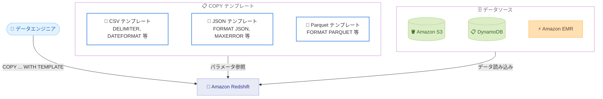

# Amazon Redshift - COPY コマンド用再利用可能テンプレート

**リリース日**: 2026 年 3 月 6 日
**サービス**: Amazon Redshift
**機能**: COPY コマンド用テンプレート

[このアップデートのインフォグラフィックを見る](https://takech9203.github.io/aws-news-summary/20260306-amazon-redshift-reusable-templates-copy.html)
<!-- INFOGRAPHIC_BASE_URL は環境変数から取得 -->

## 概要

Amazon Redshift が COPY コマンド用のテンプレート機能をサポートした。この機能により、頻繁に使用する COPY パラメータを保存し、再利用可能なテンプレートとして管理できるようになった。

テンプレートには、CSV や JSON などのファイル形式に応じたフォーマットパラメータや、データソースごとの設定を標準化して格納できる。これにより、COPY コマンド実行時に毎回パラメータを手動で指定する必要がなくなり、データ取り込み操作の一貫性と効率性が向上する。

この機能は、データエンジニアリングチームやデータパイプラインを運用するチームにとって、運用負荷の軽減とヒューマンエラーの削減に貢献するアップデートである。

**アップデート前の課題**

- COPY コマンドを実行するたびに、フォーマットパラメータやオプションを手動で指定する必要があった
- チーム内で異なるパラメータ設定が使用され、データ取り込みの一貫性を維持することが困難だった
- パラメータの変更が必要な場合、すべての COPY コマンドを個別に修正する必要があった

**アップデート後の改善**

- よく使用するパラメータをテンプレートとして保存し、COPY コマンドで参照するだけで利用可能になった
- 標準化されたテンプレートにより、チーム全体で一貫したパラメータ設定を共有できるようになった
- テンプレートの更新が今後の全ての COPY 操作に自動的に反映されるため、メンテナンスが効率化された

## アーキテクチャ図



テンプレートにフォーマットパラメータを定義し、COPY コマンド実行時にテンプレートを参照することで、一貫したデータ取り込みを実現する。

## サービスアップデートの詳細

### 主要機能

1. **再利用可能な COPY テンプレートの作成**
   - よく使用する COPY パラメータの組み合わせをテンプレートとして定義・保存できる
   - CSV、JSON、Parquet など、異なるファイル形式ごとにテンプレートを作成可能
   - テンプレートにはフォーマットパラメータ、区切り文字、日付形式、エラー処理設定などを含められる

2. **テンプレートによる COPY コマンドの実行**
   - COPY コマンド実行時にテンプレート名を指定するだけで、保存済みのパラメータが適用される
   - テーブル名、データソース、認証情報のみを指定すれば良いため、コマンドが簡潔になる
   - テンプレートのパラメータと個別のパラメータを組み合わせた利用も可能

3. **一元管理とメンテナンスの効率化**
   - テンプレートを更新すると、以降のすべての COPY 操作に変更が自動的に反映される
   - チーム全体で標準化されたテンプレートを共有することで、パラメータの不整合を防止できる
   - テンプレートの管理により、データ取り込みの監査やガバナンスも容易になる

## 技術仕様

### COPY テンプレートの構成要素

| 項目 | 詳細 |
|------|------|
| 対象コマンド | COPY |
| テンプレートに含められるパラメータ | フォーマット指定、区切り文字、日付形式、エラー処理、圧縮形式など |
| テンプレートの適用方法 | COPY コマンドで TEMPLATE キーワードを使用してテンプレート名を参照 |
| 対応データ形式 | CSV、JSON、Avro、Parquet、ORC など COPY コマンドがサポートする全形式 |

### 設定例

```sql
-- テンプレートの作成例: CSV ファイル用
CREATE COPY TEMPLATE csv_standard
DELIMITER ','
DATEFORMAT 'auto'
TIMEFORMAT 'auto'
IGNOREHEADER 1
MAXERROR 100
BLANKSASNULL
EMPTYASNULL;

-- テンプレートを使用した COPY コマンドの実行
COPY sales
FROM 's3://my-bucket/data/sales.csv'
IAM_ROLE 'arn:aws:iam::123456789012:role/RedshiftCopyRole'
TEMPLATE csv_standard;
```

上記の例では、CSV ファイルの読み込みに必要なパラメータをテンプレートとして定義し、COPY コマンドで参照している。

## 設定方法

### 前提条件

1. Amazon Redshift クラスターまたは Redshift Serverless ワークグループが稼働していること
2. COPY コマンドの実行に必要な IAM ロールおよびテーブルへの INSERT 権限があること
3. データソース (Amazon S3 など) へのアクセス権限が設定されていること

### 手順

#### ステップ 1: テンプレートの作成

```sql
-- JSON ファイル用テンプレートの作成
CREATE COPY TEMPLATE json_standard
FORMAT AS JSON 'auto'
MAXERROR 50
ACCEPTINVCHARS
COMPUPDATE ON;
```

JSON 形式のデータファイルを読み込む際の標準パラメータをテンプレートとして定義する。

#### ステップ 2: テンプレートを使用した COPY の実行

```sql
-- テンプレートを参照して COPY を実行
COPY events
FROM 's3://my-data-bucket/events/'
IAM_ROLE 'arn:aws:iam::123456789012:role/RedshiftCopyRole'
TEMPLATE json_standard;
```

テンプレート名を指定するだけで、事前に定義したパラメータが自動的に適用される。

#### ステップ 3: テンプレートの更新

```sql
-- テンプレートのパラメータを変更
ALTER COPY TEMPLATE json_standard
MAXERROR 100;
```

テンプレートを更新すると、以降のすべての COPY 操作に変更が反映される。

## メリット

### ビジネス面

- **運用効率の向上**: テンプレートを活用することで、データパイプラインの構築・管理にかかる時間を削減できる
- **ヒューマンエラーの削減**: 手動入力によるパラメータの誤りを防止し、データ品質の向上に貢献する
- **チーム間の標準化**: 組織全体で一貫したデータ取り込み設定を共有でき、ガバナンスが強化される

### 技術面

- **コマンドの簡素化**: COPY コマンドの記述量が減り、スクリプトの可読性が向上する
- **メンテナンスの一元化**: パラメータ変更をテンプレートに反映するだけで、すべての関連 COPY 操作に適用される
- **柔軟な構成管理**: ファイル形式やデータソースごとにテンプレートを分けて管理できる

## デメリット・制約事項

### 制限事項

- テンプレートの具体的な SQL 構文や利用可能なパラメータについては公式ドキュメントを確認する必要がある
- テンプレート機能は COPY コマンド専用であり、UNLOAD など他のコマンドには適用されない
- テンプレートの作成や変更に必要な権限の詳細は公式ドキュメントを参照すること

### 考慮すべき点

- 既存の COPY コマンドを使用するスクリプトやパイプラインをテンプレートに移行する場合、テスト環境での検証を推奨する
- テンプレートの命名規則やバージョン管理のルールをチームで事前に策定しておくとよい

## ユースケース

### ユースケース 1: 定期的な ETL パイプライン

**シナリオ**: データエンジニアリングチームが、毎日 Amazon S3 から複数のテーブルに CSV データを COPY で取り込んでいる。各テーブルで同じフォーマットパラメータを使用しているが、コマンドごとに手動指定している。

**実装例**:
```sql
-- 共通テンプレートを作成
CREATE COPY TEMPLATE daily_csv_load
DELIMITER ','
DATEFORMAT 'YYYY-MM-DD'
TIMEFORMAT 'YYYY-MM-DD HH:MI:SS'
IGNOREHEADER 1
MAXERROR 0
GZIP;

-- 各テーブルの COPY でテンプレートを参照
COPY orders FROM 's3://etl-bucket/orders/' IAM_ROLE '...' TEMPLATE daily_csv_load;
COPY customers FROM 's3://etl-bucket/customers/' IAM_ROLE '...' TEMPLATE daily_csv_load;
COPY products FROM 's3://etl-bucket/products/' IAM_ROLE '...' TEMPLATE daily_csv_load;
```

**効果**: 3 つのテーブルへの COPY 操作で同一のパラメータが保証され、パイプラインスクリプトが簡潔になる。

### ユースケース 2: マルチフォーマット対応

**シナリオ**: アプリケーションログは JSON 形式、トランザクションデータは CSV 形式、分析データは Parquet 形式でそれぞれ S3 に保存されている。各形式ごとに異なるパラメータを管理する必要がある。

**実装例**:
```sql
-- 形式別テンプレートを作成
CREATE COPY TEMPLATE app_logs_json FORMAT AS JSON 'auto' MAXERROR 100;
CREATE COPY TEMPLATE txn_csv DELIMITER '|' DATEFORMAT 'auto' IGNOREHEADER 1;
CREATE COPY TEMPLATE analytics_parquet FORMAT AS PARQUET;

-- 各データソースに適したテンプレートを使用
COPY app_logs FROM 's3://logs/app/' IAM_ROLE '...' TEMPLATE app_logs_json;
COPY transactions FROM 's3://data/txn/' IAM_ROLE '...' TEMPLATE txn_csv;
COPY analytics FROM 's3://data/analytics/' IAM_ROLE '...' TEMPLATE analytics_parquet;
```

**効果**: データ形式ごとに標準化されたテンプレートを用意することで、新しいテーブル追加時もテンプレートを参照するだけで済む。

### ユースケース 3: チーム横断でのデータ取り込み標準化

**シナリオ**: 複数のチームが同じ Redshift クラスターにデータを取り込んでいるが、チームごとにパラメータが異なり、データ品質に差が生じている。

**実装例**:
```sql
-- 組織標準テンプレートを管理者が作成
CREATE COPY TEMPLATE org_standard_csv
DELIMITER ','
DATEFORMAT 'auto'
TIMEFORMAT 'auto'
BLANKSASNULL
EMPTYASNULL
MAXERROR 0
ACCEPTINVCHARS '?';

-- 各チームは標準テンプレートを参照して COPY を実行
COPY team_a_data FROM 's3://team-a/data/' IAM_ROLE '...' TEMPLATE org_standard_csv;
COPY team_b_data FROM 's3://team-b/data/' IAM_ROLE '...' TEMPLATE org_standard_csv;
```

**効果**: 組織全体で統一されたデータ取り込み設定が適用され、データ品質の一貫性が確保される。

## 料金

COPY テンプレート機能自体に追加料金は発生しない。Amazon Redshift の通常の利用料金 (プロビジョニングクラスターまたは Serverless のコンピューティング料金) の範囲内で利用可能である。

## 利用可能リージョン

Amazon Redshift が利用可能なすべての AWS リージョンで利用可能。AWS GovCloud (US) リージョンも含まれる。

## 関連サービス・機能

- **Amazon Redshift COPY コマンド**: テンプレート機能の基盤となるデータ取り込みコマンド
- **Amazon S3**: COPY コマンドの主要なデータソースとして使用される
- **Amazon Redshift COPY JOB**: COPY 操作を自動化するジョブ機能。テンプレートと組み合わせることで、さらに効率的な運用が可能
- **AWS Glue**: ETL パイプラインの構築に使用。Redshift への COPY 操作と組み合わせて利用可能

## 参考リンク

- [インフォグラフィック](https://takech9203.github.io/aws-news-summary/20260306-amazon-redshift-reusable-templates-copy.html)
- [公式発表 (What's New)](https://aws.amazon.com/about-aws/whats-new/2026/03/amazon-redshift-reusable-templates-copy/)
- [Amazon Redshift COPY コマンド ドキュメント](https://docs.aws.amazon.com/redshift/latest/dg/r_COPY.html)
- [Amazon Redshift 料金ページ](https://aws.amazon.com/redshift/pricing/)

## まとめ

Amazon Redshift の COPY テンプレート機能は、データ取り込み操作の標準化と効率化を実現する実用的なアップデートである。特に複数のテーブルやデータ形式を扱う環境では、テンプレートによるパラメータの一元管理がヒューマンエラーの削減と運用コストの低減に直結する。既存の COPY コマンドベースのパイプラインを運用しているチームは、テンプレート機能への移行を検討することを推奨する。
