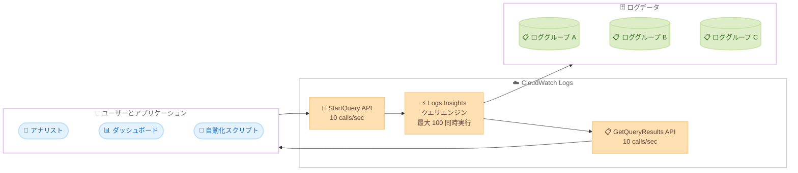

# Amazon CloudWatch Logs - クエリ同時実行数と API リミットの引き上げ

**リリース日**: 2026年03月09日
**サービス**: Amazon CloudWatch Logs
**機能**: Logs Insights クエリ同時実行数および StartQuery/GetQueryResults API リミットの引き上げ

[このアップデートのインフォグラフィックを見る](https://takech9203.github.io/aws-news-summary/20260309-amazon-cloudwatch-logs-increased-limits.html)

## 概要

Amazon CloudWatch Logs が、Logs Insights Query Language (Logs Insights QL) を使用したクエリの同時実行数と API コールのリミットを大幅に引き上げました。アカウントあたりの同時実行クエリ数が 30 から 100 に、StartQuery および GetQueryResults API のコールレートがアカウント/リージョンあたり毎秒 10 回に増加しています。

この改善により、より多くのユーザーが同時にクエリを実行し、Logs Insights QL を使用したダッシュボードを活用できるようになります。特に大規模な組織やチームにおいて、ログ分析の並列処理能力が向上し、スロットリングの発生を抑えながら迅速にクエリ結果を取得できるようになります。

**アップデート前の課題**

- アカウントあたりの同時実行クエリ数が 30 に制限されており、大規模チームでの同時利用時にクエリがブロックされることがあった
- StartQuery および GetQueryResults API のコールレートが低く、プログラムからの大量クエリ実行時にスロットリングが発生していた
- ダッシュボードで多数の Logs Insights QL ウィジェットを使用する場合、同時実行制限によりデータ表示が遅延することがあった

**アップデート後の改善**

- 同時実行クエリ数が 100 に増加し、より多くのユーザーが同時にクエリを実行可能になった
- StartQuery と GetQueryResults API のコールレートが毎秒 10 回に引き上げられ、スロットリングなしでより多くのクエリを実行可能になった
- Logs Insights QL を使用したダッシュボードのパフォーマンスが向上し、クエリ結果をより迅速に表示できるようになった

## アーキテクチャ図



CloudWatch Logs Insights のクエリフローを示しています。ユーザーやアプリケーションが StartQuery API を通じてクエリを発行し、Logs Insights クエリエンジンがロググループのデータを検索して、GetQueryResults API 経由で結果を返します。

## サービスアップデートの詳細

### 主要機能

1. **クエリ同時実行数の引き上げ**
   - 従来: アカウントあたり最大 30 の同時実行クエリ
   - 現在: アカウントあたり最大 100 の同時実行クエリ
   - 約 3.3 倍の同時実行数増加により、大規模チームでの並列クエリ実行が可能

2. **StartQuery API コールレートの引き上げ**
   - アカウント/リージョンあたり毎秒 10 回の StartQuery API コールが可能
   - プログラムからの大量クエリ発行時のスロットリングリスクを軽減
   - 自動化スクリプトやダッシュボードからのクエリ発行を効率化

3. **GetQueryResults API コールレートの引き上げ**
   - アカウント/リージョンあたり毎秒 10 回の GetQueryResults API コールが可能
   - クエリ結果のポーリング頻度を上げられるため、結果取得までの時間を短縮
   - 複数のクエリ結果を並列で取得する際のスロットリングを回避

## 技術仕様

### リミット比較

| 項目 | 変更前 | 変更後 |
|------|--------|--------|
| 同時実行クエリ数 | 30 (アカウントあたり) | 100 (アカウントあたり) |
| StartQuery API コールレート | 非公開 | 10 calls/sec (アカウント/リージョンあたり) |
| GetQueryResults API コールレート | 非公開 | 10 calls/sec (アカウント/リージョンあたり) |
| 対象クエリ言語 | Logs Insights QL | Logs Insights QL |

### API 変更履歴

直近の CloudWatch Logs に関する API 変更は以下のとおりです。

| 日付 | サービス | 変更内容 |
|------|----------|----------|
| 2026/03/03 | [Amazon CloudWatch Logs](https://awsapichanges.com/archive/changes/ec3b3e-logs.html) | 1 new 1 updated api methods - PutBearerTokenAuthentication API の追加、DescribeLogGroups の更新 |

今回のクエリ同時実行数および API リミットの引き上げは、既存の API インターフェースの変更を伴わないサービス側のリミット変更です。

### 関連 API

```bash
# StartQuery API - Logs Insights QL クエリの開始
aws logs start-query \
    --log-group-name "/aws/lambda/my-function" \
    --start-time 1709942400 \
    --end-time 1710028800 \
    --query-string 'fields @timestamp, @message | filter @message like /ERROR/ | sort @timestamp desc | limit 20'

# GetQueryResults API - クエリ結果の取得
aws logs get-query-results \
    --query-id "12345678-1234-1234-1234-123456789012"
```

## 設定方法

### 前提条件

1. AWS アカウントを持っていること
2. CloudWatch Logs へのアクセス権限 (logs:StartQuery、logs:GetQueryResults) があること
3. クエリ対象のロググループが存在すること

### 手順

#### ステップ 1: 新しいリミットの確認

```bash
# Service Quotas で現在のリミットを確認
aws service-quotas get-service-quota \
    --service-code logs \
    --quota-code L-32C48DCB
```

Service Quotas コンソールまたは API を使用して、アカウントに適用されている現在のクエリ同時実行数リミットを確認します。

#### ステップ 2: 複数の同時クエリの実行

```bash
# 複数のクエリを同時に実行する例
for i in $(seq 1 10); do
    aws logs start-query \
        --log-group-name "/aws/lambda/my-function-$i" \
        --start-time 1709942400 \
        --end-time 1710028800 \
        --query-string 'stats count(*) by @logStream' &
done
wait
```

複数のロググループに対して並列にクエリを実行します。新しいリミットでは最大 100 のクエリを同時に実行できます。

#### ステップ 3: クエリ結果の取得

```bash
# クエリ結果を取得
aws logs get-query-results \
    --query-id "12345678-1234-1234-1234-123456789012"
```

StartQuery で返されたクエリ ID を使用して結果を取得します。ステータスが `Complete` になるまでポーリングすることで、結果を取得できます。

## メリット

### ビジネス面

- **チーム生産性の向上**: 同時実行数が 3.3 倍に増加したことで、大規模チームのメンバーが同時にログ分析を行える
- **ダッシュボードの応答性向上**: Logs Insights QL を使用した多数のウィジェットを持つダッシュボードのデータ更新が高速化
- **インシデント対応の迅速化**: 障害発生時に複数のエンジニアが同時にログを分析でき、原因特定までの時間を短縮

### 技術面

- **スロットリング回避**: API コールレートの引き上げにより、自動化パイプラインでのスロットリングエラーが減少
- **並列処理の効率化**: 複数のロググループに対する並列クエリ実行が可能になり、大規模なログ分析の処理時間を短縮
- **既存コードの変更不要**: リミットの引き上げはサービス側の変更のため、アプリケーションコードの変更なしで恩恵を受けられる

## デメリット・制約事項

### 制限事項

- リミット引き上げは Logs Insights QL に適用され、他のクエリ言語には適用されない場合がある
- 各クエリのスキャンデータ量やクエリ実行時間に関する既存の制約は変更されていない
- アカウント/リージョン単位のリミットであるため、クロスアカウントクエリ時は各アカウントのリミットが適用される

### 考慮すべき点

- 同時実行クエリ数が増加しても、大量のクエリを同時に実行するとコストが増加する可能性がある
- CloudWatch Logs Insights のクエリ料金はスキャンしたデータ量に基づくため、並列クエリの増加に伴うコストを監視することが推奨される
- 特定のリージョンやアカウントで追加のリミット引き上げが必要な場合は、Service Quotas を通じてリクエスト可能

## ユースケース

### ユースケース 1: 大規模 SRE チームでの同時ログ分析

**シナリオ**: 50 名以上の SRE チームが本番環境のインシデント対応中に、それぞれ異なるロググループのログを同時に分析する必要がある。

**実装例**:
```bash
# 各チームメンバーが個別にクエリを実行
aws logs start-query \
    --log-group-name "/aws/ecs/production-service-a" \
    --start-time 1709942400 \
    --end-time 1710028800 \
    --query-string 'fields @timestamp, @message | filter @message like /Exception/ | sort @timestamp desc | limit 100'
```

**効果**: 従来は 30 名までしか同時にクエリを実行できなかったが、100 名まで同時実行可能になり、インシデント対応チーム全体が並行してログ分析を実施できる。

### ユースケース 2: 多数のウィジェットを持つ運用ダッシュボード

**シナリオ**: CloudWatch ダッシュボードに 50 以上の Logs Insights QL ウィジェットを配置し、複数のマイクロサービスのログを一覧表示している。

**実装例**:
```bash
# ダッシュボードウィジェット用のクエリ例
aws logs start-query \
    --log-group-names "/aws/lambda/service-a" "/aws/lambda/service-b" \
    --start-time 1709942400 \
    --end-time 1710028800 \
    --query-string 'stats count(*) as errorCount by bin(5m) | filter @message like /ERROR/'
```

**効果**: ダッシュボード表示時に多数のクエリが同時発行されても、同時実行数の上限に到達しにくくなり、すべてのウィジェットが迅速にデータを表示できる。

### ユースケース 3: 自動化されたログ分析パイプライン

**シナリオ**: Lambda 関数やスクリプトから定期的に StartQuery API を呼び出し、複数のロググループに対して自動化されたログ分析を実行している。

**実装例**:
```python
import boto3
import time

client = boto3.client('logs')

log_groups = [f"/aws/lambda/service-{i}" for i in range(50)]
query_ids = []

# 複数のクエリを同時に開始
for lg in log_groups:
    response = client.start_query(
        logGroupName=lg,
        startTime=int(time.time()) - 3600,
        endTime=int(time.time()),
        queryString='stats count(*) by @logStream'
    )
    query_ids.append(response['queryId'])

# 結果を取得
for qid in query_ids:
    result = client.get_query_results(queryId=qid)
    print(result['status'], result['results'])
```

**効果**: API コールレートの引き上げにより、50 のロググループに対するクエリ発行がスロットリングなしで実行でき、分析パイプラインの安定性と速度が向上する。

## 料金

今回のリミット引き上げ自体に追加料金はかかりません。CloudWatch Logs Insights のクエリ料金は、スキャンしたデータ量に基づいて課金されます。

### 料金例

| 使用量 | 月額料金 (概算、us-east-1) |
|--------|----------------------------|
| 1 GB のデータスキャン | $0.0050 |
| 100 GB のデータスキャン | $0.50 |
| 1 TB のデータスキャン | $5.00 |

同時実行クエリ数が増加することで、より多くのクエリを実行する場合はスキャンデータ量に応じたコスト増加に注意が必要です。詳細な料金情報は [CloudWatch 料金ページ](https://aws.amazon.com/cloudwatch/pricing/) を参照してください。

## 利用可能リージョン

CloudWatch Logs Insights が利用可能なすべての AWS リージョンで、この引き上げられたリミットが適用されます。

## 関連サービス・機能

- **Amazon CloudWatch**: メトリクス、アラーム、ダッシュボードなどの監視機能全般を提供する親サービス
- **Amazon CloudWatch Logs Insights**: ログデータに対するインタラクティブなクエリと可視化機能
- **AWS Lambda**: ログの自動分析やアラート生成のためのサーバーレスコンピュート
- **Amazon EventBridge**: ログ分析結果に基づくイベント駆動型の自動化処理

## 参考リンク

- [公式発表 (What's New)](https://aws.amazon.com/about-aws/whats-new/2026/03/amazon-cloudwatch-logs-increased-limits/)
- [ドキュメント: CloudWatch Logs Insights](https://docs.aws.amazon.com/AmazonCloudWatch/latest/logs/AnalyzingLogData.html)
- [ドキュメント: CloudWatch Logs のクォータ](https://docs.aws.amazon.com/AmazonCloudWatch/latest/logs/cloudwatch_limits_cwl.html)
- [CloudWatch 料金ページ](https://aws.amazon.com/cloudwatch/pricing/)

## まとめ

Amazon CloudWatch Logs のクエリ同時実行数が 30 から 100 に、StartQuery および GetQueryResults API のコールレートが毎秒 10 回に引き上げられました。この改善により、大規模チームでの同時ログ分析、多数のウィジェットを持つダッシュボードの応答性向上、自動化パイプラインの安定性向上が実現します。既存のコードや設定の変更は不要で、自動的に新しいリミットが適用されるため、すぐにメリットを享受できます。
