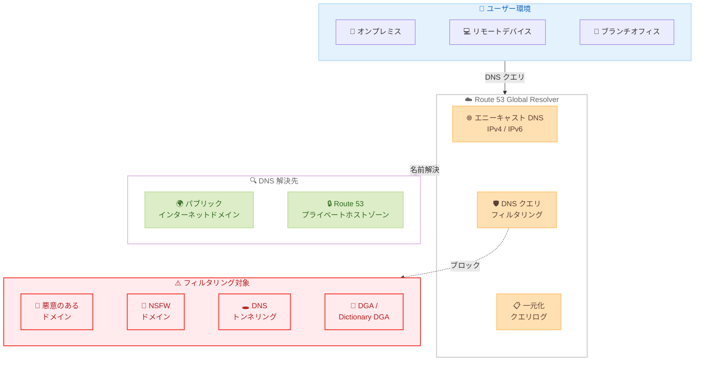

# Amazon Route 53 - Global Resolver の一般提供開始

**リリース日**: 2026 年 3 月 9 日
**サービス**: Amazon Route 53
**機能**: Route 53 Global Resolver

[このアップデートのインフォグラフィックを見る](https://takech9203.github.io/aws-news-summary/20260309-amazon-route-53-global-resolver.html)

## 概要

Amazon Route 53 Global Resolver が一般提供 (GA) を開始しました。Route 53 Global Resolver は、30 の AWS リージョンにまたがるインターネット到達可能なエニーキャスト DNS リゾルバであり、IPv4 と IPv6 の両方をサポートしています。re:Invent 2025 でプレビューとして発表されたこのサービスが、正式に利用可能になりました。

Route 53 Global Resolver は、パブリックインターネットドメインの DNS 解決に加え、Route 53 プライベートホストゾーンに関連付けられたプライベートドメインのエニーキャスト DNS 解決を提供します。これにより、オンプレミスやリモート環境からも AWS 内のプライベートリソースに対する名前解決が可能になります。

さらに、悪意のあるドメイン、NSFW ドメイン、DNS トンネリング、DGA (Domain Generation Algorithm) 脅威に対する DNS クエリフィルタリング機能を備えており、新たに Dictionary DGA 保護も追加されています。一元化されたクエリログ機能により、DNS クエリの可視化と監査が容易になります。新規のお客様には 30 日間の無料トライアルが提供されます。

**アップデート前の課題**

- パブリック DNS リゾルバとプライベート DNS 解決を統合的に管理する AWS ネイティブなソリューションが存在しなかった
- オンプレミスやリモート環境から Route 53 プライベートホストゾーンのドメインを解決するには、VPN や Direct Connect 経由で Route 53 Resolver エンドポイントを構成する必要があった
- DNS レベルでの脅威フィルタリングを実現するには、サードパーティの DNS フィルタリングサービスを別途導入する必要があった

**アップデート後の改善**

- 30 の AWS リージョンにまたがるエニーキャスト DNS リゾルバにより、インターネット経由でパブリックおよびプライベートドメインの名前解決が可能になった
- DNS クエリフィルタリングにより、悪意のあるドメイン、NSFW コンテンツ、DNS トンネリング、DGA 脅威をブロックできるようになった
- 一元化されたクエリログにより、DNS クエリの監視と分析が容易になった

## アーキテクチャ図

Route 53 Global Resolver は、ユーザー環境からの DNS クエリをエニーキャストで受信し、パブリックドメインとプライベートドメインの名前解決を提供します。同時に、DNS クエリフィルタリングにより悪意のあるトラフィックをブロックします。

## サービスアップデートの詳細

### 主要機能

1. **エニーキャスト DNS リゾルバ**
   - 30 の AWS リージョンに展開されたグローバルなエニーキャスト DNS リゾルバ
   - IPv4 および IPv6 の両方をサポート
   - インターネット経由でアクセス可能
   - 最寄りのリージョンに自動的にルーティングされ、低レイテンシーの DNS 解決を提供

2. **プライベートドメイン解決**
   - Route 53 プライベートホストゾーンに関連付けられたドメインの DNS 解決
   - VPN や Direct Connect を経由せずにプライベートドメインを解決可能
   - オンプレミスやリモートワーカーからのアクセスを簡素化

3. **DNS クエリフィルタリング**
   - 悪意のあるドメインのブロック
   - NSFW ドメインのフィルタリング
   - DNS トンネリングの検出とブロック
   - DGA (Domain Generation Algorithm) 脅威の検出
   - 新機能: Dictionary DGA 保護による高度な脅威検出

4. **一元化されたクエリログ**
   - すべての DNS クエリを一元的にログ記録
   - クエリパターンの分析と可視化
   - セキュリティ監査およびコンプライアンス要件への対応

## 技術仕様

### サービス仕様

| 項目 | 詳細 |
|------|------|
| プロトコル | IPv4、IPv6 |
| 展開リージョン | 30 の AWS リージョン |
| DNS 解決対象 | パブリックインターネットドメイン、Route 53 プライベートホストゾーン |
| フィルタリング | 悪意のあるドメイン、NSFW、DNS トンネリング、DGA、Dictionary DGA |
| ログ機能 | 一元化されたクエリログ |
| 無料トライアル | 新規のお客様に 30 日間 |

### DNS クエリフィルタリングカテゴリ

| フィルタリング種別 | 説明 |
|-------------------|------|
| 悪意のあるドメイン | マルウェア、フィッシング、コマンド & コントロールに使用されるドメインをブロック |
| NSFW ドメイン | 不適切なコンテンツを含むドメインをフィルタリング |
| DNS トンネリング | DNS プロトコルを悪用したデータ漏洩やトンネリングを検出 |
| DGA 脅威 | アルゴリズムで生成されたドメイン名を検出してブロック |
| Dictionary DGA | 辞書ベースの DGA により生成された、より自然に見えるドメイン名を検出 |

## 設定方法

### 前提条件

1. AWS アカウントを持っていること
2. Route 53 の利用権限があること
3. プライベートドメイン解決を利用する場合は、Route 53 プライベートホストゾーンが設定済みであること

### 手順

#### ステップ 1: Route 53 コンソールで Global Resolver を有効化

AWS マネジメントコンソールにサインインし、Route 53 サービスの Global Resolver セクションにアクセスして、サービスを有効化します。

#### ステップ 2: DNS クエリフィルタリングの設定

セキュリティ要件に応じて、フィルタリングポリシーを設定します。悪意のあるドメイン、NSFW コンテンツ、DNS トンネリング、DGA 脅威のブロックを有効化できます。

#### ステップ 3: プライベートホストゾーンの関連付け

Route 53 プライベートホストゾーンを Global Resolver に関連付けることで、インターネット経由でプライベートドメインの名前解決が可能になります。

#### ステップ 4: クライアントの DNS 設定を更新

オンプレミスデバイスやリモートクライアントの DNS リゾルバ設定を、Route 53 Global Resolver のエニーキャスト IP アドレスに変更します。

#### ステップ 5: クエリログの有効化

一元化されたクエリログを有効化して、DNS クエリの監視と分析を開始します。

## メリット

### ビジネス面

- **運用コストの削減**: サードパーティの DNS フィルタリングサービスが不要になり、AWS ネイティブなソリューションで一元管理が可能
- **セキュリティの強化**: DNS レベルでの脅威フィルタリングにより、悪意のあるドメインへのアクセスを未然に防止
- **コンプライアンス対応**: 一元化されたクエリログにより、監査要件への対応が容易

### 技術面

- **グローバルな低レイテンシー**: 30 リージョンにまたがるエニーキャストにより、最寄りのリージョンで DNS 解決が行われる
- **ハイブリッド環境の簡素化**: VPN や Direct Connect なしでプライベートドメインを解決可能
- **高度な脅威検出**: Dictionary DGA 保護を含む包括的な DNS セキュリティフィルタリング

## デメリット・制約事項

### 制限事項

- 詳細な料金体系は公式料金ページで確認が必要 (30 日間の無料トライアル後は課金が発生)
- プライベートホストゾーンの解決をインターネット経由で公開するため、適切なアクセス制御の設計が必要
- 既存の Route 53 Resolver エンドポイントとの使い分けを検討する必要がある

### 考慮すべき点

- プライベートドメインをインターネット経由で解決する場合のセキュリティ設計を慎重に検討すること
- DNS クエリフィルタリングの誤検知 (正当なドメインのブロック) が発生する可能性を考慮すること
- 既存の DNS インフラストラクチャからの移行計画を策定すること

## ユースケース

### ユースケース 1: リモートワーク環境での社内リソースアクセス

**シナリオ**: リモートワーカーが VPN なしで社内のプライベートリソースに名前解決でアクセスする必要がある。

**実装例**:
- Route 53 Global Resolver を有効化し、プライベートホストゾーンを関連付け
- リモートデバイスの DNS 設定を Global Resolver のエニーキャスト IP に変更
- DNS クエリフィルタリングで悪意のあるドメインをブロック

**効果**: VPN の負荷を軽減しつつ、セキュアなプライベートドメイン解決を実現。DNS レベルでの脅威保護も同時に提供。

### ユースケース 2: マルチリージョン環境での DNS セキュリティ統合

**シナリオ**: 複数のリージョンに展開されたワークロードに対して、一貫した DNS セキュリティポリシーを適用したい。

**実装例**:
- Route 53 Global Resolver のフィルタリングポリシーを一元的に設定
- 悪意のあるドメイン、DNS トンネリング、DGA 脅威のブロックを有効化
- クエリログを有効化して、全リージョンの DNS アクティビティを監視

**効果**: 30 リージョンにまたがる一貫した DNS セキュリティポリシーの適用と、一元的な監視体制の構築。

### ユースケース 3: ブランチオフィスの DNS 管理簡素化

**シナリオ**: 複数のブランチオフィスから AWS 上のプライベートリソースへのアクセスを簡素化したい。

**実装例**:
- 各ブランチオフィスの DNS リゾルバを Route 53 Global Resolver に向ける
- NSFW フィルタリングと悪意のあるドメインのブロックを有効化
- クエリログで各拠点の DNS アクティビティを監視

**効果**: 各拠点に個別の DNS フォワーダーや VPN を構成する必要がなくなり、運用が大幅に簡素化。

## 料金

新規のお客様には 30 日間の無料トライアルが提供されます。無料トライアル期間終了後の料金体系については、Route 53 の料金ページをご確認ください。

### 料金要素

| 項目 | 詳細 |
|------|------|
| DNS クエリ料金 | クエリ数に応じた従量課金 |
| フィルタリング料金 | DNS クエリフィルタリング機能の利用料金 |
| クエリログ料金 | ログの保存と分析に応じた料金 |
| 無料トライアル | 新規のお客様に 30 日間提供 |

## 利用可能リージョン

Route 53 Global Resolver は 30 の AWS リージョンで利用可能です。エニーキャストルーティングにより、クライアントからのクエリは自動的に最寄りのリージョンにルーティングされます。

## 関連サービス・機能

- **Amazon Route 53 Resolver**: VPC 内での DNS 解決とオンプレミスとの DNS フォワーディング
- **Amazon Route 53 プライベートホストゾーン**: VPC 内のプライベートドメイン管理
- **AWS Network Firewall**: ネットワークレベルのトラフィックフィルタリングとセキュリティ
- **Amazon CloudWatch**: DNS クエリログの監視とアラート
- **AWS Firewall Manager**: 複数アカウントにまたがるファイアウォールポリシーの一元管理

## 参考リンク

- [インフォグラフィック](https://takech9203.github.io/aws-news-summary/20260309-amazon-route-53-global-resolver.html)
- [公式発表 (What's New)](https://aws.amazon.com/about-aws/whats-new/2026/03/amazon-route-53-global-resolver/)
- [Amazon Route 53 製品ページ](https://aws.amazon.com/route53/)
- [Route 53 料金ページ](https://aws.amazon.com/route53/pricing/)
- [Route 53 Global Resolver ドキュメント](https://docs.aws.amazon.com/Route53/latest/DeveloperGuide/resolver-global.html)

## まとめ

Amazon Route 53 Global Resolver の一般提供開始により、30 の AWS リージョンにまたがるインターネット到達可能なエニーキャスト DNS リゾルバが利用可能になりました。パブリックドメインとプライベートドメインの統合的な名前解決、DNS クエリフィルタリングによる脅威保護、一元化されたクエリログを AWS ネイティブなソリューションとして提供します。特にリモートワーク環境やハイブリッドクラウド構成において、DNS 管理の簡素化とセキュリティ強化に効果を発揮するため、新規のお客様は 30 日間の無料トライアルを活用して評価することをお勧めします。
