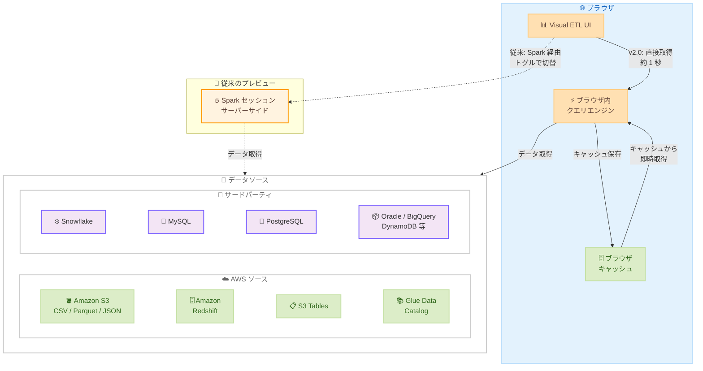

# Amazon SageMaker Unified Studio - Visual ETL の高速データプレビュー

**リリース日**: 2026 年 3 月 9 日
**サービス**: Amazon SageMaker Unified Studio
**機能**: Visual ETL データプレビュー v2.0

📊 [このアップデートのインフォグラフィックを見る](https://takech9203.github.io/aws-news-summary/20260309-amazon-sagemaker-unified-studio-faster-data-preview.html)

## 概要

Amazon SageMaker Unified Studio の Visual ETL に、データプレビュー v2.0 が導入されました。この新しいプレビュー機能は、ブラウザ内クエリエンジンを使用して約 1 秒でデータプレビュー結果を返すことができ、従来の Spark ベースのプレビューと比較して大幅に高速化されています。

従来の Visual ETL データプレビューでは、サーバーサイドの Apache Spark セッションを起動する必要があり、結果の取得に時間がかかっていました。データプレビュー v2.0 では、ソースデータがブラウザにキャッシュされ、サーバーサイドの Spark セッションが不要になるため、追加のコンピューティングコストも発生しません。CSV、Parquet、JSON (Amazon S3 上) に加え、Amazon Redshift、S3 Tables、AWS Glue Data Catalog、さらにサードパーティソース (Snowflake、MySQL、PostgreSQL、SQL Server、Oracle、BigQuery、DynamoDB、DocumentDB) もサポートしています。

**アップデート前の課題**

- Visual ETL でデータプレビューを実行するたびに、サーバーサイドの Apache Spark セッションの起動が必要で、結果取得に時間がかかっていた
- Spark セッションの起動と維持に追加のコンピューティングコストが発生していた
- ETL パイプラインの開発中、データの確認と検証のサイクルが遅く、開発効率が低下していた

**アップデート後の改善**

- ブラウザ内クエリエンジンにより、約 1 秒でデータプレビュー結果を取得できるようになった
- サーバーサイドの Spark セッションが不要になり、追加のコンピューティングコストが発生しなくなった
- ソースデータがブラウザにキャッシュされ、繰り返しのプレビューがさらに高速化された
- v2.0 と従来の Spark ベースプレビューをトグルで切り替え可能になった

## アーキテクチャ図

データプレビュー v2.0 のアーキテクチャを示しています。ブラウザ内クエリエンジンがデータソースから直接データを取得し、キャッシュに保存することで、サーバーサイドの Spark セッションを経由せず高速なプレビューを実現します。

## サービスアップデートの詳細

### 主要機能

1. **ブラウザ内クエリエンジン**
   - サーバーサイドの Spark セッションを使用せずに、ブラウザ内でデータプレビューを実行
   - 約 1 秒でプレビュー結果を取得可能
   - 追加のコンピューティングコストが不要

2. **ブラウザキャッシュ**
   - ソースデータがブラウザにキャッシュされる
   - 繰り返しのプレビューではキャッシュからデータを即時取得
   - ETL パイプライン開発中のデータ確認サイクルを大幅に短縮

3. **幅広いデータソースサポート**
   - Amazon S3 上の CSV、Parquet、JSON ファイル
   - Amazon Redshift、S3 Tables、AWS Glue Data Catalog
   - サードパーティソース: Snowflake、MySQL、PostgreSQL、SQL Server、Oracle、BigQuery、DynamoDB、DocumentDB

4. **プレビューモード切替**
   - v2.0 (ブラウザ内クエリエンジン) と従来の Spark ベースプレビューをトグルで切り替え可能
   - 必要に応じて従来のプレビュー方式も利用可能

## 技術仕様

### サポートされるデータソース

| カテゴリ | データソース | サポートフォーマット |
|----------|-------------|---------------------|
| Amazon S3 | S3 バケット | CSV、Parquet、JSON |
| AWS データサービス | Amazon Redshift | テーブル、ビュー |
| AWS データサービス | S3 Tables | テーブル |
| AWS データサービス | AWS Glue Data Catalog | テーブル、ビュー |
| サードパーティ | Snowflake | テーブル、ビュー |
| サードパーティ | MySQL | テーブル |
| サードパーティ | PostgreSQL | テーブル |
| サードパーティ | SQL Server | テーブル |
| サードパーティ | Oracle | テーブル |
| サードパーティ | BigQuery | テーブル |
| サードパーティ | DynamoDB | テーブル |
| サードパーティ | DocumentDB | コレクション |

### プレビューモードの比較

| 項目 | データプレビュー v2.0 | 従来の Spark ベースプレビュー |
|------|----------------------|------------------------------|
| 応答時間 | 約 1 秒 | Spark セッション起動時間 + クエリ実行時間 |
| 実行環境 | ブラウザ内クエリエンジン | サーバーサイド Spark セッション |
| 追加コスト | なし | Spark コンピューティングコスト |
| データキャッシュ | ブラウザにキャッシュ | なし |
| データソース | 主要な AWS およびサードパーティソース | すべての Glue 対応ソース |

## 設定方法

### 前提条件

1. Amazon SageMaker Unified Studio ドメインが作成されていること
2. Visual ETL プロジェクトが存在すること
3. 対象データソースへのアクセス権限が設定されていること

### 手順

#### ステップ 1: Visual ETL ジョブを開く

SageMaker Unified Studio にログインし、Visual ETL プロジェクトを開きます。既存のジョブまたは新規ジョブを選択します。

#### ステップ 2: データソースノードを追加

Visual ETL キャンバスで、対象のデータソースノードを追加し、接続設定を行います。

#### ステップ 3: データプレビュー v2.0 を使用

データソースノードを選択し、データプレビューを実行します。デフォルトで v2.0 (ブラウザ内クエリエンジン) が使用されます。必要に応じて、トグルスイッチで従来の Spark ベースプレビューに切り替えることも可能です。

## メリット

### ビジネス面

- **開発効率の大幅な向上**: データプレビューの待ち時間が大幅に短縮され、ETL パイプラインの開発サイクルが高速化されます
- **コスト削減**: サーバーサイドの Spark セッションが不要になるため、追加のコンピューティングコストが発生しません
- **迅速なデータ検証**: 約 1 秒でプレビュー結果が得られるため、データの品質確認を素早く繰り返し行えます

### 技術面

- **ブラウザ内処理**: データプレビューがクライアントサイドで完結するため、サーバーリソースへの依存が減少します
- **キャッシュ活用**: ブラウザキャッシュにより、同一データへの繰り返しアクセスが高速化されます
- **幅広い互換性**: AWS ネイティブサービスに加え、主要なサードパーティデータソースをサポートしています

## デメリット・制約事項

### 制限事項

- ブラウザ内クエリエンジンで処理可能なデータ量には、クライアント側のメモリに依存した制限がある可能性があります
- 大規模なデータセットの場合、従来の Spark ベースプレビューの方が適している場合があります
- ブラウザキャッシュのサイズには上限があるため、非常に大きなデータセットではキャッシュが効かない可能性があります

### 考慮すべき点

- ブラウザキャッシュにデータが保存されるため、機密性の高いデータを扱う場合はセキュリティポリシーの確認が推奨されます
- 従来の Spark ベースプレビューが必要なケースに備えて、両方のモードの使い分けを理解しておくことが重要です

## ユースケース

### ユースケース 1: ETL パイプラインの反復的な開発

**シナリオ**: データエンジニアが Visual ETL で複雑な変換ロジックを構築しており、各ステップでデータの変換結果を確認しながら開発を進めたい。

**効果**: 各変換ステップのプレビューが約 1 秒で完了するため、従来のように Spark セッションの起動を待つ必要がなく、開発のイテレーション速度が大幅に向上します。

### ユースケース 2: マルチソースデータの品質確認

**シナリオ**: データアナリストが複数のデータソース (Amazon S3 上の CSV ファイル、Redshift のテーブル、Snowflake のテーブル) からデータを取り込む ETL ジョブを作成する際に、各ソースのデータ内容を素早く確認したい。

**効果**: サードパーティソースを含む複数のデータソースのプレビューを追加コストなしで即座に実行でき、データ統合前の品質確認が効率的に行えます。

### ユースケース 3: コスト最適化を重視した開発

**シナリオ**: スタートアップ企業がコストを抑えながら ETL パイプラインを開発したい。プレビューのたびに Spark セッションのコストが発生することを避けたい。

**効果**: ブラウザ内クエリエンジンによりサーバーサイドのコンピューティングコストが不要になり、開発段階でのコストを大幅に削減できます。

## 料金

データプレビュー v2.0 はブラウザ内で実行されるため、追加のコンピューティングコストは発生しません。ただし、以下のサービスの使用に対して通常の料金が発生します。

- Amazon SageMaker Unified Studio の使用料金
- データソースへのアクセスに伴うデータ転送料金
- 従来の Spark ベースプレビューを使用する場合の Spark コンピューティングコスト

## 利用可能リージョン

この機能は、Amazon SageMaker Unified Studio がサポートされているすべての AWS リージョンで利用可能です。

## 関連サービス・機能

- **Amazon SageMaker Unified Studio**: データ統合、分析、機械学習のための統合スタジオ環境
- **AWS Glue**: データの準備と変換を行うサーバーレス ETL サービス
- **AWS Glue Data Catalog**: データレイクのメタデータカタログサービス
- **Amazon Redshift**: クラウドデータウェアハウスサービス
- **Amazon S3 Tables**: S3 上のテーブル形式データ管理機能

## 参考リンク

- 📊 [インフォグラフィック](https://takech9203.github.io/aws-news-summary/20260309-amazon-sagemaker-unified-studio-faster-data-preview.html)
- [公式発表 (What's New)](https://aws.amazon.com/about-aws/whats-new/2026/03/amazon-sagemaker-unified-studio-faster-data-preview/)
- [SageMaker Unified Studio ドキュメント](https://docs.aws.amazon.com/sagemaker-unified-studio/latest/userguide/)
- [SageMaker Unified Studio 料金ページ](https://aws.amazon.com/sagemaker-unified-studio/pricing/)

## まとめ

Amazon SageMaker Unified Studio の Visual ETL データプレビュー v2.0 は、ブラウザ内クエリエンジンにより約 1 秒でデータプレビューを実現する大幅なパフォーマンス改善です。追加のコンピューティングコストなしで、幅広い AWS およびサードパーティデータソースからのプレビューが可能になり、ETL パイプライン開発の効率性が大きく向上します。Visual ETL を使用しているチームは、この機能を活用して開発サイクルの短縮とコスト削減を実現することをお勧めします。
