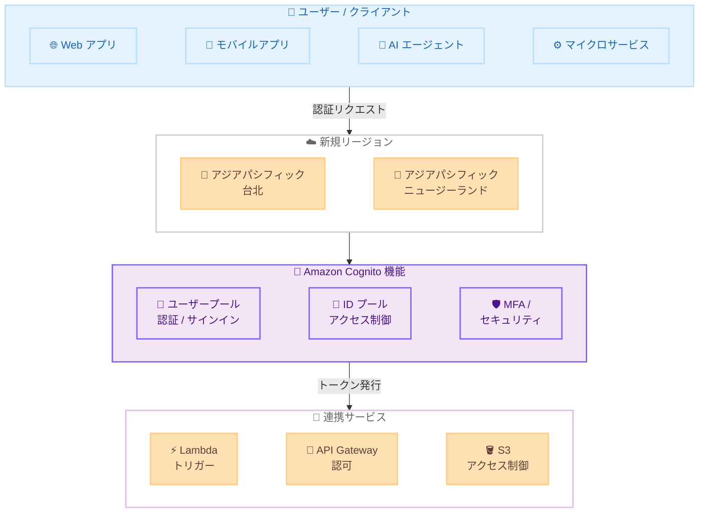

# Amazon Cognito - アジアパシフィック (台北) およびアジアパシフィック (ニュージーランド) リージョンで利用可能に

**リリース日**: 2026 年 3 月 9 日
**サービス**: Amazon Cognito
**機能**: リージョン拡張 (アジアパシフィック (台北)、アジアパシフィック (ニュージーランド))

[このアップデートのインフォグラフィックを見る](https://takech9203.github.io/aws-news-summary/20260309-cognito-taipei-and-new-zealand-regions.html)

## 概要

Amazon Cognito が AWS アジアパシフィック (台北) リージョンおよびアジアパシフィック (ニュージーランド) リージョンで利用可能になりました。すべての機能とティアが両リージョンで提供され、ユーザー、AI エージェント、マイクロサービスに対するセキュアなサインインとアクセス制御を実装できます。

Amazon Cognito は、Web アプリケーションやモバイルアプリケーションに認証・認可・ユーザー管理機能を提供するサービスです。今回のリージョン拡張により、台湾およびニュージーランドに拠点を持つお客様は、より低いレイテンシーで Cognito の機能を利用できるようになり、データレジデンシー要件への対応も容易になります。

**アップデート前の課題**

- 台湾やニュージーランドのお客様は、地理的に離れたリージョン (東京、シドニーなど) の Cognito を使用する必要があり、レイテンシーが発生していた
- 台湾やニュージーランドにおけるデータレジデンシー要件を満たすために、認証データを当該地域内に保持することが困難だった
- アジアパシフィック地域での認証インフラの冗長性を確保するための選択肢が限られていた

**アップデート後の改善**

- アジアパシフィック (台北) およびアジアパシフィック (ニュージーランド) リージョンで Cognito のすべての機能とティアが利用可能になった
- 台湾およびニュージーランドのお客様がローカルリージョンで認証データを保持でき、データレジデンシー要件への対応が容易になった
- アジアパシフィック地域でのリージョン選択肢が増え、認証インフラの冗長性と可用性が向上した

## アーキテクチャ図



Amazon Cognito が新規 2 リージョンで利用可能になり、ユーザー、AI エージェント、マイクロサービスからの認証リクエストをローカルリージョンで処理し、連携サービスとのトークンベースの認可を実現します。

## サービスアップデートの詳細

### 主要機能

1. **全機能のリージョン展開**
   - ユーザープール (認証、サインイン、ユーザー管理) がすべて利用可能
   - ID プール (フェデレーティッド ID、一時的な AWS 認証情報の付与) がすべて利用可能
   - すべてのティア (Lite、Essentials、Plus) が利用可能

2. **セキュアなサインイン機能**
   - ユーザー名 / パスワード認証
   - ソーシャル ID プロバイダー (Google、Facebook、Apple など) との連携
   - SAML 2.0 および OpenID Connect によるエンタープライズ ID フェデレーション
   - 多要素認証 (MFA) のサポート

3. **AI エージェントおよびマイクロサービス対応**
   - マシン間 (M2M) 認証のサポート
   - OAuth 2.0 クライアント認証情報フローによるサービス間認証
   - AI エージェントに対するスコープベースのアクセス制御

## 技術仕様

### 新規リージョン情報

| 項目 | 詳細 |
|------|------|
| リージョン名 1 | アジアパシフィック (台北) / ap-northeast-4 |
| リージョン名 2 | アジアパシフィック (ニュージーランド) / ap-southeast-5 |
| 対応機能 | すべての Cognito 機能 |
| 対応ティア | Lite、Essentials、Plus |
| 認証プロトコル | OAuth 2.0、OpenID Connect、SAML 2.0 |

### サポートされる認証フロー

| 認証フロー | 説明 |
|-----------|------|
| USER_PASSWORD_AUTH | ユーザー名とパスワードによる認証 |
| USER_SRP_AUTH | SRP プロトコルによるセキュアな認証 |
| CUSTOM_AUTH | Lambda トリガーによるカスタム認証フロー |
| CLIENT_CREDENTIALS | M2M / マイクロサービス間の認証 |
| REFRESH_TOKEN_AUTH | リフレッシュトークンによるトークン更新 |

## 設定方法

### 前提条件

1. AWS アカウントを持っていること
2. 対象リージョンへのアクセス権限があること
3. IAM ポリシーで Amazon Cognito の操作が許可されていること

### 手順

#### ステップ 1: リージョンの選択

AWS マネジメントコンソールにサインインし、リージョンセレクターからアジアパシフィック (台北) またはアジアパシフィック (ニュージーランド) を選択します。

#### ステップ 2: ユーザープールの作成

```bash
aws cognito-idp create-user-pool \
  --pool-name "MyUserPool" \
  --region ap-northeast-4 \
  --auto-verified-attributes email \
  --mfa-configuration OPTIONAL \
  --policies '{"PasswordPolicy":{"MinimumLength":8,"RequireUppercase":true,"RequireLowercase":true,"RequireNumbers":true,"RequireSymbols":true}}'
```

新しいリージョンでユーザープールを作成します。`--region` パラメータに `ap-northeast-4` (台北) または `ap-southeast-5` (ニュージーランド) を指定します。

#### ステップ 3: アプリクライアントの作成

```bash
aws cognito-idp create-user-pool-client \
  --user-pool-id <USER_POOL_ID> \
  --client-name "MyAppClient" \
  --region ap-northeast-4 \
  --explicit-auth-flows ALLOW_USER_PASSWORD_AUTH ALLOW_REFRESH_TOKEN_AUTH \
  --supported-identity-providers COGNITO
```

ユーザープールにアプリクライアントを作成し、認証フローとサポートする ID プロバイダーを設定します。

#### ステップ 4: ID プールの作成 (必要な場合)

```bash
aws cognito-identity create-identity-pool \
  --identity-pool-name "MyIdentityPool" \
  --region ap-northeast-4 \
  --allow-unauthenticated-identities \
  --cognito-identity-providers ProviderName="cognito-idp.ap-northeast-4.amazonaws.com/<USER_POOL_ID>",ClientId="<CLIENT_ID>"
```

AWS リソースへの一時的なアクセス認証情報を発行するために ID プールを作成します。Cognito ユーザープールを ID プロバイダーとして関連付けます。

## メリット

### ビジネス面

- **データレジデンシー要件への対応**: 台湾およびニュージーランドの規制要件に準拠し、認証データを当該地域内に保持可能
- **ユーザー体験の向上**: ローカルリージョンでの認証処理により、サインインのレイテンシーが低減
- **市場展開の加速**: アジアパシフィック地域での新規サービス展開時に、現地リージョンの Cognito を即座に利用可能

### 技術面

- **低レイテンシー認証**: 地理的に近いリージョンでの認証処理により、認証フローの応答時間が改善
- **高可用性の向上**: アジアパシフィック地域でのリージョン選択肢が増え、マルチリージョン構成の柔軟性が向上
- **フル機能サポート**: すべてのティアと機能が利用可能なため、既存の Cognito 構成を新リージョンにそのまま展開可能

## デメリット・制約事項

### 制限事項

- 既存のユーザープールを別リージョンに直接移行する機能は提供されていないため、新リージョンで新たにユーザープールを作成する必要がある
- リージョン間でのユーザーデータの自動同期は提供されていないため、マルチリージョン構成では独自の同期メカニズムの検討が必要
- 新規リージョンのため、初期段階ではサービスクォータの引き上げリクエストが必要になる場合がある

### 考慮すべき点

- 新リージョンへの移行時は、既存ユーザーの再登録またはデータ移行の計画が必要
- マルチリージョン構成を検討する場合は、トークン検証やセッション管理の設計を慎重に行うこと
- 連携する AWS サービス (API Gateway、Lambda など) も同一リージョンで利用可能か確認すること

## ユースケース

### ユースケース 1: 台湾市場向け Web アプリケーションの認証基盤

**シナリオ**: 台湾市場向けの EC サイトを運営しており、ユーザー認証のレイテンシー低減とデータレジデンシー要件への対応が必要。

**実装例**:
- アジアパシフィック (台北) リージョンに Cognito ユーザープールを作成
- ソーシャルログイン (Google、LINE) と MFA を有効化
- API Gateway と統合して認証付き API を構築

**効果**: 台湾のユーザーに対して低レイテンシーなサインイン体験を提供し、台湾のデータ保護規制に準拠した認証基盤を構築できる。

### ユースケース 2: ニュージーランドの金融サービスにおけるコンプライアンス対応

**シナリオ**: ニュージーランドの金融機関が、顧客データを国内に保持する規制要件を満たしつつ、セキュアな認証基盤を構築したい。

**実装例**:
- アジアパシフィック (ニュージーランド) リージョンに Cognito ユーザープールを作成
- SAML 2.0 を使用した企業 ID プロバイダーとのフェデレーション
- 高度なセキュリティ機能 (Plus ティア) を有効化してリスクベース認証を実装

**効果**: 認証データをニュージーランド国内に保持しつつ、金融規制に準拠したセキュアな認証基盤を実現できる。

### ユースケース 3: AI エージェントのマルチリージョン認証

**シナリオ**: アジアパシフィック地域で AI エージェントを展開しており、各リージョンでエージェントの認証とアクセス制御を実装したい。

**実装例**:
- 台北およびニュージーランドリージョンで M2M 認証用のアプリクライアントを作成
- OAuth 2.0 クライアント認証情報フローを使用して AI エージェントを認証
- リソースサーバーとスコープを定義してきめ細かなアクセス制御を実装

**効果**: AI エージェントに対するローカルリージョンでの高速な認証と、スコープベースのきめ細かなアクセス制御を実現できる。

## 料金

Amazon Cognito の料金は、月間アクティブユーザー (MAU) 数に基づく従量課金制です。料金はティアによって異なります。新規リージョンでも既存リージョンと同じ料金体系が適用されます。

### 料金例

| ティア | 無料枠 | 主な料金 |
|--------|--------|----------|
| Lite | MAU 10,000 人まで無料 | 認証のみの基本機能 |
| Essentials | - | MFA、パスキー、カスタムトークンなどの拡張機能 |
| Plus | - | 高度なセキュリティ、リスクベース認証 |

詳細な料金については [Amazon Cognito 料金ページ](https://aws.amazon.com/cognito/pricing/) をご確認ください。

## 利用可能リージョン

今回のアップデートにより、Amazon Cognito は以下の 2 つの新規リージョンで利用可能になりました。

| リージョン | リージョンコード |
|-----------|----------------|
| アジアパシフィック (台北) | ap-northeast-4 |
| アジアパシフィック (ニュージーランド) | ap-southeast-5 |

既存の利用可能リージョンに加え、上記の 2 リージョンが追加されました。すべての機能とティアが利用可能です。

## 関連サービス・機能

- **Amazon API Gateway**: Cognito ユーザープールを API の認可機能として統合し、認証付き API を構築
- **AWS Lambda**: Cognito トリガーを使用して、認証フローのカスタマイズやユーザー移行を実装
- **AWS IAM**: ID プールと連携し、認証済みユーザーに一時的な AWS 認証情報を付与
- **Amazon Verified Permissions**: Cognito トークンと連携したきめ細かなアクセス制御ポリシーの管理
- **AWS WAF**: Cognito エンドポイントへの不正アクセスやボット攻撃からの保護

## 参考リンク

- [インフォグラフィック](https://takech9203.github.io/aws-news-summary/20260309-cognito-taipei-and-new-zealand-regions.html)
- [公式発表 (What's New)](https://aws.amazon.com/about-aws/whats-new/2026/03/cognito-taipei-and-new-zealand-regions/)
- [Amazon Cognito 製品ページ](https://aws.amazon.com/cognito/)
- [Amazon Cognito デベロッパーガイド](https://docs.aws.amazon.com/cognito/latest/developerguide/)
- [Amazon Cognito 料金ページ](https://aws.amazon.com/cognito/pricing/)

## まとめ

Amazon Cognito がアジアパシフィック (台北) およびアジアパシフィック (ニュージーランド) リージョンで利用可能になり、すべての機能とティアが両リージョンで提供されます。台湾やニュージーランドに拠点を持つお客様は、ローカルリージョンでの低レイテンシー認証とデータレジデンシー要件への対応が可能になります。新規リージョンでアプリケーションを展開する場合や、既存のマルチリージョン構成を拡張する場合は、Cognito ユーザープールの作成を検討してください。
