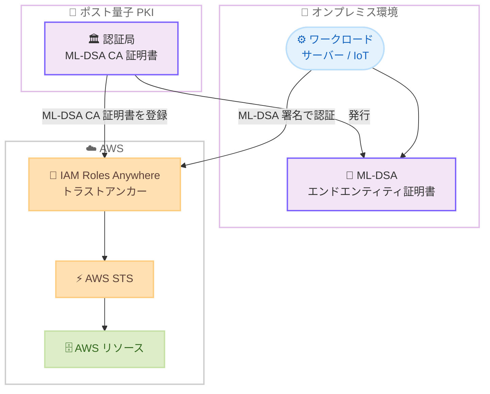

# IAM Roles Anywhere - ポスト量子デジタル証明書のサポート

**リリース日**: 2026 年 03 月 09 日
**サービス**: AWS IAM Roles Anywhere
**機能**: FIPS 204 ML-DSA ポスト量子デジタル署名アルゴリズムのサポート

[このアップデートのインフォグラフィックを見る](https://takech9203.github.io/aws-news-summary/20260309-iam-roles-anywhere-post-quantum-digital-certificates.html)

## 概要

IAM Roles Anywhere が FIPS 204 Module-Lattice Digital Signature Standard (ML-DSA) をサポートしました。ML-DSA は NIST が標準化した量子耐性デジタル署名アルゴリズムであり、将来の量子コンピュータによる暗号解読の脅威に対する防御を提供します。

このアップデートにより、ML-DSA で署名された CA 証明書をトラストアンカーとして登録し、ML-DSA 鍵にバインドされたエンドエンティティ証明書を使用して AWS の一時的な認証情報を取得できるようになります。オンプレミスのサーバーや IoT デバイスなど、AWS 外部のワークロードが量子耐性の認証方式で AWS リソースにアクセスすることが可能になります。

IAM Roles Anywhere が利用可能なすべての AWS リージョンでこの機能を利用でき、GovCloud、European Sovereign Cloud、中国リージョンも含まれます。

**アップデート前の課題**

- IAM Roles Anywhere のトラストアンカーおよびエンドエンティティ証明書は、RSA や ECDSA などの従来型デジタル署名アルゴリズムのみをサポートしていた
- 量子コンピュータの発展に伴い、従来の暗号アルゴリズムが将来的に破られるリスク (Harvest Now, Decrypt Later 攻撃) に対する対策手段がなかった
- ポスト量子暗号への移行を計画している組織が、IAM Roles Anywhere の認証フローを移行対象から除外せざるを得なかった

**アップデート後の改善**

- FIPS 204 ML-DSA による量子耐性デジタル署名を IAM Roles Anywhere の認証フローで使用可能になった
- ML-DSA で署名された CA 証明書をトラストアンカーとして登録し、ポスト量子対応の PKI を構築できるようになった
- 組織全体のポスト量子暗号移行計画に IAM Roles Anywhere を含めることが可能になった

## アーキテクチャ図



ML-DSA ポスト量子証明書を使用した IAM Roles Anywhere の認証フローを示しています。オンプレミスのワークロードが ML-DSA エンドエンティティ証明書で署名した認証リクエストを IAM Roles Anywhere に送信し、トラストアンカーに登録された ML-DSA CA 証明書で検証後、AWS STS を通じて一時的な認証情報が発行されます。

## サービスアップデートの詳細

### 主要機能

1. **ML-DSA トラストアンカーのサポート**
   - ML-DSA で署名された CA 証明書をトラストアンカーとして登録可能
   - FIPS 204 標準に準拠した量子耐性の信頼チェーンを構築
   - 既存の RSA/ECDSA ベースのトラストアンカーと併用可能

2. **ML-DSA エンドエンティティ証明書のサポート**
   - ML-DSA 鍵にバインドされたエンドエンティティ証明書を使用した認証が可能
   - CreateSession API で ML-DSA 署名による認証リクエストを処理
   - 従来の証明書形式と同様の認証フローで動作

3. **グローバルリージョン対応**
   - IAM Roles Anywhere が利用可能なすべてのリージョンで ML-DSA をサポート
   - GovCloud (US) リージョンでの利用が可能で、米国政府のポスト量子要件に対応
   - European Sovereign Cloud および中国リージョンでも利用可能

## 技術仕様

### ML-DSA アルゴリズムの概要

| 項目 | 詳細 |
|------|------|
| 標準規格 | FIPS 204 Module-Lattice Digital Signature Standard |
| アルゴリズム名 | ML-DSA (旧称: CRYSTALS-Dilithium) |
| 暗号基盤 | 格子暗号 (Lattice-based cryptography) |
| NIST 標準化 | 2024 年 8 月に FIPS 204 として正式標準化 |
| 量子耐性 | 量子コンピュータによる Shor のアルゴリズム攻撃に耐性あり |
| 用途 | CA 証明書のトラストアンカー登録、エンドエンティティ証明書による認証 |

### サポートされる証明書タイプ

| 証明書タイプ | ML-DSA サポート | 用途 |
|-------------|----------------|------|
| CA 証明書 | サポート | トラストアンカーとして登録 |
| エンドエンティティ証明書 | サポート | ワークロード認証 |
| 中間 CA 証明書 | サポート | 証明書チェーンの構築 |

### API 変更履歴

今回のアップデートに関連する API 変更は確認されていません。既存の IAM Roles Anywhere API (CreateTrustAnchor、CreateSession など) が ML-DSA 証明書を受け入れるよう拡張されたサービス側の変更です。

### IAM ポリシーの設定例

```json
{
    "Version": "2012-10-17",
    "Statement": [
        {
            "Effect": "Allow",
            "Principal": {
                "Service": "rolesanywhere.amazonaws.com"
            },
            "Action": [
                "sts:AssumeRole",
                "sts:SetSourceIdentity",
                "sts:TagSession"
            ],
            "Condition": {
                "ArnEquals": {
                    "aws:SourceArn": "arn:aws:rolesanywhere:us-east-1:123456789012:trust-anchor/example-trust-anchor-id"
                }
            }
        }
    ]
}
```

## 設定方法

### 前提条件

1. ML-DSA 対応の認証局 (CA) が構築済みであること
2. ML-DSA で署名された CA 証明書およびエンドエンティティ証明書が発行済みであること
3. IAM Roles Anywhere の利用に必要な IAM 権限があること
4. AWS CLI v2 または SDK がインストール済みであること

### 手順

#### ステップ 1: ML-DSA CA 証明書をトラストアンカーとして登録

```bash
# ML-DSA で署名された CA 証明書をトラストアンカーとして作成
aws rolesanywhere create-trust-anchor \
    --name "post-quantum-trust-anchor" \
    --source "sourceType=CERTIFICATE_BUNDLE,sourceData={x509CertificateData=$(cat ml-dsa-ca-cert.pem)}" \
    --enabled
```

ML-DSA で署名された CA 証明書を IAM Roles Anywhere のトラストアンカーとして登録します。この CA 証明書を基にエンドエンティティ証明書の検証が行われます。

#### ステップ 2: プロファイルの作成

```bash
# ワークロードが引き受ける IAM ロールを指定するプロファイルを作成
aws rolesanywhere create-profile \
    --name "post-quantum-profile" \
    --role-arns "arn:aws:iam::123456789012:role/PostQuantumWorkloadRole" \
    --enabled
```

ワークロードが認証後に引き受ける IAM ロールを指定するプロファイルを作成します。

#### ステップ 3: ワークロードからの認証

```bash
# AWS IAM Roles Anywhere Credential Helper を使用して一時的な認証情報を取得
aws_signing_helper credential-process \
    --certificate /path/to/ml-dsa-end-entity-cert.pem \
    --private-key /path/to/ml-dsa-private-key.pem \
    --trust-anchor-arn arn:aws:rolesanywhere:us-east-1:123456789012:trust-anchor/example-id \
    --profile-arn arn:aws:rolesanywhere:us-east-1:123456789012:profile/example-id \
    --role-arn arn:aws:iam::123456789012:role/PostQuantumWorkloadRole
```

AWS IAM Roles Anywhere Credential Helper を使用し、ML-DSA エンドエンティティ証明書と秘密鍵で署名した認証リクエストを送信して一時的な認証情報を取得します。

## メリット

### ビジネス面

- **将来の量子脅威への先行対策**: 量子コンピュータが実用化される前にポスト量子暗号への移行を開始でき、Harvest Now, Decrypt Later 攻撃のリスクを低減
- **コンプライアンス対応**: NIST 標準 (FIPS 204) に準拠した量子耐性アルゴリズムを採用しており、政府機関や規制産業のポスト量子暗号要件に対応
- **段階的な移行が可能**: 既存の RSA/ECDSA 証明書と ML-DSA 証明書を併用できるため、段階的なポスト量子暗号移行が可能

### 技術面

- **NIST 標準準拠**: FIPS 204 として正式に標準化された ML-DSA を採用しており、長期的な互換性と信頼性を確保
- **既存アーキテクチャとの互換性**: 既存の IAM Roles Anywhere の認証フローやプロファイル設定をそのまま活用可能
- **GovCloud 対応**: 米国政府のポスト量子暗号移行要件 (NSA CNSA 2.0 など) に対応するための基盤として利用可能

## デメリット・制約事項

### 制限事項

- ML-DSA 対応の認証局 (CA) を別途構築する必要があり、既存の CA インフラストラクチャの更新が必要になる場合がある
- ML-DSA の鍵サイズおよび署名サイズは RSA や ECDSA と比較して大きく、ネットワーク帯域や証明書ストレージに影響する可能性がある
- 一部のレガシーシステムやツールが ML-DSA 証明書をサポートしていない場合がある

### 考慮すべき点

- ポスト量子暗号への移行は段階的に進めることが推奨され、まずは非本番環境での検証から開始するべき
- ML-DSA のパフォーマンス特性 (署名生成/検証速度) は従来のアルゴリズムと異なるため、高頻度で認証を行うワークロードではベンチマークテストが推奨される
- 証明書チェーン全体をポスト量子対応にするには、ルート CA から末端証明書まですべて ML-DSA に移行する必要がある

## ユースケース

### ユースケース 1: 政府機関のポスト量子暗号移行

**シナリオ**: 政府機関がオンプレミスデータセンターのワークロードから AWS にアクセスする際、NSA CNSA 2.0 ガイドラインに準拠したポスト量子暗号を採用する必要がある。

**実装例**:
```bash
# GovCloud リージョンで ML-DSA トラストアンカーを作成
aws rolesanywhere create-trust-anchor \
    --name "gov-pqc-trust-anchor" \
    --source "sourceType=CERTIFICATE_BUNDLE,sourceData={x509CertificateData=$(cat gov-ml-dsa-ca.pem)}" \
    --enabled \
    --region us-gov-west-1
```

**効果**: FIPS 204 準拠の量子耐性認証を GovCloud 環境で実現し、政府のポスト量子暗号移行要件を満たせる。

### ユースケース 2: IoT デバイスの長期セキュリティ確保

**シナリオ**: 産業用 IoT デバイスが 15-20 年のライフサイクルを持ち、その期間中に量子コンピュータが実用化される可能性を考慮して、デバイス証明書にポスト量子アルゴリズムを採用する。

**実装例**:
```bash
# IoT デバイス用のプロファイルを作成
aws rolesanywhere create-profile \
    --name "iot-pqc-profile" \
    --role-arns "arn:aws:iam::123456789012:role/IoTDeviceRole" \
    --duration-seconds 3600 \
    --enabled
```

**効果**: デバイスのライフサイクル全体を通じて量子耐性のある認証を維持し、将来の暗号解読リスクからデバイスとデータを保護できる。

### ユースケース 3: 金融機関のハイブリッドクラウド環境

**シナリオ**: 金融機関がオンプレミスの取引システムから AWS 上のデータレイクやアナリティクス基盤にアクセスする際、規制要件に対応したポスト量子暗号認証を実装する。

**実装例**:
```bash
# 金融ワークロード用の認証設定
aws_signing_helper credential-process \
    --certificate /etc/pki/ml-dsa/trading-system-cert.pem \
    --private-key /etc/pki/ml-dsa/trading-system-key.pem \
    --trust-anchor-arn arn:aws:rolesanywhere:ap-northeast-1:123456789012:trust-anchor/finance-pqc-anchor \
    --profile-arn arn:aws:rolesanywhere:ap-northeast-1:123456789012:profile/finance-pqc-profile \
    --role-arn arn:aws:iam::123456789012:role/TradingSystemRole
```

**効果**: 金融規制のポスト量子暗号要件に先行対応し、取引データの長期的な機密性を確保できる。

## 料金

IAM Roles Anywhere の利用料金は無料です。ML-DSA 証明書のサポートに追加料金はかかりません。

### 料金例

| 項目 | 料金 |
|------|------|
| IAM Roles Anywhere | 無料 |
| ML-DSA 証明書サポート | 追加料金なし |
| AWS Private CA (証明書発行に使用する場合) | 汎用モード: $50/月/CA |

ML-DSA 対応の CA を AWS Private CA で構築する場合は、AWS Private CA の料金が適用されます。詳細は [AWS Private CA 料金ページ](https://aws.amazon.com/private-ca/pricing/) を参照してください。

## 利用可能リージョン

IAM Roles Anywhere が利用可能なすべての AWS リージョンで ML-DSA ポスト量子証明書をサポートします。以下のリージョンを含みます。

- すべての商用リージョン
- AWS GovCloud (US) リージョン
- European Sovereign Cloud
- 中国リージョン (北京、寧夏)

## 関連サービス・機能

- **AWS IAM Roles Anywhere**: AWS 外部のワークロードに対して X.509 証明書ベースの認証で一時的な AWS 認証情報を提供するサービス
- **AWS Private Certificate Authority**: ML-DSA 対応の CA 証明書を発行するためのマネージド CA サービス
- **AWS Key Management Service (KMS)**: ポスト量子 TLS をサポートしており、IAM Roles Anywhere と組み合わせて包括的なポスト量子セキュリティを実現
- **AWS Certificate Manager**: 証明書のライフサイクル管理を提供し、ポスト量子暗号移行の管理を支援

## 参考リンク

- [インフォグラフィック](https://takech9203.github.io/aws-news-summary/20260309-iam-roles-anywhere-post-quantum-digital-certificates.html)
- [公式発表 (What's New)](https://aws.amazon.com/about-aws/whats-new/2026/03/iam-roles-anywhere-post-quantum-digital-certificates)
- [ドキュメント: IAM Roles Anywhere](https://docs.aws.amazon.com/rolesanywhere/latest/userguide/introduction.html)
- [ドキュメント: IAM Roles Anywhere Trust Anchors](https://docs.aws.amazon.com/rolesanywhere/latest/userguide/trust-anchors.html)
- [AWS Post-Quantum Cryptography](https://aws.amazon.com/security/post-quantum-cryptography/)

## まとめ

IAM Roles Anywhere が FIPS 204 ML-DSA ポスト量子デジタル署名アルゴリズムをサポートしました。これにより、オンプレミスや IoT デバイスなどの AWS 外部ワークロードが量子耐性のある認証方式で AWS リソースにアクセスできるようになります。GovCloud を含むすべてのリージョンで利用可能であり、将来の量子コンピュータの脅威に備えたポスト量子暗号移行を段階的に進めることが推奨されます。
