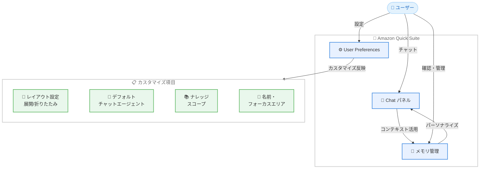

# Amazon Quick Suite - User Preferences によるチャットパーソナライゼーション

**リリース日**: 2026 年 3 月 9 日
**サービス**: Amazon Quick Suite
**機能**: User Preferences - チャットパネルのカスタマイズとパーソナライゼーション

:bar_chart: [このアップデートのインフォグラフィックを見る](https://takech9203.github.io/aws-news-summary/20260309-user-preferences-in-quick.html)

## 概要

Amazon Quick Suite が User Preferences 機能をリリースしました。この機能により、ユーザーは Chat パネルのレイアウト、デフォルトのチャットエージェント、ナレッジスコープなどを個別にカスタマイズできるようになります。Quick Suite は AI を活用したワークスペースおよびエージェントチームメイトであり、ビジネスデータから回答を得て迅速にアクションへ移行できるサービスです。

User Preferences では、ユーザーの名前やフォーカスエリアを設定でき、Quick がそのコンテキストを活用してレスポンスをパーソナライズします。また、Quick がユーザーとのやり取りから学習した「メモリ」を User Preferences 画面から確認・管理できるようになりました。これにより、各ユーザーが自分の業務スタイルに最適化された AI アシスタント体験を構築できます。

**アップデート前の課題**

- Chat パネルのレイアウトをユーザーごとにカスタマイズできず、全員が同じ表示で利用していた
- デフォルトのチャットエージェントを選択できず、毎回手動でエージェントを切り替える必要があった
- ナレッジスコープを個別に設定できず、関連性の低い情報が回答に含まれることがあった
- Quick がユーザーのコンテキストを把握できず、汎用的なレスポンスしか提供できなかった
- AI が学習したユーザー情報を確認・管理する手段がなかった

**アップデート後の改善**

- Chat パネルのレイアウトを展開/折りたたみなど好みに応じてカスタマイズ可能になった
- デフォルトのチャットエージェントを事前に選択でき、作業効率が向上した
- ナレッジスコープを個別に設定でき、業務に関連する情報に絞った回答を得られるようになった
- 名前やフォーカスエリアの設定により、パーソナライズされたレスポンスを受けられるようになった
- User Preferences からメモリの確認と管理が可能になり、AI の学習内容を制御できるようになった

## アーキテクチャ図

この図は、User Preferences を通じてユーザーが Chat パネルのレイアウト、デフォルトエージェント、ナレッジスコープ、プロフィール情報をカスタマイズし、メモリ機能と連携してパーソナライズされたチャット体験を実現する構成を示しています。

## サービスアップデートの詳細

### 主要機能

1. **Chat パネルレイアウトのカスタマイズ**
   - Chat パネルの表示を展開または折りたたみから選択可能
   - ユーザーの作業スタイルに合わせたレイアウト設定
   - 設定はユーザーごとに永続化される

2. **デフォルトチャットエージェントの選択**
   - 利用可能なチャットエージェントからデフォルトを選択可能
   - チャット開始時に自動的に選択したエージェントが使用される
   - サードパーティエージェントを含む任意のエージェントを指定可能

3. **ナレッジスコープの設定**
   - 回答に使用するナレッジベースの範囲をカスタマイズ可能
   - 業務に関連する情報源に絞ることで、回答の精度が向上
   - 複数のナレッジソースから選択して設定

4. **プロフィール情報によるパーソナライゼーション**
   - ユーザー名とフォーカスエリアを設定可能
   - Quick がコンテキストを活用してレスポンスをパーソナライズ
   - 業務領域に特化した回答を自動的に生成

5. **メモリの確認と管理**
   - Quick がユーザーとのやり取りから学習した情報を「メモリ」として保存
   - User Preferences からメモリの一覧を確認可能
   - 不要なメモリの削除や管理が可能

## 技術仕様

### User Preferences の設定項目

| 項目 | 説明 | 設定値 |
|------|------|--------|
| Chat パネルレイアウト | パネルの表示形式 | 展開/折りたたみ |
| デフォルトチャットエージェント | チャット開始時のエージェント | 利用可能なエージェントから選択 |
| ナレッジスコープ | 回答に使用する情報範囲 | ナレッジベースから選択 |
| ユーザー名 | パーソナライゼーション用の名前 | 任意のテキスト |
| フォーカスエリア | 業務領域の指定 | 任意のテキスト |
| メモリ管理 | AI が学習した情報の確認と管理 | 表示/削除 |

### API 変更履歴

| 日付 | サービス | 変更内容 |
|------|----------|----------|
| 2026/03/04 | [Amazon QuickSight](https://awsapichanges.com/archive/changes/91f8bd-quicksight.html) | 4 updated api methods - ChatAgent、CreateChatAgents 等の新しい Capabilities を追加 |

## 設定方法

### 前提条件

1. Amazon Quick Suite のアカウントとアクセス権限
2. Quick Suite が利用可能な AWS リージョンでの利用

### 手順

#### ステップ 1: Amazon Quick Suite にアクセス

AWS Management Console から Amazon Quick Suite にアクセスし、ログインします。

#### ステップ 2: User Preferences を開く

Chat パネルまたは設定メニューから User Preferences にアクセスします。

#### ステップ 3: Chat パネルのレイアウトを設定

Chat パネルの表示形式を展開または折りたたみから選択します。作業スタイルに合わせて好みのレイアウトを設定してください。

#### ステップ 4: デフォルトチャットエージェントを選択

利用可能なチャットエージェントの一覧からデフォルトで使用するエージェントを選択します。

#### ステップ 5: プロフィール情報を設定

名前とフォーカスエリアを入力します。Quick はこの情報を使用してレスポンスをパーソナライズします。

#### ステップ 6: メモリを管理

User Preferences のメモリセクションから、Quick が学習した情報を確認し、必要に応じて削除できます。

## メリット

### ビジネス面

- **生産性の向上**: デフォルトエージェントの設定やレイアウトカスタマイズにより、チャット開始までの時間を短縮
- **回答精度の向上**: ナレッジスコープとプロフィール情報により、業務に直結した回答を得られる
- **ユーザー満足度の向上**: 個人の好みに合わせたカスタマイズにより、Quick Suite の利用体験が向上

### 技術面

- **コンテキスト活用**: ユーザーのフォーカスエリアとメモリを活用した高精度なレスポンス生成
- **メモリ管理の透明性**: AI が学習した情報をユーザー自身が確認・制御できる
- **設定の永続化**: ユーザーごとの設定が保存され、セッション間で維持される

## デメリット・制約事項

### 制限事項

- User Preferences は個人単位の設定であり、チーム全体への一括適用はできない
- メモリの学習内容はユーザーとのやり取りに基づくため、初期段階ではパーソナライゼーションの効果が限定的
- フォーカスエリアの設定が不適切な場合、回答の関連性が低下する可能性がある

### 考慮すべき点

- メモリに保存される情報のプライバシーとセキュリティを理解した上で利用する必要がある
- ナレッジスコープを狭く設定しすぎると、関連する情報が回答に含まれなくなる可能性がある
- 定期的にメモリを確認し、不正確な情報が保存されていないか確認することを推奨

## ユースケース

### ユースケース 1: 営業担当者のパーソナライズ設定

**シナリオ**: 営業チームの各メンバーが、担当する業界や顧客セグメントに特化した AI アシスタントを構築する

**実装例**:
- フォーカスエリアに「金融業界向け営業」を設定
- ナレッジスコープを金融関連のデータソースに限定
- デフォルトエージェントを CRM 連携エージェントに設定

**効果**: 業界固有の用語や文脈を理解した回答が得られ、顧客対応の質が向上

### ユースケース 2: データアナリストの効率化

**シナリオ**: データアナリストが、分析業務に最適化された Quick Suite 環境を構築する

**実装例**:
- Chat パネルを展開モードに設定し、詳細な分析結果を表示
- フォーカスエリアに「データ分析・BI」を設定
- ナレッジスコープをデータウェアハウスとダッシュボード関連に設定

**効果**: 分析に関連する回答が優先され、データ探索の効率が向上

### ユースケース 3: メモリ管理によるプライバシー制御

**シナリオ**: セキュリティ意識の高い組織で、AI が保持する情報を定期的にレビューする

**実装例**:
- 月次で User Preferences のメモリセクションを確認
- 機密情報や不要な情報が含まれている場合は削除
- フォーカスエリアを適宜更新して回答の精度を維持

**効果**: AI の学習内容を制御でき、情報ガバナンスの要件を満たしながらパーソナライゼーションを活用

## 料金

User Preferences 機能は Amazon Quick Suite の標準機能として提供され、追加料金は発生しません。Amazon Quick Suite の料金は、エディションとユーザー数に基づいて課金されます。

詳細な料金情報は [Amazon Quick Suite の料金ページ](https://aws.amazon.com/quicksight/pricing/)を参照してください。

## 利用可能リージョン

この機能は、Amazon Quick Suite が利用可能なすべての AWS リージョンで使用できます。

## 関連サービス・機能

- **Amazon Quick Suite Chat**: User Preferences と連携してパーソナライズされたチャット体験を提供
- **Amazon Bedrock**: Quick Suite の AI レスポンス生成に基盤モデルを活用
- **サードパーティ AI エージェント**: デフォルトエージェントとして Box、Canva、PagerDuty などのエージェントを設定可能

## 参考リンク

- :bar_chart: [インフォグラフィック](https://takech9203.github.io/aws-news-summary/20260309-user-preferences-in-quick.html)
- [公式発表 (What's New)](https://aws.amazon.com/about-aws/whats-new/2026/03/user-preferences-in-quick/)
- [ドキュメント - Amazon Quick Suite User Guide](https://docs.aws.amazon.com/quicksuite/latest/userguide/)

## まとめ

Amazon Quick Suite の User Preferences 機能により、ユーザーは Chat パネルのレイアウト、デフォルトチャットエージェント、ナレッジスコープ、プロフィール情報を個別にカスタマイズし、パーソナライズされた AI アシスタント体験を構築できるようになりました。メモリ管理機能により AI の学習内容を透明に制御できる点も重要です。Quick Suite を利用している組織は、各ユーザーに User Preferences の設定を促し、業務に最適化された AI 活用を推進してください。
