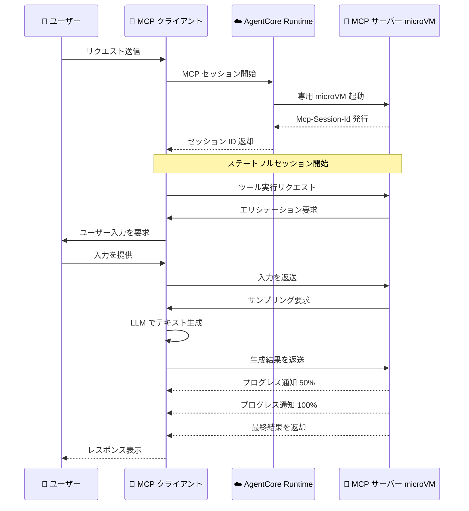

# Amazon Bedrock AgentCore Runtime - ステートフル MCP サーバー機能のサポート

**リリース日**: 2026 年 3 月 10 日
**サービス**: Amazon Bedrock AgentCore Runtime
**機能**: ステートフル MCP サーバー機能

[このアップデートのインフォグラフィックを見る](https://takech9203.github.io/aws-news-summary/20260310-amazon-bedrock-agentcore-runtime-stateful-mcp.html)

## 概要

Amazon Bedrock AgentCore Runtime がステートフルな Model Context Protocol (MCP) サーバー機能をサポートした。これにより、開発者はエリシテーション、サンプリング、プログレス通知を活用した MCP サーバーを構築できるようになり、既存のリソース、プロンプト、ツールのサポートに加えて、より高度なインタラクティブエージェントワークフローが実現可能になった。

ステートフル MCP セッションでは、各ユーザーセッションが専用の microVM 上で分離されたリソースとともに実行され、Mcp-Session-Id ヘッダーを使用して複数のインタラクションにわたるセッションコンテキストを維持する。これにより、単純なリクエスト - レスポンスパターンを超えた複雑でインタラクティブなエージェントワークフローを構築できる。

**アップデート前の課題**

- MCP サーバーはステートレスな動作に限定されており、セッション間でコンテキストを維持できなかった
- ツール実行中にユーザーからインタラクティブに入力を収集する手段がなかった
- MCP サーバーからクライアント側の LLM にテキスト生成をリクエストする仕組みがなかった
- 長時間実行されるオペレーションの進捗をクライアントにリアルタイムで通知する方法がなかった

**アップデート後の改善**

- エリシテーションにより、サーバーから起動するマルチターン会話でユーザーの嗜好や情報を収集できるようになった
- サンプリングにより、サーバーがクライアントに AI によるテキスト生成をリクエストできるようになった
- プログレス通知により、フライト検索や予約処理などの長時間オペレーションの進捗をリアルタイムでクライアントに通知できるようになった
- 専用 microVM による分離とセッション ID によるコンテキスト維持が可能になった

## アーキテクチャ図



ステートフル MCP セッションにおけるエリシテーション、サンプリング、プログレス通知の処理フローを示す。各ユーザーセッションは専用の microVM 上で動作し、セッション ID によりコンテキストが維持される。

## サービスアップデートの詳細

### 主要機能

1. **エリシテーション**
   - サーバーからクライアントへ情報収集のためのマルチターン会話を開始できる
   - ツール実行中にユーザーの嗜好や設定情報をインタラクティブに収集可能
   - 例: 旅行予約エージェントが座席の好みや食事制限を確認する場面

2. **サンプリング**
   - MCP サーバーがクライアント側に AI によるテキスト生成をリクエストできる
   - パーソナライズされた推薦文やコンテンツ生成などに活用可能
   - クライアントの LLM を活用するため、サーバー側で別途モデルを管理する必要がない

3. **プログレス通知**
   - 長時間実行されるオペレーションの進捗状況をリアルタイムでクライアントに通知
   - フライト検索、予約処理、データ分析などの処理中にユーザーへフィードバックを提供
   - クライアントが処理の完了を待つ間のユーザーエクスペリエンスを向上

4. **ステートフルセッション管理**
   - 各ユーザーセッションが専用の microVM で実行され、リソースが分離される
   - Mcp-Session-Id ヘッダーにより複数インタラクションにわたるコンテキストを維持
   - セッション単位でのリソース管理とセキュリティ分離を実現

## 技術仕様

### セッション管理

| 項目 | 詳細 |
|------|------|
| セッション識別 | Mcp-Session-Id ヘッダーによる管理 |
| 実行環境 | 専用 microVM による分離実行 |
| サポートプロトコル | MCP、HTTP、A2A、AGUI |
| ランタイム | Python 3.10 - 3.14 |

### ステートフル MCP 機能一覧

| 機能 | 方向 | 説明 |
|------|------|------|
| リソース | クライアント → サーバー | コンテキストデータの提供 |
| プロンプト | クライアント → サーバー | テンプレート化されたプロンプトの利用 |
| ツール | クライアント → サーバー | サーバー側機能の呼び出し |
| エリシテーション | サーバー → クライアント | ユーザー入力の収集 |
| サンプリング | サーバー → クライアント | AI テキスト生成のリクエスト |
| プログレス通知 | サーバー → クライアント | 処理進捗のリアルタイム通知 |

### API 変更履歴

| 日付 | サービス | 変更内容 |
|------|----------|----------|
| 2026/03/10 | [Amazon Bedrock AgentCore Control](https://awsapichanges.com/archive/changes/9ed5c2-bedrock-agentcore-control.html) | 3 updated api methods - AGUI プロトコルサポートの追加 (CreateAgentRuntime, GetAgentRuntime, UpdateAgentRuntime) |

### デプロイ設定

```python
import boto3

client = boto3.client('bedrock-agentcore-control')

response = client.create_agent_runtime(
    agentRuntimeName='my-stateful-mcp-server',
    agentRuntimeArtifact={
        'containerConfiguration': {
            'containerUri': '123456789012.dkr.ecr.us-east-1.amazonaws.com/my-mcp-server:latest'
        }
    },
    roleArn='arn:aws:iam::123456789012:role/AgentCoreRuntimeRole',
    protocolConfiguration={
        'serverProtocol': 'MCP'
    },
    lifecycleConfiguration={
        'idleRuntimeSessionTimeout': 300,
        'maxLifetime': 3600
    },
    networkConfiguration={
        'networkMode': 'PUBLIC'
    }
)
```

## 設定方法

### 前提条件

1. AWS アカウントと適切な IAM 権限
2. MCP サーバーのコンテナイメージまたは Python コードアーティファクト
3. AgentCore Runtime 用の IAM ロール

### 手順

#### ステップ 1: MCP サーバーの実装

```python
# ステートフル MCP サーバーの実装例
from mcp.server import Server

server = Server("my-stateful-server")

@server.tool()
async def book_flight(destination: str):
    # エリシテーション: ユーザーの座席の好みを収集
    seat_pref = await server.elicit(
        prompt="座席のご希望はありますか?",
        options=["窓側", "通路側", "指定なし"]
    )

    # プログレス通知: 検索中であることを通知
    await server.notify_progress(0.3, "フライトを検索中...")

    # サンプリング: クライアント LLM にパーソナライズされた提案を生成依頼
    recommendation = await server.sample(
        prompt=f"{destination} へのフライト提案を作成してください"
    )

    await server.notify_progress(1.0, "検索完了")
    return recommendation
```

MCP サーバーでエリシテーション、サンプリング、プログレス通知の各機能を実装する例を示している。

#### ステップ 2: AgentCore Runtime へのデプロイ

```bash
# コンテナイメージを ECR にプッシュ
aws ecr get-login-password --region us-east-1 | \
  docker login --username AWS --password-stdin 123456789012.dkr.ecr.us-east-1.amazonaws.com

docker push 123456789012.dkr.ecr.us-east-1.amazonaws.com/my-mcp-server:latest

# AgentCore Runtime を作成
aws bedrock-agentcore-control create-agent-runtime \
  --agent-runtime-name my-stateful-mcp-server \
  --agent-runtime-artifact '{"containerConfiguration":{"containerUri":"123456789012.dkr.ecr.us-east-1.amazonaws.com/my-mcp-server:latest"}}' \
  --role-arn arn:aws:iam::123456789012:role/AgentCoreRuntimeRole \
  --protocol-configuration '{"serverProtocol":"MCP"}'
```

コンテナイメージを ECR にプッシュし、AgentCore Runtime としてデプロイするコマンドを示している。

#### ステップ 3: ステートフルセッションの利用

```bash
# セッションの開始とツール呼び出し
# レスポンスの Mcp-Session-Id ヘッダーを以降のリクエストに含める
curl -X POST https://<runtime-endpoint>/mcp/v1/tools/call \
  -H "Content-Type: application/json" \
  -H "Mcp-Session-Id: <session-id>" \
  -d '{"tool": "book_flight", "arguments": {"destination": "Tokyo"}}'
```

Mcp-Session-Id ヘッダーを使用してステートフルセッションを維持しながらツールを呼び出す例を示している。

## メリット

### ビジネス面

- **ユーザーエクスペリエンスの向上**: エリシテーションとプログレス通知により、エージェントとのインタラクションがより自然で情報量の多いものになる
- **パーソナライゼーションの強化**: サンプリング機能により、クライアント側の LLM を活用したパーソナライズされたコンテンツ生成が可能になる
- **複雑なワークフローの実現**: マルチターン会話やコンテキスト維持により、予約、カスタマーサポートなどの複雑なビジネスプロセスを自動化できる

### 技術面

- **セキュリティ分離**: 各セッションが専用 microVM で動作するため、マルチテナント環境でのセキュリティが確保される
- **セッション管理の簡素化**: Mcp-Session-Id ヘッダーによる標準的なセッション管理で、開発者が独自のセッション管理を実装する必要がない
- **MCP 標準準拠**: 標準的な MCP プロトコルのステートフル機能をサポートしているため、既存の MCP エコシステムとの互換性が保たれる

## デメリット・制約事項

### 制限事項

- ステートフルセッションは専用 microVM を使用するため、ステートレスモードと比較してリソースコストが増加する可能性がある
- セッションにはアイドルタイムアウトと最大ライフタイムの制限があり、長時間のセッション維持には設計上の考慮が必要
- エリシテーションやサンプリングはクライアント側の対応が必要であり、すべての MCP クライアントが対応しているとは限らない

### 考慮すべき点

- ステートフルセッションの microVM 起動時間がコールドスタートとして影響する可能性がある
- セッション数に応じた microVM のスケーリングとコスト管理の計画が必要

## ユースケース

### ユースケース 1: 旅行予約エージェント

**シナリオ**: ユーザーが旅行の予約を行う際に、エージェントがインタラクティブに詳細を確認しながら最適なプランを提案する。

**実装例**:
```python
@server.tool()
async def plan_trip(destination: str):
    # エリシテーション: 旅行の詳細を確認
    dates = await server.elicit("旅行日程を教えてください")
    budget = await server.elicit("ご予算はいくらですか?")

    await server.notify_progress(0.5, "最適なプランを検索中...")

    # サンプリング: パーソナライズされた旅程を生成
    itinerary = await server.sample(
        prompt=f"{destination} への {dates} の旅程を予算 {budget} で作成"
    )
    return itinerary
```

**効果**: ユーザーとの対話を通じて要件を正確に把握し、パーソナライズされた旅行プランを提供できる。

### ユースケース 2: カスタマーサポートエージェント

**シナリオ**: 技術サポートにおいて、問題の切り分けのために段階的にユーザーから情報を収集し、解決策を提示する。

**実装例**:
```python
@server.tool()
async def troubleshoot(issue_description: str):
    # 段階的な情報収集
    env = await server.elicit("ご利用の環境を教えてください")
    error_msg = await server.elicit("エラーメッセージがあれば貼り付けてください")

    await server.notify_progress(0.3, "ナレッジベースを検索中...")

    # サンプリング: 解決策を生成
    solution = await server.sample(
        prompt=f"問題: {issue_description}, 環境: {env}, エラー: {error_msg} の解決策"
    )
    return solution
```

**効果**: セッションコンテキストを維持しながら段階的に問題を特定し、的確な解決策を提供できる。

### ユースケース 3: データ分析パイプライン

**シナリオ**: 大量のデータ分析処理をバックグラウンドで実行しながら、進捗状況をリアルタイムでユーザーに通知する。

**実装例**:
```python
@server.tool()
async def analyze_data(dataset_id: str):
    await server.notify_progress(0.1, "データセットを読み込み中...")
    data = load_dataset(dataset_id)

    await server.notify_progress(0.4, "データを前処理中...")
    processed = preprocess(data)

    await server.notify_progress(0.7, "分析を実行中...")
    results = run_analysis(processed)

    # サンプリング: 分析結果の要約を生成
    summary = await server.sample(
        prompt=f"以下の分析結果を要約してください: {results}"
    )

    await server.notify_progress(1.0, "分析完了")
    return {"results": results, "summary": summary}
```

**効果**: 長時間の分析処理中もユーザーに進捗を通知することで、処理が正常に進行していることを確認できる。

## 料金

AgentCore Runtime の料金は、microVM の実行時間とリソース使用量に基づく。ステートフルセッションでは専用 microVM が割り当てられるため、セッション数とセッション期間が料金に影響する。詳細な料金情報は Amazon Bedrock の料金ページを参照のこと。

## 利用可能リージョン

以下の 14 リージョンで利用可能。

| リージョン | コード |
|-----------|--------|
| 米国東部 (バージニア北部) | us-east-1 |
| 米国東部 (オハイオ) | us-east-2 |
| 米国西部 (オレゴン) | us-west-2 |
| アジアパシフィック (ムンバイ) | ap-south-1 |
| カナダ (中部) | ca-central-1 |
| アジアパシフィック (ソウル) | ap-northeast-2 |
| アジアパシフィック (シンガポール) | ap-southeast-1 |
| アジアパシフィック (シドニー) | ap-southeast-2 |
| アジアパシフィック (東京) | ap-northeast-1 |
| 欧州 (フランクフルト) | eu-central-1 |
| 欧州 (アイルランド) | eu-west-1 |
| 欧州 (ロンドン) | eu-west-2 |
| 欧州 (パリ) | eu-west-3 |
| 欧州 (ストックホルム) | eu-north-1 |

## 関連サービス・機能

- **Amazon Bedrock AgentCore**: MCP サーバーのホスティング基盤で、ブラウザツール、メモリ、コード実行などの機能も提供
- **Amazon Bedrock Agents**: AgentCore Runtime 上の MCP サーバーをツールとして利用可能なエージェントフレームワーク
- **Model Context Protocol**: Anthropic が策定したオープンスタンダードで、AI モデルとツール間の通信プロトコル

## 参考リンク

- [インフォグラフィック](https://takech9203.github.io/aws-news-summary/20260310-amazon-bedrock-agentcore-runtime-stateful-mcp.html)
- [公式発表 (What's New)](https://aws.amazon.com/about-aws/whats-new/2026/03/amazon-bedrock-agentcore-runtime-stateful-mcp/)
- [Amazon Bedrock AgentCore ドキュメント](https://docs.aws.amazon.com/bedrock/latest/userguide/agentcore.html)
- [Amazon Bedrock 料金ページ](https://aws.amazon.com/bedrock/pricing/)

## まとめ

Amazon Bedrock AgentCore Runtime のステートフル MCP サーバー機能により、エリシテーション、サンプリング、プログレス通知を活用した高度なインタラクティブエージェントワークフローが実現可能になった。専用 microVM によるセキュリティ分離とセッションコンテキストの維持により、旅行予約やカスタマーサポートなどの複雑なビジネスプロセスの自動化に適している。14 リージョンで利用可能であり、東京リージョンでも利用できるため、日本のユーザーも即座に活用を開始できる。
