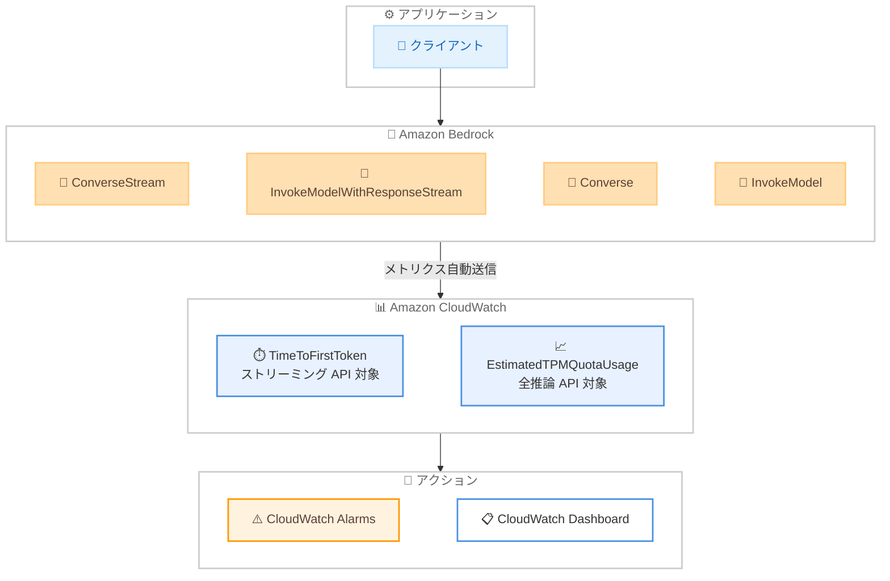

# Amazon Bedrock - First Token Latency およびクォータ消費のオブザーバビリティ

**リリース日**: 2026年3月10日
**サービス**: Amazon Bedrock
**機能**: CloudWatch メトリクス TimeToFirstToken / EstimatedTPMQuotaUsage

📊 [このアップデートのインフォグラフィックを見る](https://takech9203.github.io/aws-news-summary/20260310-amazon-bedrock-observability-ttft-quota.html)

## 概要

Amazon Bedrock に 2 つの新しい CloudWatch メトリクスが追加された。TimeToFirstToken はストリーミング API におけるファーストトークンレイテンシーを計測し、EstimatedTPMQuotaUsage は Tokens Per Minute (TPM) クォータの推定消費量を追跡する。

これらのメトリクスは追加設定やオプトイン不要で CloudWatch にそのまま公開される。ユーザーはクライアント側の計測コードを実装することなく、推論パフォーマンスとクォータ使用状況をモニタリングできるようになった。対象ユーザーは、Bedrock で生成 AI アプリケーションを運用しているエンジニアや SRE チームである。

**アップデート前の課題**

- ファーストトークンレイテンシーの計測にはクライアント側での独自実装が必要だった
- クォータ消費状況をリアルタイムに把握する標準的な手段がなく、レート制限に事前対処しにくかった
- SLA ベースラインの確立やレイテンシー劣化のアラーム設定が容易ではなかった

**アップデート後の改善**

- CloudWatch メトリクスとして TimeToFirstToken が自動的に記録され、クライアント側の計測が不要になった
- EstimatedTPMQuotaUsage によりクォータ消費量をモデル横断で追跡し、プロアクティブなアラーム設定が可能になった
- 追加コストなし、API 変更なし、オプトイン不要ですぐに利用開始できるようになった

## アーキテクチャ図



Amazon Bedrock の推論 API が自動的に CloudWatch メトリクスを送信し、アラームやダッシュボードでモニタリングする構成を示している。

## サービスアップデートの詳細

### 主要機能

1. **TimeToFirstToken メトリクス**
   - リクエスト送信からファーストトークン受信までのレイテンシーを計測
   - ストリーミング API のみが対象: ConverseStream および InvokeModelWithResponseStream
   - CloudWatch Alarms と組み合わせてレイテンシー劣化を検知可能
   - SLA ベースラインの確立に活用できる

2. **EstimatedTPMQuotaUsage メトリクス**
   - Tokens Per Minute (TPM) クォータの推定消費量を追跡
   - キャッシュ書き込みトークンおよび出力バーンダウン乗数を含む
   - 全推論 API が対象: Converse、InvokeModel、ConverseStream、InvokeModelWithResponseStream
   - クォータ上限到達前にプロアクティブなアラームを設定可能

3. **ゼロ設定での利用**
   - API 変更やオプトインは不要
   - CloudWatch にそのまま公開され、追加のメトリクス送信コストは発生しない
   - 正常に完了したリクエストに対して毎分更新

## 技術仕様

### メトリクス詳細

| 項目 | TimeToFirstToken | EstimatedTPMQuotaUsage |
|------|------------------|------------------------|
| 計測内容 | ファーストトークンレイテンシー | 推定 TPM クォータ消費量 |
| 対象 API | ConverseStream, InvokeModelWithResponseStream | Converse, InvokeModel, ConverseStream, InvokeModelWithResponseStream |
| 更新頻度 | 毎分 | 毎分 |
| 対象リクエスト | 正常完了リクエストのみ | 正常完了リクエストのみ |
| 含まれるトークン | - | キャッシュ書き込みトークン、出力バーンダウン乗数 |

### 対応する推論タイプ

| 推論タイプ | サポート状況 |
|-----------|-------------|
| クロスリージョン推論プロファイル | 対応 |
| リージョン内推論 | 対応 |

### API 変更履歴

今回のアップデートに対応する API 変更は確認されなかった。これは新しい CloudWatch メトリクスの追加であり、Bedrock の API 自体には変更がないためである。

## 設定方法

### 前提条件

1. Amazon Bedrock を利用できる AWS アカウント
2. CloudWatch へのアクセス権限 (cloudwatch:GetMetricData、cloudwatch:PutMetricAlarm など)
3. Bedrock の推論 API を使用するアプリケーション

### 手順

#### ステップ 1: CloudWatch コンソールでメトリクスを確認

```bash
# AWS CLI でメトリクスの存在を確認
aws cloudwatch list-metrics \
  --namespace "AWS/Bedrock" \
  --metric-name "TimeToFirstToken"
```

Bedrock 名前空間に TimeToFirstToken メトリクスが公開されていることを確認する。オプトインは不要で、推論リクエストを実行すると自動的にメトリクスが記録される。

#### ステップ 2: レイテンシー監視アラームの作成

```bash
# TimeToFirstToken が 5 秒を超えた場合にアラームを発報する例
aws cloudwatch put-metric-alarm \
  --alarm-name "Bedrock-TTFT-High-Latency" \
  --namespace "AWS/Bedrock" \
  --metric-name "TimeToFirstToken" \
  --statistic "Average" \
  --period 300 \
  --threshold 5000 \
  --comparison-operator "GreaterThanThreshold" \
  --evaluation-periods 2 \
  --alarm-actions "arn:aws:sns:us-east-1:123456789012:bedrock-alerts"
```

TimeToFirstToken の平均値が閾値を超えた場合に SNS トピックへ通知するアラームを作成している。閾値はアプリケーションの SLA に合わせて調整する。

#### ステップ 3: クォータ消費量の監視アラームの作成

```bash
# EstimatedTPMQuotaUsage がクォータの 80% に達した場合にアラームを発報する例
aws cloudwatch put-metric-alarm \
  --alarm-name "Bedrock-TPM-Quota-Warning" \
  --namespace "AWS/Bedrock" \
  --metric-name "EstimatedTPMQuotaUsage" \
  --statistic "Maximum" \
  --period 60 \
  --threshold 80 \
  --comparison-operator "GreaterThanThreshold" \
  --evaluation-periods 3 \
  --alarm-actions "arn:aws:sns:us-east-1:123456789012:bedrock-alerts"
```

クォータ消費量が閾値に近づいた段階で事前に通知を受け、レート制限を回避するための対応を取ることができる。

## メリット

### ビジネス面

- **SLA 管理の強化**: ファーストトークンレイテンシーを定量的に監視し、サービスレベルの維持を証明できる
- **コスト最適化**: クォータ消費量の可視化により、必要に応じた増枠リクエストを事前に計画できる
- **運用工数の削減**: クライアント側の計測実装が不要になり、開発リソースをビジネスロジックに集中できる

### 技術面

- **ゼロ設定**: API 変更やオプトイン不要で即座に利用可能
- **プロアクティブな監視**: クォータ上限到達前にアラームを設定し、レート制限を事前回避できる
- **包括的な可視性**: キャッシュ書き込みトークンや出力バーンダウン乗数を含む正確なクォータ消費量を把握できる

## デメリット・制約事項

### 制限事項

- TimeToFirstToken はストリーミング API のみが対象であり、非ストリーミング API (Converse、InvokeModel) では利用できない
- メトリクスは正常に完了したリクエストのみが対象であり、エラーリクエストのレイテンシーは記録されない
- 更新頻度が毎分であるため、秒単位のリアルタイムモニタリングには適さない

### 考慮すべき点

- EstimatedTPMQuotaUsage は「推定」値であり、実際のクォータ消費量とは若干の差異が生じる可能性がある
- クォータ上限値自体はアカウントごとに異なるため、アラーム閾値はアカウントのクォータに合わせて設定する必要がある

## ユースケース

### ユースケース 1: チャットアプリケーションの応答速度監視

**シナリオ**: 生成 AI チャットボットを提供しており、ユーザーに対して最初のレスポンスまでの待ち時間を一定以内に保つ SLA を設定している。

**実装例**:
```bash
# P99 レイテンシーが 3 秒を超えた場合にアラーム
aws cloudwatch put-metric-alarm \
  --alarm-name "ChatBot-TTFT-P99" \
  --namespace "AWS/Bedrock" \
  --metric-name "TimeToFirstToken" \
  --extended-statistic "p99" \
  --period 300 \
  --threshold 3000 \
  --comparison-operator "GreaterThanThreshold" \
  --evaluation-periods 2 \
  --alarm-actions "arn:aws:sns:us-east-1:123456789012:chatbot-ops"
```

**効果**: クライアント側の計測コードなしにレイテンシー SLA を監視でき、劣化時に即座にアラートを受け取れる。

### ユースケース 2: マルチモデル環境でのクォータ管理

**シナリオ**: 複数の基盤モデルを使い分けるアプリケーションで、それぞれのモデルのクォータ消費量を把握し、上限到達前に増枠を申請したい。

**実装例**:
```bash
# CloudWatch ダッシュボードでモデルごとの TPM 消費量を可視化
aws cloudwatch get-metric-data \
  --metric-data-queries '[
    {
      "Id": "tpm_usage",
      "MetricStat": {
        "Metric": {
          "Namespace": "AWS/Bedrock",
          "MetricName": "EstimatedTPMQuotaUsage"
        },
        "Period": 300,
        "Stat": "Maximum"
      }
    }
  ]' \
  --start-time "2026-03-10T00:00:00Z" \
  --end-time "2026-03-10T23:59:59Z"
```

**効果**: モデルごとのクォータ消費傾向を把握し、事前にクォータ増枠をリクエストすることでレート制限によるサービス中断を防止できる。

### ユースケース 3: 推論パフォーマンスのベースライン確立

**シナリオ**: 新しい基盤モデルの導入検討時に、ファーストトークンレイテンシーのベースラインデータを収集して比較評価したい。

**実装例**:
```bash
# 1 週間分の TTFT 統計を取得してベースラインを確立
aws cloudwatch get-metric-statistics \
  --namespace "AWS/Bedrock" \
  --metric-name "TimeToFirstToken" \
  --start-time "2026-03-03T00:00:00Z" \
  --end-time "2026-03-10T00:00:00Z" \
  --period 3600 \
  --statistics "Average" "p50" "p99"
```

**効果**: モデル間のレイテンシー比較をデータドリブンに行い、アプリケーション要件に最適なモデルを選定できる。

## 料金

今回追加された CloudWatch メトリクスに対する追加料金は発生しない。ユーザーは基盤モデルの推論利用料のみを支払う。

ただし、CloudWatch Alarms や CloudWatch Dashboards を設定する場合は、それぞれの CloudWatch 料金が適用される。

| 項目 | 料金 |
|------|------|
| メトリクスの記録・公開 | 無料 (推論利用料に含まれる) |
| CloudWatch Alarms | 標準アラーム: $0.10/アラーム/月 |
| CloudWatch Dashboards | $3.00/ダッシュボード/月 |

## 利用可能リージョン

全商用 Bedrock リージョンで利用可能。クロスリージョン推論プロファイルおよびリージョン内推論の両方に対応している。

## 関連サービス・機能

- **Amazon CloudWatch**: メトリクスの記録、アラーム設定、ダッシュボード作成に使用
- **Amazon Bedrock クロスリージョン推論**: 複数リージョンにまたがる推論で、各リージョンのメトリクスを統合監視可能
- **AWS Service Quotas**: EstimatedTPMQuotaUsage と組み合わせて、クォータの増枠リクエストを管理

## 参考リンク

- 📊 [インフォグラフィック](https://takech9203.github.io/aws-news-summary/20260310-amazon-bedrock-observability-ttft-quota.html)
- [公式発表 (What's New)](https://aws.amazon.com/about-aws/whats-new/2026/03/amazon-bedrock-observability-ttft-quota/)
- [Amazon Bedrock ドキュメント](https://docs.aws.amazon.com/bedrock/latest/userguide/)
- [Amazon Bedrock 料金ページ](https://aws.amazon.com/bedrock/pricing/)
- [Amazon CloudWatch 料金ページ](https://aws.amazon.com/cloudwatch/pricing/)

## まとめ

Amazon Bedrock に追加された TimeToFirstToken と EstimatedTPMQuotaUsage メトリクスにより、推論パフォーマンスとクォータ消費のオブザーバビリティが大幅に向上した。設定不要で即座に利用できるため、Bedrock を運用しているチームは CloudWatch Alarms を設定してレイテンシー劣化やクォータ上限への到達を事前に検知する運用を導入することを推奨する。
