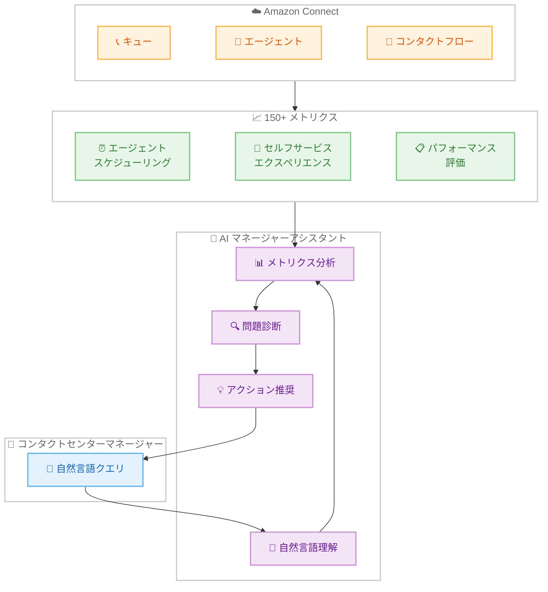

# Amazon Connect - AI を活用したマネージャーアシスタンス

**リリース日**: 2026年03月10日
**サービス**: Amazon Connect
**機能**: AI-powered manager assistance (Preview)

📊 [このアップデートのインフォグラフィックを見る](https://takech9203.github.io/aws-news-summary/20260310-amazon-connect-ai-powered-manager-assistance.html)

## 概要

Amazon Connect は、コンタクトセンターマネージャー向けの AI を活用したアシスタント機能のプレビューを発表しました。この新機能により、マネージャーは自然言語を使用して 150 以上のメトリクスにわたるクエリを実行し、エージェントのスケジューリング、セルフサービスエクスペリエンス、パフォーマンス評価などの重要な運用データに即座にアクセスできます。

AI アシスタントは、単なるデータ検索にとどまらず、問題の診断やリカバリーアクションの推奨も行います。たとえば、「今日の平均処理時間が高い原因は何ですか?」と質問すると、AI が関連するメトリクスを分析し、根本原因を特定して具体的な改善アクションを提案します。これにより、マネージャーはデータ分析に費やす時間を大幅に削減し、迅速な意思決定が可能になります。

この機能は現在プレビュー段階であり、利用を希望する場合は AWS アカウントチームに問い合わせる必要があります。

**アップデート前の課題**

- マネージャーは複数のダッシュボードやレポートを手動で確認し、運用状況を把握する必要があった
- メトリクスの分析には専門的な知識が必要で、問題の根本原因を特定するまでに時間がかかっていた
- リアルタイムの問題に対して、迅速に対応するための統合的なインサイトが不足していた
- 150 以上のメトリクスを横断的に分析するには、複雑なクエリやレポート作成が必要だった

**アップデート後の改善**

- 自然言語で質問するだけで、150 以上のメトリクスにわたるデータを即座に取得可能
- AI が問題を自動的に診断し、具体的なリカバリーアクションを推奨
- エージェントスケジューリング、セルフサービス、パフォーマンス評価を統合的に分析
- 専門的なデータ分析スキルがなくても、マネージャーが直感的にインサイトを得られる

## アーキテクチャ図



この図は、マネージャーが自然言語で質問を入力し、AI アシスタントが Amazon Connect の 150 以上のメトリクスを分析して問題診断とアクション推奨を行う仕組みを示しています。

## サービスアップデートの詳細

### 主要機能

1. **自然言語クエリ**
   - 自然言語で 150 以上のメトリクスにわたるクエリを実行可能
   - 専門的な SQL やクエリ言語の知識が不要
   - 日常的な質問形式で運用データにアクセス (例: 「今日の平均待ち時間は?」「先週最もパフォーマンスが高いエージェントは?」)

2. **問題診断**
   - AI がメトリクスの異常値やパターンを自動的に検出
   - 問題の根本原因を複数のメトリクスを横断的に分析して特定
   - リアルタイムの運用問題に対して、迅速な原因分析を提供

3. **リカバリーアクション推奨**
   - 診断結果に基づいて、具体的な改善アクションを推奨
   - エージェントのスケジュール調整、キューの設定変更など、実行可能なアクションを提案
   - マネージャーが即座に対応できるように、優先順位付きのアクションリストを提供

4. **対応メトリクス領域**
   - エージェントスケジューリング: シフト遵守率、稼働率、予測精度
   - セルフサービスエクスペリエンス: IVR 完了率、ボット解決率、エスカレーション率
   - パフォーマンス評価: 品質スコア、顧客満足度、平均処理時間

## 技術仕様

### 対応メトリクスカテゴリ

| カテゴリ | 主なメトリクス例 |
|---------|----------------|
| エージェントスケジューリング | シフト遵守率、稼働率、スケジュール充足率 |
| セルフサービス | IVR 完了率、ボット解決率、エスカレーション率 |
| パフォーマンス評価 | 品質スコア、平均処理時間、初回解決率 |
| キュー管理 | 平均待ち時間、放棄率、サービスレベル |
| エージェントパフォーマンス | コンタクト数、保留時間、後処理時間 |

### 提供形態

| 項目 | 詳細 |
|------|------|
| ステータス | プレビュー |
| 利用申し込み | AWS アカウントチームへの問い合わせが必要 |
| インターフェース | Amazon Connect 管理コンソール内で利用 |
| 対応言語 | 自然言語クエリ (詳細はプレビュー参加時に確認) |

## 設定方法

### 前提条件

1. Amazon Connect インスタンスが作成済みであること
2. AWS アカウントチームにプレビューへの参加を申し込み済みであること
3. Amazon Connect 管理コンソールへのアクセス権限があること

### 手順

#### ステップ1: プレビューへの参加申し込み

AWS アカウントチームに連絡し、AI-powered manager assistance のプレビューへの参加を申し込みます。アカウントチームから、有効化の手順と利用条件が案内されます。

#### ステップ2: 機能の有効化

```bash
# プレビュー承認後、AWS アカウントチームの指示に従い
# Amazon Connect インスタンスで機能を有効化
# 具体的な手順はプレビュー参加時に案内されます
```

プレビュー承認後、Amazon Connect 管理コンソールから AI マネージャーアシスタント機能を有効化します。

#### ステップ3: 自然言語クエリの実行

Amazon Connect 管理コンソール内の AI アシスタントインターフェースから、自然言語で質問を入力してメトリクスの分析を開始します。

## メリット

### ビジネス面

- **意思決定の迅速化**: データ分析に費やす時間を大幅に削減し、リアルタイムの問題に迅速に対応可能
- **運用効率の向上**: 複数のダッシュボードを確認する必要がなくなり、マネージャーの生産性が向上
- **問題の早期発見**: AI による自動診断により、問題が大きくなる前に対処可能

### 技術面

- **自然言語処理**: 専門的なクエリ言語を学習する必要がなく、直感的にデータにアクセス
- **統合分析**: 150 以上のメトリクスを横断的に分析し、複合的な問題の原因を特定
- **アクショナブルインサイト**: 単なるデータ表示ではなく、具体的な改善アクションを推奨

## デメリット・制約事項

### 制限事項

- 現在プレビュー段階であり、一般提供 (GA) ではない
- 利用にはAWS アカウントチームへの問い合わせが必要
- プレビュー期間中は機能の変更や制限がある可能性がある

### 考慮すべき点

- AI の推奨アクションは参考情報であり、最終的な判断はマネージャーが行う必要がある
- プレビュー段階のため、本番環境での利用には慎重な検討が必要
- GA 時に料金体系が変更される可能性がある

## ユースケース

### ユースケース1: リアルタイムの運用問題対応

**シナリオ**: コンタクトセンターの平均待ち時間が急上昇し、マネージャーが原因を迅速に特定したい。

**実装例**:
```
マネージャーの質問: 「今日の午後、平均待ち時間が急上昇しています。原因は何ですか?」

AI アシスタントの回答:
- 14:00 以降、チャットチャネルのコンタクト量が通常の 2 倍に増加
- 同時刻に 3 名のエージェントが休憩中
- 推奨アクション: 休憩スケジュールの調整、チャットボットの
  セルフサービスフローの確認
```

**効果**: 問題の根本原因を数秒で特定し、即座に対応アクションを実行できます。従来は複数のレポートを確認するのに数十分かかっていた分析が、質問一つで完了します。

### ユースケース2: エージェントパフォーマンスの改善

**シナリオ**: マネージャーが、チーム全体のパフォーマンスを向上させるために、改善が必要なエリアを特定したい。

**実装例**:
```
マネージャーの質問: 「先週、品質スコアが最も低下したスキルグループはどこですか?」

AI アシスタントの回答:
- テクニカルサポートグループの品質スコアが 15% 低下
- 主な原因: 新製品リリースに伴う問い合わせ増加で
  平均処理時間が 40% 増加
- 推奨アクション: 新製品に関するナレッジベースの更新、
  追加トレーニングの実施
```

**効果**: データに基づいた具体的な改善施策を迅速に立案し、チーム全体のパフォーマンスを効率的に向上させられます。

### ユースケース3: スケジューリングの最適化

**シナリオ**: マネージャーが、来週のシフトスケジュールを最適化するために、過去のトレンドを分析したい。

**実装例**:
```
マネージャーの質問: 「過去 4 週間で、曜日ごとのピーク時間帯と
必要なエージェント数を教えてください。」

AI アシスタントの回答:
- 月曜日: 10:00-12:00 がピーク、推奨エージェント数 15 名
- 火曜-木曜: 14:00-16:00 がピーク、推奨エージェント数 12 名
- 金曜日: 9:00-11:00 がピーク、推奨エージェント数 10 名
- 推奨アクション: 月曜午前のシフトを 2 名増員
```

**効果**: 過去のデータに基づいた最適なシフトスケジュールを作成し、サービスレベルの維持とコストの最適化を両立できます。

## 料金

現在プレビュー段階のため、料金体系は GA 時に発表される予定です。プレビュー期間中の料金については、AWS アカウントチームに確認してください。

Amazon Connect の基本料金は、使用量に基づく従量課金制です。

| 項目 | 料金 (概算) |
|------|------------|
| 音声通話 (1 分あたり) | $0.018 |
| チャットメッセージ (1 件あたり) | $0.004 |
| AI アシスタント機能 | プレビュー期間中は未定 |

*料金は変更される可能性があります。最新の料金については、[Amazon Connect 料金ページ](https://aws.amazon.com/connect/pricing/)を参照してください。*

## 利用可能リージョン

プレビュー段階のため、利用可能リージョンは限定される可能性があります。詳細は AWS アカウントチームに問い合わせてください。

Amazon Connect が一般提供されている主要リージョン:
- 米国東部 (バージニア北部)
- 米国西部 (オレゴン)
- 欧州 (フランクフルト、ロンドン)
- アジアパシフィック (東京、シンガポール、シドニー)

## 関連サービス・機能

- **Amazon Connect Contact Lens**: 通話とチャットの分析により、コンタクトセンターの品質と効率を向上
- **Amazon Connect Forecasting, Capacity Planning, and Scheduling**: エージェントのスケジューリングと需要予測を最適化
- **Amazon Connect Customer Profiles**: 顧客情報を統合し、パーソナライズされたサービスを提供
- **Amazon Q in Connect**: エージェント向けの AI アシスタントで、リアルタイムの応答推奨を提供

## 参考リンク

- 📊 [インフォグラフィック](https://takech9203.github.io/aws-news-summary/20260310-amazon-connect-ai-powered-manager-assistance.html)
- [公式発表 (What's New)](https://aws.amazon.com/about-aws/whats-new/2026/03/amazon-connect-ai-powered-manager-assistance/)
- [Amazon Connect ドキュメント](https://docs.aws.amazon.com/connect/latest/adminguide/what-is-amazon-connect.html)
- [料金ページ](https://aws.amazon.com/connect/pricing/)

## まとめ

Amazon Connect の AI を活用したマネージャーアシスタンス機能は、コンタクトセンター運用の高度化における重要なアップデートです。自然言語で 150 以上のメトリクスを横断的に分析し、問題の診断からリカバリーアクションの推奨まで AI が支援することで、マネージャーの意思決定を大幅に迅速化します。プレビュー段階ではありますが、コンタクトセンターの運用効率向上に関心のあるお客様は、AWS アカウントチームに問い合わせてプレビューへの参加を検討することを推奨します。
