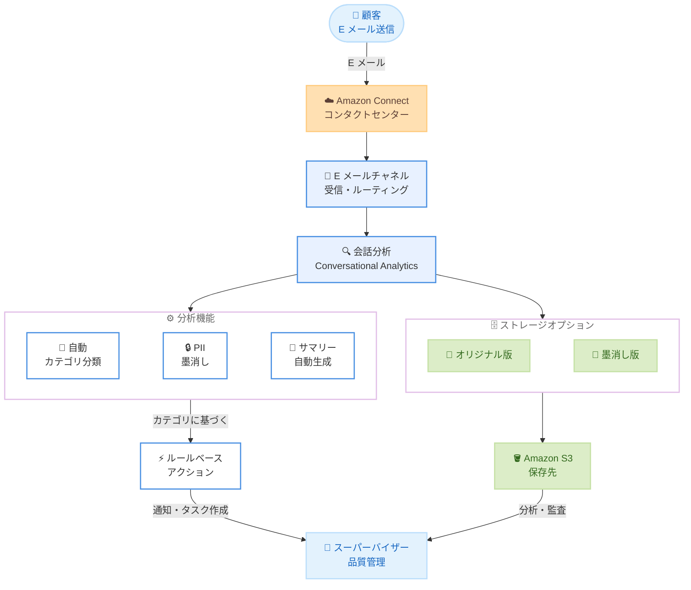

# Amazon Connect - E メール向け会話分析

**リリース日**: 2026 年 3 月 10 日
**サービス**: Amazon Connect
**機能**: E メールコンタクト向け会話分析 (Conversational Analytics for Email)

:bar_chart: [このアップデートのインフォグラフィックを見る](https://takech9203.github.io/aws-news-summary/20260310-amazon-connect-conversational-analytics-email.html)

## 概要

Amazon Connect が、E メールコンタクトに対する会話分析 (Conversational Analytics) のサポートを開始しました。これにより、音声やチャットと同様に、E メールチャネルでも自動カテゴリ分類、PII (個人識別情報) の墨消し、コンタクトサマリーの自動生成が可能になります。

従来、Amazon Connect の会話分析機能 (Contact Lens) は音声通話やチャットに対応していましたが、E メールチャネルは分析対象外でした。今回のアップデートにより、E メールコンタクトも含めた統一的なオムニチャネル分析が実現し、コンタクトセンターの品質管理と顧客体験の向上を全チャネルで推進できます。

**アップデート前の課題**

- E メールコンタクトに対する自動カテゴリ分類が利用できず、手動での分類作業が必要だった
- E メールに含まれる PII を自動的に墨消しする手段がなく、コンプライアンス対応に手間がかかった
- E メールコンタクトのサマリーを自動生成できず、スーパーバイザーが全文を確認する必要があった
- 音声やチャットと E メールで異なる分析ワークフローが必要であり、運用が複雑だった

**アップデート後の改善**

- E メールコンタクトに対して自動カテゴリ分類が適用され、問い合わせ内容の傾向を効率的に把握可能
- カスタマイズ可能な PII 墨消しタイプにより、E メールに含まれる個人情報を自動的に保護可能
- コンタクトサマリーの自動生成により、スーパーバイザーの確認作業が大幅に効率化
- オリジナル版と墨消し版の両方を保存するストレージオプションにより、監査要件にも対応可能

## アーキテクチャ図



この図は、顧客からの E メールが Amazon Connect に到着した後、会話分析エンジンで自動カテゴリ分類、PII 墨消し、サマリー生成が行われ、その結果に基づいてルールベースのアクションが実行される流れを示しています。

## サービスアップデートの詳細

### 主要機能

1. **E メールコンタクトの自動カテゴリ分類**
   - 事前定義されたルールに基づいて E メールコンタクトを自動的にカテゴリに分類
   - 問い合わせ内容の傾向分析やレポート作成に活用可能
   - 音声やチャットと同じカテゴリ分類基盤を使用し、オムニチャネルでの一貫した分析を実現

2. **カスタマイズ可能な PII 墨消し**
   - E メール本文に含まれる個人識別情報 (氏名、住所、電話番号、クレジットカード番号など) を自動検出して墨消し
   - 墨消し対象の PII タイプをカスタマイズ可能で、ビジネス要件に応じた柔軟な設定が可能
   - オリジナル版と墨消し版の両方を保存するストレージオプションを提供し、監査やコンプライアンス要件に対応

3. **コンタクトサマリーの自動生成**
   - E メールの内容を分析し、コンタクトの要約を自動的に生成
   - スーパーバイザーが大量の E メールコンタクトを効率的に確認可能
   - エージェントのパフォーマンス評価やコーチングに活用

4. **ルールベースアクション**
   - カテゴリ分類結果に基づいて自動的にアクションを実行
   - 特定のカテゴリに該当する E メールに対して通知、タスク作成、アラートなどを設定可能
   - エスカレーションや優先対応の自動化に活用

## 技術仕様

### 対応チャネルと分析機能

| 機能 | 音声 | チャット | E メール (新規) |
|------|------|----------|-----------------|
| 自動カテゴリ分類 | 対応 | 対応 | 対応 |
| PII 墨消し | 対応 | 対応 | 対応 |
| コンタクトサマリー | 対応 | 対応 | 対応 |
| ルールベースアクション | 対応 | 対応 | 対応 |

### PII 墨消し設定

| 項目 | 詳細 |
|------|------|
| 墨消し対象 | 氏名、住所、電話番号、メールアドレス、クレジットカード番号、SSN など |
| カスタマイズ | 墨消し対象の PII タイプを個別に選択可能 |
| ストレージ | オリジナル版と墨消し版を別々に保存可能 |
| 保存先 | Amazon S3 バケット |

### API 変更履歴

今回のアップデートに関連する API の変更情報は確認できませんでした。既存の Amazon Connect API および Contact Lens API を通じて E メール分析設定を行います。

## 設定方法

### 前提条件

1. Amazon Connect インスタンスが作成済みであること
2. E メールチャネルが有効化されていること
3. Contact Lens (会話分析) が有効化されていること
4. S3 バケットが分析結果の保存先として設定されていること

### 手順

#### ステップ 1: Contact Lens の E メール分析を有効化

Amazon Connect コンソールで以下の設定を行います。

1. Amazon Connect コンソールにログイン
2. 対象のインスタンスを選択
3. [分析ツール] セクションで [Contact Lens] を選択
4. E メールチャネルの会話分析を有効化

#### ステップ 2: PII 墨消しの設定

```json
{
  "AnalyticsConfiguration": {
    "Channel": "EMAIL",
    "ContentRedaction": {
      "RedactionType": "Replace",
      "RedactionOutput": "RedactedAndOriginal",
      "PiiEntityTypes": [
        "NAME",
        "ADDRESS",
        "PHONE",
        "EMAIL",
        "CREDIT_DEBIT_NUMBER",
        "SSN"
      ]
    }
  }
}
```

この設定は、E メールチャネルに対して PII 墨消しを有効にし、オリジナル版と墨消し版の両方を出力するよう構成しています。墨消し対象の PII タイプは `PiiEntityTypes` で個別に指定します。

#### ステップ 3: カテゴリ分類ルールの作成

Amazon Connect のルール機能を使用して、E メールコンタクトのカテゴリ分類ルールを作成します。

1. Amazon Connect コンソールで [ルール] を選択
2. [ルールを作成] をクリック
3. トリガーとして [Contact Lens - コンタクト後分析] を選択
4. チャネルに [E メール] を選択
5. 条件とアクションを設定

## メリット

### ビジネス面

- **オムニチャネル分析の統一**: 音声、チャット、E メールの全チャネルで一貫した分析基盤により、顧客体験の全体像を把握可能
- **コンプライアンス強化**: E メールに含まれる PII の自動墨消しにより、GDPR や CCPA などの規制への対応が容易
- **運用効率の向上**: コンタクトサマリー自動生成とカテゴリ分類により、スーパーバイザーの作業負荷を大幅に削減

### 技術面

- **統一された分析パイプライン**: 既存の Contact Lens インフラを活用し、E メール分析を追加設定のみで利用可能
- **柔軟な PII 設定**: 墨消し対象を細かく制御でき、ビジネス要件に応じたカスタマイズが可能
- **ルールベース自動化**: 分析結果に基づく自動アクションにより、エスカレーションや通知のワークフローを構築可能

## デメリット・制約事項

### 制限事項

- 利用可能リージョンが限定されている (9 リージョン)
- E メール分析は Contact Lens の有効化が前提であり、追加料金が発生する
- 添付ファイルの内容は分析対象外となる可能性がある

### 考慮すべき点

- PII 墨消しの精度は言語やコンテキストにより異なるため、定期的な検証が推奨される
- オリジナル版と墨消し版の両方を保存する場合、S3 のストレージコストが増加する
- 大量の E メールコンタクトがある場合、分析処理に伴うコスト見積もりが必要

## ユースケース

### ユースケース 1: 金融機関の E メール問い合わせ管理

**シナリオ**: 銀行のコンタクトセンターで、顧客からの E メール問い合わせに含まれるクレジットカード番号や口座番号を自動的に墨消しし、コンプライアンス要件を満たしたい。

**実装例**:
```json
{
  "ContentRedaction": {
    "RedactionType": "Replace",
    "RedactionOutput": "RedactedAndOriginal",
    "PiiEntityTypes": [
      "CREDIT_DEBIT_NUMBER",
      "BANK_ACCOUNT_NUMBER",
      "SSN",
      "NAME",
      "ADDRESS"
    ]
  }
}
```

**効果**: 金融規制に準拠した E メール管理を自動化し、手動での墨消し作業を排除することで、コンプライアンスリスクと運用コストを同時に削減できます。

### ユースケース 2: E コマースの問い合わせカテゴリ分析

**シナリオ**: EC サイトのカスタマーサポートで、E メールによる問い合わせ (返品、配送遅延、商品不具合など) を自動的にカテゴリ分類し、対応優先度に応じたルーティングを行いたい。

**実装例**:

ルール設定で以下のようなカテゴリ分類を作成します。

- カテゴリ「返品リクエスト」: キーワード「返品」「返金」「交換」を含む E メール
- カテゴリ「配送問題」: キーワード「遅延」「届かない」「配送状況」を含む E メール
- カテゴリ「緊急対応」: ネガティブセンチメントが検出された E メール

**効果**: 問い合わせの自動分類と優先対応により、顧客満足度の向上と対応時間の短縮を実現できます。

### ユースケース 3: オムニチャネル品質管理レポート

**シナリオ**: コンタクトセンターのマネージャーが、音声、チャット、E メールの全チャネルにわたるコンタクトサマリーを統合的に確認し、エージェントのパフォーマンスを評価したい。

**実装例**:

Contact Lens の分析ダッシュボードで全チャネルのコンタクトサマリーを確認し、カテゴリ別の傾向分析を実施します。E メールチャネルの追加により、全チャネル横断でのレポート生成が可能になります。

**効果**: 全チャネルを通じた統一的な品質管理により、エージェントのコーチング精度が向上し、顧客体験の一貫性を確保できます。

## 料金

E メール向け会話分析は、Amazon Connect Contact Lens の料金体系に含まれます。

### 料金体系

- **Contact Lens 分析**: E メールコンタクトごとに Contact Lens の利用料金が適用
- **S3 ストレージ**: 分析結果およびオリジナル版/墨消し版の保存料金
- **Amazon Connect E メール**: E メールメッセージの受信・送信に対する基本料金

### 料金例

| 使用量 | 月額料金 (概算) |
|--------|------------------|
| E メールコンタクト 10,000 件/月 | Contact Lens 分析料金 + S3 ストレージ料金 |
| E メールコンタクト 100,000 件/月 | Contact Lens 分析料金 + S3 ストレージ料金 |

※ 具体的な料金は [Amazon Connect 料金ページ](https://aws.amazon.com/connect/pricing/) を参照してください。リージョンや利用量により異なります。

## 利用可能リージョン

以下の 9 リージョンで利用可能です。

| リージョン名 | リージョンコード |
|-------------|-----------------|
| 米国東部 (バージニア北部) | us-east-1 |
| 米国西部 (オレゴン) | us-west-2 |
| アジアパシフィック (ソウル) | ap-northeast-2 |
| アジアパシフィック (シンガポール) | ap-southeast-1 |
| アジアパシフィック (シドニー) | ap-southeast-2 |
| アジアパシフィック (東京) | ap-northeast-1 |
| カナダ (中部) | ca-central-1 |
| ヨーロッパ (フランクフルト) | eu-central-1 |
| ヨーロッパ (ロンドン) | eu-west-2 |

## 関連サービス・機能

- **Amazon Connect Contact Lens**: 会話分析の基盤機能であり、音声・チャット・E メールの分析を統合的に提供
- **Amazon Comprehend**: PII 検出と墨消しの基盤となる自然言語処理サービス
- **Amazon S3**: 分析結果、オリジナル版、墨消し版の E メールデータの保存先
- **Amazon Connect Rules**: カテゴリ分類結果に基づくルールベースの自動アクション実行

## 参考リンク

- :bar_chart: [インフォグラフィック](https://takech9203.github.io/aws-news-summary/20260310-amazon-connect-conversational-analytics-email.html)
- [公式発表 (What's New)](https://aws.amazon.com/about-aws/whats-new/2026/03/amazon-connect-conversational-analytics-email/)
- [Contact Lens の有効化 (ドキュメント)](https://docs.aws.amazon.com/connect/latest/adminguide/enable-analytics.html)
- [E メールチャネルの設定 (ドキュメント)](https://docs.aws.amazon.com/connect/latest/adminguide/email.html)
- [Amazon Connect 料金ページ](https://aws.amazon.com/connect/pricing/)

## まとめ

Amazon Connect の E メール向け会話分析により、コンタクトセンターは音声・チャット・E メールの全チャネルで統一された分析基盤を活用できるようになりました。PII の自動墨消し、カテゴリ分類、サマリー自動生成により、コンプライアンス対応と運用効率が大幅に向上します。既に Amazon Connect で E メールチャネルを使用している場合は、Contact Lens の E メール分析を有効化し、オムニチャネルでの品質管理を強化することを推奨します。
