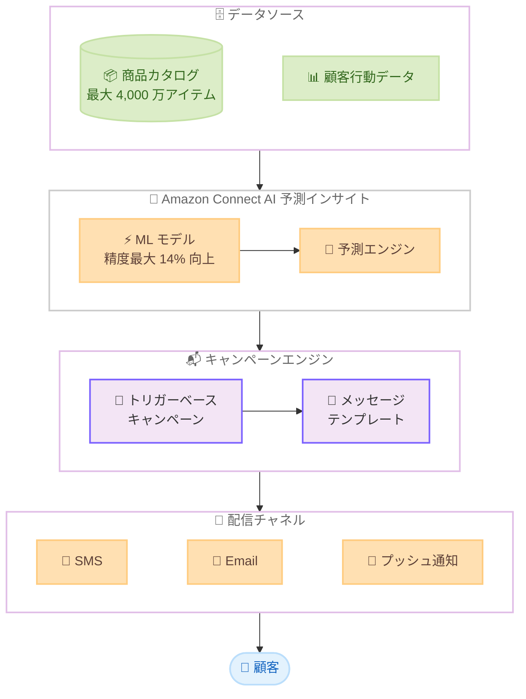

# Amazon Connect - AI 搭載予測インサイトの機能強化

**リリース日**: 2026 年 3 月 10 日
**サービス**: Amazon Connect
**機能**: AI 搭載予測インサイトの強化 (商品カタログ拡張、トリガーベースキャンペーン、モデル精度向上)

[このアップデートのインフォグラフィックを見る](https://takech9203.github.io/aws-news-summary/20260310-amazon-connect-predictive-insights.html)

## 概要

Amazon Connect が AI 搭載予測インサイト機能を大幅に強化した。主な改善点として、商品カタログのサポート上限が 8 倍の 4,000 万アイテムに拡大、メッセージテンプレートでのトリガーベースキャンペーンへの対応、そして最大 14% のモデル精度向上が含まれる。

これらの機能強化により、企業は顧客の行動や予測シグナルに基づいたトリガーベースキャンペーンを実施し、パーソナライズされたアウトリーチを実現できる。大規模な商品カタログを持つ EC サイトや小売業者にとって、より精度の高い商品レコメンデーションやキャンペーン配信が可能になる。本機能はパブリックプレビューとして提供されている。

**アップデート前の課題**

- 商品カタログのサポート上限が 500 万アイテムに制限されており、大規模な EC サイトや小売業者のカタログ全体をカバーできなかった
- キャンペーン配信がスケジュールベースに限定され、顧客の行動にリアルタイムで反応するトリガーベースの配信ができなかった
- 予測モデルの精度に改善の余地があり、レコメンデーションの関連性が十分でない場合があった

**アップデート後の改善**

- 商品カタログのサポート上限が 4,000 万アイテムに拡大し (8 倍増)、大規模カタログを持つ企業でもフルカタログの活用が可能になった
- トリガーベースキャンペーンにより、顧客の行動や予測シグナルに応じたリアルタイムのパーソナライズ配信が可能になった
- モデル精度が最大 14% 向上し、より関連性の高いレコメンデーションとキャンペーン配信を実現

## アーキテクチャ図



商品カタログと顧客行動データを AI 予測インサイトエンジンが分析し、トリガーベースキャンペーンを通じてパーソナライズされたメッセージを各チャネルで顧客に配信するフローを示しています。

## サービスアップデートの詳細

### 主要機能

1. **商品カタログサポートの拡張**
   - サポート上限が 500 万アイテムから 4,000 万アイテムに 8 倍増加
   - 大規模な EC サイトや小売業者のフルカタログに対応
   - より多くの商品に対する予測ベースのレコメンデーションが可能

2. **トリガーベースキャンペーン**
   - 顧客の行動や予測シグナルに基づいたキャンペーンの自動トリガー
   - メッセージテンプレートでの利用が可能になり、パーソナライズされたアウトリーチを実現
   - スケジュールベースのキャンペーンに加え、リアルタイムの行動トリガーに対応

3. **モデル精度の向上**
   - 予測モデルの精度が最大 14% 改善
   - より関連性の高い商品レコメンデーションを生成
   - キャンペーンのコンバージョン率向上に貢献

## 技術仕様

### 機能比較

| 項目 | 変更前 | 変更後 |
|------|--------|--------|
| 商品カタログサポート上限 | 500 万アイテム | 4,000 万アイテム (8 倍) |
| モデル精度改善 | - | 最大 14% 向上 |
| トリガーベースキャンペーン | 未対応 | メッセージテンプレートで対応 |
| キャンペーントリガー方式 | スケジュールベースのみ | スケジュール + 行動トリガー |

### API 変更履歴

直近の Amazon Connect に関する API 変更は確認されていません。今回のアップデートはサービス内部の機能強化であり、新規 API の追加は発表に含まれていません。

### IAM ポリシー例

```json
{
    "Version": "2012-10-17",
    "Statement": [
        {
            "Effect": "Allow",
            "Action": [
                "connect:CreateCampaign",
                "connect:UpdateCampaign",
                "connect:DescribeCampaign",
                "connect:GetCampaignStateBatch",
                "connect-campaigns:*"
            ],
            "Resource": "arn:aws:connect:*:*:instance/*/campaign/*"
        }
    ]
}
```

## 設定方法

### 前提条件

1. Amazon Connect インスタンスが作成済みであること
2. Amazon Connect のアウトバウンドキャンペーン機能が有効化されていること
3. 対象リージョン (フランクフルト、バージニア北部、ソウル、東京、オレゴン、シンガポール、シドニー、カナダ中部) にインスタンスが配置されていること

### 手順

#### ステップ 1: 商品カタログの準備とアップロード

Amazon Connect コンソールから、予測インサイト機能で使用する商品カタログをアップロードします。最大 4,000 万アイテムまでサポートされるため、フルカタログのインポートが可能です。

#### ステップ 2: 予測モデルの設定

Amazon Connect コンソールの予測インサイト設定画面で、商品カタログと顧客行動データを関連付けます。ML モデルが自動的にトレーニングされ、精度が最大 14% 向上した予測結果を提供します。

#### ステップ 3: トリガーベースキャンペーンの作成

```
Amazon Connect コンソール
  > アウトバウンドキャンペーン
    > キャンペーンの作成
      > トリガー種別: 行動ベーストリガー
      > メッセージテンプレート: 予測インサイト対応テンプレートを選択
```

トリガーベースキャンペーンを作成し、顧客の行動シグナル (カート放棄、閲覧履歴など) に基づいた自動配信ルールを設定します。メッセージテンプレートには予測インサイトによるパーソナライズされたレコメンデーションを含めることができます。

## メリット

### ビジネス面

- **大規模カタログへの対応**: 4,000 万アイテムのサポートにより、大手 EC サイトや小売チェーンでもフルカタログを活用した AI レコメンデーションが可能
- **コンバージョン率の向上**: モデル精度の 14% 向上とトリガーベース配信の組み合わせにより、キャンペーンの効果を最大化
- **リアルタイム顧客エンゲージメント**: 顧客の行動に即座に反応するトリガーベースキャンペーンにより、エンゲージメントの機会を逃さない

### 技術面

- **スケーラビリティ**: 8 倍に拡大した商品カタログサポートにより、成長する企業のニーズに対応
- **ML モデルの自動改善**: 精度向上が自動的に適用され、追加のモデルチューニング作業が不要
- **既存ワークフローとの統合**: メッセージテンプレートでのトリガーベースキャンペーン対応により、既存のキャンペーン管理フローに組み込み可能

## デメリット・制約事項

### 制限事項

- パブリックプレビューとして提供されており、本番環境での利用には注意が必要
- 利用可能リージョンが 8 リージョンに限定されている
- 予測インサイト機能は Amazon Connect のアウトバウンドキャンペーンの一部であり、別途アウトバウンドキャンペーンの設定が必要

### 考慮すべき点

- パブリックプレビュー段階のため、GA 時に機能や仕様が変更される可能性がある
- 大規模カタログのインポートと ML モデルのトレーニングには処理時間がかかる場合がある
- トリガーベースキャンペーンの効果を最大化するには、十分な顧客行動データの蓄積が必要

## ユースケース

### ユースケース 1: 大規模 EC サイトのパーソナライズキャンペーン

**シナリオ**: 数千万点の商品を取り扱う EC サイトが、顧客の閲覧履歴と購買行動に基づいたパーソナライズされた商品レコメンデーションを SMS やメールで配信したい。

**実装例**:
```
1. 4,000 万アイテムのフルカタログをインポート
2. 顧客行動データ (閲覧、購入、カート追加) を連携
3. 予測インサイトが各顧客に最適な商品を予測
4. トリガーベースキャンペーンで自動配信
```

**効果**: フルカタログの活用と精度向上により、レコメンデーションの関連性が向上し、クリック率とコンバージョン率の改善が期待できる。

### ユースケース 2: カート放棄リカバリーキャンペーン

**シナリオ**: 顧客がショッピングカートに商品を追加したまま購入を完了しなかった場合に、予測インサイトを活用してパーソナライズされたリマインダーメッセージを自動送信したい。

**実装例**:
```
1. カート放棄イベントをトリガーとして設定
2. メッセージテンプレートに予測インサイトの商品レコメンデーションを組み込み
3. 放棄された商品に加え、関連商品のレコメンデーションを含むメッセージを自動配信
```

**効果**: トリガーベースの即時配信により、顧客の購買意欲が高いタイミングでアプローチでき、カート放棄率の低減が見込める。

### ユースケース 3: 小売チェーンのオムニチャネルキャンペーン

**シナリオ**: 実店舗とオンラインの両方を展開する小売チェーンが、顧客の購買パターンに基づいて来店促進や新商品案内のキャンペーンを展開したい。

**実装例**:
```
1. オンラインと実店舗の統合商品カタログをインポート
2. 顧客の購買履歴と行動シグナルを予測エンジンに連携
3. 予測シグナルに基づき、再購入タイミングや関連商品をレコメンド
4. SMS、メール、プッシュ通知で最適なチャネルから配信
```

**効果**: 予測精度の 14% 向上と大規模カタログ対応により、オムニチャネルでのパーソナライズされた顧客体験を提供し、顧客生涯価値の向上に貢献する。

## 料金

今回のアップデートはパブリックプレビューとして提供されています。Amazon Connect の予測インサイトおよびアウトバウンドキャンペーン機能の料金は、Amazon Connect の料金体系に準じます。

### 料金例

| 項目 | 料金 (概算) |
|------|-------------|
| Amazon Connect アウトバウンドキャンペーン | 利用量に応じた従量課金 |
| SMS 配信 | 送信先リージョンにより異なる |
| メール配信 | Amazon SES 連携時は SES の料金が適用 |

詳細な料金については [Amazon Connect 料金ページ](https://aws.amazon.com/connect/pricing/) を参照してください。

## 利用可能リージョン

パブリックプレビューとして以下の 8 リージョンで利用可能です。

| リージョン名 | リージョンコード |
|-------------|-----------------|
| フランクフルト | eu-central-1 |
| バージニア北部 | us-east-1 |
| ソウル | ap-northeast-2 |
| 東京 | ap-northeast-1 |
| オレゴン | us-west-2 |
| シンガポール | ap-southeast-1 |
| シドニー | ap-southeast-2 |
| カナダ中部 | ca-central-1 |

## 関連サービス・機能

- **Amazon Connect アウトバウンドキャンペーン**: 予測インサイトの基盤となるアウトバウンドキャンペーン機能
- **Amazon Personalize**: 類似のレコメンデーション機能を提供する ML サービス。Connect の予測インサイトはコンタクトセンターに特化
- **Amazon Pinpoint**: マルチチャネルメッセージング機能を提供するサービス。Connect のキャンペーン配信と補完的に利用可能
- **Amazon SES**: メール配信サービス。Connect のメールチャネルでの配信に利用

## 参考リンク

- [インフォグラフィック](https://takech9203.github.io/aws-news-summary/20260310-amazon-connect-predictive-insights.html)
- [公式発表 (What's New)](https://aws.amazon.com/about-aws/whats-new/2026/03/amazon-connect-predictive-insights/)
- [ドキュメント: Amazon Connect アウトバウンドキャンペーン](https://docs.aws.amazon.com/connect/latest/adminguide/outbound-campaigns.html)
- [料金ページ](https://aws.amazon.com/connect/pricing/)

## まとめ

Amazon Connect の AI 搭載予測インサイト機能が大幅に強化され、商品カタログサポートが 8 倍の 4,000 万アイテムに拡大、モデル精度が最大 14% 向上、そしてトリガーベースキャンペーンへの対応が追加された。これらの改善により、大規模な商品カタログを持つ企業でも顧客の行動に基づいたリアルタイムのパーソナライズ配信が可能になる。パブリックプレビューとして 8 リージョンで利用可能であり、EC サイトや小売業者はまずプレビュー環境で機能を評価し、GA 時の本番導入を検討することを推奨する。
