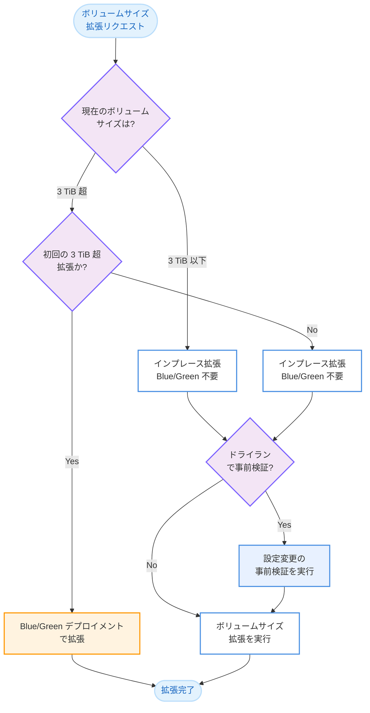

# Amazon OpenSearch Service - インプレースボリュームサイズ拡張の全サイズ対応

**リリース日**: 2026 年 3 月 10 日
**サービス**: Amazon OpenSearch Service
**機能**: インプレースボリュームサイズ拡張の全サイズ対応

[このアップデートのインフォグラフィックを見る](https://takech9203.github.io/aws-news-summary/20260310-amazon-opensearch-service-in-place-volume.html)

## 概要

Amazon OpenSearch Service が、インプレースでのクラスターボリュームサイズ拡張を 3 TiB を超えるすべてのボリュームサイズに対応した。これにより、大容量ストレージを必要とするクラスターにおいて、Blue/Green デプロイメントを経由せずにボリュームサイズを拡張できるようになった。

従来、インプレースでのボリュームサイズ拡張は 3 TiB 以下に制限されており、3 TiB を超えるボリュームサイズの変更には Blue/Green デプロイメントが必要だった。今回のアップデートにより、初回の 3 TiB 超への拡張時のみ Blue/Green デプロイメントが必要で、以降の拡張はインプレースで実行可能となった。ドライランオプションも利用可能であり、事前に変更の影響を確認できる。

**アップデート前の課題**

- 3 TiB を超えるボリュームサイズへの変更には毎回 Blue/Green デプロイメントが必要だった
- Blue/Green デプロイメントは追加のインスタンスキャパシティを必要とし、完了までに時間がかかっていた
- 大容量データを扱うクラスターでは、ストレージ拡張のたびに運用負荷が発生していた

**アップデート後の改善**

- 3 TiB を超えるボリュームサイズでもインプレースでの拡張が可能になった
- 初回の 3 TiB 超拡張後は、以降の拡張で Blue/Green デプロイメントが不要になった
- ドライランオプションにより、事前に変更の影響を検証できるようになった

## アーキテクチャ図



この図は、ボリュームサイズ拡張時の判断フローを示している。3 TiB 超への初回拡張のみ Blue/Green デプロイメントが必要で、以降はインプレースで拡張可能である。

## サービスアップデートの詳細

### 主要機能

1. **全ボリュームサイズでのインプレース拡張**
   - 3 TiB を超えるボリュームサイズでもインプレースでの拡張が可能になった
   - Blue/Green デプロイメントなしで迅速にストレージを拡張できる
   - クラスターの可用性を維持したまま拡張を実行できる

2. **初回 3 TiB 超拡張時の Blue/Green デプロイメント**
   - ボリュームサイズを初めて 3 TiB 超に拡張する場合のみ Blue/Green デプロイメントが必要
   - 一度 3 TiB 超に拡張した後の追加拡張はインプレースで実行可能
   - Blue/Green デプロイメントが必要な回数が大幅に削減される

3. **ドライランオプション**
   - ボリュームサイズ変更前にドライランで事前検証が可能
   - 変更の影響を確認してから実際の拡張を実行できる
   - 本番環境への影響を最小限に抑えた運用が可能

## 技術仕様

### ボリュームサイズ拡張の動作比較

| シナリオ | アップデート前 | アップデート後 |
|----------|---------------|---------------|
| 3 TiB 以下のボリューム拡張 | インプレース | インプレース (変更なし) |
| 初回の 3 TiB 超への拡張 | Blue/Green デプロイメント | Blue/Green デプロイメント (変更なし) |
| 2 回目以降の 3 TiB 超での拡張 | Blue/Green デプロイメント | インプレース |
| ボリュームサイズの縮小 | Blue/Green デプロイメント | Blue/Green デプロイメント (変更なし) |

### 制約条件

| 項目 | 詳細 |
|------|------|
| ボリュームサイズ縮小 | 引き続き Blue/Green デプロイメントが必要 |
| 初回 3 TiB 超拡張 | Blue/Green デプロイメントが必要 |
| ドライランオプション | 利用可能 |

## 設定方法

### 前提条件

1. Amazon OpenSearch Service ドメインが作成済みであること
2. ドメインの設定変更権限を持つ IAM ロールまたはユーザーがあること
3. 現在のボリュームサイズと目標サイズを事前に確認していること

### 手順

#### ステップ 1: ドライランで事前検証

```bash
aws opensearch update-domain-config \
  --domain-name my-domain \
  --ebs-options '{"EBSEnabled": true, "VolumeSize": 5120}' \
  --dry-run
```

ボリュームサイズを 5 TiB に拡張する前に、ドライランで変更の影響を確認するコマンド。`--dry-run` オプションにより、実際の変更は行われず、検証結果のみが返される。

#### ステップ 2: ドライラン結果の確認

```bash
aws opensearch describe-dry-run-progress \
  --domain-name my-domain
```

ドライランの進行状況と結果を確認するコマンド。Blue/Green デプロイメントが必要かどうかも確認できる。

#### ステップ 3: ボリュームサイズの拡張を実行

```bash
aws opensearch update-domain-config \
  --domain-name my-domain \
  --ebs-options '{"EBSEnabled": true, "VolumeSize": 5120}'
```

実際にボリュームサイズを 5 TiB (5,120 GiB) に拡張するコマンド。初回の 3 TiB 超拡張でない場合は、インプレースで実行される。

## メリット

### ビジネス面

- **運用コストの削減**: Blue/Green デプロイメントが不要になることで、追加インスタンスの一時的なコストと運用工数が削減される
- **ダウンタイムリスクの軽減**: インプレース拡張により、クラスターの可用性を維持したままストレージを拡張できる
- **迅速なストレージ拡張**: Blue/Green デプロイメントと比較して短時間でボリュームサイズの変更が完了する

### 技術面

- **シンプルな運用**: インプレース拡張はクラスター構成の変更を伴わないため、運用が簡素化される
- **キャパシティ制約の解消**: Blue/Green デプロイメントで必要だった追加インスタンスのキャパシティ確保が不要になる
- **ドライランによる安全な変更**: 事前検証機能により、本番環境への影響を最小限に抑えられる

## デメリット・制約事項

### 制限事項

- 初回の 3 TiB 超への拡張時は引き続き Blue/Green デプロイメントが必要
- ボリュームサイズの縮小は引き続き Blue/Green デプロイメントが必要
- インプレース拡張中もクラスターの一時的なパフォーマンス影響が発生する可能性がある

### 考慮すべき点

- 大幅なボリュームサイズ拡張を行う場合は、事前にドライランで検証することを推奨する
- ボリュームサイズの拡張は一方向の操作であり、縮小には Blue/Green デプロイメントが必要なため、計画的なサイジングが重要である

## ユースケース

### ユースケース 1: 大規模ログ分析基盤のストレージ拡張

**シナリオ**: ログデータの増加に伴い、既に 4 TiB のボリュームを使用している OpenSearch クラスターで、6 TiB への拡張が必要になった場合。

**実装例**:
```bash
aws opensearch update-domain-config \
  --domain-name production-logs \
  --ebs-options '{"EBSEnabled": true, "VolumeSize": 6144}'
```

**効果**: Blue/Green デプロイメントなしでインプレースにストレージを拡張でき、クラスターの可用性を維持したまま迅速に対応できる。

### ユースケース 2: 時系列データの保持期間延長

**シナリオ**: コンプライアンス要件の変更により、時系列データの保持期間を延長する必要があり、各データノードのボリュームサイズを 5 TiB から 8 TiB に拡張する場合。

**実装例**:
```bash
# ドライランで事前検証
aws opensearch update-domain-config \
  --domain-name timeseries-cluster \
  --ebs-options '{"EBSEnabled": true, "VolumeSize": 8192}' \
  --dry-run

# 検証後に実行
aws opensearch update-domain-config \
  --domain-name timeseries-cluster \
  --ebs-options '{"EBSEnabled": true, "VolumeSize": 8192}'
```

**効果**: 大容量のストレージ拡張をインプレースで実行でき、運用チームの作業負荷を大幅に削減できる。

### ユースケース 3: 段階的なストレージ拡張戦略

**シナリオ**: データ量の増加を見据えて、3 TiB から段階的にボリュームサイズを拡張する計画を立てている場合。

**実装例**:
```bash
# Phase 1: 3 TiB -> 4 TiB (初回の 3 TiB 超 - Blue/Green が必要)
aws opensearch update-domain-config \
  --domain-name analytics-cluster \
  --ebs-options '{"EBSEnabled": true, "VolumeSize": 4096}'

# Phase 2: 4 TiB -> 6 TiB (インプレースで実行可能)
aws opensearch update-domain-config \
  --domain-name analytics-cluster \
  --ebs-options '{"EBSEnabled": true, "VolumeSize": 6144}'
```

**効果**: 初回の Blue/Green デプロイメント後は、以降の拡張がすべてインプレースで実行できるため、段階的な拡張計画をスムーズに実施できる。

## 料金

インプレースボリュームサイズ拡張自体に追加料金は発生しない。ボリュームサイズの拡張後は、新しいボリュームサイズに基づく Amazon EBS ストレージ料金が適用される。Blue/Green デプロイメントが不要になることで、デプロイメント中の追加インスタンスの一時的なコストが削減される。

## 利用可能リージョン

すべての AWS Commercial Regions および AWS GovCloud Regions で利用可能。

## 関連サービス・機能

- **Amazon OpenSearch Service Blue/Green デプロイメント**: ドメイン更新時にダウンタイムを最小化するための基盤機能。今回のアップデートにより、ボリューム拡張時の Blue/Green デプロイメントの必要性が削減された
- **Amazon OpenSearch Service Capacity Optimized デプロイメント**: Blue/Green デプロイメントをバッチ方式で段階的に実行するオプション
- **Amazon EBS**: OpenSearch Service のデータノードで使用されるブロックストレージサービス

## 参考リンク

- [インフォグラフィック](https://takech9203.github.io/aws-news-summary/20260310-amazon-opensearch-service-in-place-volume.html)
- [公式発表 (What's New)](https://aws.amazon.com/about-aws/whats-new/2026/03/amazon-opensearch-service-in-place-volume/)
- [ドキュメント](https://docs.aws.amazon.com/opensearch-service/latest/developerguide/managedomains-configuration-changes.html)
- [料金ページ](https://aws.amazon.com/opensearch-service/pricing/)

## まとめ

Amazon OpenSearch Service のインプレースボリュームサイズ拡張が、3 TiB を超えるすべてのボリュームサイズに対応した。初回の 3 TiB 超拡張のみ Blue/Green デプロイメントが必要で、以降の拡張はインプレースで実行可能である。大容量ストレージを使用する OpenSearch クラスターを運用しているお客様は、このアップデートにより運用効率の大幅な向上が期待できるため、段階的なストレージ拡張計画の見直しを推奨する。
