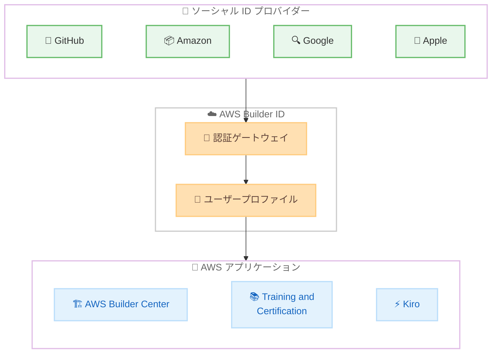

# AWS Builder ID - GitHub および Amazon ソーシャルログインのサポート

**リリース日**: 2026年03月10日
**サービス**: AWS Builder ID
**機能**: GitHub および Amazon アカウントによるソーシャルサインイン

[このアップデートのインフォグラフィックを見る](https://takech9203.github.io/aws-news-summary/20260310-aws-builder-id-sign-in-github-amazon.html)

## 概要

AWS Builder ID が、新たに GitHub および Amazon アカウントによるソーシャルログインをサポートしました。これにより、既存の Google および Apple によるサインインに加え、合計 4 つのソーシャルログインオプションが利用可能になります。

AWS Builder ID は、AWS の各種アプリケーションやサービスにアクセスするための個人プロファイルです。AWS Builder Center、AWS Training and Certification、Kiro などの AWS アプリケーションへのサインインに使用されます。今回のアップデートにより、特に開発者にとって馴染みの深い GitHub アカウントを使ったシームレスなサインインが実現し、AWS エコシステムへのアクセスがさらに簡便になります。

**アップデート前の課題**

- ソーシャルログインオプションが Google と Apple の 2 つに限られており、これらのアカウントを持たないユーザーはメールアドレスでの登録が必要だった
- 開発者が日常的に使用する GitHub アカウントでのサインインができず、別途認証情報を管理する必要があった
- Amazon アカウントを既に保有しているユーザーでも、そのアカウントを活用した Builder ID へのサインインができなかった

**アップデート後の改善**

- GitHub アカウントによるサインインが可能になり、開発者が既存の GitHub 認証情報を活用して AWS Builder ID にアクセスできるようになった
- Amazon アカウントによるサインインが追加され、既存の Amazon ユーザーがスムーズに AWS Builder ID を利用開始できるようになった
- ソーシャルログインの選択肢が 4 つに拡大し、ユーザーが自身の好みに合った認証方法を選択できるようになった

## アーキテクチャ図

ユーザーが 4 つのソーシャル ID プロバイダーのいずれかを使用して AWS Builder ID に認証し、各 AWS アプリケーションにアクセスするフローを示しています。

## サービスアップデートの詳細

### 主要機能

1. **GitHub アカウントによるサインイン**
   - GitHub の OAuth 認証を利用して AWS Builder ID にサインイン可能
   - 開発者が日常的に使用する GitHub アカウントを活用でき、追加の認証情報管理が不要
   - GitHub のセキュリティ設定 (2FA など) がそのまま適用される

2. **Amazon アカウントによるサインイン**
   - 既存の Amazon ショッピングアカウントを利用して AWS Builder ID にサインイン可能
   - 新たなアカウント作成の手間を省き、即座に AWS Builder ID の利用を開始できる
   - Amazon の多要素認証設定がそのまま活用される

3. **4 つのソーシャルログインオプション**
   - Google、Apple、GitHub、Amazon の 4 つのプロバイダーから選択可能
   - ユーザーの好みや既存アカウントの状況に応じて最適な認証方法を選択できる
   - すべてのソーシャルログインで同一の AWS Builder ID プロファイルにアクセス可能

## 技術仕様

### サポートされるソーシャルログインプロバイダー

| プロバイダー | ステータス | 備考 |
|-------------|-----------|------|
| Google | 既存 | 従来からサポート |
| Apple | 既存 | 従来からサポート |
| GitHub | 新規追加 | 今回のアップデートで追加 |
| Amazon | 新規追加 | 今回のアップデートで追加 |

### 対応 AWS アプリケーション

| アプリケーション | 説明 |
|-----------------|------|
| AWS Builder Center | AWS の開発者向けリソースハブ |
| AWS Training and Certification | AWS のトレーニングと認定資格プログラム |
| Kiro | AWS の AI 搭載開発ツール |

### API 変更履歴

今回のアップデートに関連する公開 API の変更は確認されていません。ソーシャルログインの追加は AWS Builder ID の認証サービス側の変更であり、ユーザー向け API の変更を伴いません。

## 設定方法

### 前提条件

1. GitHub アカウントまたは Amazon アカウントを保有していること
2. 各アカウントのメールアドレスが有効であること
3. Web ブラウザからインターネットにアクセスできること

### 手順

#### ステップ 1: AWS Builder ID のサインインページにアクセス

AWS Builder ID を使用するアプリケーション (AWS Builder Center、AWS Training and Certification、Kiro など) のサインインページにアクセスします。

#### ステップ 2: ソーシャルログインプロバイダーの選択

サインインページで「Sign in with GitHub」または「Sign in with Amazon」を選択します。既存の Google や Apple でのサインインも引き続き利用可能です。

#### ステップ 3: プロバイダーでの認証

選択したソーシャルログインプロバイダーの認証ページにリダイレクトされます。GitHub または Amazon の認証情報を入力し、AWS Builder ID へのアクセスを承認します。

#### ステップ 4: AWS Builder ID プロファイルの確認

初回サインイン時は、AWS Builder ID プロファイルの設定を確認または完了します。以降は選択したソーシャルログインで直接サインインが可能です。

## メリット

### ビジネス面

- **開発者の導入障壁低下**: GitHub アカウントでのサインインにより、開発者が AWS エコシステムに参加しやすくなる
- **ユーザーベースの拡大**: ソーシャルログインオプションの増加により、より多くのユーザーが AWS Builder ID を利用開始できる
- **アカウント管理の簡素化**: 既存のソーシャルアカウントを活用することで、パスワード管理の負担が軽減される

### 技術面

- **認証フローの簡素化**: OAuth ベースのソーシャルログインにより、認証プロセスが短縮される
- **セキュリティの向上**: ソーシャルプロバイダーの多要素認証がそのまま活用でき、セキュリティレベルが維持される
- **シングルサインオン体験**: 1 つのソーシャルアカウントで複数の AWS アプリケーションにアクセスでき、認証の一貫性が向上

## デメリット・制約事項

### 制限事項

- ソーシャルログインは AWS Builder ID のみに適用され、AWS マネジメントコンソールへの IAM サインインとは異なる
- ソーシャルプロバイダー側のアカウントが無効化された場合、AWS Builder ID へのサインインにも影響が生じる可能性がある
- 組織のセキュリティポリシーによっては、特定のソーシャルログインプロバイダーの使用が制限される場合がある

### 考慮すべき点

- ソーシャルログインで使用するメールアドレスと既存の AWS Builder ID のメールアドレスが異なる場合、アカウントのリンクに注意が必要
- 企業環境では、どのソーシャルログインプロバイダーを許可するかについてガバナンスポリシーの検討が推奨される

## ユースケース

### ユースケース 1: 開発者の AWS 学習開始

**シナリオ**: GitHub を日常的に使用するソフトウェアエンジニアが、AWS の認定資格取得に向けてトレーニングを開始したい。

**効果**: GitHub アカウントでワンクリックサインインし、AWS Training and Certification にすぐにアクセスできる。新たなアカウント作成やパスワード設定の手間が不要になり、学習開始までの時間が短縮される。

### ユースケース 2: Kiro を使用した AI 開発ワークフロー

**シナリオ**: オープンソースプロジェクトを GitHub で管理している開発チームが、Kiro を活用して AI 搭載のアプリケーション開発を行いたい。

**効果**: チームメンバーが普段使用している GitHub アカウントで Kiro にサインインでき、開発環境の統一感が向上する。GitHub と Kiro の間でシームレスなワークフローが実現される。

### ユースケース 3: Amazon ユーザーの AWS エコシステムへの参入

**シナリオ**: Amazon のサービスを利用しているユーザーが、AWS Builder Center で最新の AWS サービスや開発者リソースを探索したい。

**効果**: 既存の Amazon アカウントでサインインでき、新たなアカウント作成なしで AWS Builder Center のリソースにアクセスできる。AWS エコシステムへの移行がスムーズになる。

## 料金

AWS Builder ID の利用およびソーシャルログイン機能に追加料金はかかりません。AWS Builder ID は無料で提供されています。

## 利用可能リージョン

AWS Builder ID はグローバルサービスであり、すべてのリージョンのユーザーが GitHub および Amazon によるソーシャルログインを利用できます。

## 関連サービス・機能

- **AWS IAM Identity Center**: 組織向けの ID 管理とシングルサインオンを提供するサービス。AWS Builder ID とは異なり、企業の AWS アカウントへのアクセス管理に使用される
- **Amazon Cognito**: アプリケーション向けのユーザー認証・認可サービス。ソーシャルログインを含む多様な認証フローをサポート
- **Kiro**: AWS の AI 搭載開発ツール。AWS Builder ID でサインインして利用可能
- **AWS Training and Certification**: AWS の学習プラットフォーム。AWS Builder ID でアクセスしてトレーニングや認定試験を受験可能

## 参考リンク

- [このアップデートのインフォグラフィック](https://takech9203.github.io/aws-news-summary/20260310-aws-builder-id-sign-in-github-amazon.html)
- [公式発表 (What's New)](https://aws.amazon.com/about-aws/whats-new/2026/03/aws-builder-id-sign-in-github-amazon/)
- [AWS Builder ID ドキュメント](https://docs.aws.amazon.com/signin/latest/userguide/sign-in-aws_builder_id.html)

## まとめ

AWS Builder ID が GitHub および Amazon アカウントによるソーシャルログインをサポートしました。既存の Google、Apple と合わせて 4 つのソーシャルログインオプションが利用可能になり、特に開発者にとって馴染みの深い GitHub アカウントでの認証が実現しています。AWS Builder Center、AWS Training and Certification、Kiro などの AWS アプリケーションへのアクセスがさらに簡便になるため、まだ AWS Builder ID を持っていないユーザーはこの機会にソーシャルログインを活用して利用を開始することを推奨します。
