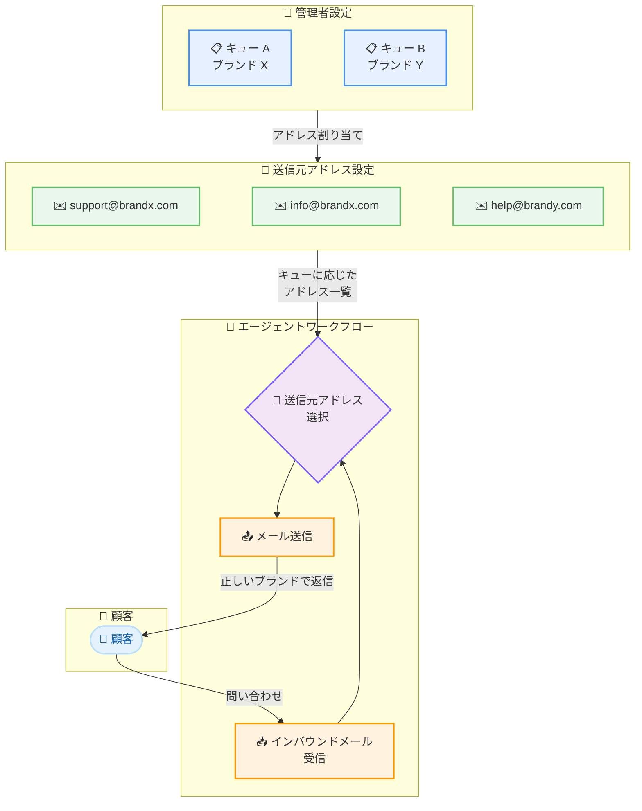

# Amazon Connect - 送信元メールアドレスの選択機能

**リリース日**: 2026 年 3 月 11 日
**サービス**: Amazon Connect
**機能**: From Email Address Selection for Outbound and Reply Emails

📊 [このアップデートのインフォグラフィックを見る](https://takech9203.github.io/aws-news-summary/20260311-amazon-connect-agents-select-from-email.html)

## 概要

Amazon Connect が、メール返信や新規送信時に「From」メールアドレスを選択できる機能をリリースしました。これにより、コンタクトセンターのエージェントは、対応するキューに設定された複数の送信元アドレスから適切なものを検索・選択でき、顧客とのやり取りで正しいブランドやビジネスアイデンティティを使用できるようになります。

この機能は、単一の Amazon Connect インスタンスから複数のブランドやビジネスラインを運営するコンタクトセンターにとって特に有用です。管理者がキューごとに複数の送信元アドレスを設定でき、エージェントはワークフローの中で適切なアドレスを選択して顧客対応を行えます。

**アップデート前の課題**

- エージェントがメール返信時に送信元アドレスを選択できず、固定のアドレスから送信されていた
- 複数ブランドを運営するコンタクトセンターでは、誤ったブランド名のアドレスで顧客に返信してしまうリスクがあった
- 1 つの Amazon Connect インスタンスで複数のビジネスラインに対応する際、メールアドレスの使い分けが困難だった

**アップデート後の改善**

- エージェントがインバウンドメールへの返信時やアウトバウンドメール送信時に、送信元アドレスを自由に選択可能に
- 管理者がキューごとに複数の送信元メールアドレスを設定可能に
- エージェントがキュー内の設定済みアドレスを検索・選択できるインターフェースが提供

## アーキテクチャ図

管理者がキューごとに複数の送信元メールアドレスを設定し、エージェントが顧客対応時に適切なアドレスを選択してメールを送信するフローを示しています。

## サービスアップデートの詳細

### 主要機能

1. **キューごとの複数送信元アドレス設定**
   - 管理者がキュー単位で複数の送信元メールアドレスを設定可能
   - ブランドやビジネスライン別にアドレスを管理
   - 既存のキュー設定に追加する形で構成

2. **エージェントによる送信元アドレスの選択**
   - インバウンドメールへの返信時に送信元アドレスを変更可能
   - 新規アウトバウンドメール作成時にも送信元アドレスを選択可能
   - キューに紐づくアドレス一覧から検索・選択するインターフェース

3. **マルチブランド対応**
   - 単一の Amazon Connect インスタンスで複数ブランドのメール対応が可能
   - 顧客に対して一貫したブランドアイデンティティを維持
   - ビジネスラインごとに適切な送信元アドレスを使い分け

## 技術仕様

### 対応チャネルと設定

| 項目 | 詳細 |
|------|------|
| 対応チャネル | メール (インバウンド返信、アウトバウンド新規送信) |
| 設定単位 | キューごと |
| アドレス設定 | 管理者がキューに複数の送信元アドレスを割り当て |
| エージェント操作 | キュー内のアドレス一覧から検索・選択 |

### API 変更履歴

| 日付 | サービス | 変更内容 |
|------|----------|----------|
| 該当なし | - | 本アップデートに直接関連する API 変更は確認されていません |

## 設定方法

### 前提条件

1. Amazon Connect インスタンスが作成済みであること
2. メールチャネルが有効化されていること
3. 管理者権限を持つユーザーでログインしていること

### 手順

#### ステップ 1: キューへの送信元メールアドレスの設定

Amazon Connect 管理コンソールにログインし、対象キューの設定画面で送信元メールアドレスを追加します。キューごとに複数のアドレスを登録できます。

#### ステップ 2: エージェントによるメール送信時のアドレス選択

エージェントがメール対応時に、割り当てられたキューの送信元アドレス一覧から適切なアドレスを検索・選択します。インバウンドメールへの返信、新規アウトバウンドメールの両方で利用可能です。

## メリット

### ビジネス面

- **ブランド一貫性の確保**: 顧客対応時に正しいブランドのメールアドレスを使用でき、ブランドイメージを維持
- **マルチブランド運営の効率化**: 単一の Amazon Connect インスタンスで複数ブランドのメール対応を一元管理
- **顧客体験の向上**: 顧客が問い合わせたブランドから適切に返信されることで信頼性が向上

### 技術面

- **柔軟な設定管理**: キューごとにアドレスを管理でき、組織構造に合わせた柔軟な設定が可能
- **運用負荷の軽減**: ブランドごとに別々のインスタンスを運用する必要がなくなり、管理が簡素化
- **エージェント操作性の向上**: 検索機能付きのアドレス選択インターフェースにより、迅速なアドレス選択が可能

## デメリット・制約事項

### 制限事項

- エージェントが選択できるアドレスは、現在対応しているキューに設定されたアドレスに限定される
- メールチャネルが有効化されている Amazon Connect インスタンスでのみ利用可能
- 利用可能なリージョンが限定されている

### 考慮すべき点

- 管理者がキューごとのアドレス設定を適切に管理する運用ルールの策定が必要
- エージェントが誤ったアドレスを選択しないよう、トレーニングやガイドラインの整備が推奨される

## ユースケース

### ユースケース 1: マルチブランドコンタクトセンター

**シナリオ**: 1 つの企業が複数のブランド (ブランド A、ブランド B) を展開し、単一の Amazon Connect インスタンスでカスタマーサポートを運営しているケース。

**効果**: エージェントが顧客の問い合わせ元ブランドに応じて適切な送信元アドレスを選択でき、各ブランドの顧客に一貫した体験を提供できる。

### ユースケース 2: 部門別メール対応

**シナリオ**: 営業部門、サポート部門、請求部門がそれぞれ異なるメールアドレスを使用しており、エージェントが複数部門の問い合わせに対応する場合。

**効果**: エージェントが対応内容に応じて適切な部門のメールアドレスを選択し、顧客に正確な情報源からの返信として届けることが可能。

### ユースケース 3: 地域別サポート

**シナリオ**: グローバル企業が地域ごとに異なるサポートメールアドレス (例: support-jp@company.com、support-us@company.com) を運用しているケース。

**効果**: エージェントが顧客の地域に応じた送信元アドレスを選択でき、地域に適したブランディングとコミュニケーションを実現。

## 料金

Amazon Connect のメールチャネル利用料金に含まれます。送信元アドレスの選択機能自体に追加料金は発生しません。Amazon Connect の料金は従量課金制で、詳細は公式料金ページを参照してください。

## 利用可能リージョン

以下のリージョンで利用可能です。

- 米国東部 (バージニア北部)
- 米国西部 (オレゴン)
- アフリカ (ケープタウン)
- アジアパシフィック (ソウル)
- アジアパシフィック (シンガポール)
- アジアパシフィック (シドニー)
- アジアパシフィック (東京)
- カナダ (中部)
- 欧州 (フランクフルト)
- 欧州 (ロンドン)

## 関連サービス・機能

- **Amazon Connect Email Channel**: 本機能の基盤となるメールチャネル機能
- **Amazon Connect Queues**: 送信元アドレスの設定単位となるキュー管理機能
- **Amazon Connect Agent Workspace**: エージェントがアドレス選択を行う操作画面

## 参考リンク

- 📊 [インフォグラフィック](https://takech9203.github.io/aws-news-summary/20260311-amazon-connect-agents-select-from-email.html)
- [公式発表 (What's New)](https://aws.amazon.com/about-aws/whats-new/2026/03/amazon-connect-agents-select-from-email/)
- [Amazon Connect ドキュメント](https://docs.aws.amazon.com/connect/latest/adminguide/what-is-amazon-connect.html)
- [Amazon Connect 料金ページ](https://aws.amazon.com/connect/pricing/)

## まとめ

Amazon Connect の送信元メールアドレス選択機能は、マルチブランドやマルチビジネスラインを運営するコンタクトセンターにとって重要なアップデートです。単一インスタンスでの効率的な運用を維持しながら、顧客に対して正しいブランドアイデンティティでメール対応を行えるようになります。複数ブランドを展開している組織は、キューごとの送信元アドレス設定を計画し、エージェント向けの運用ガイドラインを整備することを推奨します。
