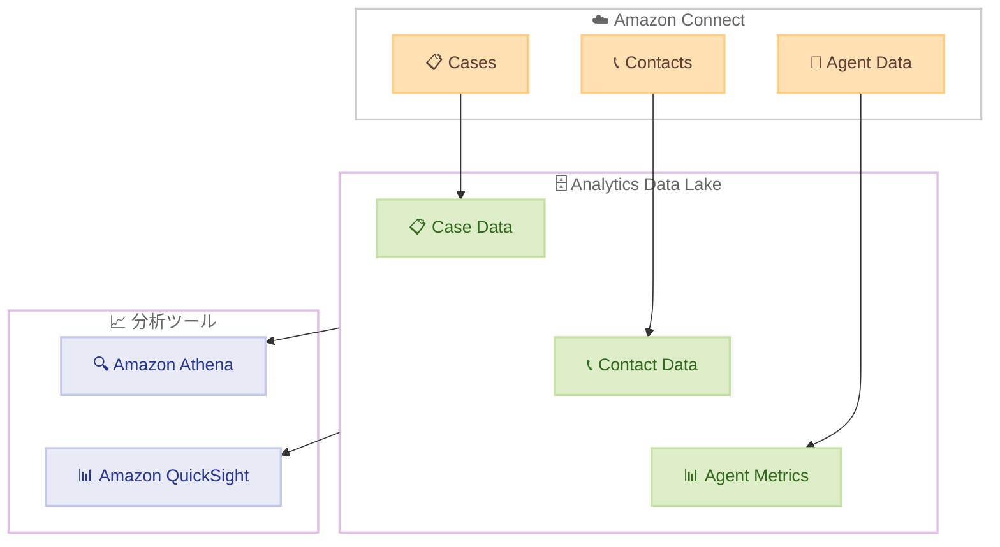

# Amazon Connect Cases - 分析データレイクでのケースデータ提供

**リリース日**: 2026 年 3 月 11 日
**サービス**: Amazon Connect
**機能**: Amazon Connect Cases データレイク統合

[このアップデートのインフォグラフィックを見る](https://takech9203.github.io/aws-news-summary/20260311-amazon-connect-cases-data-lake.html)

## 概要

Amazon Connect Cases のデータが分析データレイクで利用可能になった。これにより、ケースデータを他の Amazon Connect 分析データと組み合わせて、Amazon Athena や Amazon QuickSight を使用したカスタムレポートやインサイトの生成が容易になる。

ケースタイプ別のボリューム分析、エージェントシフトをまたいだケース対応状況、ケース全体のコンタクト感情分析などのトレンド分析が可能となる。複雑なデータパイプラインの構築・維持が不要になる点が大きなメリットである。

**アップデート前の課題**

- ケースデータを他の Amazon Connect 分析データと統合するには、独自のデータパイプラインを構築する必要があった
- ケースのトレンド分析やクロスデータ分析を行うために、ETL プロセスの開発と運用が求められていた
- ケースデータとコンタクトデータ、エージェントパフォーマンスデータを横断的に分析する手段が限られていた

**アップデート後の改善**

- ケースデータが分析データレイクに自動的に含まれるため、カスタムデータパイプラインの構築が不要になった
- Amazon Athena で SQL クエリを使用してケースデータを直接分析できるようになった
- Amazon QuickSight と連携して、ケースデータを含むビジュアルダッシュボードを作成できるようになった

## アーキテクチャ図



Amazon Connect Cases のデータが分析データレイクに統合され、Athena や QuickSight で他のコンタクトセンターデータと横断的に分析できるアーキテクチャを示す。

## サービスアップデートの詳細

### 主要機能

1. **ケースデータのデータレイク統合**
   - Amazon Connect Cases のケースデータが分析データレイクに自動的に格納される
   - 既存のコンタクトデータやエージェントパフォーマンスデータと同じデータレイクで管理される
   - 追加のデータパイプライン構築なしでデータが利用可能

2. **クロスデータ分析**
   - ケースデータとコンタクトデータを結合したクロス分析が可能
   - ケースタイプ別のボリューム、エージェントシフト間のケース対応、コンタクト感情分析などを横断的に分析できる
   - SQL ベースのクエリで柔軟にデータを抽出・集計可能

3. **BI ツールとの統合**
   - Amazon Athena を使用した SQL によるアドホッククエリ
   - Amazon QuickSight によるダッシュボードやレポートの作成
   - 既存の BI ワークフローにケースデータを組み込み可能

## 技術仕様

### データレイク構成

| 項目 | 詳細 |
|------|------|
| データソース | Amazon Connect Cases |
| データ格納先 | Amazon Connect 分析データレイク |
| クエリエンジン | Amazon Athena |
| 可視化ツール | Amazon QuickSight |
| データ形式 | 他の Connect 分析データと統一フォーマット |

### API 変更履歴

| 日付 | サービス | 変更内容 |
|------|----------|----------|
| 2026/03/10 | [Amazon Connect Cases](https://awsapichanges.com/archive/changes/9ed5c2-cases.html) | 3 updated api methods - Required/Hidden ケースルールの条件評価機能追加 |

### 分析可能なデータの例

| 分析項目 | 説明 |
|----------|------|
| ケースボリューム | ケースタイプ別の件数推移 |
| ケース対応状況 | エージェントシフトをまたいだ対応状況 |
| コンタクト感情 | ケース全体のコンタクト感情分析 |
| 解決時間 | ケースの平均解決時間やトレンド |

## 設定方法

### 前提条件

1. Amazon Connect インスタンスが設定済みであること
2. Amazon Connect Cases が有効化されていること
3. 分析データレイクが有効化されていること

### 手順

#### ステップ 1: 分析データレイクの有効化確認

Amazon Connect コンソールにアクセスし、分析データレイクが有効になっていることを確認する。未設定の場合は、Amazon Connect の分析設定からデータレイクを有効化する。

#### ステップ 2: Amazon Athena でのクエリ実行

```sql
-- ケースタイプ別のボリュームを確認するクエリ例
SELECT case_type, COUNT(*) as case_count
FROM connect_analytics_data_lake.cases
GROUP BY case_type
ORDER BY case_count DESC;
```

分析データレイク内のケーステーブルに対して Athena で直接 SQL クエリを実行できる。

#### ステップ 3: QuickSight ダッシュボードの作成

Amazon QuickSight で Athena をデータソースとして接続し、ケースデータを含むダッシュボードを作成する。既存のコンタクト分析ダッシュボードにケースデータを追加することも可能である。

## メリット

### ビジネス面

- **運用コストの削減**: カスタムデータパイプラインの構築・運用が不要になり、インフラ管理コストを削減できる
- **意思決定の迅速化**: ケースデータとコンタクトデータの統合分析により、コンタクトセンターの運用改善に関する意思決定を迅速に行える
- **顧客体験の向上**: ケースの傾向分析を通じて、顧客対応のボトルネックを特定し改善できる

### 技術面

- **データ統合の簡素化**: 分析データレイクにケースデータが自動的に統合されるため、ETL パイプラインの開発が不要
- **標準 SQL によるアクセス**: Amazon Athena を通じて標準 SQL でデータにアクセスでき、学習コストが低い
- **スケーラブルな分析基盤**: サーバーレスアーキテクチャにより、データ量の増加に応じて自動スケール

## デメリット・制約事項

### 制限事項

- 分析データレイクの有効化が前提条件となるため、未設定の場合は追加の初期設定が必要
- データレイクへのデータ反映にはリアルタイムではなく一定のラグが発生する可能性がある
- 利用可能リージョンが限定されている

### 考慮すべき点

- Athena のクエリ実行にはスキャンしたデータ量に応じたコストが発生する
- QuickSight ダッシュボードの利用には別途 QuickSight のサブスクリプションが必要

## ユースケース

### ユースケース 1: ケースボリュームのトレンド分析

**シナリオ**: コンタクトセンターマネージャーが、ケースタイプ別の週次トレンドを把握し、リソース配分の最適化に活用したい。

**実装例**:
```sql
SELECT case_type,
       DATE_TRUNC('week', created_at) as week,
       COUNT(*) as case_count
FROM connect_analytics_data_lake.cases
GROUP BY case_type, DATE_TRUNC('week', created_at)
ORDER BY week DESC, case_count DESC;
```

**効果**: ケースタイプ別のボリューム推移を可視化し、ピーク時期の予測やスタッフ配置の最適化に活用できる。

### ユースケース 2: コンタクト感情とケース解決の相関分析

**シナリオ**: 品質管理チームが、顧客の感情スコアとケース解決時間の関係を分析し、対応品質の改善ポイントを特定したい。

**実装例**:
```sql
SELECT c.case_type,
       AVG(ct.sentiment_score) as avg_sentiment,
       AVG(c.resolution_time_hours) as avg_resolution_hours
FROM connect_analytics_data_lake.cases c
JOIN connect_analytics_data_lake.contacts ct ON c.case_id = ct.case_id
GROUP BY c.case_type;
```

**効果**: 感情スコアが低いケースタイプを特定し、重点的な改善施策を立案できる。

### ユースケース 3: エージェントシフト別のケース対応分析

**シナリオ**: オペレーション責任者が、シフト間でのケース引き継ぎ状況を分析し、シフト体制の改善を検討したい。

**実装例**:
```sql
SELECT agent_shift,
       COUNT(DISTINCT case_id) as handled_cases,
       COUNT(CASE WHEN status = 'RESOLVED' THEN 1 END) as resolved_cases
FROM connect_analytics_data_lake.cases
GROUP BY agent_shift
ORDER BY agent_shift;
```

**効果**: シフト間のケース対応バランスを把握し、引き継ぎプロセスやシフト配置を最適化できる。

## 料金

Amazon Connect Cases のデータレイク統合自体には追加料金は発生しない。ただし、以下の関連サービスの利用料が適用される。

### 料金例

| サービス | 料金体系 |
|----------|----------|
| Amazon Connect Cases | ケースあたりの料金が適用 |
| Amazon Connect 分析データレイク | データストレージとデータ取り込みに対する料金 |
| Amazon Athena | スキャンしたデータ量あたり $5/TB |
| Amazon QuickSight | ユーザーあたりの月額サブスクリプション |

## 利用可能リージョン

Amazon Connect Cases は以下の AWS リージョンで利用可能。

- 米国東部 (バージニア北部)
- 米国西部 (オレゴン)
- カナダ (中部)
- 欧州 (フランクフルト)
- 欧州 (ロンドン)
- アジアパシフィック (ソウル)
- アジアパシフィック (シンガポール)
- アジアパシフィック (シドニー)
- アジアパシフィック (東京)
- アフリカ (ケープタウン)

## 関連サービス・機能

- **Amazon Connect 分析データレイク**: ケースデータを含む全てのコンタクトセンターデータを一元管理するデータレイク基盤
- **Amazon Athena**: データレイク内のデータに対してサーバーレスで SQL クエリを実行できる分析サービス
- **Amazon QuickSight**: データの可視化とダッシュボード作成のための BI サービス
- **Amazon Connect Cases**: コンタクトセンターでの顧客問題のトラッキングと管理を行うケース管理機能

## 参考リンク

- [インフォグラフィック](https://takech9203.github.io/aws-news-summary/20260311-amazon-connect-cases-data-lake.html)
- [公式発表 (What's New)](https://aws.amazon.com/about-aws/whats-new/2026/03/amazon-connect-cases-data-lake/)
- [Amazon Connect Cases ドキュメント](https://docs.aws.amazon.com/connect/latest/adminguide/cases.html)
- [Amazon Connect 分析データレイク ドキュメント](https://docs.aws.amazon.com/connect/latest/adminguide/analytics-data-lake.html)
- [Amazon Connect 料金ページ](https://aws.amazon.com/connect/pricing/)

## まとめ

Amazon Connect Cases のデータが分析データレイクで利用可能になったことで、コンタクトセンターの運用データをより包括的に分析できるようになった。カスタムデータパイプラインの構築が不要になるため、分析環境の構築コストと運用負荷が大幅に軽減される。Amazon Connect を利用しているコンタクトセンターでは、分析データレイクを有効化し、ケースデータを活用したトレンド分析やダッシュボード構築を検討することを推奨する。
