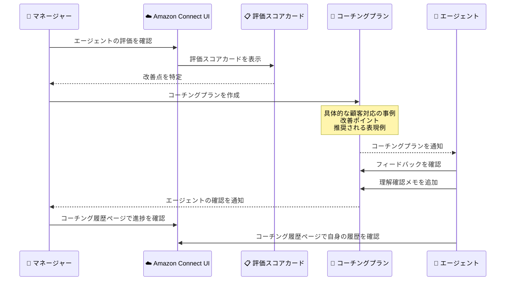

# Amazon Connect - 統合エージェントコーチングワークフロー

**リリース日**: 2026年3月11日
**サービス**: Amazon Connect
**機能**: 統合エージェントコーチングワークフロー

📊 [このアップデートのインフォグラフィックを見る](https://takech9203.github.io/aws-news-summary/20260311-amazon-connect-integrated-agent-coaching-workflows.html)

## 概要

Amazon Connect に統合エージェントコーチングワークフローが追加されました。この機能により、コンタクトセンターのマネージャーは Connect UI 内で直接、エージェントに対してタイムリーかつ的確なフィードバックを提供できるようになります。評価スコアカードで改善点を特定した後、具体的な顧客対応の事例を含むコーチングプランを即座に作成できます。

例えば、マネージャーは問題解決力に優れているが顧客への共感をもう少し示すべきエージェントに対して、該当する顧客対応の具体例と、今後使用すべき共感的な表現の例を共有できます。コーチングセッション後、エージェントはフィードバックを確認し、期待事項や次のステップについての理解を確認するメモを追加します。

マネージャーとエージェントの双方が単一のページですべてのコーチング履歴にアクセスできるため、体系的な進捗の追跡とコーチングの効果向上が実現します。この統合的なアプローチにより、コーチングの遅延を解消し、エージェント育成プロセス全体を通じてアカウンタビリティを確立できます。

**アップデート前の課題**

- 評価スコアカードで改善点を発見しても、コーチングまでにタイムラグが生じていた
- コーチングの内容や履歴を一元管理する仕組みがなく、外部ツールやメールに依存していた
- 具体的な顧客対応の事例をコーチングプランに紐づけて共有する手段がなかった
- エージェントがフィードバックを受領・理解したことを確認する仕組みが不十分だった

**アップデート後の改善**

- 評価スコアカードから直接コーチングプランを作成でき、コーチングの遅延が解消された
- Connect UI 内で具体的な顧客対応の事例を含むコーチングプランを作成・管理できるようになった
- エージェントがフィードバックを確認し、理解を示すメモを追加できるようになった
- マネージャーとエージェントの双方が単一のページでコーチング履歴全体を確認できるようになった

## アーキテクチャ図



この図は、マネージャーが評価スコアカードから改善点を特定し、コーチングプランを作成してエージェントに共有するまでの一連のワークフローを示しています。エージェントはフィードバックを確認し、理解を示すメモを追加することで、双方向のコミュニケーションが実現されます。

## サービスアップデートの詳細

### 主要機能

1. **評価スコアカードからのコーチングプラン作成**
   - 評価スコアカードで改善機会を特定した際に、即座にコーチングプランを作成可能
   - 具体的な顧客対応の事例をコーチングプランに直接紐づけて共有
   - 改善が必要な領域と推奨される対応例を明確に提示

2. **エージェントによるフィードバック確認**
   - エージェントはコーチングセッション後にフィードバックを確認
   - 期待事項や次のステップについての理解を確認するメモを追加
   - フィードバックの受領と理解が記録として残る

3. **統合コーチング履歴ページ**
   - マネージャーとエージェントの双方が単一のページですべてのコーチング履歴にアクセス
   - 体系的な進捗の追跡が可能
   - コーチングの効果を時系列で確認

4. **コーチングの遅延解消**
   - 評価からコーチングまでのプロセスが Connect UI 内で完結
   - 外部ツールへの依存を排除
   - エージェント育成プロセス全体のアカウンタビリティを確立

## 技術仕様

### 機能仕様

| 項目 | 詳細 |
|------|------|
| 対象ユーザー | コンタクトセンターマネージャー、エージェント |
| アクセス方法 | Amazon Connect 管理コンソール |
| コーチングプランの要素 | 具体的な顧客対応事例、改善ポイント、推奨表現例 |
| 履歴管理 | 単一ページでの一元管理 |
| エージェント確認機能 | フィードバック確認、メモ追加 |

### API 変更履歴

今回のアップデートに直接関連する API 変更は確認されていません。Connect UI 内の機能として提供されます。

### IAM 権限

コーチング機能を使用するには、Amazon Connect のセキュリティプロファイルで適切な権限を設定する必要があります。

```json
{
  "Version": "2012-10-17",
  "Statement": [
    {
      "Effect": "Allow",
      "Action": [
        "connect:CreateCoachingPlan",
        "connect:ViewCoachingHistory",
        "connect:AcknowledgeCoaching"
      ],
      "Resource": "arn:aws:connect:*:*:instance/*/coaching/*"
    }
  ]
}
```

※ 上記は想定される権限の例です。実際の権限名は公式ドキュメントで確認してください。

## 設定方法

### 前提条件

1. Amazon Connect インスタンスが作成済みであること
2. Contact Lens が有効化されていること (評価スコアカード機能に必要)
3. マネージャーのセキュリティプロファイルにコーチング機能の権限が付与されていること

### 手順

#### ステップ 1: 評価スコアカードの確認

Amazon Connect 管理コンソールにログインし、分析と最適化セクションから評価フォームを確認します。エージェントの評価結果から改善が必要な領域を特定します。

#### ステップ 2: コーチングプランの作成

評価スコアカードから直接コーチングプランを作成します。具体的な顧客対応の事例を選択し、改善ポイントと推奨される表現例を記載します。

#### ステップ 3: エージェントへの通知とフィードバック確認

コーチングプランが作成されると、エージェントに通知されます。エージェントはコーチング内容を確認し、理解を示すメモを追加します。マネージャーはコーチング履歴ページで進捗を追跡できます。

## メリット

### ビジネス面

- **コーチング効率の向上**: 評価からコーチングまでのプロセスが一元化され、タイムリーなフィードバックが可能
- **エージェントパフォーマンスの改善促進**: 具体的な事例に基づくコーチングにより、改善点が明確になりパフォーマンス向上が加速
- **アカウンタビリティの確立**: フィードバックの確認とメモ追加により、コーチングプロセスの透明性と責任の所在が明確化

### 技術面

- **統合ワークフロー**: 外部ツールやメールに依存せず、Connect UI 内でコーチングプロセスが完結
- **履歴の一元管理**: すべてのコーチング履歴を単一ページで管理でき、傾向分析が容易
- **評価機能との連携**: 評価スコアカードからシームレスにコーチングプランを作成でき、データの一貫性を維持

## デメリット・制約事項

### 制限事項

- Contact Lens の有効化が前提となるため、追加コストが発生する可能性がある
- コーチングプランのカスタマイズ範囲は Connect UI で提供される機能に限定される
- API による自動化は現時点では確認されていない

### 考慮すべき点

- 既存のコーチングプロセスやツールからの移行計画が必要
- マネージャーとエージェントへの新機能のトレーニングが必要
- コーチング内容にはエージェントの個人評価が含まれるため、適切なアクセス制御が重要

## ユースケース

### ユースケース 1: 顧客対応品質の改善

**シナリオ**: マネージャーが評価スコアカードで、あるエージェントが問題解決力は高いが顧客への共感表現が不足していることを発見。

**実装例**:
1. 評価スコアカードからコーチングプランを作成
2. 共感表現が不足していた具体的な顧客対応の録音/トランスクリプトを添付
3. 「お気持ちはよくわかります」「ご不便をおかけして申し訳ございません」など、推奨される共感表現の例を記載
4. エージェントがフィードバックを確認し、改善への理解を示すメモを追加

**効果**: 具体的な事例に基づくフィードバックにより、エージェントが改善点を明確に理解し、次回の顧客対応から即座に実践できます。

### ユースケース 2: 新人エージェントの育成

**シナリオ**: 新人エージェントの入社後 30 日間の育成プログラムとして、週次のコーチングセッションを実施。

**実装例**:
1. 毎週の評価スコアカードに基づき、改善が必要な領域を特定
2. 週次でコーチングプランを作成し、前週からの改善点と新たな改善目標を設定
3. コーチング履歴ページで 30 日間の成長を可視化

**効果**: 体系的なコーチング履歴により、新人エージェントの成長を定量的に追跡し、育成プログラムの効果を評価できます。

### ユースケース 3: チーム全体のパフォーマンス向上

**シナリオ**: コンタクトセンター全体で特定のスキル (アップセル、初回解決率など) の向上を目指す。

**実装例**:
1. 評価スコアカードでチーム全体のスコアを分析し、共通の改善領域を特定
2. 優秀なエージェントの顧客対応事例をベストプラクティスとしてコーチングプランに活用
3. 各エージェントの進捗をコーチング履歴ページで比較・追跡

**効果**: チーム全体の弱点を特定し、優秀なエージェントの対応を参考にすることで、組織全体のパフォーマンス底上げが実現します。

## 料金

この機能は Amazon Connect の標準機能として提供されます。コーチングワークフロー自体に追加料金はかかりませんが、前提となる機能に対して料金が発生します。

### 料金体系

| 項目 | 料金 |
|------|------|
| Amazon Connect 使用料 | コンタクトごとの従量課金 |
| Contact Lens (評価スコアカード) | コンタクト分析ごとの従量課金 |
| コーチングワークフロー | 追加料金なし |

※ 詳細な料金は [Amazon Connect 料金ページ](https://aws.amazon.com/connect/pricing/) を参照してください。

## 利用可能リージョン

Amazon Connect が利用可能なすべての AWS リージョンで利用できます。詳細は [AWS リージョナルサービス一覧](https://docs.aws.amazon.com/general/latest/gr/connect_region.html) を参照してください。

## 関連サービス・機能

- **Amazon Connect Contact Lens**: 会話分析と評価スコアカードを提供し、コーチングの基盤となるデータを生成
- **Amazon Connect 評価フォーム**: エージェントのパフォーマンスを評価し、改善機会を特定するための機能
- **Amazon Connect エージェント画面録画**: コーチングの際にエージェントの操作を視覚的に確認するために活用可能

## 参考リンク

- 📊 [インフォグラフィック](https://takech9203.github.io/aws-news-summary/20260311-amazon-connect-integrated-agent-coaching-workflows.html)
- [公式発表 (What's New)](https://aws.amazon.com/about-aws/whats-new/2026/03/amazon-connect-integrated-agent-coaching-workflows/)
- [Amazon Connect 管理者ガイド](https://docs.aws.amazon.com/connect/latest/adminguide/)
- [Amazon Connect Contact Lens](https://docs.aws.amazon.com/connect/latest/adminguide/contact-lens.html)
- [Amazon Connect 料金ページ](https://aws.amazon.com/connect/pricing/)

## まとめ

Amazon Connect の統合エージェントコーチングワークフローにより、評価からフィードバック、進捗追跡までのコーチングプロセスが Connect UI 内で完結するようになりました。具体的な顧客対応の事例に基づくタイムリーなコーチングが可能になり、エージェントのパフォーマンス改善を加速します。Contact Lens と評価スコアカードを既に使用しているコンタクトセンターでは、この機能を活用してコーチングプロセスの効率化とエージェント育成の体系化を推進することをお勧めします。
