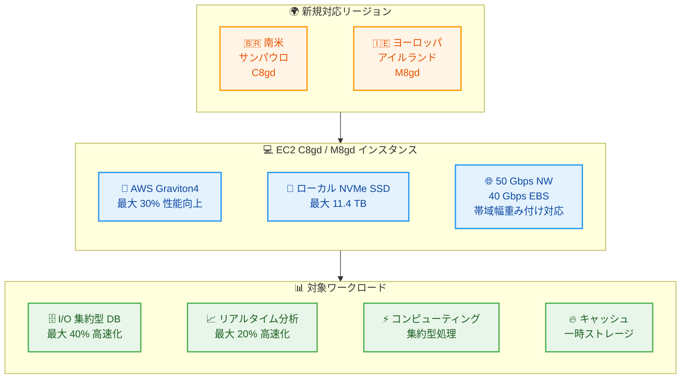

# Amazon EC2 - C8gd / M8gd インスタンスが追加リージョンで利用可能に

**リリース日**: 2026年03月11日
**サービス**: Amazon EC2
**機能**: C8gd / M8gd インスタンス (AWS Graviton4 搭載、ローカル NVMe SSD ストレージ付き)

[このアップデートのインフォグラフィックを見る](https://takech9203.github.io/aws-news-summary/20260311-amazon-ec2-c8gd-m8gd-instances-available.html)

## 概要

AWS は 2026 年 3 月 11 日、Amazon EC2 C8gd および M8gd インスタンスが追加リージョンで利用可能になったことを発表しました。C8gd インスタンスは南米 (サンパウロ) リージョンに、M8gd インスタンスはヨーロッパ (アイルランド) リージョンに拡大されています。これらのインスタンスは最大 11.4 TB のローカル NVMe ベース SSD ブロックレベルストレージを備えており、I/O 集約型のワークロードに最適です。

C8gd および M8gd インスタンスは AWS Graviton4 プロセッサーを搭載し、Graviton3 ベースのインスタンスと比較して最大 30% 優れたパフォーマンスを提供します。特に I/O 集約型のデータベースワークロードで最大 40% 高速化、リアルタイムデータ分析で最大 20% 高速なクエリ結果を実現します。各インスタンスは 12 種類のサイズで提供され、最大 50 Gbps のネットワーク帯域幅と最大 40 Gbps の Amazon EBS 帯域幅をサポートします。

**アップデート前の課題**

- 南米 (サンパウロ) リージョンでは C8gd インスタンスが利用できず、Graviton4 搭載のコンピューティング最適化インスタンスとローカル NVMe SSD ストレージを組み合わせたワークロードを実行できなかった
- ヨーロッパ (アイルランド) リージョンでは M8gd インスタンスが利用できず、汎用かつローカルストレージが必要なワークロードに Graviton4 の性能を活用できなかった
- これらのリージョンのユーザーは前世代の Graviton3 ベースインスタンスを使用する必要があり、I/O 集約型ワークロードでの最新パフォーマンス向上の恩恵を受けられなかった

**アップデート後の改善**

- C8gd インスタンスが南米 (サンパウロ) リージョンで利用可能になり、ローカル NVMe SSD 付きのコンピューティング最適化ワークロードを実行できるようになった
- M8gd インスタンスがヨーロッパ (アイルランド) リージョンで利用可能になり、汎用ワークロードにローカルストレージを活用できるようになった
- EC2 インスタンス帯域幅重み付け設定により、ネットワークと EBS の帯域幅を 25% 調整できるようになり、帯域幅リソースの配分の柔軟性が向上した

## アーキテクチャ図



C8gd と M8gd インスタンスが追加リージョンで利用可能になり、Graviton4 プロセッサーとローカル NVMe SSD ストレージを組み合わせた高性能ワークロードを実行できるようになりました。

## サービスアップデートの詳細

### 主要機能

1. **AWS Graviton4 プロセッサー搭載**
   - Graviton3 と比較して最大 30% 優れた全体パフォーマンス
   - I/O 集約型データベースワークロードで最大 40% のパフォーマンス向上
   - I/O 集約型リアルタイムデータ分析で最大 20% 高速なクエリ結果

2. **ローカル NVMe SSD ストレージ**
   - 最大 11.4 TB のローカル NVMe ベース SSD ブロックレベルストレージ
   - ネットワーク経由のストレージアクセスと比較して低レイテンシーの I/O 操作を実現
   - 一時データ、キャッシュ、スクラッチスペースなどに最適

3. **高性能ネットワーキングと帯域幅調整**
   - 最大 50 Gbps のネットワーク帯域幅
   - 最大 40 Gbps の Amazon EBS 帯域幅
   - EC2 インスタンス帯域幅重み付け設定で帯域幅を 25% 調整可能
   - 24xlarge、48xlarge、metal-24xl、metal-48xl サイズで Elastic Fabric Adapter (EFA) をサポート

## 技術仕様

### インスタンス仕様

| 項目 | C8gd | M8gd |
|------|------|------|
| インスタンスファミリー | コンピューティング最適化 | 汎用 |
| プロセッサー | AWS Graviton4 (Arm ベース) | AWS Graviton4 (Arm ベース) |
| ローカルストレージ | 最大 11.4 TB NVMe SSD | 最大 11.4 TB NVMe SSD |
| インスタンスサイズ数 | 12 | 12 |
| 最大ネットワーク帯域幅 | 50 Gbps | 50 Gbps |
| 最大 EBS 帯域幅 | 40 Gbps | 40 Gbps |
| EFA 対応サイズ | 24xlarge, 48xlarge, metal-24xl, metal-48xl | 24xlarge, 48xlarge, metal-24xl, metal-48xl |
| 帯域幅重み付け | 25% 調整可能 | 25% 調整可能 |

### パフォーマンス比較 (Graviton3 比)

| ワークロード | パフォーマンス向上 |
|-------------|-------------------|
| 全般 | 最大 30% 高速化 |
| I/O 集約型データベース | 最大 40% 高速化 |
| I/O 集約型リアルタイムデータ分析 | 最大 20% 高速化 |

## 設定方法

### 前提条件

1. 対象リージョンの AWS アカウント (sa-east-1 または eu-west-1)
2. Arm (aarch64/arm64) アーキテクチャ対応の AMI
3. 適切な IAM 権限 (EC2 インスタンスの起動権限)

### 手順

#### ステップ 1: AMI の選択

```bash
# サンパウロリージョンで Graviton 対応の Amazon Linux 2023 AMI を検索
aws ec2 describe-images \
  --region sa-east-1 \
  --filters "Name=name,Values=al2023-ami-*-arm64-*" \
            "Name=state,Values=available" \
  --query 'Images | sort_by(@, &CreationDate) | [-1].ImageId' \
  --output text
```

対象リージョンで Arm アーキテクチャ (arm64) に対応した AMI を選択します。Amazon Linux 2023、Ubuntu、RHEL などが利用可能です。

#### ステップ 2: C8gd インスタンスの起動 (サンパウロリージョン)

```bash
# C8gd インスタンスを起動
aws ec2 run-instances \
  --region sa-east-1 \
  --instance-type c8gd.xlarge \
  --image-id ami-xxxxxxxxxxxxxxxxx \
  --key-name my-key-pair \
  --security-group-ids sg-xxxxxxxxxxxxxxxxx \
  --subnet-id subnet-xxxxxxxxxxxxxxxxx
```

C8gd インスタンスタイプを指定してインスタンスを起動します。ローカル NVMe SSD ストレージはインスタンスに自動的にアタッチされますが、使用前にフォーマットとマウントが必要です。

#### ステップ 3: ローカル NVMe SSD のマウント

```bash
# ローカル NVMe SSD デバイスを確認
lsblk

# ファイルシステムを作成してマウント
sudo mkfs -t xfs /dev/nvme1n1
sudo mkdir /mnt/local-ssd
sudo mount /dev/nvme1n1 /mnt/local-ssd
```

ローカル NVMe SSD はエフェメラルストレージです。インスタンスの停止や終了時にデータは失われるため、永続的なデータは Amazon EBS に保存してください。

#### ステップ 4: 帯域幅重み付けの設定 (オプション)

```bash
# インスタンスの帯域幅重み付けを設定
aws ec2 modify-instance-attribute \
  --instance-id i-xxxxxxxxxxxxxxxxx \
  --instance-type c8gd.xlarge \
  --bandwidth-weighting "default"
```

EC2 インスタンス帯域幅重み付け設定を使用して、ネットワークと Amazon EBS の帯域幅配分を 25% 調整できます。ネットワーク帯域幅を優先する場合やストレージ帯域幅を優先する場合に活用できます。

## メリット

### ビジネス面

- **リージョン選択肢の拡大**: 南米やヨーロッパでローカル SSD 付きの Graviton4 インスタンスを利用でき、ユーザーに近いリージョンでワークロードを実行できる
- **コスト効率の向上**: Graviton4 は同等の x86 インスタンスと比較して優れた価格パフォーマンスを提供し、ローカル NVMe SSD により EBS コストを削減できるケースがある
- **帯域幅の柔軟な配分**: 帯域幅重み付け設定により、ワークロードの特性に応じたリソース配分が可能になり、インフラコストを最適化できる

### 技術面

- **低レイテンシーストレージ**: ローカル NVMe SSD により、ネットワーク経由のストレージと比較して大幅に低いレイテンシーでの I/O 操作が可能
- **大幅なパフォーマンス向上**: I/O 集約型データベースで最大 40% 高速化、リアルタイムデータ分析で最大 20% 高速化を実現
- **EFA サポート**: 大型インスタンスサイズで Elastic Fabric Adapter を利用でき、HPC やマシンラーニングワークロードでの高帯域幅・低レイテンシー通信が可能

## デメリット・制約事項

### 制限事項

- ローカル NVMe SSD はエフェメラルストレージであり、インスタンスの停止・終了時にデータが失われる
- Arm (aarch64) アーキテクチャのみサポートしており、x86 向けにコンパイルされたバイナリはそのまま実行できない
- 今回のリージョン拡大は C8gd がサンパウロ、M8gd がアイルランドに限定されており、それぞれ別のリージョンでの利用は既存の対応リージョンを確認する必要がある

### 考慮すべき点

- ローカル NVMe SSD のデータはインスタンスのライフサイクルに依存するため、重要なデータの永続化には Amazon EBS や Amazon S3 との併用が必要
- x86 アーキテクチャからの移行時には、Porting Advisor for Graviton を使用してアプリケーションの互換性テストを実施することを推奨
- 帯域幅重み付け設定は新しい機能のため、ワークロードの特性に応じたベンチマークテストが望ましい

## ユースケース

### ユースケース 1: 南米地域での I/O 集約型データベース

**シナリオ**: 南米市場向けのアプリケーションで、高速なローカルストレージを必要とするデータベースワークロードをサンパウロリージョンで実行したい。

**実装例**:
```bash
# サンパウロリージョンで C8gd インスタンスを起動
aws ec2 run-instances \
  --region sa-east-1 \
  --instance-type c8gd.8xlarge \
  --image-id ami-xxxxxxxxxxxxxxxxx \
  --count 1
```

**効果**: Graviton4 による I/O 集約型データベースの最大 40% 高速化と、ローカル NVMe SSD による低レイテンシーのデータアクセスにより、南米のユーザーに高いパフォーマンスのデータベースサービスを提供できる。

### ユースケース 2: ヨーロッパでのリアルタイムデータ分析

**シナリオ**: ヨーロッパのデータセンターでリアルタイムデータ分析を実行しており、ローカルストレージを一時データの処理に活用したい。

**実装例**:
```bash
# アイルランドリージョンで M8gd インスタンスを起動
aws ec2 run-instances \
  --region eu-west-1 \
  --instance-type m8gd.16xlarge \
  --image-id ami-xxxxxxxxxxxxxxxxx \
  --count 1
```

**効果**: Graviton4 によるリアルタイムデータ分析の最大 20% 高速なクエリ結果と、M8gd のバランスの取れたコンピューティング・メモリリソースにより、効率的なデータ分析パイプラインを構築できる。

### ユースケース 3: HPC ワークロードでの EFA 活用

**シナリオ**: 大規模な科学計算やシミュレーションで、ノード間の高帯域幅・低レイテンシー通信とローカル高速ストレージが必要。

**実装例**:
```bash
# EFA 対応の大型 C8gd インスタンスを起動
aws ec2 run-instances \
  --region sa-east-1 \
  --instance-type c8gd.48xlarge \
  --image-id ami-xxxxxxxxxxxxxxxxx \
  --network-interfaces "InterfaceType=efa,DeviceIndex=0,Groups=sg-xxxxxxxxxxxxxxxxx,SubnetId=subnet-xxxxxxxxxxxxxxxxx"
```

**効果**: 48xlarge サイズでの EFA サポートにより、ノード間の高速通信とローカル NVMe SSD によるスクラッチスペースを活用した効率的な HPC ワークロードの実行が可能。

## 料金

C8gd および M8gd インスタンスの料金はリージョンとインスタンスサイズによって異なります。一般的に Graviton ベースのインスタンスは、同等の x86 ベースインスタンスと比較して優れた価格パフォーマンスを提供します。ローカル NVMe SSD ストレージの料金はインスタンス料金に含まれています。

### 料金例

| インスタンスサイズ | 特徴 | 料金 |
|-------------------|------|------|
| c8gd.xlarge | コンピューティング最適化 + ローカル SSD | オンデマンド料金は EC2 料金ページを参照 |
| m8gd.xlarge | 汎用 + ローカル SSD | オンデマンド料金は EC2 料金ページを参照 |
| c8gd.48xlarge | 大型 + EFA 対応 | オンデマンド料金は EC2 料金ページを参照 |

具体的な料金は [Amazon EC2 料金ページ](https://aws.amazon.com/ec2/pricing/) で確認してください。Savings Plans やリザーブドインスタンスの適用で追加の割引が可能です。

## 利用可能リージョン

今回のアップデートで追加されたリージョン:

- **C8gd**: 南米 (サンパウロ) - sa-east-1
- **M8gd**: ヨーロッパ (アイルランド) - eu-west-1

C8gd および M8gd インスタンスの全リージョンの利用状況については、各インスタンスタイプのページを参照してください。

## 関連サービス・機能

- **AWS Graviton4**: C8gd / M8gd の基盤となる最新世代の Arm ベースプロセッサー。Graviton3 比で最大 30% のパフォーマンス向上を実現
- **AWS Nitro System**: EC2 インスタンスの基盤となるハードウェアとソフトウェアプラットフォーム。仮想化オーバーヘッドを最小化
- **Amazon EBS**: 最大 40 Gbps の EBS 帯域幅をサポートし、永続ストレージとローカル NVMe SSD を組み合わせて利用可能
- **Elastic Fabric Adapter (EFA)**: 大型インスタンスサイズで利用可能な高帯域幅・低レイテンシーのネットワーキングインターフェース
- **EC2 インスタンス帯域幅重み付け**: ネットワークと EBS の帯域幅配分を 25% 調整できる設定機能

## 参考リンク

- [インフォグラフィック](https://takech9203.github.io/aws-news-summary/20260311-amazon-ec2-c8gd-m8gd-instances-available.html)
- [公式発表 (What's New)](https://aws.amazon.com/about-aws/whats-new/2026/03/amazon-ec2-c8gd-m8gd-instances-available/)
- [Amazon EC2 インスタンスタイプ](https://aws.amazon.com/ec2/instance-types/)
- [AWS Graviton プロセッサー](https://aws.amazon.com/ec2/graviton/)
- [EC2 インスタンス帯域幅重み付け](https://docs.aws.amazon.com/AWSEC2/latest/UserGuide/configure-bandwidth-weighting.html)
- [Amazon EC2 料金ページ](https://aws.amazon.com/ec2/pricing/)

## まとめ

Amazon EC2 C8gd インスタンスが南米 (サンパウロ)、M8gd インスタンスがヨーロッパ (アイルランド) で利用可能になり、AWS Graviton4 プロセッサーとローカル NVMe SSD ストレージを組み合わせた高性能ワークロードをこれらのリージョンで実行できるようになりました。特に I/O 集約型データベースワークロードで最大 40% の高速化、リアルタイムデータ分析で最大 20% 高速なクエリ結果が期待できます。ローカル NVMe SSD を必要とするワークロードをこれらのリージョンで運用しているユーザーは、C8gd / M8gd インスタンスへの移行を検討することを推奨します。
