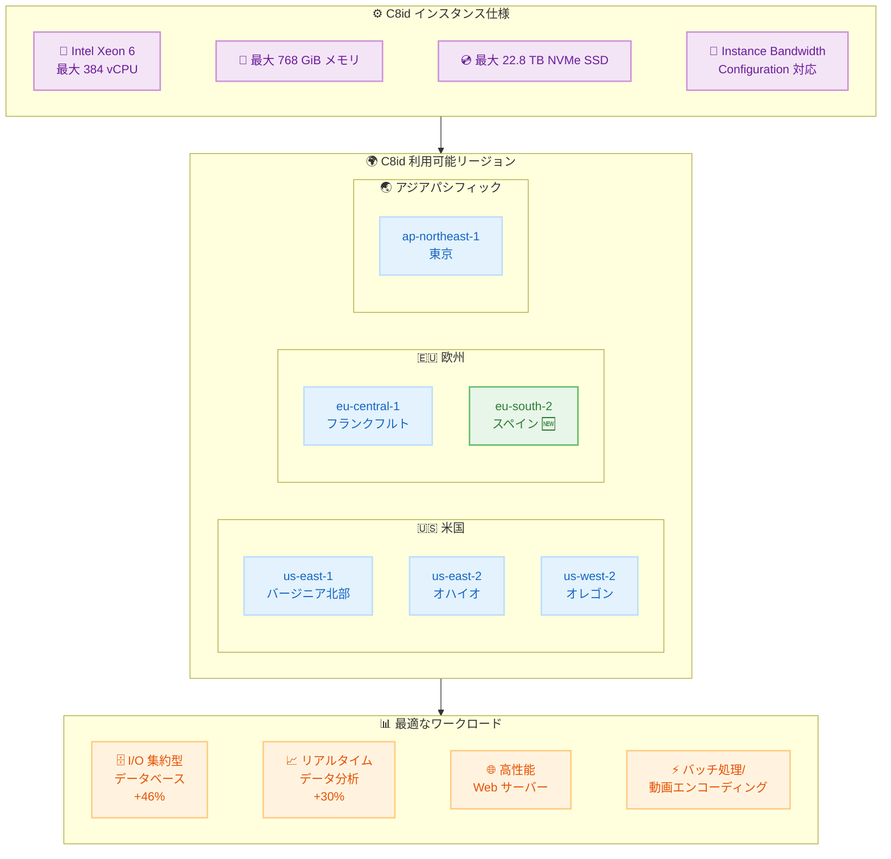

# Amazon EC2 - C8id インスタンスが欧州 (スペイン) リージョンで利用可能に

**リリース日**: 2026年03月11日
**サービス**: Amazon EC2
**機能**: C8id コンピューティング最適化インスタンス (NVMe SSD ストレージ搭載)

📊 [このアップデートのインフォグラフィックを見る](https://takech9203.github.io/aws-news-summary/20260311-amazon-ec2-c8id-instances-europe-spain.html)

## 概要

AWS は 2026 年 3 月 11 日、Amazon EC2 C8id インスタンスが欧州 (スペイン) リージョンで利用可能になったことを発表しました。C8id インスタンスは、AWS 専用のカスタム Intel Xeon 6 プロセッサーを搭載し、最大 384 vCPU、768 GiB のメモリ、22.8 TB の NVMe SSD ストレージを提供します。前世代の C6id インスタンスと比較して最大 43% 高いパフォーマンスと 3.3 倍のメモリ帯域幅を実現します。

C8id インスタンスは、I/O 集約的なデータベースワークロードで最大 46% 高いパフォーマンス、I/O 集約的なリアルタイムデータ分析で最大 30% 高速なクエリ結果を提供します。また、Instance Bandwidth Configuration をサポートしており、ネットワークと EBS 帯域幅間で 25% の柔軟な配分が可能で、ワークロードごとにリソースを最適に割り当てられます。

**アップデート前の課題**

- 欧州 (スペイン) リージョンでは C8id インスタンスが利用できず、NVMe SSD ストレージ搭載のコンピューティング最適化インスタンスとして前世代を利用する必要があった
- C6id インスタンスでは、I/O 集約的なワークロードのパフォーマンスが十分でない場合があった
- ネットワークと EBS 帯域幅の配分を柔軟に変更することができなかった

**アップデート後の改善**

- 欧州 (スペイン) リージョンで C8id インスタンスを利用でき、最新の Intel Xeon 6 プロセッサーと NVMe SSD ストレージの性能を活用できるようになった
- C6id と比較して最大 43% のパフォーマンス向上と 3.3 倍のメモリ帯域幅を利用できるようになった
- Instance Bandwidth Configuration により、ネットワークと EBS 帯域幅を 25% の柔軟性で最適配分できるようになった

## アーキテクチャ図



C8id インスタンスの主要仕様、利用可能なリージョン (欧州スペインが新規追加)、および最適なワークロードの関係を示しています。

## サービスアップデートの詳細

### 主要機能

1. **高性能コンピューティング**
   - カスタム Intel Xeon 6 プロセッサー搭載で最大 384 vCPU、768 GiB メモリを提供
   - C6id インスタンスと比較して最大 43% 高いパフォーマンスを実現
   - メモリ帯域幅が前世代比 3.3 倍に向上

2. **大容量 NVMe SSD ストレージ**
   - 最大 22.8 TB の NVMe SSD インスタンスストレージを提供
   - I/O 集約的なデータベースワークロードで最大 46% のパフォーマンス向上
   - リアルタイムデータ分析で最大 30% 高速なクエリ結果

3. **Instance Bandwidth Configuration**
   - ネットワークと EBS 帯域幅間で 25% の柔軟な配分が可能
   - ワークロードの特性に応じてリソースを最適に割り当て
   - ネットワーク集約型またはストレージ集約型のワークロードそれぞれに最適化可能

## 技術仕様

### C8id インスタンスの主要仕様

| 項目 | 詳細 |
|------|------|
| プロセッサー | カスタム Intel Xeon 6 (AWS 専用) |
| 最大 vCPU | 384 |
| 最大メモリ | 768 GiB |
| 最大 NVMe SSD | 22.8 TB |
| Instance Bandwidth Configuration | 対応 (25% 柔軟配分) |

### パフォーマンス比較 (C8id vs C6id)

| 指標 | 改善率 |
|------|--------|
| 全体パフォーマンス | 最大 43% 向上 |
| メモリ帯域幅 | 3.3 倍 |
| I/O 集約型データベース | 最大 46% 向上 |
| リアルタイムデータ分析クエリ | 最大 30% 高速化 |

### API 変更履歴

今回のアップデートに関連する API 変更は確認されませんでした。リージョン拡大に伴う変更であり、既存の EC2 API で C8id インスタンスタイプを指定して利用できます。

## 設定方法

### 前提条件

1. AWS アカウントと適切な IAM 権限
2. 欧州 (スペイン) リージョン (eu-south-2) へのアクセス
3. 必要な VPC およびサブネット設定

### 手順

#### ステップ1: 利用可能なインスタンスタイプを確認

```bash
# 欧州 (スペイン) リージョンで利用可能な C8id インスタンスタイプを確認
aws ec2 describe-instance-types \
  --filters "Name=instance-type,Values=c8id*" \
  --region eu-south-2 \
  --query "InstanceTypes[].{Type:InstanceType,vCPU:VCpuInfo.DefaultVCpus,Memory:MemoryInfo.SizeInMiB}" \
  --output table
```

欧州 (スペイン) リージョンで利用可能な C8id インスタンスタイプとスペックの一覧を表示します。

#### ステップ2: C8id インスタンスを起動

```bash
# C8id インスタンスを欧州 (スペイン) リージョンで起動
aws ec2 run-instances \
  --image-id ami-xxxxxxxxxxxxxxxxx \
  --instance-type c8id.8xlarge \
  --region eu-south-2 \
  --subnet-id subnet-xxxxxxxxxxxxxxxxx \
  --security-group-ids sg-xxxxxxxxxxxxxxxxx \
  --key-name my-key-pair
```

欧州 (スペイン) リージョン (eu-south-2) で C8id.8xlarge インスタンスを起動します。AMI ID はリージョンに応じて適切なものを指定してください。

#### ステップ3: Instance Bandwidth Configuration の活用

Instance Bandwidth Configuration を使用して、ネットワークと EBS 帯域幅の配分を調整できます。ワークロードの特性に応じて、ネットワーク帯域幅を増やすか、EBS 帯域幅を増やすかを選択します。

## メリット

### ビジネス面

- **欧州でのレイテンシー削減**: スペインリージョンでの提供により、南欧のユーザーに低レイテンシーでサービスを提供可能
- **コスト効率の向上**: 前世代比最大 43% のパフォーマンス向上により、同じワークロードをより少ないインスタンスで処理可能
- **データレジデンシー対応**: EU 内のリージョン拡大により、欧州のデータ保護規制 (GDPR 等) への準拠が容易に

### 技術面

- **I/O パフォーマンスの大幅向上**: NVMe SSD 搭載によりデータベースワークロードで最大 46% のパフォーマンス向上
- **柔軟な帯域幅配分**: Instance Bandwidth Configuration により、ワークロードに最適なネットワーク/EBS 帯域幅バランスを実現
- **大容量ローカルストレージ**: 最大 22.8 TB の NVMe SSD により、一時データの高速処理が可能
- **高メモリ帯域幅**: 前世代比 3.3 倍のメモリ帯域幅により、メモリ集約的な処理が高速化

## デメリット・制約事項

### 制限事項

- NVMe SSD インスタンスストレージはエフェメラル (一時的) であり、インスタンス停止時にデータが消失する
- すべてのリージョンで利用可能ではない (現在 6 リージョン)
- 大規模インスタンスタイプはオンデマンド料金が高額になる可能性がある

### 考慮すべき点

- インスタンスストレージのデータは永続化されないため、重要なデータは EBS または S3 に保存する必要がある
- 既存の C6id インスタンスからの移行時には、アプリケーションの互換性テストを実施することを推奨
- Instance Bandwidth Configuration の最適な設定は、ワークロードの特性に応じてベンチマークで確認すべき

## ユースケース

### ユースケース1: I/O 集約型データベース

**シナリオ**: 欧州の E コマース企業が、スペインリージョンで高速なトランザクション処理を必要とするデータベースを運用したい

**実装例**:
```bash
# C8id インスタンスでデータベースサーバーを起動
aws ec2 run-instances \
  --image-id ami-xxxxxxxxxxxxxxxxx \
  --instance-type c8id.16xlarge \
  --region eu-south-2 \
  --block-device-mappings file://db-storage-config.json
```

**効果**: I/O 集約型データベースワークロードで C6id 比最大 46% のパフォーマンス向上を実現し、トランザクション処理のスループットが大幅に改善

### ユースケース2: リアルタイムデータ分析

**シナリオ**: フィンテック企業が、欧州市場のリアルタイム取引データを分析して即座にインサイトを提供したい

**実装例**:
```bash
# C8id インスタンスでリアルタイム分析クラスターを構成
aws ec2 run-instances \
  --image-id ami-xxxxxxxxxxxxxxxxx \
  --instance-type c8id.24xlarge \
  --region eu-south-2 \
  --count 3
```

**効果**: リアルタイムデータ分析で最大 30% 高速なクエリ結果を実現し、NVMe SSD ストレージによる高速な一時データ処理で分析パイプラインを加速

### ユースケース3: 動画エンコーディングとバッチ処理

**シナリオ**: メディア企業が、欧州向けのコンテンツを大量にエンコードし、低レイテンシーで配信したい

**実装例**:
```bash
# C8id インスタンスで動画エンコーディングジョブを実行
aws ec2 run-instances \
  --image-id ami-xxxxxxxxxxxxxxxxx \
  --instance-type c8id.metal-48xl \
  --region eu-south-2 \
  --iam-instance-profile Name=MediaEncoding-Role
```

**効果**: 最大 384 vCPU と 22.8 TB の NVMe SSD により大量の動画ファイルを高速にエンコードし、スペインリージョンからの配信で南欧ユーザーへのレイテンシーを削減

## 料金

C8id インスタンスの料金は、選択したインスタンスタイプ、リージョン、購入オプションによって異なります。オンデマンド、Savings Plans、スポットインスタンスの各購入オプションで利用可能です。詳細な料金については、[Amazon EC2 料金ページ](https://aws.amazon.com/ec2/pricing/) をご確認ください。

## 利用可能リージョン

C8id インスタンスは以下のリージョンで利用可能です。

**新規対応リージョン (2026年3月11日)**:
- 欧州 (スペイン) - eu-south-2

**既存対応リージョン**:
- 米国東部 (バージニア北部) - us-east-1
- 米国東部 (オハイオ) - us-east-2
- 米国西部 (オレゴン) - us-west-2
- 欧州 (フランクフルト) - eu-central-1
- アジアパシフィック (東京) - ap-northeast-1

## 関連サービス・機能

- **Amazon EBS**: C8id インスタンスと組み合わせて永続ストレージを提供。Instance Bandwidth Configuration で EBS 帯域幅を最適化可能
- **Amazon EC2 Auto Scaling**: C8id インスタンスを使用してワークロードに応じた自動スケーリングを実現
- **AWS Nitro System**: C8id インスタンスの基盤技術として、セキュリティとパフォーマンスを最適化
- **Elastic Load Balancing**: 複数の C8id インスタンス間でトラフィックを分散

## 参考リンク

- 📊 [インフォグラフィック](https://takech9203.github.io/aws-news-summary/20260311-amazon-ec2-c8id-instances-europe-spain.html)
- [公式発表 (What's New)](https://aws.amazon.com/about-aws/whats-new/2026/03/amazon-ec2-c8id-instances-europe-spain/)
- [C8id インスタンス製品ページ](https://aws.amazon.com/ec2/instance-types/c8id/)
- [Amazon EC2 料金ページ](https://aws.amazon.com/ec2/pricing/)
- [Amazon EC2 ドキュメント](https://docs.aws.amazon.com/ec2/)

## まとめ

Amazon EC2 C8id インスタンスが欧州 (スペイン) リージョンで利用可能になったことにより、南欧のユーザーに対してカスタム Intel Xeon 6 プロセッサーと NVMe SSD ストレージによる高性能コンピューティングを低レイテンシーで提供できるようになりました。C6id と比較して最大 43% のパフォーマンス向上、I/O 集約型データベースで最大 46% の改善、Instance Bandwidth Configuration による柔軟な帯域幅配分など、特にストレージ I/O を必要とするワークロードに大きな価値をもたらします。欧州でデータベースやリアルタイム分析ワークロードを運用している場合は、C8id インスタンスへの移行を検討してください。
