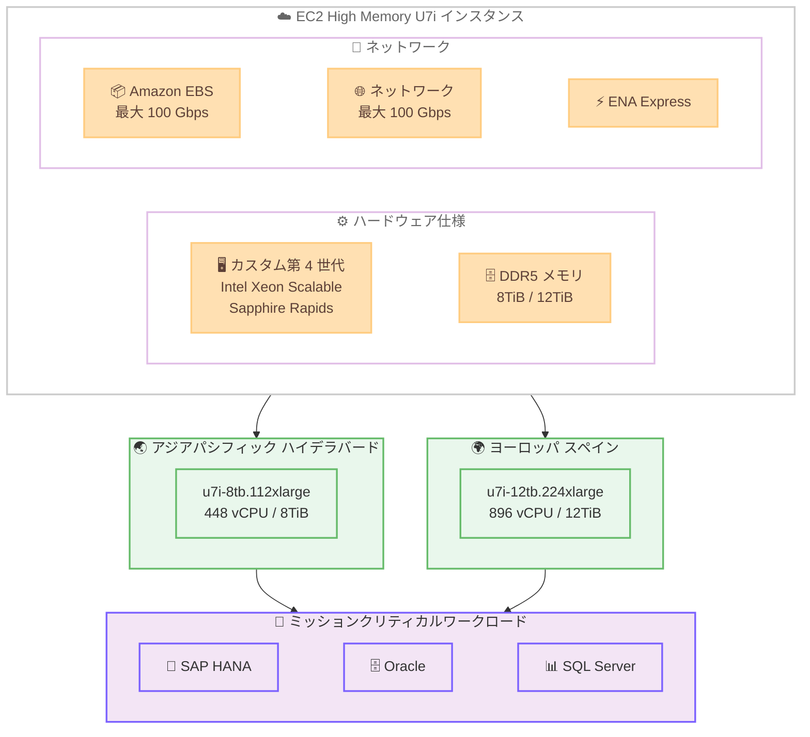

# Amazon EC2 - High Memory U7i インスタンスのリージョン拡大

**リリース日**: 2026年03月11日
**サービス**: Amazon EC2
**機能**: High Memory U7i インスタンス (u7i-8tb.112xlarge, u7i-12tb.224xlarge) のリージョン拡大

📊 [このアップデートのインフォグラフィックを見る](https://takech9203.github.io/aws-news-summary/20260311-amazon-ec2-high-memory-u7i-instances.html)

## 概要

Amazon EC2 High Memory U7i インスタンスが新たなリージョンで利用可能になりました。8TB メモリを搭載した u7i-8tb.112xlarge インスタンスがアジアパシフィック (ハイデラバード) リージョンで、12TB メモリを搭載した u7i-12tb.224xlarge インスタンスがヨーロッパ (スペイン) リージョンで提供開始されています。

U7i インスタンスは AWS 第 7 世代のインスタンスファミリーに属し、カスタム第 4 世代 Intel Xeon Scalable Processors (Sapphire Rapids) を搭載しています。DDR5 メモリテクノロジーを採用し、最大 100 Gbps の Amazon EBS 帯域幅と 100 Gbps のネットワーク帯域幅、ENA Express をサポートします。SAP HANA、Oracle、SQL Server などのミッションクリティカルなインメモリデータベースに最適なインスタンスです。

今回のリージョン拡大により、アジアパシフィックおよびヨーロッパ地域のユーザーがデータレジデンシー要件を満たしつつ、大容量メモリインスタンスを活用できるようになります。

**アップデート前の課題**

- アジアパシフィック (ハイデラバード) リージョンで U7i-8tb インスタンスが利用できず、近隣リージョンを使用する必要があった
- ヨーロッパ (スペイン) リージョンで U7i-12tb インスタンスが利用できず、データレジデンシー要件を満たせない場合があった
- 利用可能リージョンが限られており、レイテンシの観点で最適な配置ができないケースがあった

**アップデート後の改善**

- アジアパシフィック (ハイデラバード) で u7i-8tb.112xlarge (8TiB メモリ、448 vCPU) が利用可能になった
- ヨーロッパ (スペイン) で u7i-12tb.224xlarge (12TiB メモリ、896 vCPU) が利用可能になった
- これらのリージョンでデータレジデンシー要件を満たしながらミッションクリティカルなインメモリワークロードを実行可能になった

## アーキテクチャ図



U7i High Memory インスタンスの仕様と新しく対応したリージョン、主要なワークロードの関係を示した図です。

## サービスアップデートの詳細

### 主要機能

1. **u7i-8tb.112xlarge インスタンス**
   - 8TiB の DDR5 メモリを搭載
   - 448 vCPU を提供
   - アジアパシフィック (ハイデラバード) リージョンで新たに利用可能
   - 最大 100 Gbps の EBS 帯域幅と 100 Gbps のネットワーク帯域幅をサポート

2. **u7i-12tb.224xlarge インスタンス**
   - 12TiB の DDR5 メモリを搭載
   - 896 vCPU を提供
   - ヨーロッパ (スペイン) リージョンで新たに利用可能
   - 最大 100 Gbps の EBS 帯域幅と 100 Gbps のネットワーク帯域幅をサポート

3. **カスタム第 4 世代 Intel Xeon Scalable Processors**
   - Sapphire Rapids アーキテクチャを採用
   - AWS 第 7 世代インスタンスファミリー
   - DDR5 メモリテクノロジーによる高速データアクセス
   - ENA Express によるネットワークパフォーマンスの向上

## 技術仕様

### インスタンスタイプ比較

| 項目 | u7i-8tb.112xlarge | u7i-12tb.224xlarge |
|------|-------------------|---------------------|
| メモリ | 8TiB DDR5 | 12TiB DDR5 |
| vCPU | 448 | 896 |
| EBS 帯域幅 | 最大 100 Gbps | 最大 100 Gbps |
| ネットワーク帯域幅 | 最大 100 Gbps | 最大 100 Gbps |
| ENA Express | サポート | サポート |
| プロセッサ | カスタム第 4 世代 Intel Xeon Scalable | カスタム第 4 世代 Intel Xeon Scalable |
| 新規対応リージョン | ap-south-2 | eu-south-2 |

### 対応ワークロード

| ワークロード | 説明 |
|-------------|------|
| SAP HANA | ミッションクリティカルなインメモリデータベース |
| Oracle Database | 大規模トランザクション処理 |
| SQL Server | エンタープライズデータベースワークロード |
| インメモリキャッシュ | 大規模キャッシュレイヤー |

## 設定方法

### 前提条件

1. AWS アカウントが有効化されている
2. 対象リージョン (ap-south-2 または eu-south-2) でサービスクォータが適切に設定されている
3. High Memory インスタンスの起動に必要な IAM 権限が設定されている

### 手順

#### ステップ1: サービスクォータの確認

```bash
# High Memory インスタンスのサービスクォータを確認
aws service-quotas get-service-quota \
  --service-code ec2 \
  --quota-code L-43DA4232 \
  --region ap-south-2
```

U7i インスタンスの起動には十分な vCPU クォータが必要です。デフォルトのクォータでは不足する場合があるため、事前に確認し、必要に応じてクォータ引き上げをリクエストしてください。

#### ステップ2: U7i インスタンスの起動

```bash
# u7i-8tb.112xlarge インスタンスをアジアパシフィック (ハイデラバード) で起動
aws ec2 run-instances \
  --instance-type u7i-8tb.112xlarge \
  --image-id ami-xxxxxxxxx \
  --subnet-id subnet-xxxxxxxxx \
  --security-group-ids sg-xxxxxxxxx \
  --key-name my-key-pair \
  --region ap-south-2
```

このコマンドは、アジアパシフィック (ハイデラバード) リージョンで U7i-8tb インスタンスを起動します。AMI ID はリージョンに対応したものを指定してください。

#### ステップ3: EBS ボリュームの最適化

```bash
# 高スループット EBS ボリュームをアタッチ
aws ec2 create-volume \
  --volume-type io2 \
  --size 5000 \
  --iops 64000 \
  --throughput 4000 \
  --availability-zone ap-south-2a \
  --region ap-south-2
```

U7i インスタンスは最大 100 Gbps の EBS 帯域幅をサポートしているため、高性能な EBS ボリュームを使用することでデータの読み込みとバックアップを高速化できます。

## メリット

### ビジネス面

- **データレジデンシーの遵守**: インドおよびスペインにおけるデータレジデンシー要件を満たしながら、大容量メモリインスタンスを利用可能
- **レイテンシの削減**: ユーザーに近いリージョンでインメモリデータベースを実行することで、アプリケーション応答時間を改善
- **ビジネス継続性の向上**: リージョン選択肢が増えることで、災害復旧戦略の柔軟性が向上

### 技術面

- **大容量メモリ**: 8TiB または 12TiB の DDR5 メモリにより、大規模インメモリデータベースを単一インスタンスで実行可能
- **高帯域幅ネットワーク**: 最大 100 Gbps のネットワーク帯域幅と EBS 帯域幅により、高速なデータ転送を実現
- **スケーラブルなトランザクション処理**: 急成長するデータ環境でトランザクション処理スループットをスケール可能

## デメリット・制約事項

### 制限事項

- 今回追加されたのは特定のインスタンスタイプのみ (8tb は ap-south-2、12tb は eu-south-2)
- High Memory インスタンスはオンデマンドまたは専用ホストでの起動が必要で、スポットインスタンスでは利用できない場合がある
- デフォルトのサービスクォータでは vCPU 数が不足する可能性が高く、クォータ引き上げリクエストが必要

### 考慮すべき点

- 非常に大きなインスタンスサイズのため、オンデマンド料金が高額になる可能性がある
- メモリ集約型ワークロード以外では、コストパフォーマンスが最適でない場合がある
- インスタンスの起動に時間がかかる場合があるため、キャパシティの事前予約を検討すべき

## ユースケース

### ユースケース1: インドでの SAP HANA 運用

**シナリオ**: インドに拠点を持つ企業が、データレジデンシー要件を満たしながら SAP HANA を大規模に運用したい。

**実装例**:
```bash
# ハイデラバードリージョンで SAP HANA 用 U7i インスタンスを起動
aws ec2 run-instances \
  --instance-type u7i-8tb.112xlarge \
  --image-id ami-sap-hana-ap-south-2 \
  --subnet-id subnet-xxxxxxxxx \
  --security-group-ids sg-xxxxxxxxx \
  --key-name my-key-pair \
  --region ap-south-2 \
  --placement Tenancy=dedicated
```

**効果**: インドのデータレジデンシー要件を遵守しつつ、8TiB メモリの SAP HANA 環境を構築できます。ユーザーに近いリージョンでの運用により、レイテンシも改善されます。

### ユースケース2: ヨーロッパでの大規模 Oracle Database

**シナリオ**: スペインの顧客データを扱うヨーロッパ企業が、12TiB のメモリを活用して大規模な Oracle Database のインメモリ処理を行いたい。

**実装例**:
```bash
# スペインリージョンで Oracle 用 U7i インスタンスを起動
aws ec2 run-instances \
  --instance-type u7i-12tb.224xlarge \
  --image-id ami-oracle-eu-south-2 \
  --subnet-id subnet-xxxxxxxxx \
  --security-group-ids sg-xxxxxxxxx \
  --key-name my-key-pair \
  --region eu-south-2 \
  --placement Tenancy=dedicated
```

**効果**: 12TiB の DDR5 メモリと 896 vCPU により、大規模なトランザクション処理と分析クエリを高速に実行できます。GDPR に準拠したデータ管理が可能です。

### ユースケース3: 災害復旧サイトの構築

**シナリオ**: 既存の U7i インスタンスを別リージョンで運用しており、新しいリージョンを災害復旧サイトとして活用したい。

**実装例**:
```bash
# プライマリリージョンのスナップショットを新リージョンにコピー
aws ec2 copy-snapshot \
  --source-region eu-west-1 \
  --source-snapshot-id snap-xxxxxxxxx \
  --destination-region eu-south-2 \
  --description "DR copy for SAP HANA"
```

**効果**: リージョン選択肢が増えたことで、より柔軟な災害復旧戦略を構築でき、RTO/RPO 要件を満たしやすくなります。

## 料金

U7i High Memory インスタンスの料金はリージョンにより異なります。オンデマンド、Savings Plans、Reserved Instances で購入可能です。

### 料金例

| インスタンスタイプ | リージョン | 料金体系 |
|-------------------|-----------|---------|
| u7i-8tb.112xlarge | ap-south-2 | オンデマンド、Savings Plans |
| u7i-12tb.224xlarge | eu-south-2 | オンデマンド、Savings Plans |

*最新の料金については [Amazon EC2 料金ページ](https://aws.amazon.com/ec2/pricing/) を参照してください。High Memory インスタンスは高額なため、Savings Plans の活用を推奨します。

## 利用可能リージョン

今回新たに追加されたリージョンは以下の通りです。

| インスタンスタイプ | 新規追加リージョン |
|-------------------|-------------------|
| u7i-8tb.112xlarge | アジアパシフィック (ハイデラバード) - ap-south-2 |
| u7i-12tb.224xlarge | ヨーロッパ (スペイン) - eu-south-2 |

既存の利用可能リージョンと合わせて、U7i インスタンスの提供リージョンが拡大しています。

## 関連サービス・機能

- **Amazon EBS**: U7i インスタンスは最大 100 Gbps の EBS 帯域幅をサポートし、高速なデータ読み込みとバックアップを実現
- **Amazon EC2 X8i インスタンス**: メモリ最適化インスタンスの次世代モデル。最大 6TB メモリで、より幅広いサイズバリエーションを提供
- **AWS Nitro System**: U7i インスタンスの基盤となるハードウェア仮想化プラットフォームで、高いセキュリティとパフォーマンスを提供
- **ENA Express**: ネットワークパフォーマンスを向上させる機能で、U7i インスタンスで標準サポート

## 参考リンク

- 📊 [インフォグラフィック](https://takech9203.github.io/aws-news-summary/20260311-amazon-ec2-high-memory-u7i-instances.html)
- [公式発表 (What's New)](https://aws.amazon.com/about-aws/whats-new/2026/03/amazon-ec2-high-memory-u7i-instances/)
- [EC2 High Memory インスタンス](https://aws.amazon.com/ec2/instance-types/high-memory/)
- [Amazon EC2 料金](https://aws.amazon.com/ec2/pricing/)

## まとめ

Amazon EC2 High Memory U7i インスタンスがアジアパシフィック (ハイデラバード) とヨーロッパ (スペイン) で利用可能になり、これらのリージョンでデータレジデンシー要件を満たしながら大規模インメモリデータベースを運用できるようになりました。SAP HANA、Oracle、SQL Server などのミッションクリティカルなワークロードを、8TiB または 12TiB の DDR5 メモリと最大 100 Gbps の帯域幅を活用してこれらのリージョンで展開することを検討してください。
