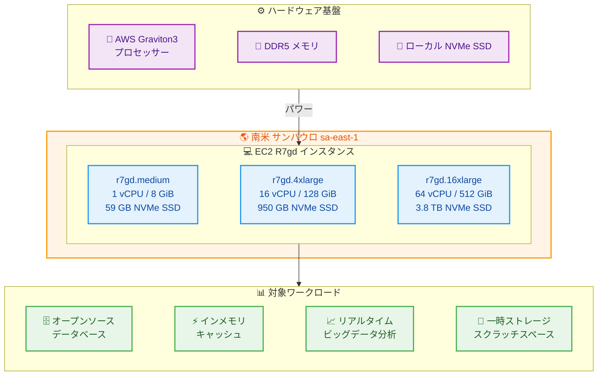

# Amazon EC2 - R7gd インスタンスが南米 (サンパウロ) リージョンで利用可能に

**リリース日**: 2026年03月11日
**サービス**: Amazon EC2
**機能**: R7gd メモリ最適化インスタンス (ローカル NVMe SSD ストレージ付き)

## 概要

AWS は 2026 年 3 月 11 日、Amazon EC2 R7gd インスタンスが南米 (サンパウロ) リージョンで利用可能になったことを発表しました。R7gd インスタンスは、AWS Graviton3 プロセッサーを搭載し、DDR5 メモリと最大 3.8 TB のローカル NVMe ベース SSD ブロックレベルストレージを提供するメモリ最適化インスタンスです。

R7gd インスタンスは、AWS Nitro System 上に構築されており、オープンソースデータベース、インメモリキャッシュ、リアルタイムビッグデータ分析などのメモリ集約的ワークロードに最適です。また、スクラッチスペース、一時ファイル、キャッシュなど、高速かつ低レイテンシーのローカルストレージへのアクセスが必要なアプリケーションにも適しています。

**アップデート前の課題**

- 南米 (サンパウロ) リージョンでは R7gd インスタンスが利用できず、Graviton3 プロセッサーとローカル NVMe SSD ストレージを組み合わせたメモリ最適化インスタンスを活用できなかった
- 南米リージョンのユーザーは、ローカル SSD ストレージ付きメモリ最適化インスタンスとして旧世代のインスタンスに依存する必要があった
- 南米リージョンでメモリ集約的ワークロードを実行する場合、最新世代の Graviton プロセッサーによる価格パフォーマンスの向上を享受できなかった

**アップデート後の改善**

- 南米 (サンパウロ) リージョンで R7gd インスタンスを利用でき、Graviton3 プロセッサーの性能とローカル NVMe SSD ストレージを活用できるようになった
- Graviton2 ベースのインスタンスと比較して最大 25% 優れたコンピューティングパフォーマンスと、最大 45% 優れたリアルタイム NVMe ストレージパフォーマンスを南米リージョンで実現できるようになった
- DDR5 メモリにより、DDR4 と比較して 50% 高いメモリ帯域幅を南米リージョンのワークロードで活用できるようになった

## アーキテクチャ図



この図は、南米 (サンパウロ) リージョンで新たに利用可能になった R7gd インスタンスのサイズバリエーション、ハードウェア基盤、および対象ワークロードの関係を示しています。

## サービスアップデートの詳細

### 主要機能

1. **AWS Graviton3 プロセッサー搭載**
   - Arm ベースの AWS 独自設計プロセッサー
   - Graviton2 と比較して最大 25% 優れたコンピューティングパフォーマンス
   - 最大 2 倍の浮動小数点パフォーマンス
   - 最大 2 倍の暗号化ワークロードパフォーマンス
   - ML ワークロードで Graviton2 比最大 3 倍のパフォーマンス (bfloat16 サポート)

2. **ローカル NVMe SSD ストレージ**
   - 最大 3.8 TB (2 x 1900 GB) のローカル NVMe ベース SSD ブロックレベルストレージ
   - Graviton2 ベースのインスタンスと比較して最大 45% 優れたリアルタイム NVMe ストレージパフォーマンス
   - 高速かつ低レイテンシーのローカルストレージアクセス

3. **DDR5 メモリと AWS Nitro System**
   - DDR5 メモリにより DDR4 と比較して 50% 高いメモリ帯域幅
   - AWS Nitro System 上に構築され、高い仮想化効率とセキュリティを実現
   - 16xlarge および metal サイズで Elastic Fabric Adapter (EFA) をサポート

## 技術仕様

### R7gd インスタンスサイズ一覧

| インスタンスサイズ | vCPU | メモリ (GiB) | ローカルストレージ | ネットワーク帯域幅 (Gbps) | EBS 帯域幅 (Gbps) |
|-------------------|------|-------------|-------------------|------------------------|-------------------|
| r7gd.medium | 1 | 8 | 1 x 59 GB NVMe SSD | 最大 12.5 | 最大 10 |
| r7gd.large | 2 | 16 | 1 x 118 GB NVMe SSD | 最大 12.5 | 最大 10 |
| r7gd.xlarge | 4 | 32 | 1 x 237 GB NVMe SSD | 最大 12.5 | 最大 10 |
| r7gd.2xlarge | 8 | 64 | 1 x 474 GB NVMe SSD | 最大 15 | 最大 10 |
| r7gd.4xlarge | 16 | 128 | 1 x 950 GB NVMe SSD | 最大 15 | 最大 10 |
| r7gd.8xlarge | 32 | 256 | 1 x 1900 GB NVMe SSD | 15 | 10 |
| r7gd.12xlarge | 48 | 384 | 2 x 1425 GB NVMe SSD | 22.5 | 15 |
| r7gd.16xlarge | 64 | 512 | 2 x 1900 GB NVMe SSD | 30 | 20 |
| r7gd.metal | 64 | 512 | 2 x 1900 GB NVMe SSD | 30 | 20 |

## 設定方法

### 前提条件

1. AWS アカウントと適切な IAM 権限
2. 南米 (サンパウロ) リージョン (sa-east-1) へのアクセス
3. Arm (Graviton) アーキテクチャ対応の AMI

### 手順

#### ステップ 1: 利用可能な R7gd インスタンスタイプを確認

```bash
# sa-east-1 リージョンで利用可能な R7gd インスタンスタイプを確認
aws ec2 describe-instance-types \
  --filters "Name=instance-type,Values=r7gd.*" \
  --region sa-east-1 \
  --query "InstanceTypes[].{Type:InstanceType,vCPU:VCpuInfo.DefaultVCpus,Memory:MemoryInfo.SizeInMiB,Storage:InstanceStorageInfo.TotalSizeInGB}" \
  --output table
```

このコマンドは、サンパウロリージョンで利用可能な R7gd インスタンスタイプとそのスペックを表示します。

#### ステップ 2: Graviton 対応 AMI を選択

```bash
# Amazon Linux 2023 の Arm64 AMI を検索
aws ec2 describe-images \
  --owners amazon \
  --filters "Name=name,Values=al2023-ami-2023*-arm64" \
             "Name=state,Values=available" \
  --region sa-east-1 \
  --query "Images | sort_by(@, &CreationDate) | [-1].{ImageId:ImageId,Name:Name}" \
  --output table
```

このコマンドは、サンパウロリージョンで利用可能な最新の Amazon Linux 2023 Arm64 AMI を検索します。Graviton プロセッサーは Arm アーキテクチャのため、Arm64 対応の AMI を選択する必要があります。

#### ステップ 3: R7gd インスタンスを起動

```bash
# R7gd インスタンスを起動
aws ec2 run-instances \
  --image-id ami-xxxxxxxxxxxxxxxxx \
  --instance-type r7gd.2xlarge \
  --region sa-east-1 \
  --subnet-id subnet-xxxxxxxxxxxxxxxxx \
  --security-group-ids sg-xxxxxxxxxxxxxxxxx \
  --key-name my-key-pair
```

このコマンドは、サンパウロリージョンで r7gd.2xlarge インスタンスを起動します。ローカル NVMe SSD ストレージは自動的にアタッチされますが、使用前にフォーマットとマウントが必要です。

## メリット

### ビジネス面

- **コスト効率の向上**: Graviton3 プロセッサーにより、x86 ベースのインスタンスと比較して優れた価格パフォーマンスを提供し、メモリ集約的ワークロードのコストを削減
- **南米リージョンでのレイテンシー最適化**: 南米のエンドユーザーに近い場所でワークロードを実行することで、アプリケーションの応答時間を短縮
- **データレジデンシー要件への対応**: ブラジルの LGPD などのデータ保護規制に準拠するため、南米リージョンでデータを保持しながら最新のインスタンスタイプを活用可能

### 技術面

- **高速ローカルストレージ**: NVMe SSD による低レイテンシーのローカルストレージアクセスにより、一時データ処理やキャッシュのパフォーマンスが向上
- **メモリ帯域幅の向上**: DDR5 メモリにより DDR4 と比較して 50% 高い帯域幅を実現し、メモリ集約的アプリケーションのスループットが向上
- **ストレージパフォーマンス**: Graviton2 ベースのインスタンスと比較して最大 45% 優れたリアルタイム NVMe ストレージパフォーマンス
- **EFA サポート**: 16xlarge および metal サイズで Elastic Fabric Adapter をサポートし、高性能コンピューティングやノード間通信を最適化

## デメリット・制約事項

### 制限事項

- ローカル NVMe SSD ストレージのデータはインスタンスの停止・終了時に消失するため、永続データの保存には適さない
- Arm (Graviton) アーキテクチャ対応のソフトウェアおよび AMI が必要であり、x86 専用のアプリケーションはそのままでは動作しない
- すべてのリージョンで利用可能ではなく、対応リージョンは順次拡大中

### 考慮すべき点

- ローカルストレージは一時データ向けのため、重要なデータは Amazon EBS または Amazon S3 に別途保存する設計が必要
- 既存の x86 ベースのワークロードから移行する場合、Arm アーキテクチャへの互換性テストとパフォーマンス検証を実施することを推奨
- ローカルストレージの容量はインスタンスサイズに固定されており、EBS のように柔軟にサイズ変更できない

## ユースケース

### ユースケース 1: オープンソースデータベースのキャッシュ層

**シナリオ**: 南米向け E コマースプラットフォームが、Redis や Memcached を使用してデータベースクエリの結果をキャッシュし、応答時間を短縮したい

**実装例**:
```bash
# Redis サーバー用の R7gd インスタンスを起動
aws ec2 run-instances \
  --image-id ami-xxxxxxxxxxxxxxxxx \
  --instance-type r7gd.4xlarge \
  --region sa-east-1 \
  --user-data file://redis-setup.sh
```

**効果**: 128 GiB のメモリと 950 GB のローカル NVMe SSD を活用し、大量のキャッシュデータを低レイテンシーで処理可能。DDR5 メモリによる高帯域幅により、キャッシュヒット率の向上とレスポンス時間の短縮を実現

### ユースケース 2: リアルタイムビッグデータ分析

**シナリオ**: 金融テクノロジー企業が、南米市場のトランザクションデータをリアルタイムで分析し、不正検知を行いたい

**実装例**:
```bash
# Apache Spark ワーカーノード用の R7gd インスタンスを起動
aws ec2 run-instances \
  --image-id ami-xxxxxxxxxxxxxxxxx \
  --instance-type r7gd.8xlarge \
  --region sa-east-1 \
  --count 3 \
  --user-data file://spark-worker-setup.sh
```

**効果**: 256 GiB のメモリと 1.9 TB のローカル NVMe SSD を各ノードで活用し、シャッフルデータやスピルオーバーデータをローカルストレージに高速に書き込むことで、分析パイプラインのスループットを向上

### ユースケース 3: 一時データ処理パイプライン

**シナリオ**: メディア企業が、動画トランスコーディングの一時ファイルを高速に処理したい

**実装例**:
```bash
# トランスコーディング用の R7gd インスタンスを起動
aws ec2 run-instances \
  --image-id ami-xxxxxxxxxxxxxxxxx \
  --instance-type r7gd.12xlarge \
  --region sa-east-1 \
  --user-data file://transcode-setup.sh
```

**効果**: 384 GiB のメモリと 2.85 TB (2 x 1425 GB) のローカル NVMe SSD により、大容量の一時ファイルを高速に読み書きでき、トランスコーディング処理の所要時間を大幅に短縮

## 料金

R7gd インスタンスの料金は、選択したインスタンスサイズ、リージョン、購入オプションによって異なります。Graviton ベースのインスタンスは、同等の x86 ベースのインスタンスと比較して一般的にコスト効率が高くなっています。詳細な料金については、[Amazon EC2 料金ページ](https://aws.amazon.com/ec2/pricing/)をご確認ください。

購入オプション:

- **オンデマンドインスタンス**: 使用した分だけ支払い
- **Savings Plans**: 1 年または 3 年のコミットメントで割引
- **スポットインスタンス**: 未使用の EC2 容量を大幅な割引で利用
- **リザーブドインスタンス**: 1 年または 3 年のコミットメントで割引

## 利用可能リージョン

今回のアップデートにより、R7gd インスタンスは南米 (サンパウロ) リージョン (sa-east-1) で新たに利用可能になりました。

その他の対応リージョンについては、[Amazon EC2 インスタンスタイプページ](https://aws.amazon.com/ec2/instance-types/r7g/)をご確認ください。

## 関連サービス・機能

- **Amazon EC2 R7g**: R7gd と同じ Graviton3 プロセッサーを搭載するが、ローカルストレージなし (EBS のみ) のメモリ最適化インスタンス
- **Amazon EBS**: R7gd のローカル NVMe SSD と併用して永続データを保存するブロックストレージサービス
- **Amazon ElastiCache**: R7gd インスタンス上でセルフマネージドの Redis/Memcached を運用する代わりに利用可能なフルマネージドキャッシュサービス
- **AWS Graviton**: Arm ベースの AWS 独自設計プロセッサーファミリー。R7gd は Graviton3 を搭載

## 参考リンク

- [公式発表 (What's New)](https://aws.amazon.com/about-aws/whats-new/2026/03/amazon-ec2-r7gd-instances-available/)
- [Amazon EC2 R7g インスタンスタイプページ](https://aws.amazon.com/ec2/instance-types/r7g/)
- [Amazon EC2 料金ページ](https://aws.amazon.com/ec2/pricing/)
- [AWS Graviton プロセッサー](https://aws.amazon.com/ec2/graviton/)
- [Amazon EC2 ドキュメント](https://docs.aws.amazon.com/ec2/)

## まとめ

Amazon EC2 R7gd インスタンスが南米 (サンパウロ) リージョンで利用可能になったことにより、南米のユーザーは Graviton3 プロセッサーの優れた価格パフォーマンスと、最大 3.8 TB のローカル NVMe SSD ストレージを活用したメモリ集約的ワークロードを実行できるようになりました。オープンソースデータベース、インメモリキャッシュ、リアルタイムビッグデータ分析など、高速なローカルストレージアクセスが求められるワークロードを南米リージョンで運用しているユーザーは、R7gd インスタンスへの移行を検討してください。
