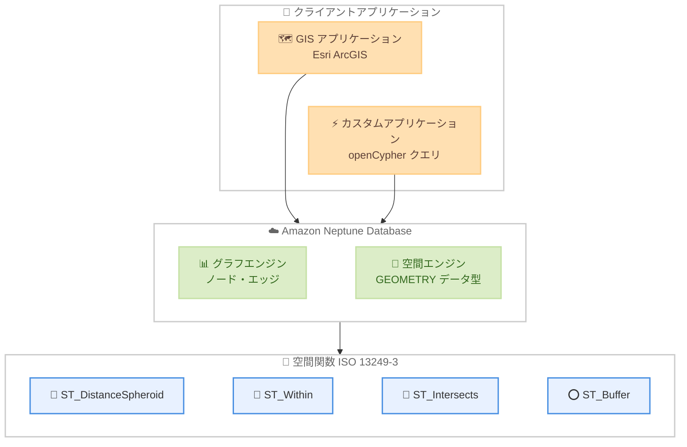

# Amazon Neptune Database - ネイティブ空間データサポート

**リリース日**: 2026 年 3 月 11 日
**サービス**: Amazon Neptune Database
**機能**: ネイティブ空間データサポート (Spatial Data Support)

## 概要

Amazon Neptune Database にネイティブな空間データ機能が追加された。グラフデータベースアプリケーションにおける位置情報を活用した分析ニーズの高まりに対応するもので、ISO 13249-3 標準に準拠した 11 の組み込み空間関数を提供する。GEOMETRY データ型をサポートし、Esri ArcGIS などの既存 GIS アプリケーションとシームレスに統合できる。

この機能により、グラフデータベースと空間データベースを別々に管理する必要がなくなる。近接分析、ネットワークインフラストラクチャにおける資産位置やルートの追跡、接続データの地理的パターン分析、ハルシネーションのない位置情報対応 AI アシスタントの構築が可能になる。openCypher クエリ言語との互換性も備えている。

**アップデート前の課題**

- グラフデータベースと空間データベースを別々に運用・管理する必要があった
- グラフデータに対して位置情報ベースのクエリを実行するには外部システムとの連携が必要だった
- 地理的な関係性とグラフの関係性を統合的に分析する手段が限られていた

**アップデート後の改善**

- Neptune Database 単体で空間データの格納とクエリが可能になり、別途空間データベースを管理する必要がなくなった
- ISO 13249-3 準拠の 11 の空間関数 (ST_DistanceSpheroid、ST_Within、ST_Intersects、ST_Buffer など) を openCypher クエリ内で直接使用できるようになった
- Esri ArcGIS などの GIS アプリケーションとシームレスに統合でき、既存のワークフローに組み込みやすくなった

## アーキテクチャ図



Amazon Neptune Database の空間データサポートのアーキテクチャを示す。GIS アプリケーションやカスタムアプリケーションから openCypher クエリを通じてグラフエンジンと空間エンジンの両方にアクセスし、ISO 13249-3 準拠の空間関数を利用できる。

## サービスアップデートの詳細

### 主要機能

1. **GEOMETRY データ型サポート**
   - ポイント、ライン、ポリゴンの空間データ型をネイティブにサポート
   - グラフデータと空間データを同一データベースで管理可能
   - 既存の GIS アプリケーションとの互換性を確保

2. **11 の組み込み空間関数**
   - ISO 13249-3 標準に準拠した空間関数を提供
   - ST_DistanceSpheroid: 球面上の 2 点間の距離計算
   - ST_Within: ジオメトリが別のジオメトリ内に含まれるかの判定
   - ST_Intersects: 2 つのジオメトリが交差するかの判定
   - ST_Buffer: ジオメトリの周囲にバッファゾーンを生成

3. **openCypher クエリ言語との統合**
   - 既存の openCypher クエリ内で空間関数を直接使用可能
   - グラフトラバーサルと空間クエリを組み合わせた複合分析が可能
   - 新たなクエリ言語の学習が不要

4. **GIS アプリケーション統合**
   - Esri ArcGIS とのシームレスな統合
   - 標準的な GIS ワークフローに Neptune を組み込み可能

## 技術仕様

### サポートされる空間関数

| 関数名 | 機能 |
|------|------|
| ST_DistanceSpheroid | 球面上の 2 点間距離を計算 |
| ST_Within | ジオメトリの包含関係を判定 |
| ST_Intersects | ジオメトリの交差を判定 |
| ST_Buffer | バッファゾーンの生成 |

### サポートされるデータ型

| 項目 | 詳細 |
|------|------|
| データ型 | GEOMETRY |
| サポート形状 | ポイント、ライン、ポリゴン |
| 準拠規格 | ISO 13249-3 |
| クエリ言語 | openCypher |

## 設定方法

### 前提条件

1. Amazon Neptune Database クラスターが作成済みであること
2. openCypher クエリエンドポイントにアクセス可能であること
3. 空間データを含むデータセットが準備されていること

### 手順

#### ステップ 1: 空間データを含むノードの作成

```cypher
CREATE (location:Place {
  name: 'Tokyo Tower',
  geom: point({longitude: 139.7454, latitude: 35.6586})
})
RETURN location
```

openCypher の `point()` 関数を使用して、経度・緯度情報を持つノードを作成する。

#### ステップ 2: 空間クエリの実行

```cypher
MATCH (a:Place), (b:Place)
WHERE a.name = 'Tokyo Tower' AND b.name = 'Skytree'
RETURN ST_DistanceSpheroid(a.geom, b.geom) AS distance_meters
```

ST_DistanceSpheroid 関数を使用して、2 つの地点間の球面距離をメートル単位で計算する。

#### ステップ 3: 範囲検索の実行

```cypher
MATCH (p:Place)
WHERE ST_Within(
  p.geom,
  ST_Buffer(point({longitude: 139.7671, latitude: 35.6812}), 5000)
)
RETURN p.name
```

ST_Buffer と ST_Within を組み合わせて、指定地点から 5,000 メートル以内にある全てのノードを検索する。

## メリット

### ビジネス面

- **運用コスト削減**: グラフデータベースと空間データベースを別々に運用する必要がなくなり、インフラストラクチャの管理コストが削減される
- **開発効率の向上**: 単一のクエリ言語で空間分析とグラフ分析を実行でき、アプリケーション開発が簡素化される
- **追加料金なし**: 空間データサポートは Neptune Database の利用料金に含まれており、追加コストが発生しない

### 技術面

- **標準準拠**: ISO 13249-3 準拠により、既存の GIS 知識やツールをそのまま活用可能
- **統合分析**: グラフの関係性と地理的な近接性を組み合わせた複合クエリが実現できる
- **GIS エコシステムとの互換性**: Esri ArcGIS などの業界標準ツールとシームレスに連携できる

## デメリット・制約事項

### 制限事項

- openCypher クエリ言語でのみ空間関数が利用可能 (Gremlin や SPARQL での対応状況は要確認)
- 提供される空間関数は 11 種類に限定されており、より高度な空間分析には外部ツールとの連携が必要な場合がある
- 3D 空間データや時系列空間データのサポートについては公式ドキュメントで確認が必要

### 考慮すべき点

- 既存の Neptune クラスターで空間機能を使用する場合のエンジンバージョン要件を確認する必要がある
- 大量の空間データを扱う場合のパフォーマンス特性については、事前にテストを推奨

## ユースケース

### ユースケース 1: 配送・物流ネットワークの最適化

**シナリオ**: 物流企業が配送拠点、配送先、ルート情報をグラフとして管理しつつ、地理的な近接性を考慮した配送ルートの最適化を行いたい。

**実装例**:
```cypher
MATCH (warehouse:Warehouse)-[:DELIVERS_TO]->(customer:Customer)
WHERE ST_DistanceSpheroid(warehouse.geom, customer.geom) < 50000
RETURN warehouse.name, customer.name,
       ST_DistanceSpheroid(warehouse.geom, customer.geom) AS distance
ORDER BY distance
```

**効果**: グラフの配送関係と地理的距離を組み合わせた分析により、配送効率を最大化し、コストを削減できる。

### ユースケース 2: 通信ネットワークの障害影響分析

**シナリオ**: 通信事業者がネットワーク機器の接続関係をグラフで管理し、特定エリアの障害が影響する範囲を空間的に特定したい。

**実装例**:
```cypher
MATCH (tower:CellTower)-[:CONNECTS*1..3]-(affected:CellTower)
WHERE ST_Within(
  tower.geom,
  ST_Buffer(point({longitude: 139.69, latitude: 35.69}), 10000)
)
RETURN affected.name, affected.geom
```

**効果**: ネットワークトポロジーと地理的範囲を統合的に分析し、障害の影響範囲を迅速に特定できる。

### ユースケース 3: 位置情報対応 AI アシスタント

**シナリオ**: 不動産企業が物件情報、周辺施設、交通アクセスをグラフで管理し、ユーザーの条件に基づいて位置情報を考慮した物件推薦を行いたい。

**実装例**:
```cypher
MATCH (p:Property)-[:NEAR]->(s:Station)
WHERE ST_DistanceSpheroid(p.geom, s.geom) < 1000
  AND p.price < 200000
RETURN p.name, p.price, s.name AS nearest_station,
       ST_DistanceSpheroid(p.geom, s.geom) AS distance_to_station
ORDER BY distance_to_station
```

**効果**: グラフの関係性データと空間データを活用し、ハルシネーションのない正確な位置情報に基づく推薦が可能になる。

## 料金

空間データサポートは Amazon Neptune Database の既存料金に含まれており、追加料金は発生しない。Neptune Database の標準的な料金体系 (インスタンス時間、ストレージ、I/O リクエスト) が適用される。

## 利用可能リージョン

Amazon Neptune Database が提供されている全てのリージョンで利用可能。

## 関連サービス・機能

- **Amazon Neptune Analytics**: グラフ分析に特化したサーバーレスサービス。Neptune Database と補完的な関係にある
- **Amazon Location Service**: 位置情報サービス。Neptune の空間データと組み合わせて高度な位置情報アプリケーションを構築可能
- **Esri ArcGIS**: Neptune の空間データサポートとシームレスに統合可能な GIS プラットフォーム

## 参考リンク

- [公式発表 (What's New)](https://aws.amazon.com/about-aws/whats-new/2026/03/amazon-neptune-database-spatial-data/)
- [Neptune Database ドキュメント](https://docs.aws.amazon.com/neptune/latest/userguide/intro.html)
- [Amazon Neptune 料金ページ](https://aws.amazon.com/neptune/pricing/)

## まとめ

Amazon Neptune Database のネイティブ空間データサポートは、グラフデータベースと空間データベースの統合という長年の課題を解決する重要なアップデートである。ISO 13249-3 準拠の 11 の空間関数を追加料金なしで利用でき、物流、通信、不動産など位置情報を活用する多くの業界で即座に活用可能である。既に Neptune Database を利用している場合は、空間データ機能の活用を検討し、別途管理している空間データベースの統合を検討することを推奨する。
