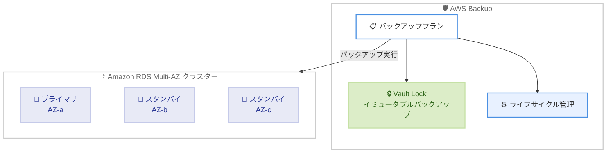

# AWS Backup - Amazon RDS Multi-AZ クラスターのサポートを 17 リージョンに拡大

**リリース日**: 2026年3月11日
**サービス**: AWS Backup
**機能**: Amazon RDS Multi-AZ クラスターのバックアップサポートのリージョン拡大

:bar_chart: [このアップデートのインフォグラフィックを見る](https://takech9203.github.io/aws-news-summary/20260311-aws-backup-expands-amazon-rds-multi-az-clusters-17-regions.html)

## 概要

AWS Backup が Amazon RDS Multi-AZ クラスターのバックアップサポートを新たに 17 の AWS リージョンに拡大した。これにより、より多くのリージョンで RDS Multi-AZ クラスターに対して AWS Backup の包括的なデータ保護機能を利用できるようになる。

RDS Multi-AZ クラスターは、1 つのプライマリ DB インスタンスと 2 つのリーダブルスタンバイ DB インスタンスを異なるアベイラビリティーゾーンに配置する構成で、高可用性と読み取りスケーラビリティを提供する。今回の拡大により、これらのクラスターに対する自動ライフサイクル管理や AWS Backup Vault Lock によるイミュータブルバックアップなどの機能が新しいリージョンで利用可能になった。

**アップデート前の課題**

- RDS Multi-AZ クラスターに対する AWS Backup のサポートが限られたリージョンでのみ利用可能だった
- 対象外リージョンではネイティブの RDS バックアップ機能のみに依存する必要があり、一元的なバックアップポリシー管理が困難だった
- グローバルに展開する組織では、リージョンごとに異なるバックアップ戦略を管理する必要があった

**アップデート後の改善**

- 17 の追加リージョンで AWS Backup による RDS Multi-AZ クラスターの一元的なバックアップ管理が可能になった
- 自動ライフサイクル管理やイミュータブルバックアップ (Vault Lock) を新しいリージョンで活用できるようになった
- 既存のバックアッププランに RDS Multi-AZ クラスターを追加するだけで保護を開始できる

## アーキテクチャ図



AWS Backup のバックアッププランから RDS Multi-AZ クラスターを保護する構成を示す。Vault Lock によるイミュータブルバックアップと自動ライフサイクル管理が利用可能である。

## サービスアップデートの詳細

### 主要機能

1. **17 リージョンへの拡大**
   - アジアパシフィック: ムンバイ、大阪、ソウル、香港、ジャカルタ、ハイデラバード、メルボルン、マレーシア
   - ヨーロッパ: ロンドン、パリ、ミラノ、チューリッヒ、スペイン
   - 南米: サンパウロ
   - アフリカ: ケープタウン
   - カナダ: セントラル、カナダウェスト (カルガリー)

2. **自動ライフサイクル管理**
   - バックアッププランによるスケジュール自動化
   - 保持期間に基づく自動削除
   - コールドストレージへの自動移行

3. **AWS Backup Vault Lock**
   - イミュータブルバックアップによるデータ保護
   - コンプライアンス要件への対応
   - ランサムウェア対策としてのバックアップ保護

## 技術仕様

### 対応リージョン一覧

| リージョン | リージョンコード |
|------|------|
| アジアパシフィック (ムンバイ) | ap-south-1 |
| アジアパシフィック (大阪) | ap-northeast-3 |
| アジアパシフィック (ソウル) | ap-northeast-2 |
| アジアパシフィック (香港) | ap-east-1 |
| アジアパシフィック (ジャカルタ) | ap-southeast-3 |
| アジアパシフィック (ハイデラバード) | ap-south-2 |
| アジアパシフィック (メルボルン) | ap-southeast-4 |
| アジアパシフィック (マレーシア) | ap-southeast-5 |
| ヨーロッパ (ロンドン) | eu-west-2 |
| ヨーロッパ (パリ) | eu-west-3 |
| ヨーロッパ (ミラノ) | eu-south-1 |
| ヨーロッパ (チューリッヒ) | eu-central-2 |
| ヨーロッパ (スペイン) | eu-south-2 |
| 南米 (サンパウロ) | sa-east-1 |
| アフリカ (ケープタウン) | af-south-1 |
| カナダ (セントラル) | ca-central-1 |
| カナダウェスト (カルガリー) | ca-west-1 |

## 設定方法

### 前提条件

1. 対象リージョンに RDS Multi-AZ クラスターが構築済みであること
2. AWS Backup サービスが有効化されていること
3. 適切な IAM 権限が設定されていること

### 手順

#### ステップ 1: バックアッププランの作成または既存プランの選択

```bash
aws backup create-backup-plan \
  --backup-plan '{"BackupPlanName":"rds-multi-az-plan","Rules":[{"RuleName":"daily-backup","TargetBackupVaultName":"Default","ScheduleExpression":"cron(0 5 ? * * *)","StartWindowMinutes":60,"CompletionWindowMinutes":180,"Lifecycle":{"DeleteAfterDays":35}}]}'
```

日次のバックアッププランを作成し、35 日間の保持期間を設定する。

#### ステップ 2: RDS Multi-AZ クラスターをバックアッププランに割り当て

```bash
aws backup create-backup-selection \
  --backup-plan-id <plan-id> \
  --backup-selection '{"SelectionName":"rds-multi-az-selection","IamRoleArn":"arn:aws:iam::<account-id>:role/service-role/AWSBackupDefaultServiceRole","Resources":["arn:aws:rds:<region>:<account-id>:cluster:<cluster-name>"]}'
```

対象の RDS Multi-AZ クラスターの ARN を指定してバックアッププランに割り当てる。

## メリット

### ビジネス面

- **コンプライアンス対応の強化**: Vault Lock によるイミュータブルバックアップで規制要件への対応が容易になる
- **運用の一元化**: 複数リージョンのバックアップを AWS Backup コンソールから一元的に管理できる
- **グローバル展開の加速**: 17 の新リージョンで同一のバックアップポリシーを適用できる

### 技術面

- **自動化による運用負荷削減**: スケジュールベースの自動バックアップにより手動作業を削減できる
- **データ保護の強化**: Vault Lock によりバックアップデータの改ざんや削除を防止できる
- **柔軟なライフサイクル管理**: 保持期間やコールドストレージ移行を自動化できる

## デメリット・制約事項

### 制限事項

- 今回のアップデートは 17 の追加リージョンのみが対象であり、すべてのリージョンで利用可能になったわけではない
- RDS Multi-AZ クラスターは MySQL および PostgreSQL エンジンのみをサポートする
- AWS Backup によるバックアップは RDS ネイティブのスナップショットとは別に管理される

### 考慮すべき点

- 既存の RDS ネイティブバックアップと AWS Backup の両方を使用する場合、バックアップの重複によるコスト増加に注意が必要
- クロスリージョンコピーを設定する場合、データ転送コストが発生する

## ユースケース

### ユースケース 1: グローバル展開企業のバックアップ一元管理

**シナリオ**: 複数のアジアパシフィックリージョンに RDS Multi-AZ クラスターを展開している企業が、統一されたバックアップポリシーを適用したい。

**実装例**:
```bash
# タグベースでの一括バックアップ割り当て
aws backup create-backup-selection \
  --backup-plan-id <plan-id> \
  --backup-selection '{"SelectionName":"global-rds-selection","IamRoleArn":"arn:aws:iam::<account-id>:role/service-role/AWSBackupDefaultServiceRole","ListOfTags":[{"ConditionType":"STRINGEQUALS","ConditionKey":"backup-policy","ConditionValue":"standard"}]}'
```

**効果**: タグベースの選択により、新しいリージョンに RDS Multi-AZ クラスターを追加しても自動的にバックアップポリシーが適用される。

### ユースケース 2: コンプライアンス要件への対応

**シナリオ**: 金融機関がヨーロッパリージョンで運用する RDS Multi-AZ クラスターに対して、改ざん不可能なバックアップを要求されている。

**実装例**:
```bash
# Vault Lock の設定
aws backup put-backup-vault-lock-configuration \
  --backup-vault-name compliance-vault \
  --min-retention-days 365 \
  --max-retention-days 2555 \
  --changeable-for-days 3
```

**効果**: Vault Lock により最低 365 日間のバックアップ保持が強制され、コンプライアンス要件を満たすことができる。

### ユースケース 3: 災害復旧戦略の強化

**シナリオ**: 大阪リージョンで本番環境を運用し、ソウルリージョンを DR サイトとして活用している組織が、両リージョンで一貫したバックアップ管理を行いたい。

**実装例**:
```bash
# クロスリージョンコピーを含むバックアッププラン
aws backup create-backup-plan \
  --backup-plan '{"BackupPlanName":"dr-plan","Rules":[{"RuleName":"daily-with-copy","TargetBackupVaultName":"Default","ScheduleExpression":"cron(0 5 ? * * *)","Lifecycle":{"DeleteAfterDays":35},"CopyActions":[{"DestinationBackupVaultArn":"arn:aws:backup:ap-northeast-2:<account-id>:backup-vault:dr-vault","Lifecycle":{"DeleteAfterDays":35}}]}]}'
```

**効果**: 大阪リージョンのバックアップが自動的にソウルリージョンにコピーされ、リージョン障害時の復旧に備えることができる。

## 料金

AWS Backup の料金は、バックアップストレージ、リストア、クロスリージョンデータ転送に基づいて発生する。RDS Multi-AZ クラスターのバックアップについても、標準の AWS Backup 料金体系が適用される。

### 料金例

| 項目 | 料金 (東京リージョン参考) |
|--------|------------------|
| ウォームバックアップストレージ | $0.05/GB-月 |
| コールドバックアップストレージ | $0.01/GB-月 |
| リストア | $0.02/GB |

※ 料金はリージョンにより異なる。最新の料金は [AWS Backup 料金ページ](https://aws.amazon.com/backup/pricing/)を参照。

## 利用可能リージョン

今回新たに追加された 17 リージョンに加え、既存の対応リージョンで利用可能。追加リージョンの詳細は上記の技術仕様セクションを参照。

## 関連サービス・機能

- **Amazon RDS Multi-AZ クラスター**: 高可用性と読み取りスケーラビリティを提供するデータベース構成
- **AWS Backup Vault Lock**: バックアップデータのイミュータブル保護機能
- **AWS Organizations**: 組織全体でのバックアップポリシーの一元管理

## 参考リンク

- :bar_chart: [インフォグラフィック](https://takech9203.github.io/aws-news-summary/20260311-aws-backup-expands-amazon-rds-multi-az-clusters-17-regions.html)
- [公式発表 (What's New)](https://aws.amazon.com/about-aws/whats-new/2026/03/aws-backup-expands-amazon-rds-multi-az-clusters-17-regions/)
- [AWS Backup ドキュメント](https://docs.aws.amazon.com/aws-backup/latest/devguide/)
- [AWS Backup 料金ページ](https://aws.amazon.com/backup/pricing/)
- [Amazon RDS Multi-AZ クラスター ドキュメント](https://docs.aws.amazon.com/AmazonRDS/latest/UserGuide/multi-az-db-clusters-concepts.html)

## まとめ

AWS Backup の Amazon RDS Multi-AZ クラスターサポートが 17 リージョンに拡大されたことで、グローバルに展開する組織がより多くのリージョンで一貫したバックアップポリシーを適用できるようになった。特に大阪リージョンが対象に含まれている点は、日本国内での DR 構成を検討する組織にとって重要である。既存のバックアッププランへの追加で利用を開始できるため、対象リージョンで RDS Multi-AZ クラスターを運用している場合は早期の導入を推奨する。
