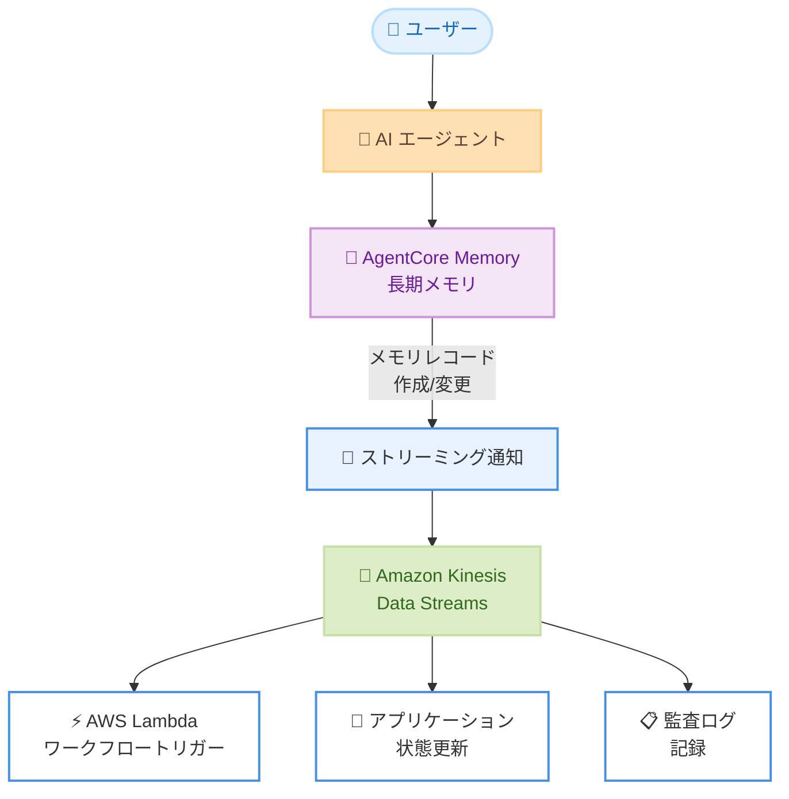

# Amazon Bedrock AgentCore Memory - 長期メモリのストリーミング通知

**リリース日**: 2026年3月12日
**サービス**: Amazon Bedrock AgentCore Memory
**機能**: 長期メモリのストリーミング通知

## 概要

Amazon Bedrock AgentCore Memory が、長期メモリ (Long-Term Memory) のストリーミング通知をサポートしました。この機能により、メモリレコードの作成や変更をリアルタイムでプッシュ通知として受信できるようになり、ポーリングによる変更検出が不要になります。

長期メモリは、エージェントとのインタラクションからインサイトを抽出し、将来のインタラクションでパーソナライズされた体験を提供するための機能です。今回のアップデートにより、メモリレコードが作成または変更されるたびに Amazon Kinesis に直接ストリーミングされるため、開発者はダウンストリームワークフローのトリガー、アプリケーション状態の更新、メモリ更新の監査を自動的に実行できるようになりました。

**アップデート前の課題**

- メモリレコードの変更を検出するために、定期的なポーリングロジックを実装する必要があった
- ポーリング間隔の管理やリフレッシュインターバルの設定を開発者が手動で行う必要があった
- メモリ更新に基づくダウンストリームワークフローのトリガーにリアルタイム性が欠けていた

**アップデート後の改善**

- メモリレコードの作成・変更時にプッシュ通知をリアルタイムで受信できるようになった
- ポーリングロジックやリフレッシュインターバル管理のコードが不要になった
- Amazon Kinesis を介したイベント駆動型アーキテクチャにより、ダウンストリームワークフローを自動化できるようになった

## アーキテクチャ図



AgentCore Memory の長期メモリが更新されると、ストリーミング通知が Amazon Kinesis に送信され、ダウンストリームの各種ワークフローが自動的にトリガーされる流れを示しています。

## サービスアップデートの詳細

### 主要機能

1. **リアルタイムプッシュ通知**
   - メモリレコードの作成時および変更時に、自動的に通知が送信される
   - ポーリングベースの監視から、イベント駆動型の監視に移行可能
   - 通知の遅延を最小限に抑えたリアルタイム配信

2. **Amazon Kinesis との統合**
   - メモリ更新イベントが Amazon Kinesis Data Streams に直接ストリーミングされる
   - Kinesis の既存のコンシューマーアプリケーションやダウンストリーム処理と統合可能
   - Kinesis のスケーラビリティと信頼性を活用したイベント配信

3. **自動化ワークフローのサポート**
   - ダウンストリームワークフローの自動トリガーが可能
   - アプリケーション状態のリアルタイム更新に対応
   - メモリ更新の監査を自動化し、コンプライアンス要件に対応

## 技術仕様

### ストリーミング通知の概要

| 項目 | 詳細 |
|------|------|
| 配信先 | Amazon Kinesis Data Streams |
| トリガーイベント | メモリレコードの作成、メモリレコードの変更 |
| 配信方式 | プッシュ型 (リアルタイム) |
| 対象メモリタイプ | 長期メモリ (Long-Term Memory) |

### API 変更履歴

| 日付 | サービス | 変更内容 |
|------|----------|----------|
| 2026/03/10 | [Amazon Bedrock AgentCore Control](https://awsapichanges.com/archive/changes/9ed5c2-bedrock-agentcore-control.html) | 3 updated api methods - AG-UI プロトコルのサポート追加 |

## 設定方法

### 前提条件

1. Amazon Bedrock AgentCore Memory が有効化されていること
2. Amazon Kinesis Data Streams のストリームが作成済みであること
3. AgentCore Memory から Kinesis にイベントを送信するための IAM 権限が設定されていること

### 手順

#### ステップ1: Kinesis Data Stream の作成

```bash
aws kinesis create-stream \
  --stream-name agentcore-memory-notifications \
  --shard-count 1 \
  --region us-east-1
```

メモリ更新イベントを受信するための Kinesis Data Stream を作成します。シャード数はイベントの想定スループットに応じて調整してください。

#### ステップ2: ストリーミング通知の設定

AgentCore Memory の設定で、ストリーミング通知の送信先として作成した Kinesis Data Stream を指定します。詳細な設定手順は公式ドキュメントを参照してください。

#### ステップ3: コンシューマーアプリケーションの実装

```python
import boto3
import json

kinesis = boto3.client('kinesis', region_name='us-east-1')

response = kinesis.get_shard_iterator(
    StreamName='agentcore-memory-notifications',
    ShardId='shardId-000000000000',
    ShardIteratorType='LATEST'
)

shard_iterator = response['ShardIterator']

while True:
    response = kinesis.get_records(
        ShardIterator=shard_iterator,
        Limit=100
    )
    for record in response['Records']:
        data = json.loads(record['Data'])
        print(f"Memory event: {data}")
    shard_iterator = response['NextShardIterator']
```

Kinesis Data Stream からメモリ更新イベントを読み取るコンシューマーアプリケーションの基本的な実装例です。本番環境では AWS Lambda や Amazon Kinesis Data Analytics などのマネージドサービスを活用することを推奨します。

## メリット

### ビジネス面

- **応答性の向上**: メモリ更新をリアルタイムで検出し、パーソナライズされた体験をより迅速に提供
- **運用コストの削減**: ポーリングロジックの実装・維持が不要になり、開発者の作業負荷を軽減
- **コンプライアンス対応**: メモリ更新の監査ログをリアルタイムで自動記録し、規制要件への対応を効率化

### 技術面

- **イベント駆動型アーキテクチャ**: ポーリングベースからプッシュ型への移行により、アーキテクチャの効率性が向上
- **スケーラビリティ**: Amazon Kinesis の活用により、大量のメモリ更新イベントにもスケーラブルに対応
- **統合の容易さ**: Kinesis エコシステム (Lambda、Firehose、Data Analytics) との既存の統合パターンを活用可能

## デメリット・制約事項

### 制限事項

- ストリーミング通知の配信先は Amazon Kinesis Data Streams に限定される
- Kinesis Data Stream の追加コストが発生する
- 長期メモリのみが対象であり、短期メモリやセッションメモリには適用されない

### 考慮すべき点

- Kinesis Data Stream のシャード数やリテンション期間を適切に設計する必要がある
- 大量のメモリ更新が発生する環境では、コンシューマーアプリケーションのスループットを考慮する必要がある

## ユースケース

### ユースケース1: パーソナライゼーションのリアルタイム更新

**シナリオ**: カスタマーサポートのチャットボットが顧客の過去のインタラクションから学習し、次回の問い合わせ時にパーソナライズされた対応を提供したい。

**実装例**:
```python
# Lambda 関数でメモリ更新イベントを処理
def lambda_handler(event, context):
    for record in event['Records']:
        payload = json.loads(
            base64.b64decode(record['kinesis']['data'])
        )
        # ユーザープロファイルキャッシュを更新
        update_user_profile_cache(
            user_id=payload['userId'],
            memory_data=payload['memoryRecord']
        )
```

**効果**: メモリ更新が即座にアプリケーションキャッシュに反映され、顧客が次回問い合わせた際に最新のコンテキストに基づいた応答が可能になる。

### ユースケース2: メモリ更新の監査とコンプライアンス

**シナリオ**: 規制産業において、AI エージェントが保存するメモリの内容をリアルタイムで監査し、コンプライアンス違反を検出したい。

**実装例**:
```python
# メモリ更新イベントを S3 に永続化し、コンプライアンスチェックを実行
def lambda_handler(event, context):
    for record in event['Records']:
        payload = json.loads(
            base64.b64decode(record['kinesis']['data'])
        )
        # S3 に監査ログを保存
        s3.put_object(
            Bucket='memory-audit-logs',
            Key=f"{payload['timestamp']}/{payload['memoryId']}.json",
            Body=json.dumps(payload)
        )
        # コンプライアンスルールを適用
        check_compliance(payload)
```

**効果**: メモリの全変更がリアルタイムで監査され、問題のあるコンテンツが保存された場合に即座にアラートを発行できる。

### ユースケース3: マルチエージェントのメモリ同期

**シナリオ**: 複数の AI エージェントが同じ顧客情報を共有し、一方のエージェントが学習した内容を他のエージェントにもリアルタイムで反映したい。

**実装例**:
```python
# メモリ更新を他のエージェントのコンテキストに同期
def lambda_handler(event, context):
    for record in event['Records']:
        payload = json.loads(
            base64.b64decode(record['kinesis']['data'])
        )
        # 関連する全エージェントにメモリコンテキストを配信
        for agent_id in get_related_agents(payload['userId']):
            sync_memory_to_agent(agent_id, payload['memoryRecord'])
```

**効果**: 1 つのエージェントが取得した顧客インサイトが、全関連エージェントにリアルタイムで共有され、一貫したパーソナライゼーションが実現する。

## 料金

AgentCore Memory のストリーミング通知機能自体に追加料金は発生しません。ただし、以下の関連サービスの料金が適用されます。

### 料金例

| 使用量 | 月額料金 (概算) |
|--------|------------------|
| Kinesis Data Stream (1 シャード、24 時間リテンション) | 約 $13.00 |
| Kinesis PUT ペイロードユニット (100 万イベント/月) | 約 $0.014 |

※ AgentCore Memory 自体の料金については、Amazon Bedrock の料金ページを参照してください。

## 利用可能リージョン

以下の 15 リージョンで利用可能です。

- US East (N. Virginia)
- US East (Ohio)
- US West (Oregon)
- Europe (Frankfurt)
- Europe (Ireland)
- Europe (London)
- Europe (Paris)
- Europe (Stockholm)
- Asia Pacific (Mumbai)
- Asia Pacific (Singapore)
- Asia Pacific (Sydney)
- Asia Pacific (Tokyo)
- Asia Pacific (Seoul)
- Canada (Central)
- South America (Sao Paulo)

## 関連サービス・機能

- **Amazon Kinesis Data Streams**: メモリ更新イベントのストリーミング配信先として使用
- **Amazon Bedrock AgentCore**: AI エージェントのランタイム環境を提供する親サービス
- **AWS Lambda**: Kinesis からのイベントをトリガーとしたサーバーレスワークフローの実行に活用

## 参考リンク

- [公式発表 (What's New)](https://aws.amazon.com/about-aws/whats-new/2026/03/agentcore-memory-streaming-ltm/)
- [ドキュメント - AgentCore Memory](https://docs.aws.amazon.com/bedrock-agentcore/latest/devguide/memory.html)
- [料金ページ - Amazon Bedrock](https://aws.amazon.com/bedrock/pricing/)

## まとめ

Amazon Bedrock AgentCore Memory のストリーミング通知機能により、長期メモリの変更をリアルタイムで検出し、イベント駆動型のワークフローを構築できるようになりました。ポーリングロジックの実装が不要になり、開発者はアプリケーションロジックに集中できます。パーソナライゼーションの即時反映、コンプライアンス監査の自動化、マルチエージェント間のメモリ同期など、幅広いユースケースでの活用が期待されます。
