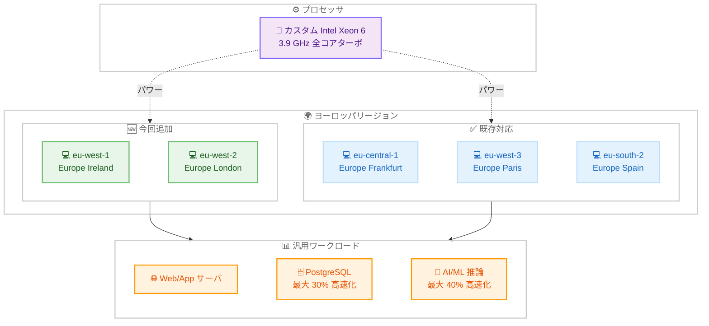

# Amazon EC2 - M8i および M8i-flex インスタンスがヨーロッパの追加リージョンで利用可能に

**リリース日**: 2026 年 3 月 12 日
**サービス**: Amazon EC2
**機能**: M8i および M8i-flex インスタンスの追加リージョン展開

📊 [このアップデートのインフォグラフィックを見る](https://takech9203.github.io/aws-news-summary/20260312-amazon-ec2-m8i-m8i-flex-additional-regions.html)

## 概要

Amazon EC2 M8i および M8i-flex インスタンスが、Europe (Ireland) および Europe (London) リージョンで利用可能になりました。これらのインスタンスは AWS 専用のカスタム Intel Xeon 6 プロセッサを搭載し、クラウド上の同等の Intel プロセッサの中で最高のパフォーマンスと最速のメモリ帯域幅を提供します。

M8i および M8i-flex インスタンスは、前世代の Intel ベースインスタンスと比較して最大 15% 優れた価格パフォーマンスと 2.5 倍のメモリ帯域幅を実現します。M7i および M7i-flex インスタンスと比較して最大 20% 高いパフォーマンスを発揮し、特定のワークロードではさらに大きなパフォーマンス向上が見られます。PostgreSQL データベースでは最大 30% 高速化、NGINX ウェブアプリケーションでは最大 60% 高速化、AI ディープラーニング推奨モデルでは最大 40% 高速化されます。

**アップデート前の課題**

- M8i/M8i-flex インスタンスが Europe (Ireland) および Europe (London) リージョンで利用できなかった
- ヨーロッパ西部のお客様は前世代の汎用インスタンスを使用する必要があり、最新世代のパフォーマンス向上を活用できなかった
- M8i/M8i-flex を利用するために、他の対応リージョンへワークロードを配置する必要があり、データローカリティやレイテンシーの面で制約があった

**アップデート後の改善**

- Europe (Ireland) および Europe (London) リージョンで M8i/M8i-flex インスタンスを直接起動できるようになった
- ヨーロッパ西部のお客様がデータローカリティ要件を維持しながら最新世代の Intel ベースインスタンスのパフォーマンスを享受できるようになった
- ヨーロッパ主要リージョンでの M8i/M8i-flex の展開がほぼ完了し、より柔軟なワークロード配置が可能になった

## アーキテクチャ図



M8i および M8i-flex インスタンスがヨーロッパの 2 つの主要リージョンに追加され、既存の 3 リージョンと合わせてヨーロッパ 5 リージョンで利用可能になったことを示しています。

## サービスアップデートの詳細

### 主要機能

1. **M8i-flex インスタンス**
   - コンピューティングリソースを完全に活用しない汎用ワークロードに最適
   - Web およびアプリケーションサーバ、マイクロサービス、中小規模のデータストア、仮想デスクトップ、エンタープライズアプリケーションに最適
   - large から 16xlarge までの最も一般的なサイズを提供
   - すべてのリソースを完全に活用しないアプリケーションの最初の選択肢

2. **M8i インスタンス**
   - すべての汎用ワークロードに最適
   - 最大のインスタンスサイズまたは継続的な高 CPU 使用率が必要なワークロードに特に適している
   - SAP 認定インスタンスであり、2 つのベアメタルサイズを含む 13 サイズを提供
   - 最大規模のアプリケーション向けに 96xlarge サイズを提供

3. **パフォーマンス向上**
   - 前世代の Intel ベースインスタンスと比較して最大 15% 優れた価格パフォーマンス
   - 前世代と比較して 2.5 倍のメモリ帯域幅
   - M7i/M7i-flex と比較して最大 20% 高いパフォーマンス
   - PostgreSQL データベースで最大 30% 高速化
   - NGINX ウェブアプリケーションで最大 60% 高速化
   - AI ディープラーニング推奨モデルで最大 40% 高速化

## 技術仕様

### M8i および M8i-flex インスタンスの主要仕様

| 項目 | M8i-flex | M8i |
|------|----------|-----|
| プロセッサ | カスタム Intel Xeon 6 (AWS 専用) | カスタム Intel Xeon 6 (AWS 専用) |
| ターボ周波数 | 3.9 GHz (全コア) | 3.9 GHz (全コア) |
| メモリタイプ | DDR5 7200MT/s | DDR5 7200MT/s |
| サイズ | large ~ 16xlarge | 13 サイズ (2 ベアメタル + 96xlarge を含む) |
| ネットワーク帯域幅 | 最大 30 Gbps | 最大 100 Gbps |
| EBS 帯域幅 | 最大 20 Gbps | 最大 80 Gbps |
| L3 キャッシュ | 前世代比 4.6 倍 | 前世代比 4.6 倍 |
| SAP 認定 | - | あり |
| EFA サポート | - | 48xlarge、96xlarge、metal サイズ |
| 最適なワークロード | リソースを完全に活用しないアプリ | 大規模または継続的な高 CPU 使用率アプリ |

### パフォーマンス比較

| 指標 | M8i/M8i-flex vs M7i/M7i-flex | M8i/M8i-flex vs 前世代 Intel |
|------|------------------------------|------------------------------|
| 全体パフォーマンス | 最大 20% 向上 | 最大 15% 優れた価格パフォーマンス |
| メモリ帯域幅 | - | 2.5 倍 |
| PostgreSQL | 最大 30% 高速化 | - |
| NGINX | 最大 60% 高速化 | - |
| AI/ML 推奨モデル | 最大 40% 高速化 | - |

## 設定方法

### 前提条件

1. AWS アカウントと適切な IAM 権限
2. 対象リージョン (eu-west-1 または eu-west-2) へのアクセス
3. 必要な VPC およびサブネット設定

### 手順

#### ステップ 1: 利用可能なインスタンスタイプを確認

```bash
# Europe (Ireland) で利用可能な M8i インスタンスタイプを確認
aws ec2 describe-instance-types \
  --filters "Name=instance-type,Values=m8i*" \
  --region eu-west-1 \
  --query "InstanceTypes[].{Type:InstanceType,vCPU:VCpuInfo.DefaultVCpus,Memory:MemoryInfo.SizeInMiB}" \
  --output table
```

このコマンドは、Europe (Ireland) リージョンで利用可能な M8i インスタンスタイプとそのスペックを一覧表示します。

#### ステップ 2: M8i-flex インスタンスを起動

```bash
# AWS CLI を使用して M8i-flex インスタンスを起動
aws ec2 run-instances \
  --image-id ami-xxxxxxxxxxxxxxxxx \
  --instance-type m8i-flex.xlarge \
  --region eu-west-1 \
  --subnet-id subnet-xxxxxxxxxxxxxxxxx \
  --security-group-ids sg-xxxxxxxxxxxxxxxxx \
  --key-name my-key-pair
```

このコマンドは、Europe (Ireland) リージョンで M8i-flex.xlarge インスタンスを起動します。

#### ステップ 3: 購入オプションを選択

M8i および M8i-flex インスタンスは、以下の購入オプションで利用できます。

- **オンデマンドインスタンス**: 使用した分だけ支払い
- **Savings Plans**: 1 年または 3 年のコミットメントで割引
- **リザーブドインスタンス**: 1 年または 3 年のコミットメントで割引
- **スポットインスタンス**: 未使用の EC2 容量を大幅な割引で利用

## メリット

### ビジネス面

- **コスト効率の向上**: 前世代と比較して最大 15% 優れた価格パフォーマンスにより、汎用ワークロードのコンピューティングコストを削減
- **ヨーロッパでの展開強化**: Ireland と London の追加により、GDPR 準拠を維持しながら最新世代のインスタンスを利用可能
- **柔軟なサイジング**: M8i-flex は large から 16xlarge、M8i は最大 96xlarge まで提供し、ワークロードに最適なサイズを選択可能

### 技術面

- **高性能プロセッサ**: AWS 専用のカスタム Intel Xeon 6 プロセッサ (3.9 GHz 全コアターボ) による最高のパフォーマンス
- **大幅なメモリ帯域幅向上**: DDR5 7200MT/s により前世代比 2.5 倍のメモリ帯域幅を実現
- **4.6 倍の L3 キャッシュ**: 前世代比 4.6 倍の L3 キャッシュにより、CPU ベース推論、科学計算、データベースワークロードのレイテンシーを大幅に改善
- **拡張アクセラレータ**: Intel AMX (FP16 対応) により、CPU ベースの推論ワークロードの範囲が拡大

## デメリット・制約事項

### 制限事項

- すべての AWS リージョンで利用可能ではない (ヨーロッパでは 5 リージョンで提供)
- M8i-flex は large から 16xlarge までのサイズに限定されており、それ以上のサイズが必要な場合は M8i を選択する必要がある
- 既存のワークロードを移行する場合、アプリケーションの互換性テストが必要

### 考慮すべき点

- M8i-flex はリソースを完全に活用しないワークロードに最適だが、継続的な高 CPU 使用率が必要な場合は M8i を選択すべき
- M7i からの移行時には、パフォーマンステストを実施して期待される改善を確認することを推奨
- SAP ワークロードの場合は SAP 認定の M8i インスタンスを使用

## ユースケース

### ユースケース 1: ヨーロッパ向け Web アプリケーションサーバ

**シナリオ**: ヨーロッパのユーザーを対象とした SaaS プロバイダが、GDPR 準拠を維持しながらアプリケーションのパフォーマンスを最適化したい

**実装例**:
```bash
# Europe (Ireland) で M8i-flex インスタンスを起動
aws ec2 run-instances \
  --image-id ami-xxxxxxxxxxxxxxxxx \
  --instance-type m8i-flex.4xlarge \
  --region eu-west-1 \
  --user-data file://webapp-setup.sh
```

**効果**: NGINX ワークロードで最大 60% のパフォーマンス向上により、より多くのリクエストを処理でき、M7i-flex と比較してインスタンス数を削減してコストを最適化

### ユースケース 2: PostgreSQL データベースサーバ

**シナリオ**: 金融サービス企業が、ヨーロッパリージョンで運用する PostgreSQL データベースのクエリパフォーマンスを改善したい

**実装例**:
```bash
# Europe (London) で M8i インスタンスを起動
aws ec2 run-instances \
  --image-id ami-xxxxxxxxxxxxxxxxx \
  --instance-type m8i.8xlarge \
  --region eu-west-2 \
  --block-device-mappings file://db-storage-config.json
```

**効果**: PostgreSQL データベースで最大 30% の高速化を実現し、DDR5 7200MT/s による 2.5 倍のメモリ帯域幅でデータベースのスループットを大幅に向上

### ユースケース 3: SAP ワークロード

**シナリオ**: 製造業企業が、ヨーロッパリージョンで SAP S/4HANA を運用しており、最新世代のインスタンスに移行して性能を向上させたい

**実装例**:
```bash
# SAP 認定の M8i インスタンスで SAP ワークロードを実行
aws ec2 run-instances \
  --image-id ami-xxxxxxxxxxxxxxxxx \
  --instance-type m8i.24xlarge \
  --region eu-west-1 \
  --iam-instance-profile Name=SAP-Instance-Role
```

**効果**: SAP 認定の M8i インスタンスにより、M7i と比較して最大 20% のパフォーマンス向上を実現し、4.6 倍の L3 キャッシュによりデータベースワークロードのレイテンシーを大幅に改善

## 料金

M8i および M8i-flex インスタンスの料金は、選択したインスタンスタイプ、リージョン、購入オプションによって異なります。詳細な料金については、[Amazon EC2 料金ページ](https://aws.amazon.com/ec2/pricing/) をご確認ください。

### 料金例

M8i-flex および M8i インスタンスは、前世代の Intel ベースインスタンスと比較して最大 15% 優れた価格パフォーマンスを提供します。Savings Plans やリザーブドインスタンスを活用することで、さらなるコスト削減が可能です。

**注**: 最新の料金については、公式料金ページをご確認ください。

## 利用可能リージョン

M8i および M8i-flex インスタンスは、以下のリージョンで利用可能です。

**今回追加されたリージョン (2026 年 3 月 12 日)**:
- **Europe (Ireland) - eu-west-1** (今回追加)
- **Europe (London) - eu-west-2** (今回追加)

**既存対応リージョン**:
- US East (N. Virginia) - us-east-1
- US East (Ohio) - us-east-2
- US West (Oregon) - us-west-2
- US West (N. California) - us-west-1
- Europe (Frankfurt) - eu-central-1
- Europe (Paris) - eu-west-3
- Europe (Spain) - eu-south-2
- Asia Pacific (Tokyo) - ap-northeast-1
- Asia Pacific (Seoul) - ap-northeast-2
- Asia Pacific (Singapore) - ap-southeast-1
- Asia Pacific (Kuala Lumpur) - ap-southeast-5
- Asia Pacific (Hyderabad) - ap-south-2
- Africa (Cape Town) - af-south-1
- Canada (Central) - ca-central-1
- South America (Sao Paulo) - sa-east-1

## 関連サービス・機能

- **Amazon EC2 Auto Scaling**: M8i/M8i-flex インスタンスの自動スケーリングで需要に応じたキャパシティ調整を実現
- **Elastic Load Balancing**: 複数の M8i/M8i-flex インスタンス間での負荷分散
- **AWS Savings Plans**: 1 年または 3 年のコミットメントで M8i インスタンスのコストを削減
- **Amazon CloudWatch**: M8i インスタンスのパフォーマンスメトリクスを監視
- **Elastic Fabric Adapter**: M8i の大型インスタンスサイズで EFA をサポートし、高性能コンピューティングに対応

## 参考リンク

- 📊 [インフォグラフィック](https://takech9203.github.io/aws-news-summary/20260312-amazon-ec2-m8i-m8i-flex-additional-regions.html)
- [公式発表 (What's New)](https://aws.amazon.com/about-aws/whats-new/2026/03/amazon-ec2-m8i-m8i-flex-additional-regions/)
- [M8i インスタンス製品ページ](https://aws.amazon.com/ec2/instance-types/m8i/)
- [Amazon EC2 料金ページ](https://aws.amazon.com/ec2/pricing/)
- [Amazon EC2 ドキュメント](https://docs.aws.amazon.com/ec2/)

## まとめ

Amazon EC2 M8i および M8i-flex インスタンスが Europe (Ireland) および Europe (London) リージョンで利用可能になり、ヨーロッパにおける M8i/M8i-flex の展開が 5 リージョンに拡大しました。カスタム Intel Xeon 6 プロセッサによる最大 20% のパフォーマンス向上と 2.5 倍のメモリ帯域幅に加え、PostgreSQL で最大 30% 高速化、NGINX で最大 60% 高速化といったワークロード別の大幅な性能向上を、ヨーロッパの主要 2 リージョンで活用できるようになりました。GDPR 準拠が必要なヨーロッパのワークロードで、M7i からの移行を検討してください。
