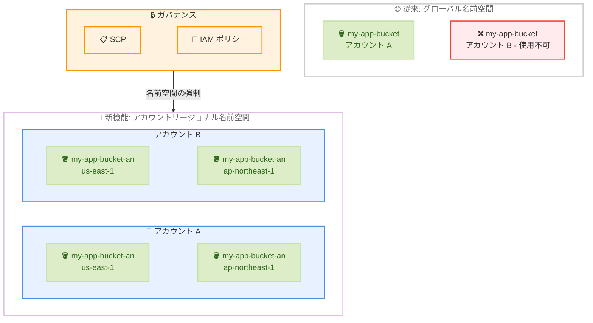

# Amazon S3 - アカウントリージョナル名前空間

**リリース日**: 2026 年 03 月 12 日
**サービス**: Amazon S3
**機能**: Account Regional Namespaces for General Purpose Buckets

📊 [このアップデートのインフォグラフィックを見る](https://takech9203.github.io/aws-news-summary/20260312-amazon-s3-account-regional-namespaces.html)

## 概要

Amazon S3 が汎用バケット向けにアカウントリージョナル名前空間を導入しました。この機能により、バケット名を AWS アカウントとリージョンにスコープして作成できるようになり、グローバルに一意なバケット名を探す必要がなくなります。アカウントリージョナル名前空間を使用することで、複数の AWS リージョンにわたって予測可能なバケット名を作成でき、必要な名前がいつでも利用可能であることが保証されます。

この機能は、顧客ごと、チームごと、データセットごとにバケットを使用するワークロードの構築を容易にします。また、クラウドセキュリティチームはサービスコントロールポリシー (SCP) と IAM ポリシーを使用して、ユーザーがアカウントリージョナル名前空間内でのみバケットを作成するように強制でき、企業全体で一貫したバケット命名規則を適用できます。

アカウントリージョナル名前空間は、AWS China および AWS GovCloud (US) リージョンを含む 37 の AWS リージョンで追加料金なしで利用可能です。AWS マネジメントコンソール、S3 REST API、AWS CLI、AWS SDK、AWS CloudFormation から利用できます。

**アップデート前の課題**

- バケット名はパーティション内のすべての AWS アカウントとリージョンにわたってグローバルに一意である必要があった
- 希望するバケット名が他のアカウントで既に使用されている場合、別の名前を選択する必要があった
- 複数リージョンにわたって一貫したバケット命名規則を適用することが困難だった
- バケット削除後に同じ名前を他のアカウントが取得できるリスクがあった
- 顧客ごとやチームごとにバケットを作成するワークロードでは、一意な名前の生成が複雑になっていた

**アップデート後の改善**

- バケット名を AWS アカウントとリージョンにスコープして作成可能になり、グローバル一意性の制約から解放された
- 複数リージョンで同じバケット名を使用できるため、予測可能で一貫した命名が可能になった
- SCP と IAM ポリシーを使用して、アカウントリージョナル名前空間でのバケット作成を強制可能になった
- バケット名の所有権がアカウントに紐づくため、名前の競合リスクが排除された

## アーキテクチャ図



この図は、従来のグローバル名前空間とアカウントリージョナル名前空間の違いを示しています。従来はバケット名がグローバルに一意である必要がありましたが、アカウントリージョナル名前空間では、異なるアカウントが同じバケット名を同じリージョンで使用できます。

## サービスアップデートの詳細

### 主要機能

1. **アカウントリージョナル名前空間でのバケット作成**
   - バケット名を AWS アカウントとリージョンにスコープして作成可能
   - バケット名の末尾に `-an` サフィックスを付与して、アカウントリージョナル名前空間であることを示す
   - 同じバケット名を複数のアカウントおよびリージョンで使用可能
   - CreateBucket API で新しいバケット名前空間リクエストヘッダーを指定して作成

2. **予測可能なバケット命名**
   - 複数リージョンにわたって一貫したバケット名を使用可能
   - 顧客ごと、チームごと、データセットごとに体系的なバケット名を設計可能
   - 希望する名前が常に利用可能であることが保証される

3. **ガバナンスと命名規則の強制**
   - SCP を使用して、組織全体でアカウントリージョナル名前空間の使用を強制可能
   - IAM ポリシーを使用して、個々のユーザーやロールに対して名前空間の使用を制御可能
   - 企業全体で一貫したバケット命名規則を適用可能

## 技術仕様

### 名前空間の比較

| 項目 | グローバル名前空間 | アカウントリージョナル名前空間 |
|------|-------------------|-------------------------------|
| 一意性のスコープ | パーティション全体 | アカウント + リージョン |
| バケット名の重複 | 不可 | 異なるアカウント/リージョンで可能 |
| 名前のサフィックス | なし | `-an` |
| 他アカウントによる名前取得リスク | あり (削除後) | なし |
| 複数リージョンで同じ名前 | 不可 | 可能 |

### バケット命名規則

| 項目 | 詳細 |
|------|------|
| バケット名の長さ | 3 文字から 63 文字 |
| 使用可能文字 | 小文字、数字、ピリオド (.)、ハイフン (-) |
| サフィックス | アカウントリージョナル名前空間のバケットは `-an` で終了 |
| 先頭・末尾 | 英字または数字で開始・終了 |

### IAM ポリシー例

```json
{
    "Version": "2012-10-17",
    "Statement": [
        {
            "Sid": "EnforceAccountRegionalNamespace",
            "Effect": "Deny",
            "Action": "s3:CreateBucket",
            "Resource": "arn:aws:s3:::*",
            "Condition": {
                "StringNotEquals": {
                    "s3:x-amz-bucket-namespace": "account-regional"
                }
            }
        }
    ]
}
```

## 設定方法

### 前提条件

1. AWS CLI が最新バージョンにアップデートされていること
2. 必要な IAM 権限 (`s3:CreateBucket`) が付与されていること
3. バケットを作成する AWS リージョンが決定していること

### 手順

#### ステップ 1: AWS CLI を使用したアカウントリージョナル名前空間でのバケット作成

```bash
aws s3api create-bucket \
    --bucket my-app-data-an \
    --region ap-northeast-1 \
    --create-bucket-configuration LocationConstraint=ap-northeast-1 \
    --x-amz-bucket-namespace account-regional
```

このコマンドは、アカウントリージョナル名前空間で東京リージョンにバケットを作成します。`--x-amz-bucket-namespace account-regional` ヘッダーにより、アカウントリージョナル名前空間での作成を指定しています。

#### ステップ 2: AWS CloudFormation テンプレートでのバケット作成

```yaml
AWSTemplateFormatVersion: '2010-09-09'
Resources:
  MyBucket:
    Type: AWS::S3::Bucket
    Properties:
      BucketName: my-app-data-an
      BucketNamespace: account-regional
```

CloudFormation テンプレートでは、`BucketNamespace` プロパティを `account-regional` に設定して、アカウントリージョナル名前空間でバケットを作成します。

#### ステップ 3: SCP による名前空間の強制

```json
{
    "Version": "2012-10-17",
    "Statement": [
        {
            "Sid": "RequireAccountRegionalNamespace",
            "Effect": "Deny",
            "Action": "s3:CreateBucket",
            "Resource": "*",
            "Condition": {
                "StringNotEquals": {
                    "s3:x-amz-bucket-namespace": "account-regional"
                }
            }
        }
    ]
}
```

この SCP を組織のルートまたは OU に適用することで、すべてのメンバーアカウントがアカウントリージョナル名前空間でのみバケットを作成するように強制できます。

## メリット

### ビジネス面

- **運用の簡素化**: グローバルに一意なバケット名を探す必要がなくなり、バケット作成プロセスが簡素化される
- **スケーラブルなマルチテナント設計**: 顧客ごとやチームごとにバケットを作成するワークロードで、予測可能な命名パターンを使用可能
- **ガバナンスの強化**: SCP と IAM ポリシーを使用して企業全体で一貫した命名規則を強制でき、コンプライアンスとセキュリティを向上

### 技術面

- **名前の予測可能性**: 複数リージョンにわたって同じバケット名を使用でき、IaC テンプレートの再利用性が向上
- **セキュリティの向上**: バケット名がアカウントにスコープされるため、削除後に他のアカウントが同じ名前を取得するリスクが排除される
- **デプロイの信頼性**: 希望するバケット名が常に利用可能であるため、デプロイの失敗リスクが低減

## デメリット・制約事項

### 制限事項

- アカウントリージョナル名前空間のバケット名は `-an` サフィックスで終わる必要がある
- 既存のグローバル名前空間のバケットをアカウントリージョナル名前空間に移行することはできない (新規作成が必要)
- アカウントリージョナル名前空間のバケットは、バケット名だけでは一意に識別できないため、アクセス時にアカウントとリージョン情報が必要

### 考慮すべき点

- 既存のツールやスクリプトがグローバル名前空間のバケット名形式を前提としている場合、更新が必要になる可能性がある
- 従来のグローバル名前空間と新しいアカウントリージョナル名前空間が共存するため、組織内で使用する名前空間を統一するポリシーの策定を推奨
- S3 Transfer Acceleration を使用する場合、バケット名にピリオド (.) を含めることはできない点は従来と同様

## ユースケース

### ユースケース 1: マルチテナント SaaS アプリケーション

**シナリオ**: SaaS プロバイダーが顧客ごとに専用の S3 バケットを作成してデータを分離する必要がある。グローバル名前空間では、顧客 ID をバケット名に含める場合に名前の競合が発生する可能性がある。

**実装例**:
```bash
# 顧客ごとにバケットを作成
aws s3api create-bucket \
    --bucket customer-12345-data-an \
    --region ap-northeast-1 \
    --create-bucket-configuration LocationConstraint=ap-northeast-1 \
    --x-amz-bucket-namespace account-regional
```

**効果**: 顧客 ID をそのままバケット名に使用できるため、命名の一貫性が保たれ、バケット管理が大幅に簡素化される。

### ユースケース 2: マルチリージョンデプロイメント

**シナリオ**: グローバルに展開するアプリケーションで、各リージョンに同じ構成のバケットをデプロイする必要がある。従来はリージョンサフィックスを付けるなどの工夫が必要だった。

**実装例**:
```yaml
# CloudFormation テンプレートを複数リージョンにデプロイ
AWSTemplateFormatVersion: '2010-09-09'
Resources:
  AppDataBucket:
    Type: AWS::S3::Bucket
    Properties:
      BucketName: my-global-app-data-an
      BucketNamespace: account-regional
```

**効果**: 同じ CloudFormation テンプレートを変更なしで複数リージョンにデプロイでき、IaC の再利用性と保守性が向上する。

### ユースケース 3: エンタープライズガバナンスの統一

**シナリオ**: 大企業の IT 部門が、すべての部門とプロジェクトに対してバケット命名規則を統一し、セキュリティリスクを低減したい。

**実装例**:
```json
{
    "Version": "2012-10-17",
    "Statement": [
        {
            "Sid": "EnforceNamingConvention",
            "Effect": "Deny",
            "Action": "s3:CreateBucket",
            "Resource": "*",
            "Condition": {
                "StringNotEquals": {
                    "s3:x-amz-bucket-namespace": "account-regional"
                }
            }
        }
    ]
}
```

**効果**: SCP により組織全体でアカウントリージョナル名前空間の使用を強制し、バケット名の競合リスクを排除すると同時に、一貫した命名規則を適用できる。

## 料金

アカウントリージョナル名前空間は追加料金なしで利用できます。バケットの作成、ストレージ、リクエスト、データ転送に対する通常の S3 料金が適用されます。

### 料金例

| 使用量 | 月額料金 (概算) |
|--------|------------------|
| バケット作成 | 無料 |
| ストレージ (S3 Standard、100 GB) | 約 $2.30 (東京リージョン) |
| リクエスト (100,000 PUT/GET) | 通常の S3 リクエスト料金 |

詳細な料金情報については、[Amazon S3 料金ページ](https://aws.amazon.com/s3/pricing/)を参照してください。

## 利用可能リージョン

AWS China および AWS GovCloud (US) リージョンを含む 37 の AWS リージョンで利用可能です。東京リージョン (ap-northeast-1) を含むすべての商用リージョンで使用できます。

## 関連サービス・機能

- **AWS Organizations (SCP)**: アカウントリージョナル名前空間の使用を組織全体で強制するためのサービスコントロールポリシー
- **AWS IAM**: バケット作成時の名前空間指定を制御するポリシー
- **AWS CloudFormation**: IaC テンプレートでアカウントリージョナル名前空間のバケットをプロビジョニング
- **Amazon S3 Access Points**: バケットへのアクセスを管理するための補完的な機能
- **S3 Transfer Acceleration**: バケット名にピリオドを含まない場合に使用可能な高速転送機能

## 参考リンク

- 📊 [インフォグラフィック](https://takech9203.github.io/aws-news-summary/20260312-amazon-s3-account-regional-namespaces.html)
- [公式発表 (What's New)](https://aws.amazon.com/about-aws/whats-new/2026/03/amazon-s3-account-regional-namespaces/)
- [S3 バケット命名規則ドキュメント](https://docs.aws.amazon.com/AmazonS3/latest/userguide/bucketnamingrules.html)
- [S3 バケット名前空間ドキュメント](https://docs.aws.amazon.com/AmazonS3/latest/userguide/bucket-namespaces.html)
- [Amazon S3 料金ページ](https://aws.amazon.com/s3/pricing/)

## まとめ

Amazon S3 のアカウントリージョナル名前空間は、長年の課題であったグローバルに一意なバケット名の制約を解消する重要なアップデートです。特にマルチテナント SaaS アプリケーション、マルチリージョンデプロイメント、エンタープライズガバナンスの統一といったユースケースで大きな価値を提供します。追加料金なしで利用可能であり、既存のワークロードに影響を与えることなく新しいバケットから導入できるため、新規バケットの作成時にはアカウントリージョナル名前空間の使用を推奨します。
