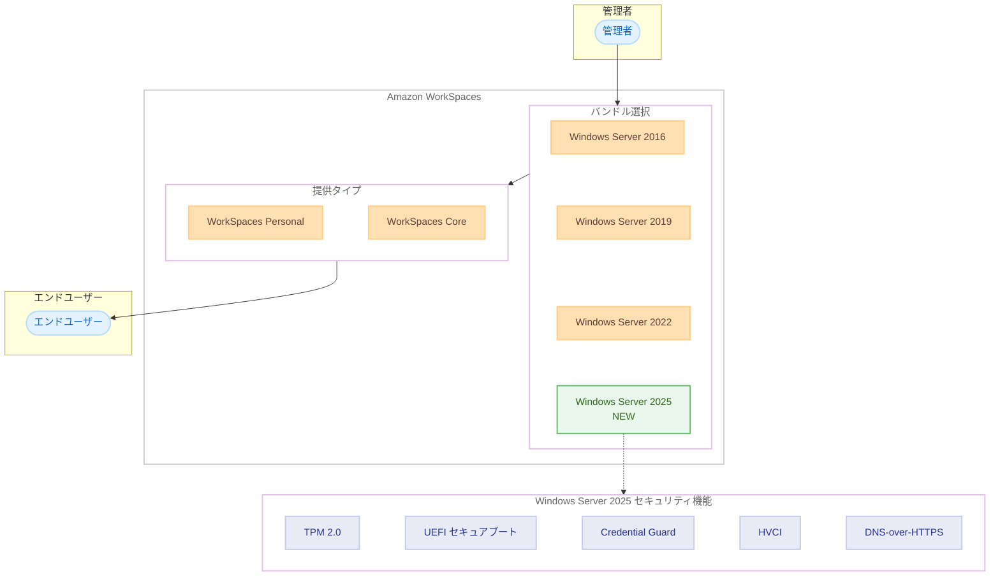

# Amazon WorkSpaces - Windows Server 2025 サポート

**リリース日**: 2026 年 3 月 12 日
**サービス**: Amazon WorkSpaces
**機能**: Windows Server 2025 バンドルのサポート

## 概要

Amazon WorkSpaces が Microsoft Windows Server 2025 を搭載した新しいバンドルの提供を開始した。Amazon WorkSpaces Personal および Amazon WorkSpaces Core で利用可能であり、最新の Windows Server オペレーティングシステムの機能を活用した仮想デスクトップ環境を構築できる。

Windows Server 2016、2019、2022 を搭載した既存の WorkSpaces バンドルは引き続き利用可能だが、Windows Server 2025 では TPM 2.0、UEFI セキュアブート、Secured-core サーバー、Credential Guard、HVCI、DNS-over-HTTPS などの強化されたセキュリティ機能が利用できる。また、Microsoft 365 Apps for enterprise など、新しい Windows バージョンを必要とするアプリケーションの実行が可能になる。

**アップデート前の課題**

- WorkSpaces で利用できる最新の Windows Server は 2022 であり、Windows Server 2025 の新しいセキュリティ機能を活用できなかった
- Microsoft 365 Apps for enterprise など、新しい Windows バージョンを必要とするアプリケーションの動作要件を満たせないケースがあった
- TPM 2.0 や UEFI セキュアブートなど、最新のハードウェアベースのセキュリティ機能を仮想デスクトップ環境で利用できなかった

**アップデート後の改善**

- Windows Server 2025 搭載のバンドルを選択して WorkSpaces を起動できるようになった
- TPM 2.0、UEFI セキュアブート、Credential Guard、HVCI などの最新セキュリティ機能が利用可能になった
- 新しい Windows バージョンを要件とする Microsoft 365 Apps for enterprise などのアプリケーションを実行できるようになった
- マネージドバンドルの利用に加え、カスタムバンドルやイメージの作成にも対応している

## アーキテクチャ図



管理者が Windows Server 2025 バンドルを選択して WorkSpaces を起動し、エンドユーザーが最新のセキュリティ機能を備えた仮想デスクトップを利用する構成を示している。

## サービスアップデートの詳細

### 主要機能

1. **Windows Server 2025 バンドル**
   - Amazon WorkSpaces Personal および Amazon WorkSpaces Core で利用可能
   - マネージドバンドルとして提供されるほか、カスタムバンドルやイメージの作成にも対応
   - 既存の Windows Server 2016、2019、2022 バンドルとの併用が可能

2. **強化されたセキュリティ機能**
   - Trusted Platform Module 2.0 (TPM 2.0): ハードウェアベースのセキュリティ機能
   - Unified Extensible Firmware Interface (UEFI) セキュアブート: 起動プロセスの整合性検証
   - Secured-core サーバー: ファームウェアレベルからの保護
   - Credential Guard: 資格情報の分離保護
   - Hypervisor-protected Code Integrity (HVCI): カーネルモードコードの整合性保護
   - DNS-over-HTTPS: DNS クエリの暗号化

3. **アプリケーション互換性の向上**
   - Microsoft 365 Apps for enterprise など、新しい Windows バージョンを必要とするアプリケーションの実行をサポート
   - 最新の Windows Server OS 機能を活用したアプリケーション開発・運用が可能

## 技術仕様

### 対応 OS バージョン

| 項目 | 詳細 |
|------|------|
| OS バージョン | Windows Server 2025 |
| 対応サービス | WorkSpaces Personal、WorkSpaces Core |
| バンドルタイプ | マネージドバンドル、カスタムバンドル |
| 既存 OS サポート | Windows Server 2016、2019、2022 は引き続き利用可能 |

### API 変更履歴

| 日付 | サービス | 変更内容 |
|------|----------|----------|
| 2026/03/11 | [workspaces](https://awsapichanges.com/archive/changes/537c33-workspaces.html) | 4 updated api methods - OperatingSystemName に WINDOWS_SERVER_2025 を追加 |

### 変更された API メソッド

以下の 4 つの API メソッドで `OperatingSystemName` パラメータに `WINDOWS_SERVER_2025` が追加された。

```
CreateWorkspaces          - WorkspaceProperties.OperatingSystemName に WINDOWS_SERVER_2025 を追加
DescribeApplications      - OperatingSystemNames フィルタおよびレスポンスに WINDOWS_SERVER_2025 を追加
DescribeWorkspaces        - レスポンスの WorkspaceProperties.OperatingSystemName に WINDOWS_SERVER_2025 を追加
ModifyWorkspaceProperties - WorkspaceProperties.OperatingSystemName に WINDOWS_SERVER_2025 を追加
```

## 設定方法

### 前提条件

1. Amazon WorkSpaces が利用可能な AWS アカウント
2. WorkSpaces ディレクトリの設定済み環境
3. 適切な IAM 権限

### 手順

#### ステップ 1: マネージドバンドルで WorkSpaces を起動

AWS マネジメントコンソールから WorkSpaces を作成する際に、Windows Server 2025 搭載のバンドルを選択する。

#### ステップ 2: AWS CLI を使用した WorkSpaces の作成

```bash
aws workspaces create-workspaces \
  --workspaces '[{
    "DirectoryId": "d-xxxxxxxxxx",
    "UserName": "username",
    "BundleId": "wsb-xxxxxxxxx",
    "WorkspaceProperties": {
      "RunningMode": "AUTO_STOP",
      "OperatingSystemName": "WINDOWS_SERVER_2025"
    }
  }]'
```

WorkSpaces の作成時に `OperatingSystemName` を `WINDOWS_SERVER_2025` に指定することで、Windows Server 2025 搭載の仮想デスクトップを起動できる。

#### ステップ 3: カスタムバンドルの作成

独自のアプリケーションや設定が必要な場合は、Windows Server 2025 ベースのカスタムバンドルおよびイメージを作成して利用する。

## メリット

### ビジネス面

- **コンプライアンス対応**: 最新の OS を要件とするセキュリティポリシーやコンプライアンス要件への対応が容易になる
- **アプリケーション互換性**: Microsoft 365 Apps for enterprise など、最新の Windows バージョンを必要とするビジネスアプリケーションを仮想デスクトップで利用可能
- **長期サポート**: Windows Server 2025 の長期サポートライフサイクルにより、安定した運用が見込める

### 技術面

- **セキュリティ強化**: TPM 2.0、UEFI セキュアブート、Credential Guard、HVCI などのハードウェアベースのセキュリティ機能により、仮想デスクトップのセキュリティが大幅に向上
- **DNS-over-HTTPS**: DNS クエリの暗号化により、ネットワークレベルのプライバシーが向上
- **Secured-core サーバー**: ファームウェアレベルからの保護により、高度な脅威に対する防御力が向上

## デメリット・制約事項

### 制限事項

- Windows Server 2025 は WorkSpaces Personal と WorkSpaces Core のみで利用可能であり、WorkSpaces Pools への対応状況は公式発表に記載されていない
- 既存の Windows Server 2022 以前の WorkSpaces から Windows Server 2025 への直接的なインプレースアップグレードに関する情報は記載されていない

### 考慮すべき点

- 既存のカスタムイメージやバンドルは Windows Server 2025 用に再作成する必要がある
- アプリケーションの互換性テストを事前に実施することを推奨する
- Windows Server 2025 固有のライセンス要件を確認する必要がある

## ユースケース

### ユースケース 1: セキュリティ要件の厳しい企業環境

**シナリオ**: 金融機関や政府機関など、厳格なセキュリティポリシーを持つ組織が、TPM 2.0 や Credential Guard を必須要件とする仮想デスクトップ環境を構築する。

**効果**: ハードウェアベースのセキュリティ機能により、資格情報の盗取やカーネルレベルの攻撃に対する防御力が向上し、コンプライアンス要件を満たすことができる。

### ユースケース 2: Microsoft 365 Apps の最新要件への対応

**シナリオ**: 組織が Microsoft 365 Apps for enterprise を利用しており、新しい Windows バージョンが動作要件として求められている。

**効果**: Windows Server 2025 バンドルを使用することで、最新の Microsoft 365 Apps を WorkSpaces 上で実行でき、生産性ツールの継続的な利用が可能になる。

### ユースケース 3: DNS セキュリティの強化

**シナリオ**: ネットワークセキュリティの強化を目指す組織が、DNS クエリの暗号化により中間者攻撃や DNS スプーフィングのリスクを低減したい。

**効果**: Windows Server 2025 の DNS-over-HTTPS 機能により、仮想デスクトップからの DNS 通信が暗号化され、ネットワークレベルのセキュリティが向上する。

## 料金

Amazon WorkSpaces の既存の料金体系に従う。Windows Server 2025 バンドルの利用に追加料金が発生するかどうかは、Amazon WorkSpaces の料金ページを参照のこと。

## 利用可能リージョン

Amazon WorkSpaces が利用可能なすべての AWS リージョンで利用可能。

## 関連サービス・機能

- **Amazon WorkSpaces Personal**: 個人ユーザー向けの永続的な仮想デスクトップサービス
- **Amazon WorkSpaces Core**: サードパーティの VDI ソリューションと統合可能な WorkSpaces の基盤サービス
- **AWS Directory Service**: WorkSpaces のユーザー認証やディレクトリ管理に使用

## 参考リンク

- [公式発表 (What's New)](https://aws.amazon.com/about-aws/whats-new/2026/03/amazon-workspaces-windows-server-2025/)
- [Amazon WorkSpaces FAQ](https://aws.amazon.com/workspaces/faqs/)
- [Amazon WorkSpaces 料金ページ](https://aws.amazon.com/workspaces/pricing/)
- [Amazon WorkSpaces ドキュメント](https://docs.aws.amazon.com/workspaces/)

## まとめ

Amazon WorkSpaces が Windows Server 2025 をサポートしたことにより、TPM 2.0、UEFI セキュアブート、Credential Guard、HVCI、DNS-over-HTTPS といった最新のセキュリティ機能を仮想デスクトップ環境で活用できるようになった。セキュリティ要件の厳しい組織や、最新の Microsoft 365 Apps を利用する必要がある組織は、Windows Server 2025 バンドルへの移行を検討することを推奨する。
