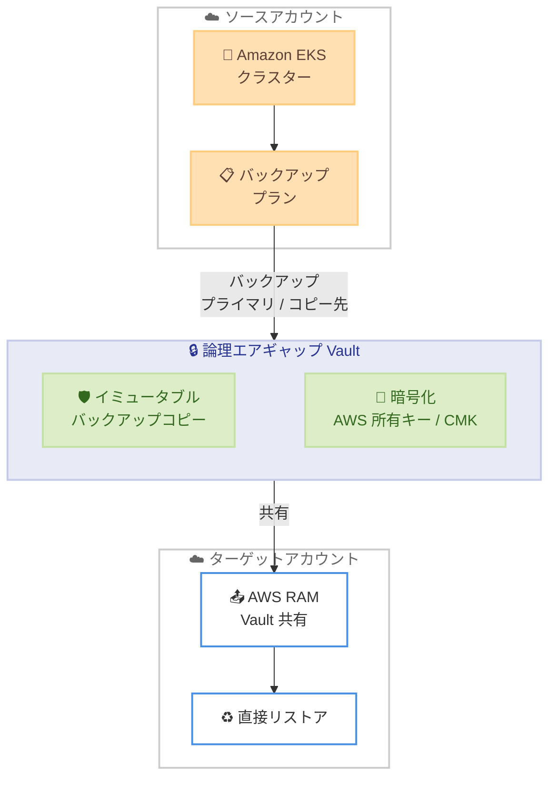

# AWS Backup - Amazon EKS 向け論理エアギャップ Vault サポート

**リリース日**: 2026年3月12日
**サービス**: AWS Backup
**機能**: Amazon EKS 向け論理エアギャップ Vault (Logically Air-Gapped Vault)

📊 [このアップデートのインフォグラフィックを見る](https://takech9203.github.io/aws-news-summary/20260312-aws-backup-logically-air-gapped-vault-amazon-eks.html)

## 概要

AWS Backup の論理エアギャップ Vault が Amazon EKS をサポートするようになった。論理エアギャップ Vault は、バックアップコピーをデフォルトでロックし、不変 (immutable) として保存する特殊なタイプの Vault であり、AWS 所有キーまたはカスタマーマネージドキー (CMK) による暗号化で隔離される。

このアップデートにより、Amazon EKS クラスターのバックアップを論理エアギャップ Vault に保存できるようになった。同一アカウント内だけでなく、クロスアカウントやクロスリージョンでのバックアップ保存も可能である。AWS Resource Access Manager (RAM) を使用した Vault の共有や、マルチパーティ承認を介したアクセスにも対応しており、復旧時にはバックアップコピーの事前複製なしに直接リストアを実行できるため、復旧時間の短縮が期待できる。

**アップデート前の課題**

- Amazon EKS クラスターのバックアップを論理エアギャップ Vault に保存できなかった
- EKS のバックアップに対してイミュータブル (不変) かつ論理的に隔離された保護を適用する手段が限られていた
- クロスアカウントでの EKS バックアップ共有と直接リストアのワークフローが複雑だった

**アップデート後の改善**

- Amazon EKS クラスターのバックアップを論理エアギャップ Vault に直接保存可能になった
- バックアップコピーがデフォルトでロック・不変化され、ランサムウェアや不正削除からの保護が強化された
- クロスアカウント・クロスリージョンでの Vault 共有と直接リストアにより、災害復旧の運用が簡素化された

## アーキテクチャ図



ソースアカウントの Amazon EKS クラスターからバックアッププランを通じて論理エアギャップ Vault にバックアップを保存し、AWS RAM を介してターゲットアカウントから直接リストアを実行するフローを示している。

## サービスアップデートの詳細

### 主要機能

1. **EKS バックアップの論理エアギャップ Vault 保存**
   - Amazon EKS クラスターのバックアップを論理エアギャップ Vault に保存可能
   - バックアッププランでプライマリターゲットまたはコピー先として指定
   - 同一アカウント、クロスアカウント、クロスリージョンでの保存に対応

2. **イミュータブルバックアップコピー**
   - Vault に保存されたバックアップコピーはデフォルトでロック
   - 不変性により、ランサムウェアや悪意ある削除からの保護を実現
   - AWS 所有キーまたはカスタマーマネージドキー (CMK) による暗号化

3. **直接リストアによる復旧時間短縮**
   - 共有された Vault から直接リストアジョブを実行可能
   - バックアップコピーの事前複製が不要
   - AWS RAM またはマルチパーティ承認によるアクセス制御

## 技術仕様

### Vault タイプの比較

| 項目 | 標準 Vault | 論理エアギャップ Vault |
|------|-----------|----------------------|
| イミュータブル性 | オプション | デフォルトでロック |
| 暗号化 | AWS 所有キー / CMK | AWS 所有キー / CMK |
| クロスアカウント共有 | AWS RAM | AWS RAM / マルチパーティ承認 |
| 直接リストア | - | 対応 |
| EKS サポート | 対応 | 対応 (今回追加) |

### IAM ポリシー例

```json
{
    "Version": "2012-10-17",
    "Statement": [
        {
            "Effect": "Allow",
            "Action": [
                "backup:CreateBackupPlan",
                "backup:CreateBackupSelection",
                "backup:StartBackupJob",
                "backup:StartCopyJob",
                "backup:StartRestoreJob"
            ],
            "Resource": "*"
        },
        {
            "Effect": "Allow",
            "Action": [
                "eks:DescribeCluster",
                "eks:ListClusters"
            ],
            "Resource": "*"
        }
    ]
}
```

## 設定方法

### 前提条件

1. AWS Backup が有効化されていること
2. Amazon EKS クラスターが稼働していること
3. 論理エアギャップ Vault が作成済みであること
4. 適切な IAM 権限が設定されていること

### 手順

#### ステップ 1: 論理エアギャップ Vault の作成

```bash
aws backup create-logically-air-gapped-backup-vault \
    --backup-vault-name my-eks-air-gapped-vault \
    --min-retention-days 7 \
    --max-retention-days 365
```

論理エアギャップ Vault を作成する。最小保持期間と最大保持期間を指定する必要がある。

#### ステップ 2: バックアッププランで EKS を論理エアギャップ Vault に指定

```bash
aws backup create-backup-plan --backup-plan '{
    "BackupPlanName": "eks-air-gapped-plan",
    "Rules": [
        {
            "RuleName": "daily-eks-backup",
            "TargetBackupVaultName": "my-eks-air-gapped-vault",
            "ScheduleExpression": "cron(0 12 * * ? *)",
            "Lifecycle": {
                "DeleteAfterDays": 90
            }
        }
    ]
}'
```

バックアッププランを作成し、ターゲットとして論理エアギャップ Vault を指定する。

#### ステップ 3: EKS クラスターをバックアップリソースとして割り当て

```bash
aws backup create-backup-selection \
    --backup-plan-id <plan-id> \
    --backup-selection '{
        "SelectionName": "eks-clusters",
        "IamRoleArn": "arn:aws:iam::<account-id>:role/AWSBackupDefaultServiceRole",
        "Resources": [
            "arn:aws:eks:<region>:<account-id>:cluster/<cluster-name>"
        ]
    }'
```

対象の EKS クラスターをバックアッププランのリソースとして割り当てる。

## メリット

### ビジネス面

- **コンプライアンス対応の強化**: イミュータブルバックアップにより、規制要件やデータ保護ポリシーへの準拠が容易になる
- **事業継続性の向上**: クロスアカウント・クロスリージョンでの保護により、大規模障害時にも EKS ワークロードの復旧が可能
- **復旧時間の短縮**: 直接リストア機能により、バックアップコピーの転送時間を削減し、RTO の改善に寄与する

### 技術面

- **ランサムウェア耐性**: デフォルトでロックされたイミュータブルコピーにより、悪意ある暗号化や削除からバックアップを保護
- **運用の簡素化**: バックアッププランの設定のみで論理エアギャップ Vault への保存が完了し、追加のスクリプトやワークフローが不要
- **マルチパーティ承認**: Vault へのアクセスにマルチパーティ承認を適用でき、セキュリティレイヤーを追加可能

## デメリット・制約事項

### 制限事項

- 論理エアギャップ Vault には最小保持期間と最大保持期間の設定が必須
- バックアップコピーは Vault 内で変更や削除ができない (不変性の仕様上)
- カスタマーマネージドキー使用時は、キーの管理とローテーションを適切に運用する必要がある

### 考慮すべき点

- 論理エアギャップ Vault のストレージコストは標準 Vault と異なる場合がある
- クロスリージョンコピーにはデータ転送コストが発生する
- 既存のバックアッププランを使用している場合、論理エアギャップ Vault への移行計画を検討する必要がある

## ユースケース

### ユースケース 1: ランサムウェア対策としての EKS バックアップ保護

**シナリオ**: 金融機関が EKS 上でマイクロサービスを運用しており、ランサムウェア攻撃によるデータ損失リスクを最小化したい。

**実装例**:
```bash
# 論理エアギャップ Vault に最小 30 日保持でバックアップを保存
aws backup create-logically-air-gapped-backup-vault \
    --backup-vault-name finance-eks-immutable \
    --min-retention-days 30 \
    --max-retention-days 365
```

**効果**: バックアップコピーがイミュータブルかつ論理的に隔離されるため、攻撃者がバックアップを暗号化・削除することを防止できる。

### ユースケース 2: クロスアカウント災害復旧

**シナリオ**: マルチアカウント環境で本番 EKS クラスターを運用しており、本番アカウントが侵害された場合でも別アカウントから復旧したい。

**実装例**:
```bash
# AWS RAM で論理エアギャップ Vault をターゲットアカウントと共有
aws ram create-resource-share \
    --name eks-backup-share \
    --resource-arns arn:aws:backup:<region>:<account-id>:backup-vault:my-eks-air-gapped-vault \
    --principals <target-account-id>
```

**効果**: ターゲットアカウントから直接リストアを実行でき、バックアップコピーの事前転送なしに迅速な復旧が可能になる。

### ユースケース 3: 規制対応のためのイミュータブルバックアップ

**シナリオ**: 医療系 SaaS を EKS 上で運用しており、HIPAA や各種規制でバックアップの不変性と保持期間の厳格な管理が求められている。

**実装例**:
```bash
# 規制要件に合わせた最小保持期間を設定
aws backup create-logically-air-gapped-backup-vault \
    --backup-vault-name healthcare-eks-compliant \
    --min-retention-days 365 \
    --max-retention-days 2555
```

**効果**: 最小保持期間の強制とイミュータブル性により、規制で求められるバックアップの保持と改ざん防止を自動的に実現できる。

## 料金

AWS Backup の料金は、バックアップストレージ、リストア、クロスリージョンデータ転送に基づく。論理エアギャップ Vault のストレージ料金は Warm Storage と異なるティアが適用される場合がある。

### 料金例

| 項目 | 料金 (米国東部リージョン) |
|------|--------------------------|
| EKS バックアップストレージ | バックアップデータ量に基づく従量課金 |
| クロスリージョンデータ転送 | GB あたりのデータ転送料金が適用 |
| リストア | リストアされたデータ量に基づく |

最新の料金情報は [AWS Backup 料金ページ](https://aws.amazon.com/backup/pricing/)を参照。

## 利用可能リージョン

24 の AWS リージョンで利用可能。詳細なリージョン一覧は [AWS Backup ドキュメント](https://docs.aws.amazon.com/aws-backup/latest/devguide/whatisbackup.html)を参照。

## 関連サービス・機能

- **AWS Backup**: バックアップの一元管理サービス。論理エアギャップ Vault はその Vault タイプの 1 つ
- **Amazon EKS**: マネージド Kubernetes サービス。今回のアップデートでバックアップ保護が強化された
- **AWS Resource Access Manager (RAM)**: 論理エアギャップ Vault のクロスアカウント共有に使用
- **AWS KMS**: カスタマーマネージドキーによる Vault の暗号化に使用

## 参考リンク

- 📊 [インフォグラフィック](https://takech9203.github.io/aws-news-summary/20260312-aws-backup-logically-air-gapped-vault-amazon-eks.html)
- [公式発表 (What's New)](https://aws.amazon.com/about-aws/whats-new/2026/03/aws-backup-logically-air-gapped-vault-amazon-eks/)
- [AWS Backup ドキュメント](https://docs.aws.amazon.com/aws-backup/latest/devguide/whatisbackup.html)
- [AWS Backup 料金ページ](https://aws.amazon.com/backup/pricing/)

## まとめ

AWS Backup の論理エアギャップ Vault が Amazon EKS をサポートしたことで、Kubernetes ワークロードに対するイミュータブルかつ論理的に隔離されたバックアップ保護が実現された。ランサムウェア対策、コンプライアンス要件、災害復旧の強化を検討している EKS ユーザーは、論理エアギャップ Vault の導入を推奨する。既存のバックアッププランに論理エアギャップ Vault をコピー先として追加することで、段階的な移行も可能である。
