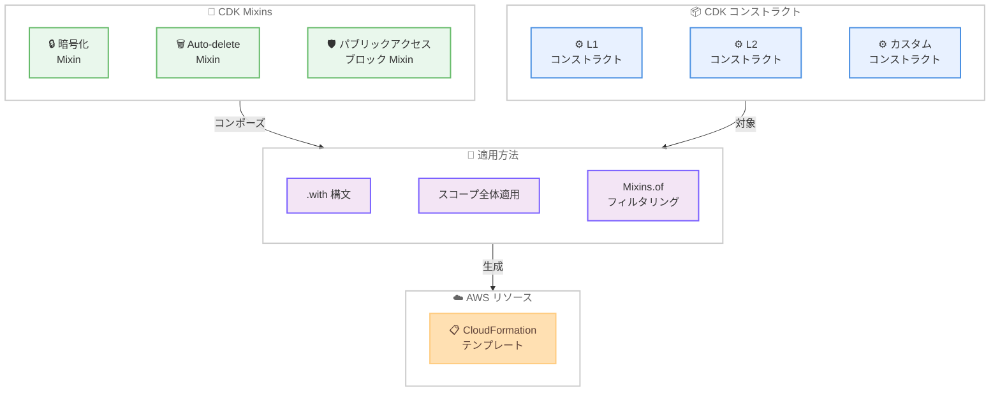

# AWS CDK - CDK Mixins の一般提供開始

**リリース日**: 2026 年 3 月 12 日
**サービス**: AWS Cloud Development Kit (CDK)
**機能**: CDK Mixins

📊 [このアップデートのインフォグラフィックを見る](https://takech9203.github.io/aws-news-summary/20260312-aws-cdk-mixins.html)

## 概要

AWS Cloud Development Kit (CDK) の新機能である CDK Mixins が一般提供 (GA) となった。CDK Mixins は、L1、L2、カスタムコンストラクトを問わず、任意の AWS コンストラクトに対してコンポーザブルで再利用可能な抽象化を追加できる機能である。aws-cdk-lib パッケージを通じて提供され、すべてのコンストラクトタイプで動作する。

これまで開発チームは、L1 コンストラクトを使用して新しい AWS 機能に即座にアクセスするか、L2 コンストラクトの高レベルな抽象化の利便性を選ぶかというトレードオフに直面していた。CDK Mixins により、このトレードオフが解消され、既存のインフラストラクチャコードを再構築することなく、必要な抽象化を柔軟に適用できるようになった。

エンタープライズチームは、再利用可能なセキュリティおよびコンプライアンスポリシーをインフラストラクチャ全体に適用しながら、新しい AWS 機能への Day 1 アクセスを維持できる。

**アップデート前の課題**

- L1 コンストラクトで新機能に即座にアクセスできるが、セキュリティやコンプライアンス要件を満たすために大幅な追加コードが必要だった
- L2 コンストラクトの高レベル抽象化は便利だが、新しい AWS 機能のサポートが遅れることがあった
- カスタムコンストラクトライブラリの保守が複雑で、共通のベストプラクティスを横断的に適用することが困難だった
- セキュリティやコンプライアンスのポリシーを組織全体で一貫して適用するには、各チームが個別に実装する必要があった

**アップデート後の改善**

- `.with()` 構文を使用して、auto-delete、バケット暗号化、バージョニング、パブリックアクセスブロックなどの機能をコンストラクトに直接適用できるようになった
- 複数の Mixin を組み合わせてカスタム L2 コンストラクトを構成できるようになった
- `Mixins.of()` を使用してリソースタイプやパスパターンによる高度なフィルタリングが可能になった
- コンプライアンスポリシーをスコープ全体に一括適用できるようになった

## アーキテクチャ図



CDK Mixins は、再利用可能な抽象化をコンストラクトタイプに関係なく適用し、最終的に CloudFormation テンプレートとして出力する仕組みを示している。

## サービスアップデートの詳細

### 主要機能

1. **`.with()` 構文による Mixin 適用**
   - 任意のコンストラクトに対して、暗号化、バージョニング、パブリックアクセスブロックなどの機能を簡潔な構文で追加できる
   - L1、L2、カスタムコンストラクトのいずれでも利用可能
   - 複数の Mixin をチェーンして組み合わせることができる

2. **カスタム L2 コンストラクトの構成**
   - 複数の Mixin を組み合わせて、組織固有の要件に合った高レベルコンストラクトを構築できる
   - 既存のインフラストラクチャコードを書き直す必要がない
   - カスタムコンストラクトライブラリの保守が簡素化される

3. **スコープ全体へのポリシー適用**
   - コンプライアンスポリシーをスタック全体やアプリケーション全体に一括で適用できる
   - `Mixins.of()` を使用して、リソースタイプやパスパターンで適用対象をフィルタリングできる
   - エンタープライズ規模でのセキュリティポリシーの統一的な運用が可能になる

## 技術仕様

### Mixin の機能一覧

| 機能 | 説明 |
|------|------|
| auto-delete | リソースの自動削除設定を追加 |
| bucket encryption | S3 バケットの暗号化設定を適用 |
| versioning | S3 バケットのバージョニングを有効化 |
| block public access | パブリックアクセスブロック設定を適用 |

### 主要 API

| API | 説明 |
|------|------|
| `.with()` | コンストラクトに Mixin を適用するための構文 |
| `Mixins.of()` | リソースタイプやパスパターンによるフィルタリングを使用した高度な適用 |

## 設定方法

### 前提条件

1. AWS CDK v2 がインストールされていること
2. aws-cdk-lib パッケージが最新バージョンに更新されていること
3. CDK プロジェクトが初期化されていること

### 手順

#### ステップ 1: aws-cdk-lib の更新

```bash
npm install aws-cdk-lib@latest
```

CDK Mixins は aws-cdk-lib パッケージに含まれているため、最新バージョンへの更新で利用可能になる。

#### ステップ 2: Mixin を使用したコンストラクトの定義

```typescript
import * as cdk from 'aws-cdk-lib';
import * as s3 from 'aws-cdk-lib/aws-s3';

// .with() 構文で Mixin を適用
const bucket = new s3.CfnBucket(this, 'MyBucket')
  .with(s3.BucketEncryption.S3_MANAGED)
  .with(s3.BlockPublicAccess.BLOCK_ALL);
```

`.with()` 構文により、L1 コンストラクトに対しても L2 コンストラクト相当の抽象化を適用できる。

#### ステップ 3: スコープ全体へのポリシー適用

```typescript
import { Mixins } from 'aws-cdk-lib';

// スコープ全体にコンプライアンスポリシーを適用
Mixins.of(this).apply({
  resourceType: 's3.CfnBucket',
  mixin: s3.BlockPublicAccess.BLOCK_ALL
});
```

`Mixins.of()` を使用することで、指定したスコープ内のすべての対象リソースに一括でポリシーを適用できる。

## メリット

### ビジネス面

- **Day 1 アクセスの維持**: 新しい AWS 機能がリリースされた際に、L1 コンストラクトで即座に利用しながら、Mixin でセキュリティ要件を満たすことができる
- **コンプライアンスの一貫性**: 組織全体で統一されたセキュリティポリシーを自動的に適用でき、監査対応が容易になる
- **開発速度の向上**: 再利用可能な Mixin により、繰り返し作業が削減され、インフラストラクチャの構築速度が向上する

### 技術面

- **コードの再利用性**: Mixin はコンストラクトタイプに依存しないため、L1、L2、カスタムコンストラクトすべてで再利用できる
- **保守性の向上**: カスタムコンストラクトライブラリの保守が簡素化され、変更の影響範囲を最小化できる
- **柔軟な構成**: 複数の Mixin を自由に組み合わせることで、要件に応じた柔軟なコンストラクト構成が可能になる

## デメリット・制約事項

### 制限事項

- aws-cdk-lib の最新バージョンへの更新が必要
- 既存のカスタムコンストラクトとの互換性を検証する必要がある
- Mixin の組み合わせによっては、意図しない設定の競合が発生する可能性がある

### 考慮すべき点

- Mixin の適用順序によって結果が異なる場合があるため、適用順序の設計に注意が必要
- スコープ全体へのポリシー適用は強力だが、意図しないリソースへの適用を避けるためにフィルタリングを適切に設定する必要がある

## ユースケース

### ユースケース 1: L1 コンストラクトへのセキュリティベストプラクティス適用

**シナリオ**: 新しい AWS サービスの L1 コンストラクトを使用する際に、暗号化やアクセス制御などのセキュリティベストプラクティスを適用したい。

**実装例**:
```typescript
const bucket = new s3.CfnBucket(this, 'SecureBucket')
  .with(s3.BucketEncryption.S3_MANAGED)
  .with(s3.BlockPublicAccess.BLOCK_ALL)
  .with(s3.BucketVersioning.ENABLED);
```

**効果**: L2 コンストラクトの提供を待つことなく、新しいリソースにセキュリティベストプラクティスを即座に適用できる。

### ユースケース 2: 組織全体のコンプライアンスポリシー適用

**シナリオ**: エンタープライズ環境で、すべての S3 バケットに対してパブリックアクセスブロックと暗号化を義務付けたい。

**実装例**:
```typescript
Mixins.of(app).apply({
  resourceType: 's3.CfnBucket',
  mixin: [
    s3.BlockPublicAccess.BLOCK_ALL,
    s3.BucketEncryption.S3_MANAGED
  ]
});
```

**効果**: 開発チームが個別に設定を忘れるリスクを排除し、組織全体で一貫したセキュリティポリシーを自動的に適用できる。

### ユースケース 3: カスタムコンストラクトライブラリの簡素化

**シナリオ**: 社内向けのカスタムコンストラクトライブラリを保守しているが、各コンストラクトに共通のベストプラクティスを適用する作業が煩雑になっている。

**実装例**:
```typescript
// 共通の Mixin セットを定義
const companyStandard = [
  encryption.KMS_MANAGED,
  logging.ENABLED,
  tagging.REQUIRED
];

// カスタムコンストラクトに適用
const myResource = new CustomConstruct(this, 'Resource')
  .with(...companyStandard);
```

**効果**: 共通のベストプラクティスを Mixin として一元管理することで、カスタムコンストラクトライブラリの保守コストを大幅に削減できる。

## 料金

CDK Mixins は aws-cdk-lib パッケージの一部として提供され、追加料金は発生しない。AWS CDK 自体は無料で利用可能であり、料金は CDK で作成された AWS リソースの使用量に基づいて発生する。

## 利用可能リージョン

CDK Mixins は AWS CloudFormation がサポートされているすべての AWS リージョンで利用可能。

## 関連サービス・機能

- **[AWS CloudFormation](https://aws.amazon.com/cloudformation/)**: CDK が生成するテンプレートの実行基盤
- **[AWS CDK Constructs Library](https://docs.aws.amazon.com/cdk/api/v2/)**: L1、L2 コンストラクトを含む CDK のコンストラクトライブラリ
- **[AWS CDK Aspects](https://docs.aws.amazon.com/cdk/v2/guide/aspects.html)**: コンストラクトツリー全体にクロスカット関心事を適用する既存の仕組み

## 参考リンク

- 📊 [インフォグラフィック](https://takech9203.github.io/aws-news-summary/20260312-aws-cdk-mixins.html)
- [公式発表 (What's New)](https://aws.amazon.com/about-aws/whats-new/2026/03/aws-cdk-mixins/)
- [AWS CDK ドキュメント](https://docs.aws.amazon.com/cdk/v2/guide/)
- [aws-cdk-lib API リファレンス](https://docs.aws.amazon.com/cdk/api/v2/)

## まとめ

AWS CDK Mixins は、コンストラクトタイプを問わずコンポーザブルな抽象化を適用できる新機能であり、L1 コンストラクトでの Day 1 アクセスと高レベル抽象化の利便性を両立させる。エンタープライズチームにとっては、セキュリティやコンプライアンスポリシーの組織全体への一貫した適用が容易になる点が大きな価値となる。CDK を利用している組織は、aws-cdk-lib を最新バージョンに更新し、既存のカスタムコンストラクトライブラリを Mixin ベースに移行することを検討することをお勧めする。
