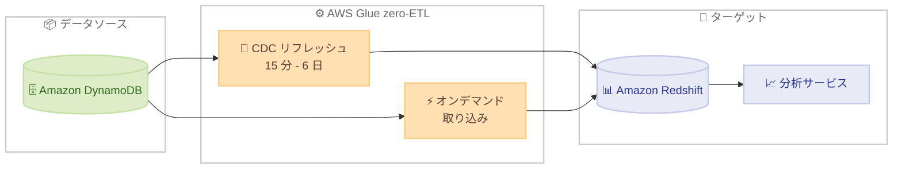

# AWS Glue zero-ETL - Amazon DynamoDB ソースの新しい設定オプション

**リリース日**: 2026 年 3 月 12 日
**サービス**: AWS Glue
**機能**: zero-ETL 統合における DynamoDB ソースの CDC リフレッシュ間隔設定およびオンデマンドデータ取り込み

[このアップデートのインフォグラフィックを見る](https://takech9203.github.io/aws-news-summary/20260312-aws-glue-zetl-dynamodb-configurations.html)

## 概要

AWS Glue zero-ETL 統合において、Amazon DynamoDB をソースとする場合に、変更データキャプチャ (CDC) のリフレッシュ間隔の設定とオンデマンドデータ取り込みが新たにサポートされた。これにより、DynamoDB テーブルからのデータ変更キャプチャの頻度を 15 分から 6 日の範囲でカスタマイズでき、必要に応じて即時のデータ取り込みをトリガーすることが可能になった。

この機能強化により、DynamoDB ソースの zero-ETL 統合が、Salesforce、SAP、ServiceNow などの SaaS ソースとの zero-ETL 統合と機能的に同等になり、異なるソースタイプ間で一貫した機能が確保される。

**アップデート前の課題**

- DynamoDB ソースの zero-ETL 統合では CDC リフレッシュ間隔を柔軟に設定できなかった
- 即時のデータ取り込みが必要な場合でも、次のスケジュールされた CDC 間隔まで待つ必要があった
- SaaS ソース (Salesforce、SAP、ServiceNow) と比較して DynamoDB ソースの設定オプションが限定的だった

**アップデート後の改善**

- CDC リフレッシュ間隔を 15 分から 6 日の範囲で自由に設定可能になった
- オンデマンドデータ取り込みにより、スケジュールを待たずに即時のデータキャプチャが可能になった
- DynamoDB ソースと SaaS ソースの zero-ETL 統合が機能的に同等になった

## アーキテクチャ図

DynamoDB テーブルから AWS Glue zero-ETL を経由してターゲットにデータを連携する際に、CDC リフレッシュ間隔の設定とオンデマンド取り込みの 2 つの方法を選択できる。

## サービスアップデートの詳細

### 主要機能

1. **CDC リフレッシュ間隔の設定**
   - DynamoDB テーブルからの変更データキャプチャの頻度をカスタマイズ可能
   - 設定可能な範囲は 15 分から 6 日
   - ビジネス要件に応じてニアリアルタイム更新から長間隔まで柔軟に対応
   - 長い間隔を設定することでコスト削減が可能

2. **オンデマンドデータ取り込み**
   - スケジュールされた CDC 間隔を待たずに即時のデータキャプチャが可能
   - 重要なデータ変更を即座に分析やレポートに反映
   - ダウンストリームアプリケーションへの即時データ提供に対応

3. **SaaS ソースとの機能パリティ**
   - Salesforce、SAP、ServiceNow などの SaaS ソースと同等の設定オプション
   - 異なるソースタイプ間で一貫した運用体験を実現

## 技術仕様

### CDC リフレッシュ間隔設定

| 項目 | 詳細 |
|------|------|
| 最小間隔 | 15 分 |
| 最大間隔 | 6 日 |
| オンデマンド取り込み | サポート |
| 対象ソース | Amazon DynamoDB テーブル |

## 設定方法

### 前提条件

1. AWS Glue zero-ETL 統合が利用可能なリージョンで AWS アカウントを持っていること
2. Amazon DynamoDB テーブルが作成済みであること
3. AWS Glue zero-ETL 統合のターゲットが設定されていること

### 手順

#### ステップ 1: AWS Glue コンソールで統合を設定

AWS Glue コンソールから zero-ETL 統合を作成または編集し、ソースとして Amazon DynamoDB テーブルを選択する。CDC リフレッシュ間隔を要件に応じて設定する。

#### ステップ 2: CDC リフレッシュ間隔の調整

データの鮮度要件に基づいて適切な間隔を選択する。ニアリアルタイムが必要な場合は 15 分、コスト最適化を重視する場合はより長い間隔を設定する。

#### ステップ 3: オンデマンド取り込みの実行

即時のデータ反映が必要な場合は、オンデマンドデータ取り込みをトリガーする。これにより、次のスケジュールされた CDC 間隔を待たずにデータを取り込むことができる。

詳細な設定手順は [AWS Glue ドキュメント](https://docs.aws.amazon.com/glue/latest/dg/zero-etl-configuring-integration.html) を参照。

## メリット

### ビジネス面

- **データ鮮度の最適化**: ビジネス要件に応じてデータ更新頻度を柔軟に調整でき、意思決定の迅速化が可能
- **コスト最適化**: リフレッシュ間隔を長く設定することで、不要なデータ処理コストを削減
- **運用の一貫性**: SaaS ソースと DynamoDB ソースで同じ設定オプションを利用でき、運用負荷を軽減

### 技術面

- **柔軟なデータパイプライン**: 15 分から 6 日の範囲で CDC 間隔を設定でき、多様なワークロードに対応
- **即時データ取り込み**: オンデマンド機能により、緊急のデータ更新要件にも対応可能
- **ETL 不要のデータ連携**: zero-ETL の利点を維持しつつ、より細かい制御が可能に

## デメリット・制約事項

### 制限事項

- CDC リフレッシュ間隔の最小値は 15 分であり、リアルタイム (秒単位) のデータ連携には DynamoDB Streams の直接利用が必要
- オンデマンド取り込みの頻繁な実行はコスト増加につながる可能性がある

### 考慮すべき点

- リフレッシュ間隔の設定はデータの鮮度とコストのトレードオフを考慮して決定する必要がある
- 大量のデータ変更がある場合、短い間隔での CDC はターゲット側のパフォーマンスに影響を与える可能性がある

## ユースケース

### ユースケース 1: ニアリアルタイム分析ダッシュボード

**シナリオ**: E コマースプラットフォームで、注文データを DynamoDB に格納し、15 分間隔で Amazon Redshift に連携して、リアルタイムに近い売上ダッシュボードを構築する。

**効果**: 従来のバッチ処理と比較してデータの遅延が大幅に短縮され、迅速な意思決定が可能になる。

### ユースケース 2: コスト効率の高い日次レポート

**シナリオ**: IoT デバイスのセンサーデータを DynamoDB に蓄積し、CDC 間隔を 1 日に設定して日次でデータウェアハウスに連携する。リアルタイム性は不要だが、ETL パイプラインの構築・運用コストを削減したい場合に有効。

**効果**: 長い CDC 間隔により処理コストを最小限に抑えつつ、zero-ETL の利便性を享受できる。

### ユースケース 3: 緊急データ更新への対応

**シナリオ**: 金融サービスにおいて、通常は 1 時間間隔で CDC を実行しているが、市場の急変時にオンデマンド取り込みをトリガーして、最新のトランザクションデータを即座に分析システムに反映する。

**効果**: 通常時はコストを抑えつつ、緊急時には即座にデータを取り込むことで、データの鮮度とコストのバランスを最適化できる。

## 料金

AWS Glue zero-ETL 統合の料金は、データ処理量とリフレッシュ頻度に基づく。CDC リフレッシュ間隔を長く設定することでデータ処理回数が減少し、コスト削減につながる。詳細な料金については [AWS Glue の料金ページ](https://aws.amazon.com/glue/pricing/) を参照。

## 利用可能リージョン

AWS Glue zero-ETL がサポートされているすべての AWS リージョンで利用可能。

## 関連サービス・機能

- **Amazon DynamoDB**: ソースデータベースとして使用されるフルマネージドの NoSQL データベースサービス
- **Amazon Redshift**: zero-ETL 統合の主要なターゲットデータウェアハウス
- **AWS Glue zero-ETL**: ETL パイプラインを構築せずにデータソースからターゲットへ直接データを連携する機能

## 参考リンク

- [このアップデートのインフォグラフィック](https://takech9203.github.io/aws-news-summary/20260312-aws-glue-zetl-dynamodb-configurations.html)
- [公式発表 (What's New)](https://aws.amazon.com/about-aws/whats-new/2026/03/aws-glue-zetl-dynamodb-configurations/)
- [AWS Glue zero-ETL 統合の設定ドキュメント](https://docs.aws.amazon.com/glue/latest/dg/zero-etl-configuring-integration.html)
- [AWS Glue zero-ETL の使用ドキュメント](https://docs.aws.amazon.com/glue/latest/dg/zero-etl-using.html)
- [AWS Glue 料金ページ](https://aws.amazon.com/glue/pricing/)

## まとめ

AWS Glue zero-ETL 統合における DynamoDB ソースの CDC リフレッシュ間隔設定とオンデマンドデータ取り込みのサポートにより、データの鮮度とコストのバランスを柔軟に制御できるようになった。SaaS ソースとの機能パリティが実現されたことで、異なるソースタイプ間での一貫した運用が可能になり、DynamoDB を利用したデータ分析基盤の構築がより柔軟かつ効率的になる。
