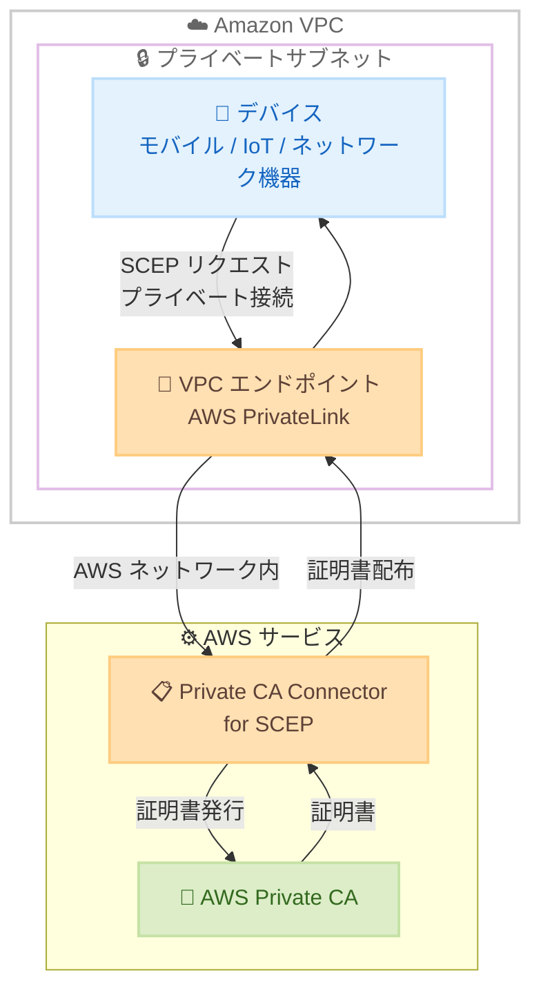

# AWS Private CA Connector for SCEP - AWS PrivateLink サポート

**リリース日**: 2026 年 3 月 12 日
**サービス**: AWS Private CA Connector for SCEP
**機能**: AWS PrivateLink サポート

📊 [このアップデートのインフォグラフィックを見る](https://takech9203.github.io/aws-news-summary/20260312-aws-private-ca-connector-scep-privatelink.html)

## 概要

AWS Private CA Connector for SCEP が AWS PrivateLink をサポートし、Amazon VPC 内のプライベートエンドポイントを通じて SCEP コネクタにアクセスできるようになった。これにより、証明書の登録リクエストがパブリックインターネットを経由せず、すべてのトラフィックが AWS ネットワーク内に留まるようになる。

AWS Private CA Connector for SCEP は、Simple Certificate Enrollment Protocol (SCEP) を使用して AWS Private Certificate Authority (CA) から証明書を発行するためのマネージドコネクタである。SCEP は、モバイルデバイス、ネットワーク機器、IoT デバイスの自動証明書登録および更新に広く使用されているプロトコルである。今回の PrivateLink サポートにより、証明書管理にプライベート接続を必須とするコンプライアンス要件への対応が容易になる。

**アップデート前の課題**

- SCEP コネクタへのアクセスにはパブリックインターネット経由の接続が必要だった
- インターネットゲートウェイ、NAT デバイス、VPN 接続などのネットワーク構成が必要だった
- 証明書管理トラフィックがパブリックインターネットを経由するため、セキュリティおよびコンプライアンス上の懸念があった

**アップデート後の改善**

- VPC エンドポイントを作成して SCEP コネクタにプライベートに接続できるようになった
- インターネットゲートウェイ、NAT デバイス、VPN 接続が不要になり、ネットワーク構成が簡素化された
- すべてのトラフィックが AWS ネットワーク内に留まるため、セキュリティとコンプライアンスが向上した

## アーキテクチャ図



VPC 内のデバイスが PrivateLink 経由で SCEP コネクタにプライベートに接続し、AWS Private CA から証明書を取得するフローを示す。パブリックインターネットを経由せず、すべての通信が AWS ネットワーク内で完結する。

## サービスアップデートの詳細

### 主要機能

1. **VPC エンドポイントによるプライベート接続**
   - VPC 内にインターフェイス VPC エンドポイントを作成して SCEP コネクタに接続
   - パブリックインターネットを経由せずに証明書の登録と更新が可能
   - ENI ベースのエンドポイントにより、セキュリティグループによるアクセス制御が可能

2. **ネットワーク構成の簡素化**
   - インターネットゲートウェイの設定が不要
   - NAT デバイスの構成と管理が不要
   - VPN 接続の設定が不要

3. **コンプライアンス対応の強化**
   - 証明書管理トラフィックの完全なプライベート化
   - 規制要件に準拠したプライベート接続の実現
   - AWS ネットワーク内でのトラフィック閉域化

## 技術仕様

### 構成要素

| 項目 | 詳細 |
|------|------|
| エンドポイントタイプ | インターフェイス VPC エンドポイント |
| プロトコル | SCEP (Simple Certificate Enrollment Protocol) |
| 接続方式 | AWS PrivateLink |
| バックエンド CA | AWS Private Certificate Authority |

### IAM ポリシーの例

```json
{
    "Version": "2012-10-17",
    "Statement": [
        {
            "Effect": "Allow",
            "Action": [
                "ec2:CreateVpcEndpoint",
                "ec2:DescribeVpcEndpoints"
            ],
            "Resource": "*"
        },
        {
            "Effect": "Allow",
            "Action": [
                "pca-connector-scep:*"
            ],
            "Resource": "*"
        }
    ]
}
```

## 設定方法

### 前提条件

1. AWS Private CA Connector for SCEP が設定済みであること
2. VPC およびプライベートサブネットが作成済みであること
3. 適切な IAM 権限が付与されていること

### 手順

#### ステップ 1: VPC エンドポイントの作成

```bash
aws ec2 create-vpc-endpoint \
    --vpc-id vpc-0123456789abcdef0 \
    --service-name com.amazonaws.us-east-1.pca-connector-scep \
    --vpc-endpoint-type Interface \
    --subnet-ids subnet-0123456789abcdef0 \
    --security-group-ids sg-0123456789abcdef0
```

指定した VPC 内にインターフェイス VPC エンドポイントを作成する。サブネットとセキュリティグループを指定して、アクセスを制御する。

#### ステップ 2: セキュリティグループの設定

```bash
aws ec2 authorize-security-group-ingress \
    --group-id sg-0123456789abcdef0 \
    --protocol tcp \
    --port 443 \
    --source-group sg-device-security-group
```

VPC エンドポイントに関連付けるセキュリティグループで、SCEP クライアントデバイスからの HTTPS トラフィックを許可する。

#### ステップ 3: SCEP クライアントの設定

SCEP クライアントデバイスの SCEP URL を VPC エンドポイントの DNS 名に更新する。プライベート DNS が有効な場合、既存の SCEP コネクタエンドポイント URL がそのまま VPC エンドポイント経由で解決される。

## メリット

### ビジネス面

- **コンプライアンス対応の簡素化**: 証明書管理のプライベート接続要件を容易に満たすことが可能
- **運用コストの削減**: NAT ゲートウェイやVPN 接続の管理が不要になり、ネットワーク構成がシンプルになる
- **セキュリティ体制の強化**: 証明書管理トラフィックがパブリックインターネットに露出しないため、攻撃対象面が縮小

### 技術面

- **ネットワーク構成の簡素化**: インターネットゲートウェイや NAT デバイスが不要になり、アーキテクチャがシンプルになる
- **低レイテンシ**: AWS ネットワーク内で通信が完結するため、安定した低レイテンシ接続が実現
- **セキュリティグループによるアクセス制御**: VPC エンドポイントに対してきめ細かいネットワークアクセス制御が可能

## デメリット・制約事項

### 制限事項

- VPC エンドポイントの作成には追加のネットワーク設定が必要
- インターフェイス VPC エンドポイントには別途料金が発生する
- VPC エンドポイントのサブネット配置はアベイラビリティゾーンを考慮する必要がある

### 考慮すべき点

- 既存の SCEP クライアント設定をプライベートエンドポイント経由に移行する際の計画が必要
- セキュリティグループおよび VPC エンドポイントポリシーの適切な設計が重要

## ユースケース

### ユースケース 1: 規制産業でのデバイス証明書管理

**シナリオ**: 金融機関や医療機関が、規制要件によりすべての証明書管理トラフィックをプライベートネットワーク内に限定する必要がある。

**実装例**:
```bash
# プライベートサブネットに VPC エンドポイントを作成
aws ec2 create-vpc-endpoint \
    --vpc-id vpc-prod \
    --service-name com.amazonaws.us-east-1.pca-connector-scep \
    --vpc-endpoint-type Interface \
    --subnet-ids subnet-private-1a subnet-private-1b \
    --private-dns-enabled
```

**効果**: 証明書の発行と更新がすべてプライベートネットワーク内で完結し、規制要件への準拠が実現される。

### ユースケース 2: IoT デバイスのセキュアな証明書自動登録

**シナリオ**: 製造業の工場ネットワーク内にある IoT デバイスが、インターネットアクセスなしで証明書を自動的に取得・更新する必要がある。

**実装例**:
```bash
# IoT デバイス用のセキュリティグループを設定
aws ec2 create-security-group \
    --group-name iot-scep-endpoint-sg \
    --description "Security group for SCEP VPC endpoint" \
    --vpc-id vpc-factory

# IoT サブネットからのアクセスのみ許可
aws ec2 authorize-security-group-ingress \
    --group-id sg-iot-scep \
    --protocol tcp \
    --port 443 \
    --cidr 10.0.100.0/24
```

**効果**: 工場内の IoT デバイスがインターネット接続なしで証明書を自動取得でき、セキュリティリスクが大幅に軽減される。

### ユースケース 3: マルチ VPC 環境でのネットワーク機器証明書管理

**シナリオ**: 大規模な企業ネットワークで、複数の VPC にまたがるネットワーク機器の証明書を一元的に管理する。

**実装例**:
```bash
# 各 VPC に VPC エンドポイントを作成
for vpc in vpc-hub vpc-spoke1 vpc-spoke2; do
    aws ec2 create-vpc-endpoint \
        --vpc-id $vpc \
        --service-name com.amazonaws.us-east-1.pca-connector-scep \
        --vpc-endpoint-type Interface \
        --subnet-ids $(aws ec2 describe-subnets \
            --filters "Name=vpc-id,Values=$vpc" "Name=tag:Type,Values=private" \
            --query 'Subnets[].SubnetId' --output text)
done
```

**効果**: 各 VPC 内のネットワーク機器がローカルに証明書を取得でき、集中管理と分散アクセスの両立が実現される。

## 料金

AWS PrivateLink の VPC エンドポイントに対する標準料金が適用される。AWS Private CA Connector for SCEP 自体の料金に加え、以下の PrivateLink 関連費用が発生する。

### 料金例

| 項目 | 料金 (概算、us-east-1) |
|------|------------------------|
| VPC エンドポイント (1 時間あたり、1 AZ) | $0.01/時間 |
| VPC エンドポイント (月額、1 AZ) | 約 $7.30/月 |
| データ処理 (1 GB あたり) | $0.01/GB |

※ AWS Private CA の証明書発行料金は別途発生する。最新の料金は [AWS PrivateLink 料金ページ](https://aws.amazon.com/privatelink/pricing/) を参照。

## 利用可能リージョン

AWS Private CA Connector for SCEP が利用可能なすべての AWS リージョンで PrivateLink サポートが利用可能。リージョンの詳細は [AWS リージョン表](https://aws.amazon.com/about-aws/global-infrastructure/regional-product-services/) を参照。

## 関連サービス・機能

- **AWS Private Certificate Authority**: プライベート CA の作成と管理を行うサービス。SCEP コネクタのバックエンドとして証明書を発行する
- **AWS PrivateLink**: VPC 内からAWS サービスへのプライベート接続を提供する機能。今回のアップデートで SCEP コネクタに対応
- **Amazon VPC**: 仮想プライベートクラウド環境。VPC エンドポイントの配置先となる
- **AWS IoT Core**: IoT デバイスの接続と管理。SCEP を使用したデバイス証明書の自動登録と組み合わせて利用可能

## 参考リンク

- 📊 [インフォグラフィック](https://takech9203.github.io/aws-news-summary/20260312-aws-private-ca-connector-scep-privatelink.html)
- [公式発表 (What's New)](https://aws.amazon.com/about-aws/whats-new/2026/03/aws-private-ca-connector-scep-privatelink/)
- [AWS Private CA Connector for SCEP ドキュメント](https://docs.aws.amazon.com/privateca/latest/userguide/connector-for-scep.html)
- [AWS PrivateLink ドキュメント](https://docs.aws.amazon.com/vpc/latest/privatelink/create-interface-endpoint.html)
- [AWS PrivateLink 料金](https://aws.amazon.com/privatelink/pricing/)

## まとめ

AWS Private CA Connector for SCEP の AWS PrivateLink サポートにより、証明書管理トラフィックを完全にプライベートネットワーク内に閉じることが可能になった。特に、コンプライアンス要件が厳しい規制産業や、インターネットアクセスを制限している環境でのデバイス証明書管理に大きな価値をもたらす。既存の SCEP コネクタを利用しているユーザーは、VPC エンドポイントを追加するだけでプライベート接続に移行できるため、早期の導入を推奨する。
