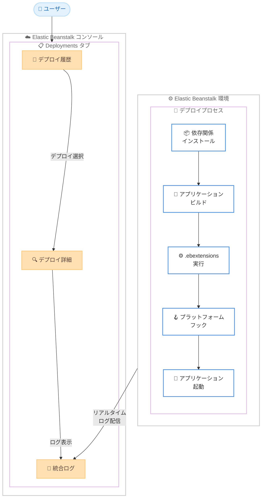

# AWS Elastic Beanstalk - Deployments タブによるデプロイ履歴とリアルタイムログの提供

**リリース日**: 2026 年 3 月 12 日
**サービス**: AWS Elastic Beanstalk
**機能**: Deployments タブ (デプロイ履歴とインプログレスログ)

## 概要

AWS Elastic Beanstalk の環境ダッシュボードに新しい Deployments タブが追加された。このタブにより、デプロイ履歴の一覧表示と、進行中のデプロイのリアルタイムなステップバイステップログの確認が可能になる。

これまでデプロイの状況を把握するには、デプロイ完了後にログを取得し、複数のソースにまたがるイベントを手動で突き合わせる必要があった。今回のアップデートにより、デプロイのステータス、イベント、詳細ログを Elastic Beanstalk コンソールの単一のインターフェースから直接確認できるようになった。デプロイが進行中であっても、リアルタイムでログを参照できる。

この機能はすべての Elastic Beanstalk Linux ベースのプラットフォームブランチでサポートされている。

**アップデート前の課題**

- デプロイが完了するまでログを取得できなかった
- デプロイの問題を診断するために、複数のソース (イベント、ログ、ヘルスダッシュボード) を横断して情報を相関させる必要があった
- デプロイ進行中のリアルタイムなステータス確認が困難だった

**アップデート後の改善**

- デプロイ進行中でもステップバイステップのログをリアルタイムで確認できるようになった
- デプロイ履歴、イベント、詳細ログを単一のインターフェースに統合
- 依存関係のインストール、アプリケーションビルド、.ebextensions、プラットフォームフック、アプリケーション起動出力など、デプロイプロセスの各ステップを統合ログで確認可能になった

## アーキテクチャ図



Deployments タブでは、デプロイプロセスの各ステップからリアルタイムでログが配信され、単一のインターフェースでデプロイ履歴、詳細、統合ログを確認できる。

## サービスアップデートの詳細

### 主要機能

1. **デプロイ履歴の一覧表示**
   - 環境の最近のデプロイ履歴を一覧で表示
   - アプリケーションデプロイ、設定変更、環境起動を含む
   - 各デプロイのステータスを一目で確認可能

2. **デプロイ詳細ビュー**
   - 各デプロイのイベントとステータスの詳細表示
   - デプロイプロセスの各ステップを時系列で追跡
   - デプロイ進行中でもリアルタイムで情報を確認可能

3. **統合デプロイログ**
   - デプロイプロセスの各ステップをキャプチャする統合ログ
   - 依存関係のインストール、アプリケーションビルド、.ebextensions、プラットフォームフック、アプリケーション起動出力を含む
   - デプロイ完了を待たずにログを参照可能

## 技術仕様

### 対応するデプロイタイプ

| デプロイタイプ | 対応状況 |
|------|------|
| アプリケーションデプロイ | 対応 |
| 設定変更 (Configuration updates) | 対応 |
| 環境起動 (Environment launches) | 対応 |

### 統合ログに含まれるステップ

| ステップ | 説明 |
|------|------|
| 依存関係インストール | パッケージマネージャーによる依存関係の解決とインストール |
| アプリケーションビルド | アプリケーションのビルドプロセス |
| .ebextensions | カスタム設定とリソースの適用 |
| プラットフォームフック | プラットフォーム固有のフック処理 |
| アプリケーション起動出力 | アプリケーションの起動時の出力 |

### API 変更履歴

| 日付 | サービス | 変更内容 |
|------|----------|----------|
| 2026/03/04 | [elasticbeanstalk](https://awsapichanges.com/archive/changes/91f8bd-elasticbeanstalk.html) | 2 updated api methods - RequestEnvironmentInfo と RetrieveEnvironmentInfo に新しい InfoType `analyze` が追加 |

### 対応プラットフォーム

この機能はすべての Elastic Beanstalk Linux ベースのプラットフォームブランチでサポートされている。Windows ベースのプラットフォームブランチについては言及されていない。

## 設定方法

### 前提条件

1. AWS Elastic Beanstalk 環境が作成済みであること
2. Linux ベースのプラットフォームブランチを使用していること
3. Elastic Beanstalk コンソールへのアクセス権限があること

### 手順

#### ステップ 1: Elastic Beanstalk コンソールで環境を開く

AWS マネジメントコンソールにサインインし、Elastic Beanstalk コンソールから対象の環境を選択する。

#### ステップ 2: Deployments タブを選択

環境ダッシュボードの Deployments タブをクリックして、デプロイ履歴の一覧を表示する。

#### ステップ 3: デプロイ詳細を確認

確認したいデプロイを選択すると、デプロイイベントと統合ログが表示される。進行中のデプロイの場合、ログはリアルタイムで更新される。

## メリット

### ビジネス面

- **デプロイ問題の迅速な解決**: デプロイ中の問題をリアルタイムで特定でき、ダウンタイムの短縮に寄与する
- **運用効率の向上**: 複数のソースを横断してログを確認する手間が不要になり、運用チームの作業効率が向上する
- **デプロイの可視性向上**: デプロイ履歴と詳細ログの統合により、チーム全体でデプロイ状況を共有しやすくなる

### 技術面

- **リアルタイムデバッグ**: デプロイ進行中にログを確認できるため、問題の早期検出と対応が可能
- **統合ログビュー**: 依存関係インストールからアプリケーション起動まで、すべてのステップを 1 つのログで追跡可能
- **デプロイパイプラインの透明性**: .ebextensions やプラットフォームフックの実行状況を詳細に把握できる

## デメリット・制約事項

### 制限事項

- Linux ベースのプラットフォームブランチのみサポート。Windows ベースのプラットフォームは対象外の可能性がある
- コンソールベースの機能であり、API や CLI からの同等のアクセス方法については明示されていない

### 考慮すべき点

- 既存の環境でも Deployments タブは利用可能であるが、過去のデプロイ履歴の表示範囲については確認が必要
- デプロイログの保持期間については公式ドキュメントで確認することを推奨

## ユースケース

### ユースケース 1: デプロイ失敗の迅速なトラブルシューティング

**シナリオ**: アプリケーションのデプロイが失敗し、原因を特定する必要がある。

**実装例**:
```
1. Elastic Beanstalk コンソール -> 環境 -> Deployments タブ
2. 失敗したデプロイを選択
3. 統合ログで失敗したステップを特定
   (例: 依存関係インストール時のエラー、.ebextensions の設定エラーなど)
```

**効果**: デプロイ完了を待たずに問題箇所を特定でき、修正サイクルを短縮できる。

### ユースケース 2: 設定変更の影響確認

**シナリオ**: 環境の設定変更 (インスタンスタイプ変更、環境変数の追加など) がデプロイプロセスに与える影響を確認したい。

**実装例**:
```
1. 設定変更を適用
2. Deployments タブでリアルタイムにデプロイの進行状況を監視
3. 各ステップの所要時間やログ出力を確認
4. 問題があれば即座に対応
```

**効果**: 設定変更によるデプロイプロセスへの影響をリアルタイムで把握し、問題の早期対応が可能になる。

### ユースケース 3: デプロイ履歴の比較と分析

**シナリオ**: 過去のデプロイと現在のデプロイを比較して、パフォーマンスや動作の変化を分析したい。

**実装例**:
```
1. Deployments タブでデプロイ履歴一覧を表示
2. 正常に完了した過去のデプロイと問題のあるデプロイを比較
3. 統合ログの各ステップの出力を比較して差異を特定
```

**効果**: デプロイ間の差異を体系的に分析でき、回帰問題やパフォーマンス劣化の原因特定に役立つ。

## 料金

Deployments タブの利用に追加料金は発生しない。AWS Elastic Beanstalk 自体に追加料金はなく、アプリケーションの保存と実行に必要な AWS リソース (EC2 インスタンス、S3 バケットなど) に対してのみ課金される。

## 利用可能リージョン

AWS Elastic Beanstalk が利用可能なすべてのリージョンで利用可能。すべての Linux ベースのプラットフォームブランチが対象。

## 関連サービス・機能

- **AWS Elastic Beanstalk AI 分析**: 2026 年 3 月 5 日にリリースされた AI ベースの環境分析機能。API 変更 (InfoType `analyze`) と関連
- **AWS CodePipeline**: CI/CD パイプラインと Elastic Beanstalk デプロイの連携
- **Amazon CloudWatch Logs**: Elastic Beanstalk 環境のログを CloudWatch Logs に転送する既存機能との補完的な利用

## 参考リンク

- [公式発表 (What's New)](https://aws.amazon.com/about-aws/whats-new/2026/03/elastic-beanstalk-deployments-tab/)
- [AWS Elastic Beanstalk ドキュメント](https://docs.aws.amazon.com/elasticbeanstalk/latest/dg/)
- [AWS Elastic Beanstalk 料金ページ](https://aws.amazon.com/elasticbeanstalk/pricing/)

## まとめ

AWS Elastic Beanstalk の Deployments タブは、デプロイの可視性とトラブルシューティング体験を大幅に改善するアップデートである。特にデプロイ進行中のリアルタイムログ確認は、問題の早期発見と迅速な対応を可能にする。Elastic Beanstalk を利用している場合は、次回のデプロイ時にこの機能を活用してデプロイプロセスの透明性を確認することを推奨する。
