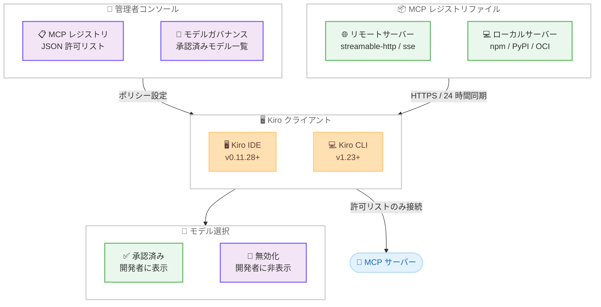

# Kiro - エンタープライズガバナンス: MCP サーバーレジストリとモデルガバナンス

**リリース日**: 2026 年 3 月 12 日 (Blog) / 2026 年 3 月 11 日 (Changelog v0.11)
**サービス**: Kiro
**機能**: MCP レジストリガバナンス、モデルガバナンス、ドキュメント添付

📊 [このアップデートのインフォグラフィックを見る](https://takech9203.github.io/aws-news-summary/20260312-kiro-enterprise-governance.html)

## 概要

Kiro v0.11 では、エンタープライズチーム向けの 2 つの重要なガバナンス機能が追加されました。1 つ目は MCP サーバーレジストリガバナンスで、管理者が組織内で許可する MCP サーバーを JSON 形式の許可リストで一元管理できます。2 つ目はモデルガバナンスで、開発者が使用できる AI モデルを管理者が制御できます。さらに、チャットへのドキュメント添付機能も追加されました。

エンタープライズのセキュリティ・コンプライアンスチームが AI コーディングツールを評価する際、MCP サーバー接続の一元管理と AI モデル使用のガバナンスは最も一貫して求められる要件です。今回のリリースでは、これらの要件に対して IDE と CLI の両方で決定的 (deterministic) に適用されるポリシー制御を提供します。

**アップデート前の課題**

- MCP サーバーの接続先を個々の開発者の裁量に委ねており、組織全体での一元的な管理手段がなかった
- 新しい AI モデルが追加されるたびに即座に全開発者に公開され、承認プロセスを適用する方法がなかった
- 実験的モデルがグローバルクロスリージョン推論を使用する場合、データレジデンシー要件との整合性を確認する前に利用可能になっていた
- チャットでドキュメントファイルを直接共有してエージェントに分析させることができなかった

**アップデート後の改善**

- 管理者が JSON 形式の MCP レジストリファイルで許可サーバーを定義し、組織全体に適用可能
- モデルガバナンスにより未承認モデルを無効化し、開発者のモデル選択を制御可能
- データレジデンシー要件に基づいて実験的モデルを無効化し、GA 移行後に有効化するワークフローが実現
- PDF、CSV、DOC、XLSX など多様な形式のドキュメントをチャットに添付し、エージェントに内容を読み取らせることが可能

## アーキテクチャ図



この図は、管理者コンソールから MCP レジストリとモデルガバナンスのポリシーが Kiro クライアントに適用され、MCP サーバー接続とモデル選択が制御される流れを示しています。

## サービスアップデートの詳細

### 主要機能

1. **MCP レジストリガバナンス**
   - 管理者が JSON 形式の許可リストファイルを作成し、HTTPS エンドポイント (Amazon S3、nginx、内部 Web サーバーなど) でホスト
   - Kiro 管理コンソールでレジストリ URL を設定すると、全 Kiro クライアントが起動時に取得し 24 時間ごとに再同期
   - レジストリにないローカル MCP サーバーは自動終了され、開発者による再追加が防止される
   - レジストリで新しいバージョンが指定されている場合、自動的に更新されたバージョンでサーバーを再起動
   - リモートサーバー (streamable-http / sse トランスポート) とローカルサーバー (npm、PyPI、OCI パッケージの stdio トランスポート) の両方をサポート
   - サーバーパラメータ (URL、パッケージ識別子、ランタイム引数) は読み取り専用で、開発者は環境変数と HTTP ヘッダーのみ追加可能
   - MCP レジストリオープンスタンダード (Anthropic が作成し、現在はオープンスタンダードとして管理) のサブセットに準拠

2. **モデルガバナンス**
   - 管理者が Kiro 管理コンソールの共有設定からモデルの有効/無効を制御
   - 無効化されたモデルは組織内の全開発者の IDE および CLI のモデルセレクターに表示されない
   - デフォルトモデルの設定が可能で、全クライアントに自動適用
   - GA モデル (US / EU リージョナル推論) と実験的モデル (グローバルクロスリージョン推論) のステータスとスコープを確認可能
   - データレジデンシー要件のある組織は、グローバル推論を使用する実験的モデルを無効化して対応可能

3. **ドキュメント添付**
   - チャット入力にファイルをペーストまたはドラッグ&ドロップで添付可能
   - 対応形式: PDF、CSV、DOC、DOCX、XLS、XLSX、HTML、TXT、Markdown
   - ドキュメントはネイティブドキュメントブロックとしてモデルに送信され、エージェントが内容を読み取り推論可能
   - 1 メッセージあたり最大 5 ドキュメントまで添付可能
   - テキストや画像と同一プロンプト内で混在利用が可能

## 技術仕様

### MCP レジストリファイル仕様

| 項目 | 詳細 |
|------|------|
| ファイル形式 | JSON |
| ホスティング | 任意の HTTPS エンドポイント |
| 同期間隔 | 24 時間ごと (起動時にも取得) |
| サーバー定義 | name (ファイル内で一意)、description、version (セマンティックバージョニング推奨) |
| リモートサーバー | `remotes` 配列で HTTP ベースのサーバーを定義 |
| ローカルサーバー | `packages` 配列で stdio サーバーを定義 (npm、PyPI、OCI) |
| 変数プレースホルダー | `${VAR}` 形式でユーザー固有の値 (認証トークンなど) を定義可能 |
| 準拠規格 | MCP レジストリオープンスタンダードのサブセット |

### モデルガバナンス対応モデル例

| モデル | ステータス | 推論スコープ |
|--------|------------|--------------|
| Claude Sonnet 4.5 | GA | US / EU リージョナル |
| Claude Sonnet 4.6 | GA | US / EU リージョナル |
| Claude Opus 4.6 | Experimental | グローバル |
| DeepSeek v3.2 | Experimental | グローバル |
| MiniMax 2.1 | Experimental | グローバル |
| Qwen3 Coder Next | Experimental | グローバル |

### 前提条件

| 項目 | 要件 |
|------|------|
| Kiro IDE | v0.11.28 以降 |
| Kiro CLI | v1.23 以降 |
| 認証方式 | AWS IAM Identity Center、Okta、または Microsoft Entra ID |
| ライセンス | Kiro Enterprise |

## 設定方法

### 前提条件

1. Kiro Enterprise ライセンスを保有していること
2. AWS IAM Identity Center、Okta、または Microsoft Entra ID で認証設定済みであること
3. Kiro IDE v0.11.28 以降、または Kiro CLI v1.23 以降がインストール済みであること

### 手順

#### ステップ 1: MCP レジストリファイルの作成

```json
{
  "servers": [
    {
      "name": "my-docs-server",
      "description": "Internal documentation MCP server",
      "version": "1.2.0",
      "remotes": [
        {
          "transport_type": "streamable-http",
          "url": "https://mcp.internal.example.com/docs"
        }
      ]
    },
    {
      "name": "my-local-tool",
      "description": "Local analysis tool from npm",
      "version": "0.5.0",
      "packages": [
        {
          "registry_type": "npm",
          "name": "@myorg/analysis-tool",
          "version": "0.5.0",
          "runtime": "node",
          "transport_type": "stdio"
        }
      ]
    }
  ]
}
```

組織で許可する MCP サーバーの一覧を JSON 形式で定義します。リモートサーバーとローカルサーバーの両方を含めることができます。

#### ステップ 2: レジストリファイルのホスティング

```bash
# 例: Amazon S3 にレジストリファイルをアップロード
aws s3 cp mcp-registry.json s3://my-bucket/kiro/mcp-registry.json
```

作成した JSON ファイルを HTTPS でアクセス可能なエンドポイント (Amazon S3、nginx、内部 Web サーバーなど) にホストします。

#### ステップ 3: 管理コンソールでの設定

Kiro 管理コンソールの Settings > Shared settings から以下を設定します。

- **MCP registry URL**: ステップ 2 でホストしたレジストリファイルの URL を入力
- **Model availability**: 有効化して、組織で承認するモデルのチェックボックスをオン/オフし、デフォルトモデルを選択

設定後、全 Kiro クライアントが次回起動時または 24 時間以内に自動的にポリシーを反映します。

## メリット

### ビジネス面

- **コンプライアンス要件への対応**: データレジデンシー要件に基づいてモデルの使用を制御し、規制対応を簡素化
- **一元的なポリシー管理**: 数百人の開発者がいる組織でも、MCP サーバーとモデルの使用ポリシーを管理者が一元的に適用
- **段階的な導入管理**: 新しいモデルや MCP サーバーを組織のレビュープロセスに基づいて段階的に有効化可能

### 技術面

- **決定的なポリシー適用**: IDE と CLI の両方でポリシーが自動的かつ決定的に適用され、開発者の手動確認に依存しない
- **自動バージョン管理**: MCP レジストリでバージョンを指定すると、Kiro が自動的にサーバーを更新バージョンで再起動
- **オープンスタンダード準拠**: MCP レジストリオープンスタンダードに準拠しており、ベンダーロックインを回避

## デメリット・制約事項

### 制限事項

- MCP レジストリガバナンスとモデルガバナンスは Kiro Enterprise ライセンスが必要
- 認証は AWS IAM Identity Center、Okta、Microsoft Entra ID のいずれかに限定
- レジストリの同期間隔は 24 時間であり、即時反映ではない (ただし起動時には取得)
- モデルガバナンスは既存モデルの無効化のみで、組織独自のモデル追加 (BYOM) には対応していない

### 考慮すべき点

- ローカル MCP サーバーの実行には、開発者のマシンに適切なパッケージランナー (npx、uvx、docker) がインストールされている必要がある
- レジストリファイルのホスティング先の可用性とセキュリティを適切に管理する必要がある
- 実験的モデルのステータスが GA に変更された際、管理者が手動でモデルを有効化する運用が必要

## ユースケース

### ユースケース 1: データレジデンシー要件のある EU 企業

**シナリオ**: EU に拠点を置く企業が、GDPR に準拠するためにデータが EU 外に流出しないよう管理する必要がある。

**実装例**:
```
モデルガバナンス設定:
- Claude Sonnet 4.5 (GA, US/EU Regional): 有効
- Claude Sonnet 4.6 (GA, US/EU Regional): 有効
- Claude Opus 4.6 (Experimental, Global): 無効
- DeepSeek v3.2 (Experimental, Global): 無効
```

**効果**: グローバルクロスリージョン推論を使用する実験的モデルをすべて無効化し、リージョナル推論を使用する GA モデルのみを開発者に提供。データレジデンシー要件に適合しつつ、最新の GA モデルを活用可能。

### ユースケース 2: MCP サーバーのセキュリティ管理

**シナリオ**: 大規模な開発組織で、数百人の開発者が各自で MCP サーバーに接続しており、セキュリティチームが接続先を把握・制御できていない。

**実装例**:
```json
{
  "servers": [
    {
      "name": "approved-docs",
      "description": "社内ドキュメント MCP サーバー",
      "version": "2.0.0",
      "remotes": [
        {
          "transport_type": "streamable-http",
          "url": "https://mcp.internal.corp.com/docs"
        }
      ]
    },
    {
      "name": "approved-jira",
      "description": "承認済み JIRA 連携サーバー",
      "version": "1.5.0",
      "packages": [
        {
          "registry_type": "npm",
          "name": "@corp/jira-mcp",
          "version": "1.5.0",
          "runtime": "node",
          "transport_type": "stdio"
        }
      ]
    }
  ]
}
```

**効果**: セキュリティチームが承認した MCP サーバーのみを許可リストに登録し、開発者は許可リスト外のサーバーに接続不可。バージョン固定によりサプライチェーンリスクも低減。

### ユースケース 3: ドキュメント分析ワークフロー

**シナリオ**: 設計書やレビュー資料を Kiro のエージェントに読み取らせて、コードとの整合性チェックや要件の確認を行いたい。

**実装例**:
```
チャット入力欄にドラッグ&ドロップ:
- requirements.pdf (要件定義書)
- api-spec.xlsx (API 仕様一覧)
- design-notes.md (設計メモ)

プロンプト: 「これらのドキュメントの内容を確認し、
現在のコードベースとの差異を分析してください」
```

**効果**: 最大 5 ドキュメントを 1 プロンプトで送信し、エージェントが内容を読み取って分析。手動での要件トレーサビリティ確認作業を効率化。

## 料金

Kiro Enterprise の料金体系の詳細については [Kiro Pricing ページ](https://kiro.dev/pricing/)を参照してください。MCP レジストリガバナンスおよびモデルガバナンスは Kiro Enterprise プランに含まれる機能であり、追加料金は発生しません。

## 利用可能リージョン

グローバル

## 関連サービス・機能

- **Kiro MCP サポート**: Kiro は初期からローカル MCP サーバー、その後リモート MCP サーバーをサポートしており、今回のレジストリガバナンスはその上位管理機能
- **Kiro エンタープライズ ID プロバイダー**: Okta および Microsoft Entra ID による認証が前提となるガバナンス機能
- **MCP レジストリオープンスタンダード**: Anthropic が作成し現在オープンスタンダードとして管理される MCP サーバー検出・配布の仕様
- **AWS IAM Identity Center**: エンタープライズ認証の選択肢の 1 つとして MCP/モデルガバナンスと連携

## 参考リンク

- 📊 [インフォグラフィック](https://takech9203.github.io/aws-news-summary/20260312-kiro-enterprise-governance.html)
- [Blog: Enterprise governance: control your MCP servers and models](https://kiro.dev/blog/enterprise-governance-mcp-and-models/)
- [Changelog: Version 0.11](https://kiro.dev/changelog/)
- [Kiro MCP ガバナンスドキュメント](https://kiro.dev/docs/enterprise/mcp-governance/)
- [Kiro Pricing](https://kiro.dev/pricing/)

## まとめ

Kiro v0.11 のエンタープライズガバナンス機能は、大規模組織での Kiro 採用における最も重要な障壁であった MCP サーバーとモデルの一元管理を実現しました。MCP レジストリオープンスタンダードに準拠したレジストリガバナンスと、データレジデンシー要件に対応可能なモデルガバナンスにより、セキュリティ・コンプライアンスチームの要件を満たしながら開発者の生産性を維持できます。Kiro Enterprise を利用中の組織は、管理コンソールから直ちにこれらのガバナンス機能を設定することを推奨します。
