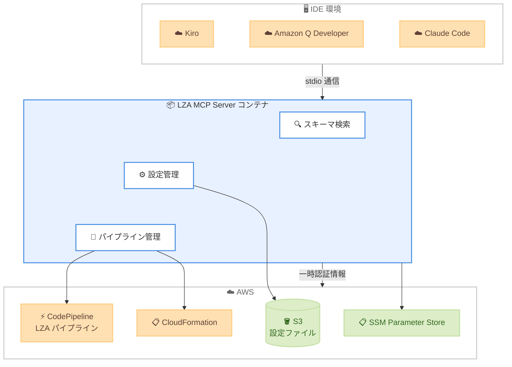

# Landing Zone Accelerator on AWS - LZA MCP Server

**リリース日**: 2026 年 3 月 12 日
**サービス**: Landing Zone Accelerator on AWS (LZA)
**機能**: LZA MCP Server for AI-assisted configuration management

📊 [このアップデートのインフォグラフィックを見る](https://takech9203.github.io/aws-news-summary/20260312-new-lza-mcp-server-ai-assisted.html)

## 概要

Landing Zone Accelerator on AWS (LZA) の Model Context Protocol (MCP) Server がオープンソースとして公開された。この MCP サーバーにより、AI アシスタントとの自然言語による対話を通じて LZA デプロイメントを管理できるようになる。

LZA MCP Server は 20 の専用ツールを提供し、複数の LZA バージョンにわたるドキュメント検索、設定管理、パイプライン監視、デプロイ失敗時の実用的なインサイト提供といった機能を備えている。コンテナ化された MCP エンドポイントとして動作し、Kiro、Amazon Q Developer、Claude Code などの IDE と互換性がある。

**アップデート前の課題**

- LZA の設定変更は手動で YAML/JSON ファイルを編集する必要があり、時間と労力がかかっていた
- LZA スキーマの理解や正しい設定値の把握には、ドキュメントを横断的に調査する必要があった
- パイプラインの失敗時に原因を特定し対処するまでのプロセスが煩雑だった
- 複数の LZA バージョン間でスキーマの違いを把握することが困難だった

**アップデート後の改善**

- AI アシスタントとの自然言語対話により、LZA の設定タスクを効率化できるようになった
- 20 の専用ツールにより、スキーマ検索、設定管理、パイプライン監視が統合的に行える
- デプロイ失敗時に自動診断と対処ガイダンスが提供される
- Universal Configuration テンプレートの統合により、コンプライアンス準拠のベースライン環境を迅速にデプロイ可能になった

## アーキテクチャ図



IDE から stdio トランスポートを介して LZA MCP Server コンテナと通信し、AWS リソースの操作は一時認証情報を使用して行われる。

## サービスアップデートの詳細

### 主要機能

1. **スキーマ検索・ディスカバリ**
   - 複数の LZA バージョンのスキーマを検索可能
   - プロパティ名、パターン、複雑性による検索をサポート
   - ビルド時にスキーマのプリプロセスを行い、サブ秒での検索を実現

2. **設定管理**
   - S3 からの LZA 設定ファイルの取得とアップロード
   - 最小構成テンプレートの生成
   - Universal Configuration テンプレートとの統合マージ

3. **パイプライン管理**
   - パイプライン実行の開始とステータス監視
   - 失敗時の詳細なエラーログ取得と診断
   - CodeBuild ログの分析とトラブルシューティングガイダンス

4. **Universal Configuration 統合**
   - エンタープライズ向けコンプライアンステンプレートの統合
   - Hub-and-Spoke、Shared VPC などのネットワークパターンをサポート
   - 複数のグローバル規制フレームワークに対応

## 技術仕様

### 提供ツール一覧

| カテゴリ | ツール名 | 機能 |
|----------|----------|------|
| AWS サービス | checkAwsConnectivity | AWS 認証情報の検証と接続確認 |
| AWS サービス | getDeployedLzaVersion | SSM Parameter Store からデプロイ済み LZA バージョン取得 |
| 設定管理 | getMinimumConfiguration | 最小 LZA 設定テンプレートの生成 |
| 設定管理 | uploadConfigurationToS3 | 設定ファイルの S3 アップロード |
| 設定管理 | getConfigurationFromS3 | S3 から現在の設定を取得 |
| パイプライン | releasePipeline | LZA パイプライン実行の開始 |
| パイプライン | getPipelineStatus | パイプライン実行状況の監視 |
| パイプライン | diagnosePipelineErrors | 失敗したパイプラインの詳細エラーログ取得と診断 |
| スキーマ | listLzaSupportedVersions | 組み込みスキーマの LZA バージョン一覧 |
| スキーマ | searchJsonSchema | LZA 設定スキーマの検索 |
| スキーマ | getFullSchema | 完全なスキーマ定義の取得 |

### 前提条件

| 項目 | 詳細 |
|------|------|
| コンテナランタイム | Docker または Finch |
| 対応 IDE | Kiro、Amazon Q Developer、Claude Code |
| LZA デプロイメント | S3 ベースの設定ストレージを使用するデプロイメント |
| 認証 | 一時認証情報 (AWS IAM Identity Center 推奨) |
| 対応 LZA バージョン | v1.12.0 以降 |
| ライセンス | Apache License 2.0 |

### IAM ポリシー

LZA MCP Server は最小権限の原則に従った IAM ポリシーを使用する。主な権限は以下の通り。

```json
{
  "Version": "2012-10-17",
  "Statement": [
    {
      "Sid": "STSAccess",
      "Effect": "Allow",
      "Action": "sts:GetCallerIdentity",
      "Resource": "*"
    },
    {
      "Sid": "SSMAccess",
      "Effect": "Allow",
      "Action": "ssm:GetParameter",
      "Resource": "arn:${PARTITION}:ssm:${HOME-REGION}:${MANAGEMENT_ACCOUNT}:parameter/accelerator/*"
    },
    {
      "Sid": "S3WriteAccess",
      "Effect": "Allow",
      "Action": ["s3:GetObject", "s3:PutObject"],
      "Resource": ["arn:${PARTITION}:s3:::${ACCELERATOR_PREFIX}-config-*/zipped/*"]
    }
  ]
}
```

## 設定方法

### 前提条件

1. Docker または Finch がインストールされていること
2. 必要な IAM 権限を持つ AWS 認証情報が設定されていること
3. MCP 対応の IDE (Kiro、Claude Code など) がインストールされていること
4. 既存の LZA デプロイメントが存在すること (パイプライン・設定操作用)

### 手順

#### ステップ 1: コンテナイメージのビルド

```bash
cd src/lza-mcp-server
make build
```

自動的に Docker または Finch を検出し、利用可能なランタイムでビルドが実行される。ビルド時に LZA スキーマの取得・処理が行われ、約 30-60 秒かかる。

#### ステップ 2: AWS 認証情報の設定

```bash
# IAM Identity Center を使用する場合
aws sso login --profile your-sso-profile
```

一時認証情報の使用が推奨される。`extract-aws-credentials.sh` スクリプトが AWS CLI プロファイルから認証情報を抽出し、コンテナに渡す。

#### ステップ 3: MCP クライアントの設定

IDE の MCP 設定ファイルにサーバー設定を追加する。

```json
{
  "mcpServers": {
    "awslabs.lza-mcp-server": {
      "command": "<REPO_PATH>/scripts/extract-aws-credentials.sh",
      "args": [
        "docker", "run",
        "--security-opt=no-new-privileges:true",
        "--cap-drop=ALL",
        "--read-only",
        "--tmpfs", "/tmp:rw,noexec,nosuid,size=200m",
        "--rm", "-i",
        "-v", "<CONFIG_PATH>:/app/lza-config:rw",
        "-e", "LZA_CONFIG_HOST_PATH=<CONFIG_PATH>",
        "-e", "AWS_ACCESS_KEY_ID",
        "-e", "AWS_SECRET_ACCESS_KEY",
        "-e", "AWS_SESSION_TOKEN",
        "-e", "AWS_REGION",
        "lza-mcp-server:local"
      ],
      "env": {
        "AWS_PROFILE": "<YOUR_AWS_PROFILE>",
        "AWS_REGION": "<YOUR_AWS_REGION>"
      }
    }
  }
}
```

Kiro IDE の場合は `.kiro/settings/mcp.json` に、Claude Desktop の場合は `~/Library/Application Support/Claude/claude_desktop_config.json` に設定を追加する。

#### ステップ 4: 接続の検証

```
Use your tools, check my AWS connectivity
```

IDE を再起動し、上記のプロンプトでサーバーの接続を検証する。

## メリット

### ビジネス面

- **運用効率の向上**: AI アシスタントを通じた自然言語での設定管理により、手動作業にかかる時間を大幅に短縮
- **コンプライアンス対応の迅速化**: Universal Configuration テンプレートにより、コンプライアンス準拠のベースライン環境を迅速にデプロイ可能
- **障害対応の高速化**: パイプライン失敗時の自動診断により、問題解決までの時間を短縮

### 技術面

- **セキュリティバイデザイン**: コンテナの読み取り専用マウント、権限の最小化、一時認証情報の使用など、セキュリティベストプラクティスに準拠
- **マルチバージョン対応**: 複数の LZA バージョンのスキーマを同時にサポートし、バージョン間の比較が可能
- **拡張性**: オープンソースのため、組織固有の要件に合わせたカスタマイズが可能

## デメリット・制約事項

### 制限事項

- CodeCommit ベースの設定リポジトリは現在サポートされていない (S3 ベースの設定ストレージのみ対応)
- LZA v1.12.0 以降のバージョンのみサポート
- コンテナランタイム (Docker または Finch) が必須

### 考慮すべき点

- AWS API レスポンスが AI モデルプロバイダーに共有されるため、組織のセキュリティ・プライバシーポリシーとの整合性を確認する必要がある
- IAM Identity Center のセッションは通常 8-12 時間で期限切れとなるため、定期的な再認証が必要
- ビルド時に含める LZA バージョン数が増えると、イメージサイズとビルド時間が比例して増加する

## ユースケース

### ユースケース 1: 新規ランディングゾーンの初期設定

**シナリオ**: 新しい AWS マルチアカウント環境を LZA で構築する際に、AI アシスタントを使って最小構成テンプレートを生成し、要件に合わせてカスタマイズする。

**実装例**:
```
LZA の最小構成テンプレートを生成して、
VPC を 3 つの AZ で構成してください
```

**効果**: 手動でスキーマを調査してテンプレートを作成する時間を大幅に削減し、設定ミスのリスクを低減できる。

### ユースケース 2: パイプライン障害の迅速な診断

**シナリオ**: LZA パイプラインが失敗した際に、AI アシスタントを使ってエラーログを分析し、根本原因と対処方法を特定する。

**実装例**:
```
LZA パイプラインが失敗しました。
エラーを診断して原因と対処方法を教えてください
```

**効果**: CodeBuild ログの分析を自動化し、トラブルシューティングガイダンスにより障害復旧時間を短縮できる。

### ユースケース 3: コンプライアンステンプレートの統合

**シナリオ**: 既存の LZA デプロイメントに Universal Configuration のコンプライアンステンプレートを統合し、規制要件に準拠したベースライン環境を構築する。

**実装例**:
```
Universal Configuration の Hub-and-Spoke ネットワークモデルを
既存の LZA 設定にマージしてください
```

**効果**: エンタープライズ向けのセキュリティ・ガバナンス設定を手動で構築する代わりに、テスト済みのテンプレートを統合することで、構築時間を短縮し品質を確保できる。

## 料金

LZA MCP Server 自体はオープンソースであり無料で利用可能。ただし、以下の AWS リソースの使用に応じた料金が発生する。

- S3 ストレージおよびリクエスト料金 (設定ファイルの保存・取得)
- CodePipeline の実行料金
- CodeBuild のビルド時間料金
- SSM Parameter Store の API リクエスト料金

## 利用可能リージョン

Landing Zone Accelerator がサポートされているすべての商用 AWS リージョンおよび AWS GovCloud (US) リージョンで利用可能。

## 関連サービス・機能

- **[Landing Zone Accelerator on AWS](https://aws.amazon.com/solutions/implementations/landing-zone-accelerator-on-aws/)**: LZA MCP Server が管理対象とする AWS ソリューション
- **AWS Control Tower**: LZA が基盤として使用するマルチアカウントガバナンスサービス
- **AWS CodePipeline**: LZA の設定変更をデプロイするために使用される CI/CD サービス
- **Model Context Protocol (MCP)**: AI アシスタントとツールを接続するオープンプロトコル

## 参考リンク

- 📊 [インフォグラフィック](https://takech9203.github.io/aws-news-summary/20260312-new-lza-mcp-server-ai-assisted.html)
- [公式発表 (What's New)](https://aws.amazon.com/about-aws/whats-new/2026/03/new-lza-mcp-server-ai-assisted/)
- [AWS Labs GitHub リポジトリ](https://github.com/awslabs/lza-mcp-server)
- [Landing Zone Accelerator on AWS ソリューションページ](https://aws.amazon.com/solutions/implementations/landing-zone-accelerator-on-aws/)

## まとめ

LZA MCP Server は、AWS ランディングゾーンの設定管理を AI アシスタントとの自然言語対話で効率化するオープンソースツールである。20 の専用ツールによるスキーマ検索、設定管理、パイプライン監視の統合により、LZA の運用負荷を大幅に軽減できる。LZA を利用している組織は、GitHub リポジトリからサーバーをビルドし、IDE に統合することで、すぐに AI アシスタントによる設定管理を開始できる。
