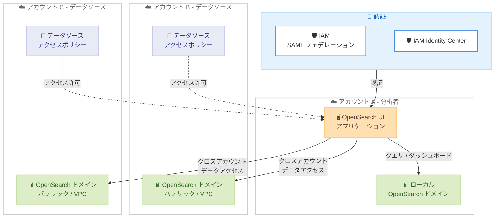

# Amazon OpenSearch Service - OpenSearch UI クロスアカウントデータアクセス

**リリース日**: 2026年3月12日
**サービス**: Amazon OpenSearch Service
**機能**: OpenSearch UI Cross Account Data Access to OpenSearch Domains

📊 [このアップデートのインフォグラフィックを見る](https://takech9203.github.io/aws-news-summary/20260312-opensearch-ui-cross-account-data-access-domains.html)

## 概要

Amazon OpenSearch Service の OpenSearch UI がクロスアカウントデータアクセスをサポートした。この機能により、単一の OpenSearch UI アプリケーションから異なる AWS アカウントにホストされた OpenSearch ドメインにアクセスし、クエリの実行やダッシュボードの構築が可能になる。

クロスアカウントデータアクセスにより、組織の境界を越えた統合的なオブザーバビリティ、検索、セキュリティ分析のワークフローを構築しやすくなる。データを単一アカウントに集約したり、コストのかかるデータパイプラインを維持する必要がなくなり、各アカウントのアクセス制御を維持したままデータをその場で分析できる。パブリックおよび VPC 構成の両方の OpenSearch ドメインに対応しており、認証方式として IAM (SAML via IAM フェデレーションを含む) と IAM Identity Center (IdC) をサポートしている。

**アップデート前の課題**

- 複数の AWS アカウントにまたがる OpenSearch ドメインのデータを統合的に分析するには、データを単一アカウントに集約する必要があった
- アカウント間でデータを参照するためにコストのかかるデータパイプラインの構築・維持が必要だった
- 異なるアカウントの OpenSearch ドメインにアクセスするにはエンドポイントの切り替えが必要で、運用が煩雑だった

**アップデート後の改善**

- 単一の OpenSearch UI から複数アカウントの OpenSearch ドメインにアクセスし、クエリやダッシュボード構築が可能になった
- データのレプリケーションや集約パイプラインが不要になり、コスト削減と運用簡素化を実現
- 同一リージョン内のクロスアカウントアクセスにより、各アカウントのアクセス制御を維持したまま統合分析が可能になった

## アーキテクチャ図



アカウント A の OpenSearch UI アプリケーションから、アカウント B およびアカウント C の OpenSearch ドメインにクロスアカウントでアクセスするフローを示している。各アカウントのデータソースアクセスポリシーによりアクセス制御が行われる。

## サービスアップデートの詳細

### 主要機能

1. **クロスアカウントデータアクセス**
   - 単一の OpenSearch UI アプリケーションから異なる AWS アカウントの OpenSearch ドメインにアクセス可能
   - 同一リージョン内のドメインが対象
   - エンドポイントの切り替えやデータレプリケーションが不要

2. **パブリック / VPC 両構成のサポート**
   - パブリックアクセス構成の OpenSearch ドメインに対応
   - VPC 構成の OpenSearch ドメインにも対応
   - 既存のネットワーク構成を変更せずにクロスアカウントアクセスが可能

3. **柔軟な認証方式**
   - IAM 認証 (SAML via IAM フェデレーションを含む) に対応
   - IAM Identity Center (IdC) によるエンドユーザー認証に対応
   - データソースアクセスポリシーによる細粒度のアクセス制御

## 技術仕様

### データソースアクセスポリシー

| 項目 | 詳細 |
|------|------|
| アクセス範囲 | 同一リージョン内のクロスアカウント |
| ドメインタイプ | パブリック、VPC |
| 認証方式 | IAM、SAML via IAM フェデレーション、IAM Identity Center |
| ポリシータイプ | DataSourceAccessPolicy |

### API 変更履歴

| 日付 | サービス | 変更内容 |
|------|----------|----------|
| 2026/03/09 | [Amazon OpenSearch Service](https://awsapichanges.com/archive/changes/dc6194-es.html) | 6 updated api methods - クロスアカウント・クロスリージョンアクセスを DataSources で有効化 |

### 更新された API メソッド

| メソッド | 変更内容 |
|----------|----------|
| AddDirectQueryDataSource | `DataSourceAccessPolicy` パラメータの追加 |
| UpdateDirectQueryDataSource | `DataSourceAccessPolicy` パラメータの追加 |
| GetDirectQueryDataSource | レスポンスに `DataSourceAccessPolicy` を含む |
| CreateApplication | `iamRoleForDataSourceArn` パラメータの追加 |
| UpdateApplication | `iamRoleForDataSourceArn` パラメータの追加 |
| GetApplication | レスポンスに `iamRoleForDataSourceArn` を含む |

### データソースアクセスポリシー例

```json
{
    "Version": "2012-10-17",
    "Statement": [
        {
            "Effect": "Allow",
            "Principal": {
                "AWS": "arn:aws:iam::<source-account-id>:root"
            },
            "Action": "es:OpenSearchDirectQueryAccess",
            "Resource": "arn:aws:es:<region>:<target-account-id>:datasource/<datasource-name>"
        }
    ]
}
```

## 設定方法

### 前提条件

1. OpenSearch UI アプリケーションが作成済みであること
2. アクセス先のアカウントに OpenSearch ドメインが存在すること
3. データソースアクセスポリシーでソースアカウントからのアクセスが許可されていること
4. IAM または IAM Identity Center による認証が設定済みであること

### 手順

#### ステップ 1: データソースアクセスポリシーの設定

ターゲットアカウント側でデータソースにアクセスポリシーを設定し、ソースアカウントからのアクセスを許可する。

```bash
aws opensearch add-direct-query-data-source \
    --data-source-name my-cross-account-ds \
    --data-source-type '{"CloudWatchLog": {"RoleArn": "arn:aws:iam::<target-account-id>:role/OpenSearchDataSourceRole"}}' \
    --open-search-arns '["arn:aws:es:<region>:<target-account-id>:domain/<domain-name>"]' \
    --data-source-access-policy '{"Version":"2012-10-17","Statement":[{"Effect":"Allow","Principal":{"AWS":"arn:aws:iam::<source-account-id>:root"},"Action":"es:OpenSearchDirectQueryAccess","Resource":"*"}]}'
```

ターゲットアカウントのデータソースに対してアクセスポリシーを設定し、ソースアカウントからの Direct Query アクセスを許可する。

#### ステップ 2: OpenSearch UI アプリケーションにデータソースを追加

ソースアカウント側で OpenSearch UI アプリケーションにクロスアカウントのデータソースを追加する。

```bash
aws opensearch update-application \
    --id <application-id> \
    --data-sources '[{
        "dataSourceArn": "arn:aws:es:<region>:<target-account-id>:datasource/<datasource-name>",
        "dataSourceDescription": "Cross-account data source",
        "iamRoleForDataSourceArn": "arn:aws:iam::<source-account-id>:role/OpenSearchCrossAccountRole"
    }]'
```

OpenSearch UI アプリケーションにクロスアカウントのデータソースを登録し、アクセスに使用する IAM ロールを指定する。

#### ステップ 3: OpenSearch UI からクエリを実行

OpenSearch UI にログインし、追加したクロスアカウントデータソースを選択してクエリやダッシュボードの構築を行う。

## メリット

### ビジネス面

- **運用コスト削減**: データレプリケーションパイプラインの構築・維持が不要になり、インフラコストと運用工数を削減できる
- **組織横断的な分析**: マルチアカウント環境で分散しているデータを統合的に分析でき、意思決定の迅速化に寄与する
- **セキュリティ体制の維持**: データを移動させずに分析できるため、各アカウントのデータガバナンスとアクセス制御を維持できる

### 技術面

- **アーキテクチャの簡素化**: データ集約レイヤーやクロスアカウントパイプラインが不要になり、システム構成がシンプルになる
- **リアルタイム分析**: データのレプリケーション遅延なく、最新データに対してクエリを実行可能
- **柔軟な認証連携**: IAM と IAM Identity Center の両方をサポートし、既存の認証基盤と容易に統合できる

## デメリット・制約事項

### 制限事項

- クロスアカウントアクセスは同一リージョン内に限定される
- ターゲットアカウント側でデータソースアクセスポリシーの設定が必要
- クロスアカウントクエリのレイテンシは、同一アカウント内のクエリと比較して若干増加する可能性がある

### 考慮すべき点

- マルチアカウント環境でのアクセスポリシー管理が複雑になる可能性がある
- VPC 構成のドメインへのクロスアカウントアクセスでは、ネットワーク接続の追加設定が必要になる場合がある
- データソースアクセスポリシーの設計は、最小権限の原則に基づいて慎重に行う必要がある

## ユースケース

### ユースケース 1: 集中型オブザーバビリティプラットフォーム

**シナリオ**: 大規模なマルチアカウント環境で各アカウントの OpenSearch ドメインにログデータが分散しており、SRE チームが統合的にモニタリングしたい。

**実装例**:
```bash
# 各アカウントのデータソースを集中分析アカウントの OpenSearch UI に登録
aws opensearch update-application \
    --id <app-id> \
    --data-sources '[
        {"dataSourceArn": "arn:aws:es:ap-northeast-1:<prod-account>:datasource/prod-logs", "dataSourceDescription": "Production logs"},
        {"dataSourceArn": "arn:aws:es:ap-northeast-1:<staging-account>:datasource/staging-logs", "dataSourceDescription": "Staging logs"}
    ]'
```

**効果**: 単一のダッシュボードから本番・ステージング環境のログを横断的に分析でき、障害の早期検知と根本原因の特定が迅速化される。

### ユースケース 2: セキュリティ分析の一元化

**シナリオ**: セキュリティチームが複数のアカウントにまたがるセキュリティログを統合的に分析し、脅威検出を行いたい。

**実装例**:
```bash
# Security Lake データソースをクロスアカウントで設定
aws opensearch add-direct-query-data-source \
    --data-source-name security-analytics \
    --data-source-type '{"SecurityLake": {"RoleArn": "arn:aws:iam::<security-account>:role/SecurityLakeRole"}}' \
    --open-search-arns '["arn:aws:es:ap-northeast-1:<security-account>:domain/security-domain"]' \
    --data-source-access-policy '{"Version":"2012-10-17","Statement":[{"Effect":"Allow","Principal":{"AWS":"arn:aws:iam::<soc-account>:root"},"Action":"es:OpenSearchDirectQueryAccess","Resource":"*"}]}'
```

**効果**: SOC チームが各アカウントのセキュリティデータをリアルタイムで分析でき、組織全体のセキュリティ可視性が向上する。

### ユースケース 3: 部門横断的な業務データ検索

**シナリオ**: 各事業部門が個別の AWS アカウントで OpenSearch を運用しており、経営層が部門横断的なデータ分析を行いたい。

**実装例**:
```bash
# 各部門のドメインを分析アカウントのアプリケーションに統合
aws opensearch create-application \
    --name "enterprise-analytics" \
    --data-sources '[
        {"dataSourceArn": "arn:aws:es:ap-northeast-1:<sales-account>:datasource/sales-data", "dataSourceDescription": "Sales data"},
        {"dataSourceArn": "arn:aws:es:ap-northeast-1:<support-account>:datasource/support-data", "dataSourceDescription": "Support data"}
    ]' \
    --iam-identity-center-options '{"enabled": true, "iamIdentityCenterInstanceArn": "arn:aws:sso:::instance/ssoins-xxxxxxxxxx"}'
```

**効果**: IAM Identity Center を活用した SSO 認証により、部門横断的なデータ分析をセキュアかつシームレスに実現できる。

## 料金

OpenSearch UI のクロスアカウントデータアクセス機能自体に追加料金は発生しない。ただし、OpenSearch ドメインの通常の料金 (インスタンス料金、ストレージ、データ転送など) は引き続き適用される。

### 料金例

| 項目 | 料金 |
|------|------|
| クロスアカウントデータアクセス機能 | 追加料金なし |
| OpenSearch ドメイン | インスタンスタイプ・サイズに基づく従量課金 |
| データ転送 | クロスアカウントのデータ転送料金が適用される場合がある |

最新の料金情報は [Amazon OpenSearch Service 料金ページ](https://aws.amazon.com/opensearch-service/pricing/)を参照。

## 利用可能リージョン

OpenSearch UI が利用可能なすべての AWS リージョンで利用可能。

## 関連サービス・機能

- **Amazon OpenSearch Service**: フルマネージドの検索・分析サービス。今回のアップデートで UI のクロスアカウントアクセスが追加された
- **OpenSearch UI**: OpenSearch Service のビジュアル分析インターフェース。クロスアカウントデータソースの統合管理が可能
- **IAM Identity Center**: エンドユーザー認証に使用。SSO によるシームレスなクロスアカウントアクセスを実現
- **Amazon Security Lake**: セキュリティデータレイクサービス。OpenSearch の Direct Query データソースとして連携可能
- **Amazon CloudWatch Logs**: ログ管理サービス。OpenSearch の Direct Query データソースとして連携可能

## 参考リンク

- 📊 [インフォグラフィック](https://takech9203.github.io/aws-news-summary/20260312-opensearch-ui-cross-account-data-access-domains.html)
- [公式発表 (What's New)](https://aws.amazon.com/about-aws/whats-new/2026/03/opensearch-ui-cross-account-data-access-domains/)
- [Amazon OpenSearch Service ドキュメント](https://docs.aws.amazon.com/opensearch-service/latest/developerguide/what-is.html)
- [Amazon OpenSearch Service 料金ページ](https://aws.amazon.com/opensearch-service/pricing/)

## まとめ

Amazon OpenSearch Service の OpenSearch UI がクロスアカウントデータアクセスをサポートしたことで、マルチアカウント環境での統合的なデータ分析が大幅に簡素化された。データレプリケーションやパイプラインの構築が不要になり、各アカウントのアクセス制御を維持したまま横断的な分析が可能である。マルチアカウント環境でオブザーバビリティやセキュリティ分析を運用しているチームは、この機能の導入を検討することを推奨する。
