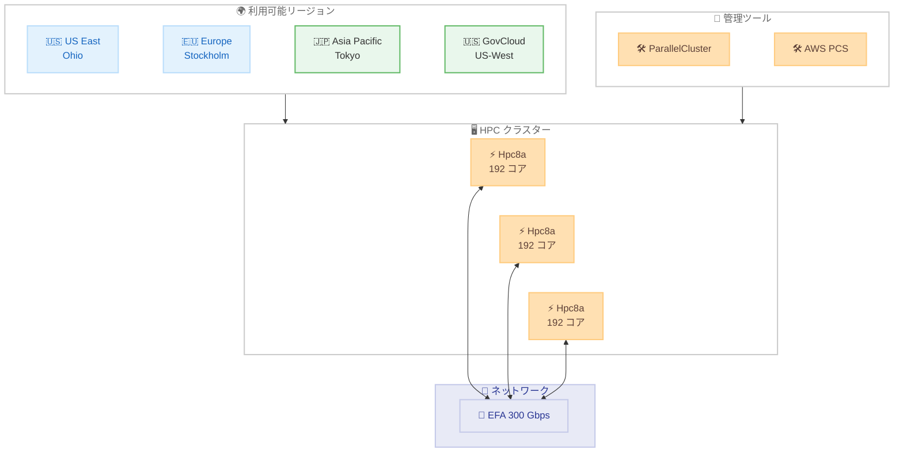

# Amazon EC2 - Hpc8a インスタンスが Asia Pacific (Tokyo) および AWS GovCloud (US-West) で利用可能に

**リリース日**: 2026 年 3 月 13 日
**サービス**: Amazon EC2
**機能**: Hpc8a インスタンスの追加リージョン展開

📊 [このアップデートのインフォグラフィックを見る](https://takech9203.github.io/aws-news-summary/20260313-amazon-ec2-hpc8a-additional-regions.html)

## 概要

Amazon EC2 Hpc8a インスタンスが Asia Pacific (Tokyo) および AWS GovCloud (US-West) リージョンで利用可能になった。Hpc8a インスタンスは 2026 年 2 月 16 日に US East (Ohio) と Europe (Stockholm) で提供開始されたハイパフォーマンスコンピューティング (HPC) 最適化インスタンスであり、今回のリージョン拡張により利用可能リージョンが 4 つに拡大した。

Hpc8a インスタンスは第 5 世代 AMD EPYC プロセッサ (コード名 Turin) を搭載し、最大周波数 4.5 GHz で動作する。Hpc7a インスタンスと比較して最大 40% の性能向上、最大 25% のコストパフォーマンス改善、最大 42% のメモリ帯域向上を実現する。計算流体力学 (CFD)、天気予報、陽解法有限要素解析 (FEA)、マルチフィジックスシミュレーションなどの計算集約型ワークロードに最適である。

東京リージョンへの展開により、日本国内の製造業、研究機関、気象関連機関が低レイテンシで HPC ワークロードを実行できるようになる。また、AWS GovCloud (US-West) への展開により、米国政府機関や規制対象ワークロードでも Hpc8a インスタンスを活用可能になった。

**アップデート前の課題**

- Hpc8a インスタンスは US East (Ohio) と Europe (Stockholm) の 2 リージョンのみで利用可能だった
- 日本のお客様は HPC ワークロードを海外リージョンで実行するか、旧世代のインスタンスを使用する必要があった
- 米国政府機関向けの GovCloud リージョンでは Hpc8a インスタンスが利用できなかった

**アップデート後の改善**

- Asia Pacific (Tokyo) リージョンで Hpc8a インスタンスが利用可能になり、日本のお客様が低レイテンシで HPC ワークロードを実行可能に
- AWS GovCloud (US-West) で利用可能になり、規制対象ワークロードでも最新 HPC インスタンスを活用可能に
- 利用可能リージョンが 4 つに拡大し、地理的な柔軟性が向上

## アーキテクチャ図



Hpc8a インスタンスの利用可能リージョンが 4 つに拡大した。緑色のノードが今回追加されたリージョンを示す。

## サービスアップデートの詳細

### 主要機能

1. **リージョン拡張**
   - Asia Pacific (Tokyo) リージョンが追加
   - AWS GovCloud (US-West) リージョンが追加
   - 既存の US East (Ohio) と Europe (Stockholm) に加え、合計 4 リージョンで利用可能

2. **第 5 世代 AMD EPYC プロセッサ搭載**
   - コード名 Turin の最新プロセッサ
   - 最大周波数 4.5 GHz
   - 192 コアによる高い並列処理能力

3. **高性能ネットワーキング**
   - 300 Gbps EFA ネットワーク帯域
   - 低レイテンシのノード間通信
   - 密結合 HPC アプリケーションに最適化

## 技術仕様

### インスタンス仕様

| 項目 | 詳細 |
|------|------|
| インスタンスタイプ | hpc8a.96xlarge |
| コア数 | 192 |
| メモリ | 768 GiB |
| プロセッサ | AMD EPYC 第 5 世代 (Turin) |
| 最大周波数 | 4.5 GHz |
| EFA 帯域 | 300 Gbps |
| Nitro | 第 6 世代 AWS Nitro Cards |

### Hpc7a との比較

| 指標 | 改善率 |
|------|--------|
| パフォーマンス | 最大 40% 向上 |
| コストパフォーマンス | 最大 25% 改善 |
| メモリ帯域 | 最大 42% 向上 |

### 利用可能リージョン一覧

| リージョン | リージョンコード | 提供開始日 |
|-----------|----------------|-----------|
| US East (Ohio) | us-east-2 | 2026 年 2 月 16 日 |
| Europe (Stockholm) | eu-north-1 | 2026 年 2 月 16 日 |
| Asia Pacific (Tokyo) | ap-northeast-1 | 2026 年 3 月 13 日 |
| AWS GovCloud (US-West) | us-gov-west-1 | 2026 年 3 月 13 日 |

## 設定方法

### 前提条件

1. 対象リージョンの AWS アカウントを保有していること
2. EC2 インスタンスの起動権限を持つ IAM ユーザーまたはロールがあること
3. Hpc8a インスタンスのサービスクォータが確認済みであること

### 手順

#### ステップ 1: 東京リージョンでインスタンスを起動

```bash
aws ec2 run-instances \
  --instance-type hpc8a.96xlarge \
  --image-id <ami-id> \
  --region ap-northeast-1 \
  --placement GroupName=<placement-group-name> \
  --network-interfaces "InterfaceType=efa,DeviceIndex=0,Groups=<security-group-id>,SubnetId=<subnet-id>"
```

EFA を有効にしたプレイスメントグループ内で、東京リージョンの Hpc8a インスタンスを起動する。

#### ステップ 2: クラスター構成

AWS ParallelCluster や AWS Parallel Computing Service (PCS) を使用してクラスターを構成する。

```yaml
# ParallelCluster 設定例
Region: ap-northeast-1
Scheduling:
  Scheduler: slurm
  SlurmQueues:
    - Name: hpc
      ComputeResources:
        - Name: hpc8a
          InstanceType: hpc8a.96xlarge
          MinCount: 0
          MaxCount: 100
```

ParallelCluster の設定ファイルで東京リージョンを指定し、Hpc8a インスタンスをコンピュートリソースとして定義する。

## メリット

### ビジネス面

- **データレジデンシー対応**: 日本国内のデータ保管要件がある HPC ワークロードを東京リージョンで実行可能
- **低レイテンシアクセス**: 日本のお客様が国内リージョンから HPC クラスターにアクセスでき、データ転送の遅延を削減
- **GovCloud 対応**: 米国政府機関や規制対象組織が最新の HPC インスタンスを利用可能
- **コスト最適化**: Hpc7a 比で最大 25% のコストパフォーマンス改善

### 技術面

- **高い計算性能**: 第 5 世代 AMD EPYC プロセッサによる最大 40% の性能向上
- **メモリ帯域の大幅向上**: 42% のメモリ帯域向上により、メモリバウンドなシミュレーションが高速化
- **高速ノード間通信**: 300 Gbps EFA により密結合ワークロードの通信遅延を最小化
- **最新 Nitro インフラストラクチャ**: 第 6 世代 AWS Nitro Cards によるセキュリティとパフォーマンスの強化

## デメリット・制約事項

### 制限事項

- インスタンスサイズは hpc8a.96xlarge の 1 種類のみ
- 購入方法は Savings Plans またはオンデマンドのみ
- 利用可能リージョンは 4 リージョンに限定

### 考慮すべき点

- 既存の Hpc7a ベースのワークロードからの移行には AMI やソフトウェアの互換性確認が必要
- EFA ドライバーの最新バージョンへの更新が推奨される
- 東京リージョンでの HPC インスタンスのサービスクォータ引き上げが必要な場合がある

## ユースケース

### ユースケース 1: 日本の製造業における衝突シミュレーション

**シナリオ**: 日本の自動車メーカーが東京リージョンで車両の衝突シミュレーションを実行し、設計イテレーションを高速化したい

**実装例**:
```bash
aws ec2 run-instances \
  --instance-type hpc8a.96xlarge \
  --image-id ami-xxxxxxxxxxxxxxxxx \
  --region ap-northeast-1 \
  --count 10 \
  --placement GroupName=crash-sim-pg \
  --network-interfaces "InterfaceType=efa,DeviceIndex=0,Groups=sg-xxx,SubnetId=subnet-xxx"
```

**効果**: 国内リージョンでの実行によりデータ転送の遅延が解消され、40% の性能向上により衝突シミュレーションの処理時間を大幅に短縮

### ユースケース 2: 気象モデルの高解像度計算

**シナリオ**: 日本の気象関連機関が、高解像度の天気予報モデルを東京リージョンの Hpc8a クラスターで運用したい

**実装例**:
```yaml
# ParallelCluster 設定例
Region: ap-northeast-1
Scheduling:
  Scheduler: slurm
  SlurmQueues:
    - Name: weather
      ComputeResources:
        - Name: hpc8a-weather
          InstanceType: hpc8a.96xlarge
          MinCount: 4
          MaxCount: 50
SharedStorage:
  - MountDir: /fsx
    Name: weather-data
    StorageType: FsxLustre
```

**効果**: 42% のメモリ帯域向上により大規模グリッドの気象モデル計算が高速化。東京リージョンでの実行により気象データの入出力遅延を最小化

### ユースケース 3: 米国政府機関向け HPC ワークロード

**シナリオ**: 米国政府機関が GovCloud 環境でコンプライアンス要件を満たしながら HPC シミュレーションを実行したい

**実装例**:
```bash
aws ec2 run-instances \
  --instance-type hpc8a.96xlarge \
  --image-id ami-xxxxxxxxxxxxxxxxx \
  --region us-gov-west-1 \
  --placement GroupName=gov-hpc-pg \
  --network-interfaces "InterfaceType=efa,DeviceIndex=0,Groups=sg-xxx,SubnetId=subnet-xxx"
```

**効果**: GovCloud 環境で最新の HPC インスタンスを利用でき、FedRAMP High や ITAR などの規制要件に準拠しながら計算集約型ワークロードを実行可能

## 料金

Hpc8a インスタンスは Savings Plans またはオンデマンドで購入可能。リージョンによって料金が異なる。Hpc7a 比で最大 25% のコストパフォーマンス改善により、同等の計算を低コストで実行できる。

詳細な料金については、[Amazon EC2 Hpc8a インスタンスページ](https://aws.amazon.com/ec2/instance-types/hpc8a/) を参照。

## 利用可能リージョン

Hpc8a インスタンスは以下のリージョンで利用可能です。

- US East (Ohio) - us-east-2
- Europe (Stockholm) - eu-north-1
- **Asia Pacific (Tokyo) - ap-northeast-1** (今回追加)
- **AWS GovCloud (US-West) - us-gov-west-1** (今回追加)

## 関連サービス・機能

- **Amazon EC2 Hpc7a**: Hpc8a の前世代の HPC 最適化インスタンス
- **AWS ParallelCluster**: HPC クラスターの自動デプロイと管理
- **AWS Parallel Computing Service (PCS)**: マネージド HPC サービス
- **Elastic Fabric Adapter (EFA)**: 低レイテンシ・高スループットのネットワーキング
- **Amazon FSx for Lustre**: HPC ワークロード向け高性能ファイルシステム

## 参考リンク

- 📊 [インフォグラフィック](https://takech9203.github.io/aws-news-summary/20260313-amazon-ec2-hpc8a-additional-regions.html)
- [公式発表 (What's New)](https://aws.amazon.com/about-aws/whats-new/2026/03/amazon-ec2-hpc8a-additional-regions/)
- [初回リリースレポート](reports/2026/2026-02-16-announcing-amazon-ec2-hpc8a-instances.md)
- [Amazon EC2 Hpc8a インスタンスページ](https://aws.amazon.com/ec2/instance-types/hpc8a/)

## まとめ

Amazon EC2 Hpc8a インスタンスが Asia Pacific (Tokyo) および AWS GovCloud (US-West) リージョンで利用可能になり、利用可能リージョンが 4 つに拡大した。東京リージョンへの展開により、日本の製造業や研究機関が低レイテンシで最新の HPC インスタンスを活用でき、CFD、天気予報、FEA などの計算集約型ワークロードを国内リージョンで実行可能になった。東京リージョンで HPC ワークロードを検討しているお客様は、Hpc7a 比で最大 40% の性能向上と 25% のコストパフォーマンス改善を提供する Hpc8a インスタンスへの移行を推奨する。
