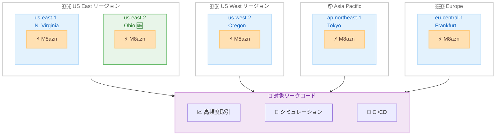

# Amazon EC2 M8azn - US East (Ohio) リージョンで利用可能に

**リリース日**: 2026 年 3 月 13 日
**サービス**: Amazon EC2
**機能**: M8azn インスタンスのリージョン拡大

📊 [このアップデートのインフォグラフィックを見る](https://takech9203.github.io/aws-news-summary/20260313-amazon-ec2-m8azn-instances-ohio.html)

## 概要

AWS は、Amazon EC2 M8azn インスタンスが US East (Ohio) リージョン (us-east-2) で利用可能になったことを発表しました。M8azn インスタンスは第 5 世代 AMD EPYC プロセッサ (コードネーム Turin) を搭載し、クラウドで最大 5GHz の CPU 周波数を提供する高周波数汎用インスタンスです。

M8azn インスタンスは 2026 年 2 月に一般提供が開始され、前世代の M5zn インスタンスと比較して最大 2 倍のコンピューティング性能、4.3 倍のメモリ帯域幅、10 倍の L3 キャッシュを提供します。今回のリージョン拡大により、US East (Ohio) リージョンを利用するお客様も、レイテンシに敏感なワークロードで M8azn インスタンスの高周波数性能を活用できるようになりました。

**アップデート前の課題**

- US East (Ohio) リージョンでは M8azn インスタンスが利用できず、高周波数コンピューティングが必要なワークロードで最新世代のインスタンスを活用できなかった
- Ohio リージョンに展開されたレイテンシに敏感なアプリケーションでは、M5zn インスタンスの性能に制限されていた
- マルチリージョン構成で M8azn を使用する場合、Ohio リージョンだけ異なるインスタンスタイプを使用する必要があった

**アップデート後の改善**

- US East (Ohio) リージョンで M8azn インスタンスを利用でき、5GHz の高周波数 CPU 性能を活用できるようになった
- Ohio リージョンのワークロードで M5zn から M8azn への移行が可能になり、最大 2 倍のコンピューティング性能向上を実現
- US East の 2 つのリージョン (Virginia、Ohio) で M8azn を利用でき、マルチリージョン構成の統一が容易になった

## アーキテクチャ図



M8azn インスタンスが利用可能な全 5 リージョンを示しています。今回新たに US East (Ohio) が追加されました。

## サービスアップデートの詳細

### 主要機能

1. **5GHz 最大 CPU 周波数**
   - クラウドで利用可能な最高の CPU 周波数
   - 第 5 世代 AMD EPYC (Turin) プロセッサを搭載
   - M5zn と比較して最大 2 倍のコンピューティング性能

2. **大幅に強化されたメモリ性能**
   - M5zn と比較して 4.3 倍のメモリ帯域幅
   - 10 倍の L3 キャッシュサイズ
   - メモリ対 vCPU 比率は 4:1

3. **第 6 世代 Nitro Cards によるネットワーキング**
   - M5zn と比較して 2 倍のネットワークスループット
   - 3 倍の EBS スループット
   - AWS Nitro System による高効率な仮想化

## 技術仕様

### インスタンスサイズ

| サイズ | vCPU | メモリ (GiB) |
|--------|------|--------------|
| m8azn.large | 2 | 8 |
| m8azn.xlarge | 4 | 16 |
| m8azn.2xlarge | 8 | 32 |
| m8azn.4xlarge | 16 | 64 |
| m8azn.8xlarge | 32 | 128 |
| m8azn.12xlarge | 48 | 192 |
| m8azn.24xlarge | 96 | 384 |
| m8azn.metal | 96 | 384 |
| m8azn.metal-24xl | 96 | 384 |

### 性能比較 (M5zn 対比)

| 指標 | 改善率 |
|------|--------|
| コンピューティング性能 | 最大 2 倍 |
| メモリ帯域幅 | 4.3 倍 |
| L3 キャッシュ | 10 倍 |
| ネットワークスループット | 2 倍 |
| EBS スループット | 3 倍 |

## 設定方法

### 前提条件

1. 適切な IAM 権限を持つ AWS アカウント
2. US East (Ohio) リージョン (us-east-2) へのアクセス
3. 必要に応じた EC2 サービスクォータの確認と引き上げ

### 手順

#### ステップ 1: AWS CLI でインスタンスを起動

```bash
aws ec2 run-instances \
  --instance-type m8azn.xlarge \
  --image-id ami-xxxxxxxxxxxxxxxxx \
  --region us-east-2 \
  --key-name my-key-pair \
  --security-group-ids sg-xxxxxxxxxxxxxxxxx \
  --subnet-id subnet-xxxxxxxxxxxxxxxxx
```

このコマンドは US East (Ohio) リージョンで m8azn.xlarge インスタンスを起動します。

#### ステップ 2: 利用可能なインスタンスタイプを確認

```bash
aws ec2 describe-instance-types \
  --filters "Name=instance-type,Values=m8azn*" \
  --region us-east-2 \
  --query "InstanceTypes[].{Type:InstanceType,vCPU:VCpuInfo.DefaultVCpus,Memory:MemoryInfo.SizeInMiB}" \
  --output table
```

このコマンドは US East (Ohio) リージョンで利用可能な M8azn インスタンスタイプの一覧を表示します。

## メリット

### ビジネス面

- **マルチリージョン展開の柔軟性**: US East の 2 リージョンで M8azn を利用でき、高可用性アーキテクチャの構築が容易に
- **レイテンシの最適化**: Ohio リージョンに近いエンドユーザーに対して、高周波数コンピューティングを低レイテンシで提供可能
- **コスト効率の向上**: M5zn からの移行により、同じワークロードをより少ないリソースで処理可能

### 技術面

- **5GHz CPU 周波数**: シングルスレッド性能が重要なワークロードで最高のパフォーマンスを実現
- **大容量 L3 キャッシュ**: 10 倍のキャッシュサイズにより、キャッシュミスを削減しレイテンシを低減
- **高帯域幅 I/O**: ネットワークと EBS の両方で M5zn から大幅に向上した帯域幅を活用可能

## デメリット・制約事項

### 制限事項

- 全リージョンで利用可能ではなく、現時点では 5 リージョンに限定
- 高周波数プロセッサのため、vCPU あたりの料金が他の汎用インスタンスよりも高い可能性
- ベアメタルを含む 9 サイズのみの提供

### 考慮すべき点

- M5zn からの移行時はアプリケーションの互換性テストを推奨
- 高周波数が必要ないワークロードでは、M8a や M8g などの他のインスタンスファミリーの方がコスト効率が高い場合がある
- Ohio リージョンでの新規利用時はサービスクォータの確認が必要

## ユースケース

### ユースケース 1: マルチリージョン高頻度取引

**シナリオ**: 金融機関が US East の 2 リージョンで冗長化された高頻度取引システムを運用

**実装例**:
```bash
# Ohio リージョンに取引サーバーを配置
aws ec2 run-instances \
  --instance-type m8azn.12xlarge \
  --region us-east-2 \
  --placement AvailabilityZone=us-east-2a \
  --network-interfaces "DeviceIndex=0,SubnetId=subnet-xxx,Groups=sg-xxx"
```

**効果**: Virginia と Ohio の両リージョンで 5GHz の高周波数インスタンスを使用でき、フェイルオーバー時も同等のパフォーマンスを維持

### ユースケース 2: CI/CD パイプラインの高速化

**シナリオ**: Ohio リージョンに展開されたインフラストラクチャに対する CI/CD パイプラインのビルド・テスト時間を短縮

**実装例**:
```bash
# Ohio リージョンで CI/CD ランナーを起動
aws ec2 run-instances \
  --instance-type m8azn.8xlarge \
  --region us-east-2 \
  --tag-specifications 'ResourceType=instance,Tags=[{Key=Role,Value=ci-runner}]'
```

**効果**: 5GHz の高周波数 CPU により、コンパイルやテスト実行時間を大幅に短縮

### ユースケース 3: リアルタイムシミュレーション

**シナリオ**: 自動車メーカーが Ohio リージョンで車両シミュレーションを実行

**実装例**:
```bash
# ベアメタルインスタンスで大規模シミュレーションを実行
aws ec2 run-instances \
  --instance-type m8azn.metal \
  --region us-east-2 \
  --block-device-mappings "DeviceName=/dev/sda1,Ebs={VolumeSize=500,VolumeType=gp3,Iops=16000}"
```

**効果**: 96 vCPU、384 GiB メモリのベアメタルインスタンスで大規模シミュレーションを Ohio リージョンで実行可能

## 料金

M8azn インスタンスの料金は On-Demand、Savings Plans、Spot インスタンスの 3 種類の購入オプションで利用可能です。具体的な料金は AWS EC2 料金ページを参照してください。

### 購入オプション

| オプション | 特徴 |
|------------|------|
| On-Demand | 長期契約なしで時間単位の料金 |
| Savings Plans | 1 年または 3 年の契約で割引 |
| Spot | 未使用キャパシティを最大 90% 割引で利用 |

## 利用可能リージョン

今回のアップデートにより、M8azn インスタンスは以下の 5 リージョンで利用可能です。

- US East (N. Virginia) - us-east-1
- **US East (Ohio) - us-east-2** (今回追加)
- US West (Oregon) - us-west-2
- Asia Pacific (Tokyo) - ap-northeast-1
- Europe (Frankfurt) - eu-central-1

## 関連サービス・機能

- **Amazon EC2 Auto Scaling**: M8azn インスタンスを使用したスケーリンググループの構築
- **AWS Nitro System**: 第 6 世代 Nitro Cards によるセキュリティと性能の基盤
- **Amazon EBS**: 高スループット EBS ボリュームとの組み合わせで 3 倍の I/O 性能を活用
- **Elastic Load Balancing**: 複数の M8azn インスタンス間でトラフィックを分散

## 参考リンク

- 📊 [インフォグラフィック](https://takech9203.github.io/aws-news-summary/20260313-amazon-ec2-m8azn-instances-ohio.html)
- [公式発表 (What's New)](https://aws.amazon.com/about-aws/whats-new/2026/03/amazon-ec2-m8azn-instances-ohio/)
- [Amazon EC2 M8azn インスタンスページ](https://aws.amazon.com/ec2/instance-types/m8a)
- [Amazon EC2 料金ページ](https://aws.amazon.com/ec2/pricing/)
- [AWS Nitro System](https://aws.amazon.com/ec2/nitro/)

## まとめ

Amazon EC2 M8azn インスタンスが US East (Ohio) リージョンで利用可能になり、クラウドで最大 5GHz の CPU 周波数を提供する高周波数インスタンスの利用範囲が拡大しました。Ohio リージョンで高頻度取引、リアルタイム分析、シミュレーションモデリングなどのレイテンシに敏感なワークロードを運用しているお客様は、M5zn からの移行を検討し、最大 2 倍のコンピューティング性能向上を活用してください。
