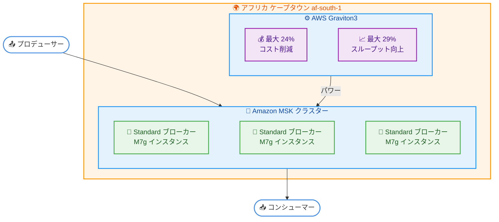

# Amazon MSK - Standard ブローカーで Graviton3 インスタンス (M7g) がアフリカ (ケープタウン) リージョンで利用可能に

**リリース日**: 2026年03月13日
**サービス**: Amazon Managed Streaming for Apache Kafka (Amazon MSK)
**機能**: Standard ブローカー向け Graviton3 (M7g) インスタンスサポート

[このアップデートのインフォグラフィックを見る](https://takech9203.github.io/aws-news-summary/20260313-amazon-msk-standardm7g-cpt-region.html)

## 概要

AWS は 2026 年 3 月 13 日、Amazon MSK のプロビジョニングクラスターにおいて、Standard ブローカーで AWS Graviton3 ベースの M7g インスタンスがアフリカ (ケープタウン) リージョンで利用可能になったことを発表しました。

Graviton3 ベースの M7g インスタンスは、同等の M5 インスタンスと比較して最大 24% のコンピューティングコスト削減と最大 29% の読み書きスループット向上を実現します。アフリカリージョンで Apache Kafka ワークロードを運用するユーザーにとって、コスト効率とパフォーマンスの両面で大きなメリットをもたらすアップデートです。

**アップデート前の課題**

- アフリカ (ケープタウン) リージョンでは Amazon MSK の Standard ブローカーで Graviton3 ベースの M7g インスタンスが利用できなかった
- アフリカリージョンの MSK ユーザーは M5 インスタンスに依存しており、最新世代の Graviton プロセッサーによるコスト削減とスループット向上を享受できなかった
- M5 インスタンスでは、大量のストリーミングデータを処理する際にコストパフォーマンスが最適ではなかった

**アップデート後の改善**

- アフリカ (ケープタウン) リージョンで MSK Standard ブローカーに M7g インスタンスを選択できるようになった
- M5 インスタンスと比較して最大 24% のコンピューティングコスト削減を実現できるようになった
- M5 インスタンスと比較して最大 29% 高い読み書きスループットを得られるようになった

## アーキテクチャ図



この図は、アフリカ (ケープタウン) リージョンで Graviton3 ベースの M7g インスタンスを使用した Amazon MSK Standard ブローカークラスターの構成と、プロデューサー・コンシューマーとの関係を示しています。

## サービスアップデートの詳細

### 主要機能

1. **Graviton3 ベース M7g インスタンスサポート**
   - Amazon MSK の Standard ブローカーで M7g インスタンスタイプを選択可能
   - AWS Graviton3 プロセッサーによる高いコンピューティング効率
   - Arm ベースアーキテクチャによるエネルギー効率の向上

2. **パフォーマンス向上**
   - M5 インスタンスと比較して最大 29% 高い書き込みおよび読み取りスループット
   - ストリーミングデータの処理能力が向上し、高スループットのワークロードに対応

3. **コスト最適化**
   - M5 インスタンスと比較して最大 24% のコンピューティングコスト削減
   - 同等以上のパフォーマンスをより低いコストで実現

## 技術仕様

### M7g と M5 の比較

| 項目 | M7g (Graviton3) | M5 |
|------|-----------------|-----|
| プロセッサー | AWS Graviton3 (Arm) | Intel Xeon Platinum (x86) |
| コンピューティングコスト | M5 比最大 24% 削減 | ベースライン |
| 読み書きスループット | M5 比最大 29% 向上 | ベースライン |
| アーキテクチャ | Arm64 | x86_64 |

### 利用可能な M7g インスタンスサイズ

Amazon MSK Standard ブローカーで利用可能な M7g インスタンスサイズの詳細については、[Amazon MSK デベロッパーガイド](https://docs.aws.amazon.com/msk/latest/developerguide/)をご確認ください。

## 設定方法

### 前提条件

1. AWS アカウントと Amazon MSK に対する適切な IAM 権限
2. アフリカ (ケープタウン) リージョン (af-south-1) が有効化されていること
3. MSK クラスター用の VPC、サブネット、セキュリティグループが設定済みであること

### 手順

#### ステップ 1: 新規 MSK クラスターを M7g ブローカーで作成

```bash
# M7g インスタンスを使用した MSK クラスターの作成
aws kafka create-cluster \
  --cluster-name my-msk-cluster \
  --broker-node-group-info '{
    "InstanceType": "kafka.m7g.xlarge",
    "ClientSubnets": ["subnet-xxxxxxxxxxxxxxxxx", "subnet-yyyyyyyyyyyyyyyyy", "subnet-zzzzzzzzzzzzzzzzz"],
    "SecurityGroups": ["sg-xxxxxxxxxxxxxxxxx"],
    "StorageInfo": {
      "EbsStorageInfo": {
        "VolumeSize": 100
      }
    }
  }' \
  --kafka-version "3.6.0" \
  --number-of-broker-nodes 3 \
  --region af-south-1
```

このコマンドは、アフリカ (ケープタウン) リージョンに M7g インスタンスを使用した 3 ブローカーの MSK クラスターを作成します。

#### ステップ 2: 既存の M5 クラスターを M7g にアップグレード

```bash
# 既存クラスターのブローカータイプを M7g に更新
aws kafka update-broker-type \
  --cluster-arn arn:aws:kafka:af-south-1:123456789012:cluster/my-cluster/xxxxxxxx-xxxx-xxxx-xxxx-xxxxxxxxxxxx-x \
  --current-version "K1XXXXXXXXXXXXXXXX" \
  --target-instance-type "kafka.m7g.xlarge" \
  --region af-south-1
```

このコマンドは、既存の MSK クラスターのブローカーインスタンスタイプを M7g にアップグレードします。アップグレードはローリング方式で実行され、クラスターの可用性を維持しながら実施されます。

#### ステップ 3: アップグレード状況の確認

```bash
# クラスターの状態を確認
aws kafka describe-cluster \
  --cluster-arn arn:aws:kafka:af-south-1:123456789012:cluster/my-cluster/xxxxxxxx-xxxx-xxxx-xxxx-xxxxxxxxxxxx-x \
  --region af-south-1 \
  --query "ClusterInfo.{State:State,BrokerType:BrokerNodeGroupInfo.InstanceType}"
```

このコマンドは、クラスターの現在の状態とブローカーインスタンスタイプを確認します。

## メリット

### ビジネス面

- **コスト削減**: M5 インスタンスから M7g への移行により最大 24% のコンピューティングコスト削減を実現し、ストリーミングデータ基盤の運用コストを低減
- **アフリカリージョンでのレイテンシー最適化**: アフリカのエンドユーザーに近い場所で Kafka クラスターを運用することで、データストリーミングのレイテンシーを短縮
- **サステナビリティ**: Graviton3 プロセッサーは同等の x86 プロセッサーと比較してエネルギー効率が高く、カーボンフットプリントの削減に貢献

### 技術面

- **スループット向上**: M5 比で最大 29% 高い読み書きスループットにより、高トラフィックのストリーミングワークロードに対応
- **インプレースアップグレード**: 既存の M5 クラスターを Amazon MSK コンソールまたは CLI から M7g にアップグレード可能で、クラスターの再作成が不要
- **互換性**: Apache Kafka はプラットフォーム非依存のため、Arm アーキテクチャへの移行時にアプリケーション側の変更が不要

## デメリット・制約事項

### 制限事項

- 本アップデートはアフリカ (ケープタウン) リージョンのみが対象であり、他のリージョンでの M7g サポート状況は別途確認が必要
- アフリカ (ケープタウン) リージョンはオプトインリージョンであり、利用前にアカウントでリージョンを有効化する必要がある
- Standard ブローカーが対象であり、Express ブローカーについては別途確認が必要

### 考慮すべき点

- M5 から M7g へのアップグレード中はローリング方式でブローカーが再起動されるため、一時的にクラスターのパフォーマンスが低下する可能性がある
- アップグレード前に、本番環境と同等のテスト環境でパフォーマンスを検証することを推奨

## ユースケース

### ユースケース 1: アフリカ向けリアルタイムイベント処理

**シナリオ**: 南アフリカの金融サービス企業が、取引イベントをリアルタイムで処理し、不正検知や取引分析を行いたい

**実装例**:
```bash
# M7g ブローカーを使用した高スループット MSK クラスターの作成
aws kafka create-cluster \
  --cluster-name trading-events-cluster \
  --broker-node-group-info '{
    "InstanceType": "kafka.m7g.2xlarge",
    "ClientSubnets": ["subnet-aaa", "subnet-bbb", "subnet-ccc"],
    "SecurityGroups": ["sg-xxx"],
    "StorageInfo": {"EbsStorageInfo": {"VolumeSize": 500}}
  }' \
  --kafka-version "3.6.0" \
  --number-of-broker-nodes 3 \
  --region af-south-1
```

**効果**: M7g インスタンスにより最大 29% 高いスループットを実現し、取引イベントの処理遅延を低減。同時に最大 24% のコスト削減によりインフラコストを最適化

### ユースケース 2: IoT データストリーミング

**シナリオ**: アフリカの通信事業者が、IoT デバイスからの大量のテレメトリデータを収集・処理するためのストリーミング基盤を構築したい

**実装例**:
```bash
# IoT データ収集用 MSK クラスター
aws kafka create-cluster \
  --cluster-name iot-telemetry-cluster \
  --broker-node-group-info '{
    "InstanceType": "kafka.m7g.xlarge",
    "ClientSubnets": ["subnet-aaa", "subnet-bbb", "subnet-ccc"],
    "SecurityGroups": ["sg-xxx"],
    "StorageInfo": {"EbsStorageInfo": {"VolumeSize": 1000}}
  }' \
  --kafka-version "3.6.0" \
  --number-of-broker-nodes 3 \
  --region af-south-1
```

**効果**: ケープタウンリージョンでの低レイテンシーなデータ収集と、Graviton3 による高いコスト効率を両立。大量の IoT デバイスからのデータストリームを効率的に処理

### ユースケース 3: 既存 M5 クラスターのコスト最適化

**シナリオ**: 既にケープタウンリージョンで M5 ベースの MSK クラスターを運用している企業が、コスト削減とパフォーマンス向上を目的にアップグレードしたい

**実装例**:
```bash
# 既存クラスターを M7g にアップグレード
aws kafka update-broker-type \
  --cluster-arn arn:aws:kafka:af-south-1:123456789012:cluster/existing-cluster/xxx-x \
  --current-version "K1XXXXXXXXXXXXXXXX" \
  --target-instance-type "kafka.m7g.xlarge" \
  --region af-south-1
```

**効果**: アプリケーション側の変更なしにインプレースアップグレードが可能。最大 24% のコスト削減と最大 29% のスループット向上を即座に実現

## 料金

Amazon MSK の料金は、ブローカーインスタンスタイプ、ブローカー数、ストレージ容量、データ転送量によって異なります。M7g インスタンスは M5 インスタンスと比較して最大 24% のコンピューティングコスト削減を実現します。

詳細な料金については、[Amazon MSK 料金ページ](https://aws.amazon.com/msk/pricing/)をご確認ください。

購入オプション:

- **オンデマンド**: 使用した分だけ時間単位で支払い
- **1 年リザーブド**: 1 年のコミットメントで割引 (部分前払い、全前払い、前払いなし)
- **3 年リザーブド**: 3 年のコミットメントでさらに割引

## 利用可能リージョン

今回のアップデートにより、Amazon MSK Standard ブローカーの M7g インスタンスはアフリカ (ケープタウン) リージョン (af-south-1) で利用可能になりました。

他のリージョンでの M7g インスタンスの利用可能状況については、[Amazon MSK デベロッパーガイド](https://docs.aws.amazon.com/msk/latest/developerguide/)をご確認ください。

## 関連サービス・機能

- **Amazon MSK Serverless**: プロビジョニング不要でオートスケーリングする MSK オプション。インスタンスタイプの選択が不要な場合に適している
- **Amazon MSK Connect**: Apache Kafka Connect と互換性のあるフルマネージドコネクターサービス。MSK クラスターとデータソース・シンク間のデータ連携を簡素化
- **AWS Graviton**: Arm ベースの AWS 独自設計プロセッサーファミリー。M7g インスタンスは第 3 世代の Graviton3 を搭載
- **Amazon CloudWatch**: MSK クラスターのモニタリングに使用。ブローカーの CPU 使用率、ディスク使用量、ネットワークスループットなどのメトリクスを監視

## 参考リンク

- [インフォグラフィック](https://takech9203.github.io/aws-news-summary/20260313-amazon-msk-standardm7g-cpt-region.html)
- [公式発表 (What's New)](https://aws.amazon.com/about-aws/whats-new/2026/03/amazon-msk-standardm7g-cpt-region/)
- [Amazon MSK デベロッパーガイド](https://docs.aws.amazon.com/msk/latest/developerguide/)
- [Amazon MSK 料金ページ](https://aws.amazon.com/msk/pricing/)
- [AWS Graviton プロセッサー](https://aws.amazon.com/ec2/graviton/)

## まとめ

Amazon MSK の Standard ブローカーで Graviton3 ベースの M7g インスタンスがアフリカ (ケープタウン) リージョンで利用可能になりました。M5 インスタンスと比較して最大 24% のコスト削減と最大 29% のスループット向上を実現するため、ケープタウンリージョンで MSK クラスターを運用しているユーザーは M7g へのアップグレードを検討してください。新規クラスター作成時は M7g インスタンスを選択し、既存クラスターは Amazon MSK コンソールまたは CLI から簡単にアップグレードできます。
