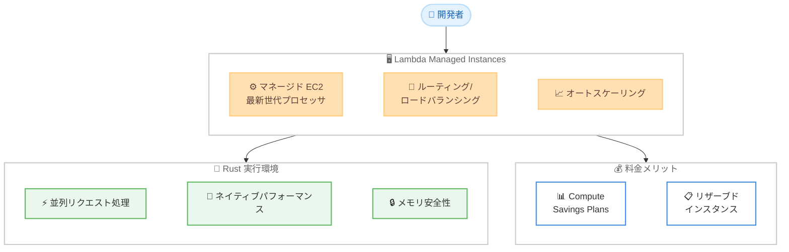

# AWS Lambda Managed Instances - Rust サポートの追加

**リリース日**: 2026 年 3 月 13 日
**サービス**: AWS Lambda
**機能**: Lambda Managed Instances での Rust プログラミング言語サポート

[このアップデートのインフォグラフィックを見る](https://takech9203.github.io/aws-news-summary/20260313-aws-lambda-managed-instances-rust.html)

## 概要

AWS Lambda Managed Instances が Rust プログラミング言語をサポートするようになりました。開発者は Lambda が管理する Amazon EC2 インスタンス上で高パフォーマンスな Rust ベースの関数を実行でき、Lambda の運用のシンプルさを維持しながら、Rust の性能と効率性を活用できます。

Lambda Managed Instances は、最新世代のプロセッサや高帯域幅ネットワーキングを含む専用のコンピュート構成へのアクセスを提供します。ルーティング、ロードバランシング、オートスケーリングが組み込まれたフルマネージド EC2 インスタンスであり、運用オーバーヘッドがありません。さらに、Compute Savings Plans やリザーブドインスタンスなどの EC2 の料金上のメリットも活用できます。

Rust サポートにより、各実行環境内での並列リクエスト処理が可能となり、Lambda Managed Instances と Rust の組み合わせで利用効率と価格性能が最大化されます。

**アップデート前の課題**

- Lambda Managed Instances で Rust を使用するための公式サポートがなく、カスタムランタイムなどの回避策が必要だった
- Rust の高いパフォーマンスを Lambda 環境で最大限に活かすことが困難だった
- パフォーマンスクリティカルなアプリケーションでは、サーバーレスの利便性を犠牲にして EC2 を直接管理する必要があった

**アップデート後の改善**

- Lambda Managed Instances で Rust が公式にサポートされ、ネイティブなパフォーマンスを活用できるようになった
- 各実行環境内で並列リクエスト処理が可能になり、スループットが向上した
- サーバーレスの運用のシンプルさと EC2 の料金メリットを組み合わせて、Rust アプリケーションを効率的に実行できるようになった

## アーキテクチャ図



この図は、Lambda Managed Instances における Rust 実行環境の構成と、マネージド EC2 インスタンスのコンポーネント、料金メリットの関係を示しています。

## サービスアップデートの詳細

### 主要機能

1. **Rust ネイティブサポート**
   - Lambda Managed Instances で Rust プログラミング言語を公式にサポート
   - Rust のゼロコスト抽象化とメモリ安全性を Lambda 環境で活用可能
   - カスタムランタイムの設定が不要で、シンプルなデプロイが可能

2. **並列リクエスト処理**
   - 各実行環境内で複数のリクエストを並列に処理可能
   - Rust の非同期ランタイムを活用した高スループット処理
   - 実行環境の利用効率を最大化し、コスト効率を向上

3. **Lambda Managed Instances との統合**
   - 最新世代プロセッサと高帯域幅ネットワーキングを活用
   - ルーティング、ロードバランシング、オートスケーリングが自動管理
   - Compute Savings Plans やリザーブドインスタンスによるコスト最適化

## 技術仕様

### サポート概要

| 項目 | 詳細 |
|------|------|
| サポート言語 | Rust |
| 実行環境 | Lambda Managed Instances |
| インフラストラクチャ | マネージド Amazon EC2 インスタンス |
| 並列処理 | 実行環境内での並列リクエスト処理に対応 |
| スケーリング | 自動ロードバランシング・オートスケーリング |
| 料金モデル | EC2 ベース - Compute Savings Plans / リザーブドインスタンス対応 |

### API 変更履歴

現時点で Rust サポートに関連する API の変更は確認されていません。

### IAM ポリシーの例

```json
{
  "Version": "2012-10-17",
  "Statement": [
    {
      "Effect": "Allow",
      "Action": [
        "lambda:CreateFunction",
        "lambda:UpdateFunctionCode",
        "lambda:UpdateFunctionConfiguration"
      ],
      "Resource": "arn:aws:lambda:*:*:function:*"
    }
  ]
}
```

## 設定方法

### 前提条件

1. Rust ツールチェーンがインストールされていること
2. AWS CLI がインストールおよび設定されていること
3. Lambda 関数を作成・管理するための適切な IAM 権限があること

### 手順

#### ステップ 1: Rust プロジェクトの作成

```bash
# cargo-lambda ツールをインストール
pip3 install cargo-lambda

# 新しい Lambda 関数プロジェクトを作成
cargo lambda new my-rust-function
cd my-rust-function
```

`cargo-lambda` は Rust で Lambda 関数を開発するためのツールです。プロジェクトの初期テンプレートを生成します。

#### ステップ 2: 関数コードの実装

```rust
use lambda_runtime::{service_fn, LambdaEvent, Error};
use serde::{Deserialize, Serialize};

#[derive(Deserialize)]
struct Request {
    name: String,
}

#[derive(Serialize)]
struct Response {
    message: String,
}

async fn handler(event: LambdaEvent<Request>) -> Result<Response, Error> {
    let name = &event.payload.name;
    Ok(Response {
        message: format!("Hello, {}!", name),
    })
}

#[tokio::main]
async fn main() -> Result<(), Error> {
    lambda_runtime::run(service_fn(handler)).await
}
```

Rust の非同期ランタイム (tokio) を使用した Lambda 関数の基本的な実装例です。

#### ステップ 3: ビルドとデプロイ

```bash
# Lambda 用にビルド
cargo lambda build --release

# Lambda Managed Instances にデプロイ
cargo lambda deploy my-rust-function \
  --region us-east-1 \
  --iam-role arn:aws:iam::123456789012:role/lambda-execution-role
```

`cargo lambda build` で Lambda 実行環境向けにクロスコンパイルし、`cargo lambda deploy` でデプロイします。

## メリット

### ビジネス面

- **コスト効率の最大化**: Rust の低リソース消費と Lambda Managed Instances の EC2 料金メリットにより、コストパフォーマンスが向上します
- **運用負荷の削減**: サーバー管理が不要で、ルーティングやスケーリングが自動化されるため、運用チームの負荷が軽減されます
- **パフォーマンスの向上**: Rust のネイティブパフォーマンスにより、レイテンシの低減とスループットの向上が期待できます

### 技術面

- **メモリ安全性**: Rust のオーナーシップシステムにより、メモリリークやデータ競合を防止できます
- **並列処理の効率化**: 各実行環境内で並列リクエスト処理が可能で、リソース利用率が向上します
- **ゼロコスト抽象化**: 高レベルな抽象化を使用しても、ランタイムオーバーヘッドがほぼゼロです

## デメリット・制約事項

### 制限事項

- Lambda Managed Instances が利用可能なリージョンに限定されます
- Rust の学習曲線は他の言語と比較して急であり、開発チームのスキルセットを考慮する必要があります
- Lambda の標準ランタイム (Python、Node.js など) と比較して、エコシステムやサードパーティライブラリのサポートが限定的な場合があります

### 考慮すべき点

- 既存の Lambda 関数から Rust への移行には、コードの書き換えが必要です
- ビルド時間が他の言語と比較して長くなる可能性があり、CI/CD パイプラインの設計を考慮する必要があります

## ユースケース

### ユースケース 1: 高スループット API バックエンド

**シナリオ**: 大量のリクエストを低レイテンシで処理する必要がある API バックエンドを構築する

**実装例**:
```rust
use lambda_runtime::{service_fn, LambdaEvent, Error};
use serde_json::{json, Value};

async fn handler(event: LambdaEvent<Value>) -> Result<Value, Error> {
    let payload = event.payload;
    // 高速なデータ処理
    let result = process_request(&payload).await?;
    Ok(json!({ "statusCode": 200, "body": result }))
}
```

**効果**: Rust の高いパフォーマンスと並列リクエスト処理により、低レイテンシで大量のリクエストを効率的に処理できます

### ユースケース 2: リアルタイムデータ処理パイプライン

**シナリオ**: IoT デバイスからのストリーミングデータをリアルタイムで処理し、集約結果を保存する

**実装例**:
```rust
use lambda_runtime::{service_fn, LambdaEvent, Error};
use aws_sdk_dynamodb::Client as DynamoClient;

async fn handler(event: LambdaEvent<KinesisEvent>) -> Result<(), Error> {
    let config = aws_config::load_defaults(BehaviorVersion::latest()).await;
    let dynamo_client = DynamoClient::new(&config);

    for record in &event.payload.records {
        let data = parse_sensor_data(&record.data)?;
        aggregate_and_store(&dynamo_client, data).await?;
    }
    Ok(())
}
```

**効果**: Rust のメモリ効率と並列処理能力により、大量の IoT データを低コストでリアルタイム処理できます

### ユースケース 3: パフォーマンスクリティカルなマイクロサービス

**シナリオ**: 画像処理や暗号化処理など、CPU 負荷の高い処理をサーバーレスで実行する

**実装例**:
```rust
use lambda_runtime::{service_fn, LambdaEvent, Error};
use image::DynamicImage;

async fn handler(event: LambdaEvent<ImageRequest>) -> Result<ImageResponse, Error> {
    let image_data = fetch_from_s3(&event.payload.s3_key).await?;
    let img = image::load_from_memory(&image_data)?;

    // CPU 負荷の高い画像処理
    let processed = img.resize(800, 600, image::imageops::FilterType::Lanczos3);

    let output_key = upload_to_s3(&processed).await?;
    Ok(ImageResponse { output_key })
}
```

**効果**: Rust のネイティブパフォーマンスにより、CPU 負荷の高い処理をサーバー管理なしで効率的に実行できます

## 料金

Lambda Managed Instances の料金は、使用する EC2 インスタンスタイプに基づきます。Rust を使用しても追加料金は発生しません。Compute Savings Plans やリザーブドインスタンスを活用することでコストを最適化できます。

### 料金例

| 使用量 | 月額料金（概算） |
|--------|------------------|
| m5.large、1 日 8 時間稼働 | 約 $30 |
| c6g.xlarge、24 時間稼働 | 約 $100 |

## 利用可能リージョン

Lambda Managed Instances が利用可能なすべての AWS リージョンで Rust サポートが利用できます。

## 関連サービス・機能

- **AWS Lambda**: サーバーレスコンピューティングの基盤サービスで、Rust を含む複数の言語をサポートしています
- **Amazon EC2**: Lambda Managed Instances の基盤となるコンピュートインフラストラクチャを提供します
- **AWS SAM**: Lambda Managed Instances を含むサーバーレスアプリケーションのローカル開発とデプロイに使用できます
- **Amazon API Gateway**: Rust ベースの Lambda 関数への HTTP エンドポイントを提供します
- **Amazon CloudWatch**: Lambda Managed Instances 上の Rust 関数のログとメトリクスを監視できます

## 参考リンク

- [インフォグラフィック](https://takech9203.github.io/aws-news-summary/20260313-aws-lambda-managed-instances-rust.html)
- [公式発表 (What's New)](https://aws.amazon.com/about-aws/whats-new/2026/03/aws-lambda-managed-instances-rust/)
- [Lambda ドキュメント](https://docs.aws.amazon.com/lambda/latest/dg/lambda-managed-instances.html)
- [AWS Lambda 製品ページ](https://aws.amazon.com/lambda/)

## まとめ

AWS Lambda Managed Instances の Rust サポートにより、パフォーマンスクリティカルなワークロードをサーバーレスの運用のシンプルさで実行できるようになりました。Rust の高いパフォーマンス、メモリ安全性、並列リクエスト処理と、Lambda Managed Instances の自動スケーリングや EC2 料金メリットの組み合わせは、低レイテンシや高スループットが求められるアプリケーションに最適です。パフォーマンス要件の高いワークロードを持つチームは、この新しいサポートを活用してコスト効率と性能の両立を検討することを推奨します。
