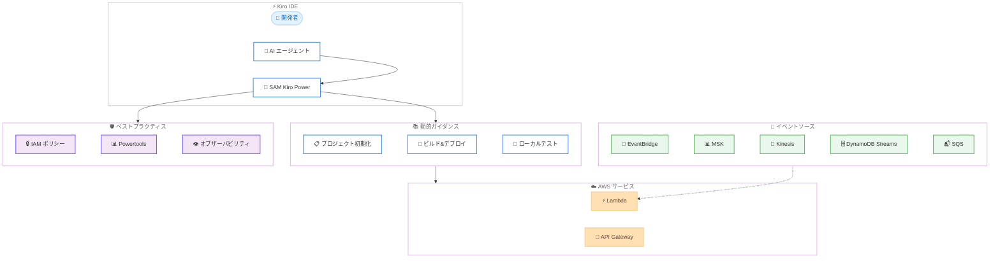

# AWS SAM - Kiro Power によるサーバーレスアプリケーション開発の加速

**リリース日**: 2026 年 3 月 13 日
**サービス**: AWS Serverless Application Model (SAM)
**機能**: SAM Kiro Power

📊 [このアップデートのインフォグラフィックを見る](https://takech9203.github.io/aws-news-summary/20260313-aws-sam-kiro-power.html)

## 概要

AWS は AWS Serverless Application Model (SAM) の Kiro Power を発表した。これにより、AI 搭載 IDE である Kiro 上でサーバーレスアプリケーション開発のエキスパートガイダンスを活用できるようになる。SAM Kiro Power は、AI エージェントがサーバーレスアプリケーションを構築するために必要な関連ガイダンスと開発の専門知識を動的にロードし、ローカル環境で直接サーバーレスアプリケーションの構築、デプロイ、管理を支援する。

SAM はサーバーレスアプリケーションの構築を簡素化するオープンソースフレームワークであり、今回の Kiro Power 統合により、SAM プロジェクトの初期化、アプリケーションのビルドとデプロイ、Lambda 関数のローカルテストまでを AI エージェントの支援のもとで実行できる。さらに、Amazon EventBridge、Amazon MSK、Amazon Kinesis、Amazon DynamoDB Streams、Amazon SQS といったイベント駆動パターンをサポートし、IAM ポリシーのセキュリティベストプラクティスもカバーしている。

**アップデート前の課題**

- サーバーレスアプリケーション開発時に SAM のベストプラクティスを自分で調べて適用する必要があった
- IAM ポリシーのセキュリティ設定やオブザーバビリティの導入を手動で行う必要があり、設定漏れのリスクがあった
- イベント駆動アーキテクチャの構築時に、各サービスの統合パターンを個別に学習する必要があった

**アップデート後の改善**

- Kiro IDE 上で AI エージェントがサーバーレス開発のベストプラクティスを動的に提供し、開発を加速できるようになった
- SAM リソースと Powertools for AWS Lambda の使用がデフォルトで強制され、オブザーバビリティと構造化ログが最初から組み込まれる
- EventBridge、MSK、Kinesis、DynamoDB Streams、SQS を活用したイベント駆動パターンの構築が AI ガイダンス付きで容易になった

## アーキテクチャ図



SAM Kiro Power が Kiro IDE 内の AI エージェントに対してサーバーレス開発の動的ガイダンスを提供し、AWS サービスへのデプロイやイベント駆動パターンの構築、セキュリティベストプラクティスの適用を支援する全体像を示している。

## サービスアップデートの詳細

### 主要機能

1. **動的ガイダンスのロード**
   - AI エージェントがサーバーレスアプリケーションを構築するために必要な関連ガイダンスと開発の専門知識を動的にロード
   - SAM プロジェクトの初期化、ビルド、デプロイの各フェーズでコンテキストに応じた支援を提供
   - コンセプトからプロダクションまでの開発プロセスを加速

2. **イベント駆動パターンのサポート**
   - Amazon EventBridge によるイベントバスパターン
   - Amazon MSK によるストリーミングメッセージ処理
   - Amazon Kinesis によるリアルタイムデータストリーミング
   - Amazon DynamoDB Streams による変更データキャプチャ
   - Amazon SQS によるキューベースの非同期処理

3. **セキュリティとオブザーバビリティのデフォルト適用**
   - IAM ポリシーのセキュリティベストプラクティスを組み込みガイダンスとして提供
   - SAM リソースの使用を強制し、一貫したインフラストラクチャ定義を実現
   - Powertools for AWS Lambda によるオブザーバビリティと構造化ログをデフォルトで適用

## 技術仕様

### サポート対象

| 項目 | 詳細 |
|------|------|
| フレームワーク | AWS SAM (Serverless Application Model) |
| IDE | Kiro |
| 対応パターン | 静的 Web サイト + API バックエンド、イベント駆動マイクロサービス、フルスタックアプリケーション |
| イベントソース | EventBridge、MSK、Kinesis、DynamoDB Streams、SQS |
| オブザーバビリティ | Powertools for AWS Lambda (デフォルト有効) |
| インストール | Kiro IDE からのワンクリックインストール、Kiro Powers ページ |

### 組み込みベストプラクティス

| カテゴリ | 内容 |
|----------|------|
| セキュリティ | IAM ポリシーの最小権限原則に基づくガイダンス |
| オブザーバビリティ | Powertools for AWS Lambda による構造化ログ |
| リソース定義 | SAM リソースの使用を強制 |
| ローカル開発 | Lambda 関数のローカルテスト支援 |

## 設定方法

### 前提条件

1. Kiro IDE がインストールされていること
2. AWS アカウントと適切な IAM 権限が設定されていること
3. AWS SAM CLI がローカル環境にインストールされていること

### 手順

#### ステップ 1: SAM Kiro Power のインストール

Kiro IDE を開き、Kiro Powers ページまたは IDE 内のワンクリックインストールから SAM Kiro Power をインストールする。

#### ステップ 2: プロジェクトの初期化

SAM Kiro Power がロードされた状態で、AI エージェントに対してサーバーレスプロジェクトの初期化を依頼する。AI エージェントが SAM テンプレートとプロジェクト構造を自動生成する。

```bash
# SAM CLI による手動初期化の例
sam init --runtime python3.12 --app-template hello-world
```

#### ステップ 3: ビルドとデプロイ

AI エージェントのガイダンスに従い、アプリケーションをビルドしてデプロイする。Powertools for AWS Lambda によるオブザーバビリティが自動的に組み込まれる。

```bash
# SAM CLI によるビルドとデプロイの例
sam build
sam deploy --guided
```

## メリット

### ビジネス面

- **開発速度の向上**: AI エージェントによるガイダンスにより、サーバーレスアプリケーションのコンセプトからプロダクションまでの時間を短縮
- **品質の向上**: セキュリティベストプラクティスとオブザーバビリティがデフォルトで適用されるため、本番環境の品質を初期段階から確保
- **学習コストの削減**: サーバーレス開発の専門知識が AI エージェントを通じて提供されるため、チームの学習曲線を緩和

### 技術面

- **ベストプラクティスの自動適用**: IAM ポリシーの最小権限原則や Powertools for AWS Lambda が標準で組み込まれる
- **イベント駆動パターンの簡素化**: 5 つの主要イベントソースとの統合パターンが AI ガイダンス付きで提供される
- **ローカル開発体験の改善**: Lambda 関数のローカルテストを AI エージェントが支援し、デプロイ前の検証を効率化

## デメリット・制約事項

### 制限事項

- Kiro IDE 専用の機能であり、他の IDE では利用できない
- AI エージェントのガイダンスは SAM ベースのサーバーレスアプリケーションに限定される
- 生成されたコードやテンプレートは開発者による確認とレビューが必要

### 考慮すべき点

- AI エージェントが生成するガイダンスの正確性は、入力するプロンプトの質に依存する
- 既存の SAM プロジェクトへの統合時に、既存設定との整合性を確認する必要がある

## ユースケース

### ユースケース 1: 静的 Web サイト + API バックエンドの構築

**シナリオ**: 新規プロジェクトで静的 Web サイトと Lambda ベースの API バックエンドを構築する

**実装例**:
```yaml
# SAM テンプレート例 (template.yaml)
AWSTemplateFormatVersion: '2010-09-09'
Transform: AWS::Serverless-2016-10-31

Resources:
  ApiFunction:
    Type: AWS::Serverless::Function
    Properties:
      Handler: app.handler
      Runtime: python3.12
      Events:
        Api:
          Type: Api
          Properties:
            Path: /api
            Method: get
```

**効果**: AI エージェントが SAM テンプレートの最適な構成をガイドし、Powertools による構造化ログやトレーシングを自動的に組み込む

### ユースケース 2: イベント駆動マイクロサービスの構築

**シナリオ**: DynamoDB Streams と SQS を活用した非同期処理パイプラインを構築する

**実装例**:
```yaml
# SAM テンプレート例 (template.yaml)
Resources:
  ProcessorFunction:
    Type: AWS::Serverless::Function
    Properties:
      Handler: processor.handler
      Runtime: python3.12
      Events:
        DDBStream:
          Type: DynamoDB
          Properties:
            Stream: !GetAtt MyTable.StreamArn
            StartingPosition: TRIM_HORIZON
```

**効果**: イベントソースマッピングの設定やエラーハンドリング、デッドレターキューの構成まで AI エージェントがベストプラクティスに基づいてガイド

### ユースケース 3: フルスタックアプリケーションの迅速なプロトタイピング

**シナリオ**: API Gateway、Lambda、DynamoDB を組み合わせた CRUD アプリケーションを短期間で構築する

**実装例**:
```yaml
# SAM テンプレート例 (template.yaml)
Resources:
  CrudFunction:
    Type: AWS::Serverless::Function
    Properties:
      Handler: crud.handler
      Runtime: nodejs20.x
      Policies:
        - DynamoDBCrudPolicy:
            TableName: !Ref ItemsTable
      Events:
        GetItems:
          Type: Api
          Properties:
            Path: /items
            Method: get
```

**効果**: IAM ポリシーの最小権限設定が自動的にガイドされ、セキュアなアプリケーションを短期間で構築可能

## 料金

SAM Kiro Power 自体の追加料金はない。SAM はオープンソースフレームワークであり、Kiro Powers ページからワンクリックでインストール可能である。なお、Kiro IDE の利用料金および SAM でデプロイする AWS リソース (Lambda、API Gateway、DynamoDB など) の料金は別途発生する。

## 利用可能リージョン

SAM Kiro Power は Kiro IDE のプラグインとして提供されるため、Kiro IDE が利用可能な環境で使用できる。デプロイ先は SAM CLI がサポートする全ての AWS リージョンが対象となる。

## 関連サービス・機能

- **AWS SAM CLI**: SAM テンプレートのビルド、テスト、デプロイを行うコマンドラインツール
- **Kiro**: AWS が提供する AI 搭載 IDE で、エージェント型開発を支援
- **Powertools for AWS Lambda**: Lambda 関数のオブザーバビリティ、トレーシング、構造化ログを提供するツールキット
- **AWS Lambda**: サーバーレスコンピューティングサービスで、SAM の主要なデプロイターゲット
- **Amazon EventBridge**: イベント駆動アーキテクチャのためのサーバーレスイベントバスサービス

## 参考リンク

- 📊 [インフォグラフィック](https://takech9203.github.io/aws-news-summary/20260313-aws-sam-kiro-power.html)
- [公式発表 (What's New)](https://aws.amazon.com/about-aws/whats-new/2026/03/aws-sam-kiro-power/)
- [AWS SAM ドキュメント](https://docs.aws.amazon.com/serverless-application-model/latest/developerguide/)
- [SAM Kiro Power - GitHub](https://github.com/aws/aws-sam-cli)
- [Powertools for AWS Lambda ドキュメント](https://docs.powertools.aws.dev/lambda/)
- [Kiro IDE](https://kiro.dev/)

## まとめ

SAM Kiro Power は、Kiro IDE 上でサーバーレスアプリケーション開発のベストプラクティスを AI エージェントを通じて動的に提供する新機能である。セキュリティやオブザーバビリティがデフォルトで組み込まれるため、サーバーレス開発の経験が浅いチームでも本番品質のアプリケーションを迅速に構築できる。サーバーレスアプリケーションを開発しているチームは、Kiro IDE から SAM Kiro Power をインストールして開発ワークフローの効率化を検討することを推奨する。
