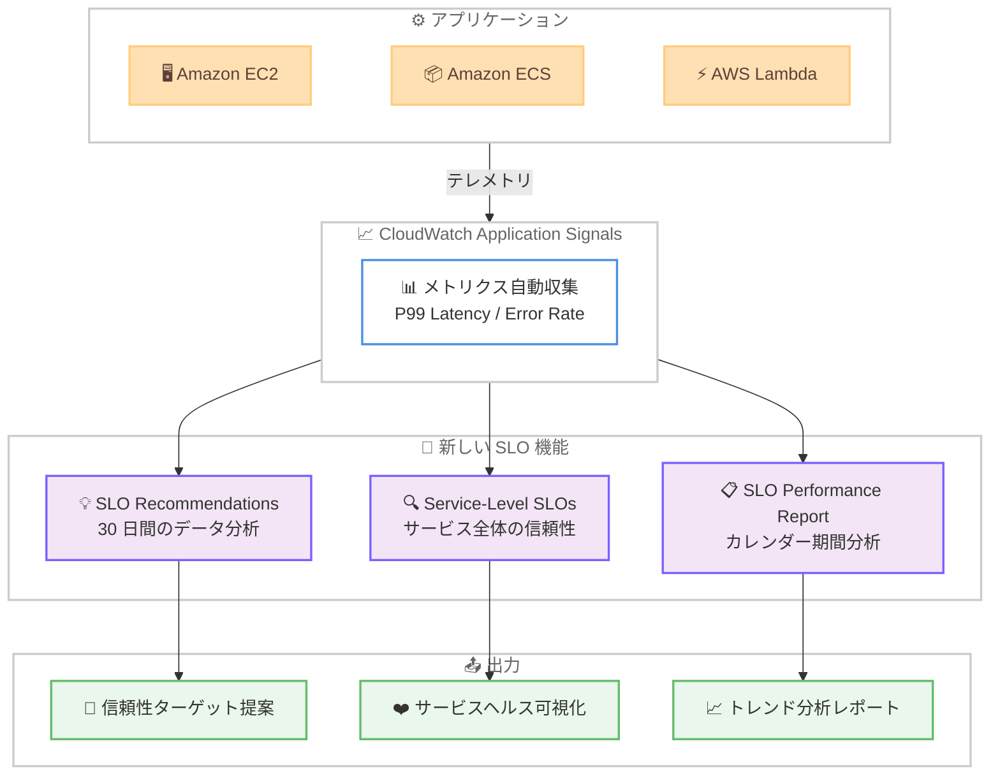

# Amazon CloudWatch Application Signals - 新しい SLO 機能の追加

**リリース日**: 2026 年 3 月 13 日
**サービス**: Amazon CloudWatch Application Signals
**機能**: SLO Recommendations、Service-Level SLOs、SLO Performance Report

📊 [このアップデートのインフォグラフィックを見る](https://takech9203.github.io/aws-news-summary/20260313-cloudwatch-application-signals-adds-slo-capabilities.html)

## 概要

Amazon CloudWatch Application Signals に、Service Level Objectives (SLOs) に関する 3 つの新しいコンソールベースの機能が追加されました。SLO Recommendations、Service-Level SLOs、SLO Performance Report の 3 機能により、データ駆動型の信頼性目標の設定、サービス全体のヘルス監視、信頼性トレンドの分析が容易になります。

CloudWatch Application Signals は、Amazon EC2、Amazon ECS、AWS Lambda 上で稼働するアプリケーションからデータを自動収集し、パフォーマンス監視を支援するサービスです。今回のアップデートにより、SLO の設定・監視・レポーティングに関する運用負荷が大幅に軽減されます。

**アップデート前の課題**

- SLO のしきい値設定がデータに基づかず手動で行われ、ターゲットの誤設定やアラート疲労につながっていた
- 複数のオペレーションにまたがるサービス全体の信頼性を一元的に把握する手段がなかった
- 信頼性トレンドを時系列で追跡する方法がなく、カレンダー期間に沿ったパフォーマンスレポートの生成ができなかった

**アップデート後の改善**

- SLO Recommendations により、30 日間のメトリクスデータに基づいた適切な信頼性ターゲットの提案が可能になった
- Service-Level SLOs により、全オペレーションを横断したサービス信頼性の包括的な把握が可能になった
- SLO Performance Report により、日次・週次・月次のカレンダー期間に合わせた信頼性の履歴分析が可能になった

## アーキテクチャ図

アプリケーションから収集されたメトリクスデータを基に、3 つの新しい SLO 機能がそれぞれ異なる観点で信頼性管理を支援します。

## サービスアップデートの詳細

### 主要機能

1. **SLO Recommendations**
   - 30 日間のサービスメトリクス (P99 レイテンシおよびエラーレート) を分析
   - 適切な信頼性ターゲットを自動的に提案
   - 実装前に提案されたターゲットを検証可能
   - 新しい SLO デプロイに必要な認知的・運用的負荷を軽減

2. **Service-Level SLOs**
   - 全オペレーションを横断したサービス信頼性の包括的なビューを提供
   - 技術的な監視とビジネス目標の整合を簡素化
   - 個別のオペレーションではなくサービス全体の健全性を把握

3. **SLO Performance Report**
   - カレンダー期間に合わせた履歴分析を提供
   - 日次、週次、月次のインターバルをサポート
   - 信頼性トレンドをインシデント発生前に特定可能
   - ビジネスレポーティングに適した形式での出力

## 技術仕様

### 機能比較

| 機能 | 分析対象 | 期間 | 主な用途 |
|------|----------|------|----------|
| SLO Recommendations | P99 レイテンシ、エラーレート | 過去 30 日間 | 信頼性ターゲットの自動提案 |
| Service-Level SLOs | 全オペレーションの SLO | リアルタイム | サービス全体のヘルス監視 |
| SLO Performance Report | SLO パフォーマンス履歴 | 日次/週次/月次 | カレンダー期間のトレンド分析 |

### 対応メトリクス

| メトリクス | 説明 |
|-----------|------|
| P99 Latency | リクエストの 99 パーセンタイルレイテンシ |
| Error Rate | エラーレート |

## 設定方法

### 前提条件

1. Amazon CloudWatch Application Signals が有効化されたアプリケーション
2. 対象サービスが Amazon EC2、Amazon ECS、または AWS Lambda 上で稼働
3. SLO Recommendations を使用するには、最低 30 日間のメトリクスデータが必要

### 手順

#### ステップ 1: SLO Recommendations の確認

CloudWatch コンソールの Application Signals セクションから SLO Recommendations にアクセスし、提案された信頼性ターゲットを確認します。

30 日間のメトリクスデータに基づいた P99 レイテンシおよびエラーレートの推奨しきい値が表示されます。

#### ステップ 2: Service-Level SLOs の設定

Service-Level SLOs を使用して、サービス全体の信頼性ビューを構成します。

個別のオペレーション単位の SLO に加え、サービスレベルでの信頼性を一元的に監視できるようになります。

#### ステップ 3: SLO Performance Report の活用

SLO Performance Report で日次・週次・月次の期間を選択し、信頼性トレンドを分析します。

カレンダー期間に沿ったパフォーマンスレポートにより、ビジネスレビューやステークホルダーへの報告に活用できます。

## メリット

### ビジネス面

- **データ駆動型の意思決定**: 実際のメトリクスデータに基づく SLO 設定により、恣意的なターゲット設定を排除
- **ステークホルダーレポーティング**: カレンダー期間に合わせたレポートにより、ビジネスレビューが容易
- **プロアクティブな信頼性管理**: トレンド分析によりインシデント発生前に対処可能

### 技術面

- **アラート疲労の軽減**: データに基づいた適切なしきい値設定により、不要なアラートを削減
- **運用負荷の軽減**: 手動でのしきい値設定やレポート作成が不要
- **包括的な可視性**: サービス全体の信頼性を単一ビューで把握可能

## デメリット・制約事項

### 制限事項

- SLO Recommendations には最低 30 日間のメトリクスデータが必要
- コンソールベースの機能であり、API による自動化については公式情報を確認する必要がある
- Application Signals が有効化されていないサービスでは利用不可

### 考慮すべき点

- 推奨値はあくまで提案であり、ビジネス要件に応じたカスタマイズが必要
- Service-Level SLOs の導入にあたり、既存の個別 SLO との整合性を確認することが重要
- レポート期間の粒度 (日次/週次/月次) をチームのレビューサイクルに合わせて選択する必要がある

## ユースケース

### ユースケース 1: 新規サービスの SLO 設定

**シナリオ**: 新しいマイクロサービスをデプロイし、適切な SLO しきい値を設定する必要がある

**実装例**: サービスのデプロイ後 30 日間のメトリクスを収集し、SLO Recommendations の提案値を確認。提案されたターゲットを検証した上で SLO として設定する。

**効果**: データに基づいた信頼性ターゲットの設定により、アラート疲労を回避しつつ適切な監視体制を構築

### ユースケース 2: 月次サービスレビュー

**シナリオ**: 経営層やビジネスステークホルダーに対して、月次のサービス信頼性レポートを提出する必要がある

**実装例**: SLO Performance Report で月次インターバルを選択し、カレンダー月に沿ったパフォーマンスデータを生成。Service-Level SLOs の包括的ビューと組み合わせて報告資料を作成する。

**効果**: 手動でのレポート作成が不要になり、一貫性のあるデータに基づいたビジネスレポーティングを実現

### ユースケース 3: 信頼性の予防的管理

**シナリオ**: 大規模なマイクロサービスアーキテクチャにおいて、信頼性低下の兆候を早期に検知したい

**実装例**: Service-Level SLOs でサービス全体の信頼性を継続的に監視し、SLO Performance Report の週次トレンドで劣化傾向を分析。SLO Recommendations で定期的にしきい値の妥当性を確認する。

**効果**: インシデント発生前に信頼性トレンドの変化を検知し、プロアクティブに対応可能

## 料金

CloudWatch Application Signals の料金は、アプリケーションへのインバウンドおよびアウトバウンドリクエスト数に基づきます。SLO については、各 SLO が Service Level Indicator のメトリクス期間ごとに 2 つの Application Signals を生成します。

詳細な料金については、CloudWatch の料金ページを確認してください。

## 利用可能リージョン

Amazon CloudWatch Application Signals が利用可能なすべての AWS リージョンで利用できます。

## 関連サービス・機能

- **Amazon CloudWatch**: メトリクス、ログ、アラームを統合した監視サービス
- **AWS X-Ray**: 分散トレーシングによるアプリケーションパフォーマンス分析
- **Amazon CloudWatch Synthetics**: 外形監視によるエンドポイントヘルスチェック
- **Amazon CloudWatch ServiceLens**: サービスマップと X-Ray の統合ビュー

## 参考リンク

- 📊 [インフォグラフィック](https://takech9203.github.io/aws-news-summary/20260313-cloudwatch-application-signals-adds-slo-capabilities.html)
- [公式発表 (What's New)](https://aws.amazon.com/about-aws/whats-new/2026/03/cloudwatch-application-signals-adds-slo-capabilities/)
- [ドキュメント - CloudWatch Application Signals](https://docs.aws.amazon.com/AmazonCloudWatch/latest/monitoring/CloudWatch-Application-Monitoring-Sections.html)
- [料金ページ - Amazon CloudWatch](https://aws.amazon.com/cloudwatch/pricing/)

## まとめ

Amazon CloudWatch Application Signals に追加された 3 つの SLO 機能により、信頼性目標の設定・監視・レポーティングがデータ駆動型で実現可能になりました。特に SLO Recommendations は、手動でのしきい値設定に伴うアラート疲労を解消し、適切な信頼性ターゲットの設定を支援します。マイクロサービスアーキテクチャを運用している組織においては、Service-Level SLOs と SLO Performance Report を組み合わせることで、プロアクティブな信頼性管理とビジネスレポーティングの効率化が期待できます。
