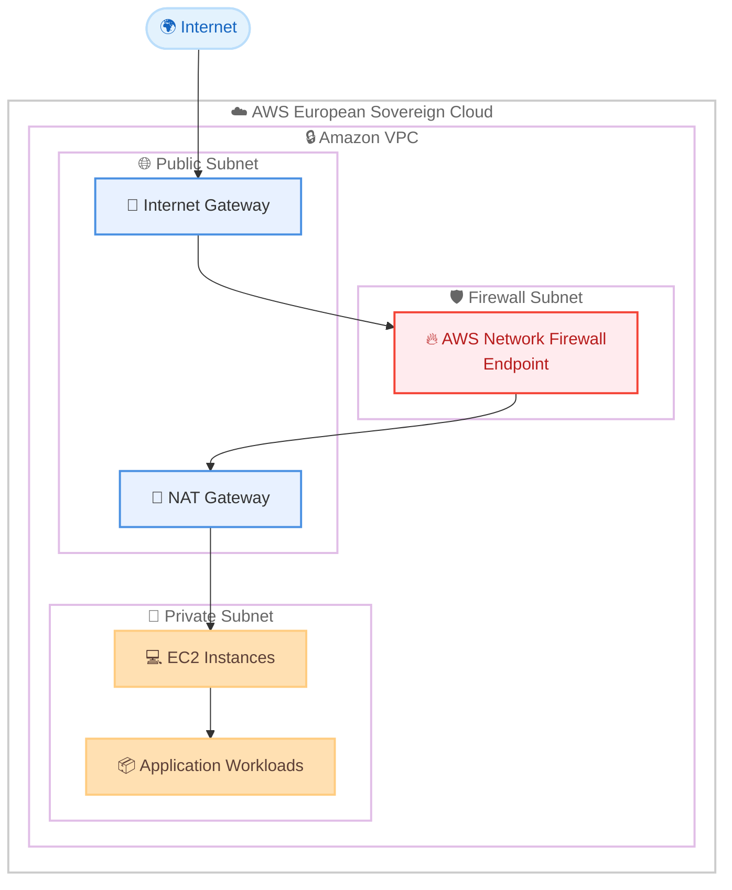

# AWS Network Firewall - AWS European Sovereign Cloud での提供開始

**リリース日**: 2026 年 3 月 13 日
**サービス**: AWS Network Firewall
**機能**: AWS European Sovereign Cloud リージョンでの提供開始

📊 [このアップデートのインフォグラフィックを見る](https://takech9203.github.io/aws-news-summary/20260313-network-firewall-european-sovereign-cloud-region.html)

## 概要

AWS Network Firewall が AWS European Sovereign Cloud で利用可能になりました。このローンチにより、特に規制の厳しい業界、政府機関、厳格なデータ主権要件を持つ欧州の顧客が、EU のデータ保護規制に完全に準拠しながら、最も機密性の高いワークロードを保護するために AWS Network Firewall をデプロイできるようになります。

AWS European Sovereign Cloud を使用している顧客は、他の AWS リージョンで利用可能なものと同じ AWS Network Firewall の機能を活用でき、すべてのデータと運用が EU 域内に完全に留まり、EU ベースの管理下に置かれることが保証されます。AWS Network Firewall は、Amazon Virtual Private Cloud (VPC) に不可欠なネットワーク保護を提供するマネージドファイアウォールサービスであり、ネットワークトラフィック量に応じて自動的にスケールし、基盤となるインフラストラクチャのセットアップやメンテナンスを必要とせずに高可用性の保護を実現します。

**アップデート前の課題**

- AWS European Sovereign Cloud を使用する顧客は、VPC レベルのマネージドファイアウォール保護を利用できなかった
- データ主権要件を満たしながらネットワークセキュリティを確保するために、サードパーティのソリューションやカスタム構成が必要だった
- EU 域内にデータを保持しつつ、高度なネットワーク脅威検出と防御を実装することが困難だった

**アップデート後の改善**

- AWS European Sovereign Cloud 内で AWS Network Firewall をネイティブにデプロイし、VPC のネットワーク保護が可能になった
- すべてのデータと運用を EU 域内に保持しながら、他の AWS リージョンと同等のファイアウォール機能を利用できるようになった
- マネージドサービスとして自動スケーリングと高可用性が提供され、インフラストラクチャ管理の負担が軽減された

## アーキテクチャ図



AWS European Sovereign Cloud 内の VPC において、AWS Network Firewall がトラフィックを検査し、ステートフルおよびステートレスなルールに基づいてフィルタリングを行う構成を示しています。すべてのデータと運用は EU 域内に保持されます。

## サービスアップデートの詳細

### 主要機能

1. **ステートフルおよびステートレスなトラフィック検査**
   - VPC を通過するすべてのトラフィックに対するパケットレベルの検査
   - Suricata 互換の IPS ルールによる高度な脅威検出
   - ドメイン名、IP アドレス、プロトコルに基づくフィルタリング

2. **自動スケーリングと高可用性**
   - ネットワークトラフィック量に応じた自動スケーリング
   - 基盤インフラストラクチャの管理が不要
   - 複数の Availability Zone にまたがるデプロイメントによる高可用性

3. **AWS サービスとの統合**
   - AWS Firewall Manager による一元管理
   - Amazon CloudWatch によるメトリクスとログの監視
   - AWS CloudFormation によるインフラストラクチャのコード化
   - VPC フローログとの連携

## 技術仕様

### AWS Network Firewall の主要機能

| 項目 | 詳細 |
|------|------|
| ステートレスルール | 5-tuple ベースのフィルタリング |
| ステートフルルール | Suricata 互換 IPS ルール、ドメインリストフィルタリング |
| TLS インスペクション | 暗号化トラフィックの検査 |
| Web カテゴリフィルタリング | URL カテゴリベースのアクセス制御 |
| ログ記録 | アラートログ、フローログ、TLS ログ |
| デプロイメント | 分散型、集中型、複合型モデルに対応 |

### IAM ポリシー例

```json
{
    "Version": "2012-10-17",
    "Statement": [
        {
            "Effect": "Allow",
            "Action": [
                "network-firewall:CreateFirewall",
                "network-firewall:CreateFirewallPolicy",
                "network-firewall:CreateRuleGroup",
                "network-firewall:DescribeFirewall",
                "network-firewall:UpdateFirewallPolicy"
            ],
            "Resource": "*",
            "Condition": {
                "StringEquals": {
                    "aws:RequestedRegion": "eu-sovereign-1"
                }
            }
        }
    ]
}
```

## 設定方法

### 前提条件

1. AWS European Sovereign Cloud へのアクセス権限
2. 保護対象の Amazon VPC が European Sovereign Cloud リージョン内に存在すること
3. AWS Network Firewall の操作に必要な IAM 権限

### 手順

#### ステップ 1: ファイアウォールポリシーの作成

```bash
aws network-firewall create-firewall-policy \
    --firewall-policy-name "eu-sovereign-policy" \
    --firewall-policy '{
        "StatelessDefaultActions": ["aws:forward_to_sfe"],
        "StatelessFragmentDefaultActions": ["aws:forward_to_sfe"],
        "StatefulDefaultActions": ["aws:alert_strict"],
        "StatefulEngineOptions": {
            "RuleOrder": "STRICT_ORDER"
        }
    }'
```

ファイアウォールポリシーを作成し、ステートレスおよびステートフルなデフォルトアクションを設定します。`STRICT_ORDER` を使用することで、ルールの評価順序を明示的に制御できます。

#### ステップ 2: ファイアウォールの作成

```bash
aws network-firewall create-firewall \
    --firewall-name "eu-sovereign-firewall" \
    --firewall-policy-arn "arn:aws:network-firewall:eu-sovereign-1:ACCOUNT_ID:firewall-policy/eu-sovereign-policy" \
    --vpc-id "vpc-xxxxxxxxx" \
    --subnet-mappings '[{"SubnetId": "subnet-xxxxxxxxx"}]'
```

指定した VPC とサブネットにファイアウォールエンドポイントを作成します。複数の Availability Zone に配置する場合は、`subnet-mappings` に複数のサブネットを指定します。

#### ステップ 3: ルートテーブルの更新

```bash
aws ec2 create-route \
    --route-table-id "rtb-xxxxxxxxx" \
    --destination-cidr-block "0.0.0.0/0" \
    --vpc-endpoint-id "vpce-xxxxxxxxx"
```

VPC のルートテーブルを更新し、トラフィックがファイアウォールエンドポイントを経由するように設定します。これにより、すべてのインターネット向けトラフィックが AWS Network Firewall で検査されます。

## メリット

### ビジネス面

- **データ主権の確保**: すべてのデータと運用が EU 域内に保持され、EU のデータ保護規制に準拠
- **コンプライアンス対応の簡素化**: 規制の厳しい業界や政府機関向けの要件を満たすネットワークセキュリティを容易に実装
- **運用コストの削減**: マネージドサービスにより、ファイアウォールインフラストラクチャの管理負担を軽減

### 技術面

- **自動スケーリング**: トラフィック量に応じた自動スケーリングにより、パフォーマンスを維持
- **高可用性**: 複数の Availability Zone にまたがるデプロイメントで耐障害性を確保
- **他の AWS リージョンとの機能同等性**: European Sovereign Cloud でも同等のファイアウォール機能を利用可能

## デメリット・制約事項

### 制限事項

- AWS European Sovereign Cloud のリージョン内でのみ利用可能
- European Sovereign Cloud へのアクセスには、適格な顧客としての要件を満たす必要がある
- AWS European Sovereign Cloud で利用可能なサービスは、他の商用リージョンと比較して限定的な場合がある

### 考慮すべき点

- European Sovereign Cloud のリージョン展開状況に応じて、利用可能な Availability Zone が限定される可能性がある
- 既存の商用リージョンから European Sovereign Cloud への移行には、ネットワークアーキテクチャの再設計が必要になる場合がある

## ユースケース

### ユースケース 1: 欧州金融機関のネットワーク保護

**シナリオ**: EU の金融規制 (DORA など) に準拠しながら、クラウド上のワークロードをネットワーク脅威から保護する必要がある欧州の銀行

**実装例**:
```bash
# ステートフルルールグループで金融サービス向けのルールを作成
aws network-firewall create-rule-group \
    --rule-group-name "financial-services-rules" \
    --type STATEFUL \
    --capacity 100 \
    --rule-group '{
        "RulesSource": {
            "RulesSourceList": {
                "Targets": [".approved-payment-gateway.eu", ".eu-banking-api.com"],
                "TargetTypes": ["TLS_SNI", "HTTP_HOST"],
                "GeneratedRulesType": "ALLOWLIST"
            }
        }
    }'
```

**効果**: EU 域内にデータを保持しつつ、承認された金融サービスへのアクセスのみを許可し、規制要件を満たすネットワーク保護を実現

### ユースケース 2: 欧州政府機関のセキュアなクラウド環境

**シナリオ**: データ主権要件を厳格に遵守しながら、政府系ワークロードを AWS 上で運用する必要がある EU 加盟国の政府機関

**実装例**:
```bash
# IPS ルールによる高度な脅威検出を設定
aws network-firewall create-rule-group \
    --rule-group-name "gov-threat-detection" \
    --type STATEFUL \
    --capacity 200 \
    --rule-group '{
        "RulesSource": {
            "StatefulRules": [
                {
                    "Action": "DROP",
                    "Header": {
                        "Protocol": "TCP",
                        "Source": "ANY",
                        "SourcePort": "ANY",
                        "Destination": "ANY",
                        "DestinationPort": "ANY",
                        "Direction": "ANY"
                    },
                    "RuleOptions": [
                        {"Keyword": "sid", "Settings": ["1"]},
                        {"Keyword": "msg", "Settings": ["\"Block known malicious traffic\""]}
                    ]
                }
            ]
        }
    }'
```

**効果**: すべてのネットワークトラフィックを EU 域内で検査・フィルタリングし、高度な脅威からの保護を実現しながらデータ主権を維持

### ユースケース 3: ヘルスケア業界の GDPR 準拠環境

**シナリオ**: 患者データの保護と GDPR への準拠を確保しながら、ヘルスケアアプリケーションを European Sovereign Cloud で運用する病院チェーン

**実装例**:
```bash
# ドメインベースのフィルタリングで承認された医療系サービスのみ許可
aws network-firewall create-rule-group \
    --rule-group-name "healthcare-domain-rules" \
    --type STATEFUL \
    --capacity 100 \
    --rule-group '{
        "RulesSource": {
            "RulesSourceList": {
                "Targets": [".ehr-system.eu", ".medical-imaging.eu", ".eu-health-api.com"],
                "TargetTypes": ["TLS_SNI"],
                "GeneratedRulesType": "ALLOWLIST"
            }
        }
    }'
```

**効果**: 患者データが EU 域外に流出するリスクを最小化し、承認された医療系システムとの通信のみを許可することで GDPR 準拠を支援

## 料金

AWS Network Firewall の料金は以下の要素で構成されます。

| 項目 | 料金 |
|------|------|
| ファイアウォールエンドポイント | リージョンおよび Availability Zone ごとに時間単位で課金 |
| データ処理 | ファイアウォールエンドポイントで処理されたデータ量 (GB 単位) |
| TLS インスペクション (Advanced Inspection) | 追加の時間単位料金 (TLS インスペクション使用時) |
| Active Threat Defense | 処理されたトラフィック量に対する追加料金 |

参考として、US East (N. Virginia) リージョンでは、ファイアウォールエンドポイントが $0.395/時間、データ処理が $0.065/GB です。AWS European Sovereign Cloud の料金はリージョンテーブルで確認してください。NAT Gateway と同一ネットワークパスに配置した場合、NAT Gateway の時間料金とデータ処理料金が免除されるディスカウントがあります。

## 利用可能リージョン

AWS European Sovereign Cloud リージョン

詳細な利用可能リージョンについては、[AWS リージョンテーブル](https://aws.amazon.com/about-aws/global-infrastructure/regional-product-services/)を参照してください。

## 関連サービス・機能

- **AWS Firewall Manager**: 複数のアカウントおよびリソースにわたるファイアウォールルールの一元管理
- **Amazon VPC**: AWS Network Firewall が保護するネットワーク環境
- **AWS Shield**: DDoS 攻撃からの保護を提供する補完的なセキュリティサービス
- **AWS WAF**: Web アプリケーション層での保護を提供するファイアウォールサービス
- **AWS European Sovereign Cloud**: EU のデータ主権要件に対応した独立したクラウドインフラストラクチャ

## 参考リンク

- 📊 [インフォグラフィック](https://takech9203.github.io/aws-news-summary/20260313-network-firewall-european-sovereign-cloud-region.html)
- [公式発表 (What's New)](https://aws.amazon.com/about-aws/whats-new/2026/03/network-firewall-european-sovereign-cloud-region/)
- [AWS Network Firewall 製品ページ](https://aws.amazon.com/network-firewall/)
- [AWS Network Firewall ドキュメント](https://docs.aws.amazon.com/network-firewall/latest/developerguide/)
- [AWS Network Firewall 料金ページ](https://aws.amazon.com/network-firewall/pricing/)
- [AWS リージョンテーブル](https://aws.amazon.com/about-aws/global-infrastructure/regional-product-services/)

## まとめ

AWS Network Firewall の AWS European Sovereign Cloud での提供開始により、EU のデータ主権要件を持つ顧客が、マネージドなネットワークファイアウォールサービスを Sovereign Cloud 環境内でネイティブに利用できるようになりました。規制の厳しい業界や政府機関にとって、EU 域内でのデータ保持を保証しながら高度なネットワーク保護を実現できるため、European Sovereign Cloud の採用をさらに加速させるアップデートです。European Sovereign Cloud を利用中、または利用を検討している顧客は、ネットワークセキュリティ戦略に AWS Network Firewall の導入を検討することを推奨します。
